<!-- _class: titlepage -->
# Webprogrammierung
**mit KI-gestützten Workflows**

**3. Semester**

**Fachlehrer  Stefan Sauer**
**THWS Geovisualisierung**


---
<!-- _class: structural-->
# Prüfungsleistung Portfolioabgabe
## Seminaristischer Unterricht & Übung
### 5 SWS | 5 ECTS | Präsenzzeit 75 h | Selbststudium 112 h
Prüfungsleistung benotete Portfolioaufgabe

---
**Lehrinhalt:**
- Kenntnis der grundlegenden Techniken der Web-Programmierung.
- Fähigkeit, Webseiten selbstständig zu erstellen.
- Trennung von Inhalt und Darstellung bei der Webpräsentation.
- Beherrschung von client- und serverseitigen Skriptsprachen.
- Kenntnis gängiger JS-Bibliotheken, deren Einbindung in eigene Anwendungen sowie die Beurteilung ihrer Vor- und Nachteile.


---
<!--_class: structural  -->
# Modulinhalte Webprogrammierung
Ein Schwerpunkt des Kurses wird auf den Grundlagen und der KI-gestützen Erstellung von Webseiten liegen.
- Welche Tools gibt es?
- Wie können wir sie nutzen?
- Welche Grundlagen sollte ich kennen?
- Wie fange ich an?
- Wie erstelle ich eine eigene Webpräsentation?

---

## Arbeitsgrundlagen
- Lernmittel
- Software (Notepad++ / VS Code / Antigravity / Cursor / XAMPP / Chrome Git)


---
<!--_class: structural  -->
### Lernmittel
- HERDT-Verlag
- Online-Dokumentationen

---

**HERDT-Verlag (Hochschulmedien):**
In der universitären Lehre gilt das Programm HERDT-Campus ALL YOU CAN READ als Standardwerk. 
- HTML5, CSS3 und JavaScript- Webseiten entwickeln
- JavaScript Grundlagen

---
<!--_class: structural  -->
**Essenzielle Webseiten zur Weiterbildung**
- das MDN
- W3Schools
- SelfHTML
- CSS-Tricks
- Can I Use
- W3C Web Accessibility Initiative (WAI)

---

**Das MDN**
- präziseste, aktuellste und verlässlichste Dokumentation für HTML, CSS und JavaScript.
- Wenn im Zuge von modernen Workflows Code durch KI generiert wird, ist der „Algorithmische Skeptizismus“ Pflicht
- Jede Syntax und jedes Web-API sollte gegen das MDN geprüft werden (Halluzinations-Check).

https://developer.mozilla.org/en-US/

---
**W3Schools**
- hervorragende Plattform für Anfänger, um die Grundlagen von HTML, CSS und JavaScript interaktiv zu lernen.
- Der integrierte Code-Editor („Try it Yourself“) ermöglicht sofortiges Ausprobieren und Experimentieren mit Code-Beispielen.
https://www.w3schools.com/

---
**SelfHTML**
- umfassende deutsche Online-Dokumentation für HTML, CSS, JavaScript und weitere Web-Technologien.
- Sie bietet detaillierte Beschreibungen, zahlreiche Code-Beispiele und praktische Anleitungen für Webentwickler aller Erfahrungsstufen.

https://wiki.selfhtml.org/

---
**CSS-Tricks**
- populäre Ressource für Webentwickler, die sich auf CSS, aber auch auf HTML, JavaScript und modernes Webdesign konzentriert.
- Die Seite bietet Artikel, Tutorials und Videos zu aktuellen Web-Technologien und Best Practices.
https://css-tricks.com/

---
**Can I Use**
- essentielle Online-Ressource, die detaillierte Informationen über die Unterstützung von HTML-, CSS- und JavaScript-Funktionen in verschiedenen Webbrowsern bietet.
- Sie hilft Entwicklern zu überprüfen, welche Technologien in Zielbrowsern verfügbar sind und welche Polyfills oder Fallbacks benötigt werden.
https://caniuse.com/

---
**W3C Web Accessibility Initiative (WAI)**
- bietet Richtlinien und Ressourcen für die Schaffung von barrierefreien Webinhalten
- stellt sicher, dass Webseiten für alle Menschen zugänglich sind, einschließlich Menschen mit Behinderungen.
https://www.w3.org/WAI/


---
**Digital Shepherd**

Egal welche Quelle genutzt wird: Der moderne Ansatz lautet "Digital Shepherd" (Digitaler Hirte). Man sollte Code (egal ob aus Tutorials, Foren oder von einer KI generiert) niemals blind kopieren. Die eigentliche Kompetenz liegt aktuell darin, den Code zu verstehen, seine Barrierefreiheit (z.B. korrekte Alt-Texte für Bilder), semantische Sauberkeit und Performance zu validieren, um langfristig wartbare Webprojekte aufzubauen.

---


---
**Digital Shepherd & "Vibe Coding"**
- **Was ist Vibe-Coding?** Das Programmieren mittels natürlicher Sprache und KI-Assistenten (man beschreibt die Absicht, die KI schreibt den Code).
- **Die Verführung:** Es fühlt sich einfach an ("es läuft ja"). Doch KI generiert oft Code, der oberflächlich funktioniert, aber unter der Haube erhebliche Defizite aufweist.
- **Die Rolle des Hirten (Shepherd):**
  - Prompting ersetzt kein Grundlagenwissen!
  - Wer die Grundlagen (HTML-Semantik, CSS-Kaskadierung, JS-Sicherheit) nicht versteht, kann den generierten Code weder korrigieren noch pflegen.
  - Der "Digital Shepherd" leitet die KI gezielt an, statt sich blind von ihr leiten zu lassen.

---

**Die Auditing-Checkliste des Digital Shepherd**
Wenn eine KI Code generiert, müssen Sie diesen stets kritisch auf folgende Kriterien prüfen:
- **Semantik & Struktur:** Nutzt der Code echte HTML5-Elemente (`<main>`, `<article>`, `<header>`) oder handelt es sich um eine unübersichtliche Verschachtelung reiner `<div>`-Elementen?
- **Barrierefreiheit (Accessibility):** Fehlen Alt-Attribute bei Bildern, korrekte Label-Zuordnungen bei Formularen oder barrierefreie Kontraste?
- **Performance & Overhead:** Wurde unnötig komplexer Code vorgeschlagen, wo einfaches Vanilla-CSS/JS ausreicht?
- **Sicherheit:** Werden Eingaben ungeprüft verarbeitet oder veraltete/unsichere Methoden genutzt?

---

**Zukunftsperspektive: Vom Coder zum Architekten**
Wie verändert sich die Rolle von Webentwicklern durch generative KI?
- **Der Wandel:** Die reine Schreibarbeit (Syntax tippen) nimmt ab. Die Rolle verschiebt sich hin zum **Systemarchitekten** und **Qualitätsprüfer**.
- **Menschliche Stärken:** KI versteht selten den größeren geschäftlichen Kontext, Datenschutz-Anforderungen oder das emotionale Design-Gefühl für Benutzer.
- **Fazit:**
  - Reine "Code-Kopierer" werden durch KI ersetzt.
  - **Systemversteher** und **Digital Shepherds**, die komplexe Systeme konzipieren, verifizieren und absichern können, sind gefragter denn je!

---
<!--_class: structural  -->
### Software

- Notepad++
- VS Code
- Antigravity
- Cursor
- XAMPP
- Chrome
- Git
- uvm.


---
#### Notepad++
- Windows only
- Kostenlos & Open Source: quelloffen für Text Code
- ressourcenschonend, schnell
- Syntax-Hervorhebung & -Ausblendung (Code Folding):

https://notepad-plus-plus.org/downloads/


---


- Unterstützt viele Programmier-, Skript- und Auszeichnungssprachen (z. B. HTML, CSS, JavaScript, Python, C++).
- Tab-Dokumente: Ermöglicht gleichzeitiges Öffnen und Bearbeiten mehrerer Dateien in Tabs.
- Erweiterbarkeit durch Plugins
- Leistungsstarke Suchen-und-Ersetzen-Funktion
- Makro-Aufzeichnung

---
#### VS Code

https://code.visualstudio.com/

- Kostenlos & plattformübergreifend (Windows, macOS, Linux)
- Riesiger Marketplace für Erweiterungen (Extensions)
- Hervorragende Autovervollständigung (IntelliSense)
- Integrierte Git-Unterstützung und Versionskontrolle
- Eingebautes Terminal und Debugging-Tools
- Industriestandard für moderne Webentwicklung


---
#### Antigravity

https://antigravity.ai/

- Leistungsstarker, agentischer KI-Coding-Assistent von Google DeepMind
- Arbeitet im direkten Projektkontext und versteht die gesamte Codebasis
- Kann selbstständig Code schreiben, debuggen, testen und Dateien modifizieren
- Unterstützt bei der strukturierten Planung komplexer Webprojekte
- Begleitet Entwickler als digitaler Partner bei Code-Qualität, Semantik und Barrierefreiheit


---
#### Cursor

https://cursor.com/

- KI-gestützter Code-Editor, der als Fork von VS Code entwickelt wurde
- Vollständig kompatibel mit allen VS Code-Erweiterungen und -Themes
- Bietet native KI-Features wie Inline-Codegenerierung, Chat und automatische Fehlerbehebung
- Ermöglicht das Referenzieren und Durchsuchen der gesamten Codebasis (@Files, @Folders, @Codebase)
- KI-gestütztes Autocomplete (Tab-Vervollständigung), das oft ganze Zeilen oder Blöcke vorausahnt


---
#### XAMPP

https://www.apachefriends.org/

- Kostenlose & einfach zu installierende lokale Serverumgebung
- Komplettpaket aus Apache (Webserver), MariaDB (Datenbank), Skriptsprachen PHP und Perl
- Ermöglicht lokales Entwickeln und Testen von dynamischen Webanwendungen ohne Live-Webserver
- Einfache Verwaltung aller Dienste über das XAMPP Control Panel


---
#### Chrome

https://www.google.com/chrome/

- Schneller, sicherer und weltweit am meisten genutzter Webbrowser von Google
- Leistungsstarke Entwicklertools (Chrome DevTools) zur Fehlerbehebung / Code-Analyse
(HTML, CSS, JS)
- Führend in der Unterstützung moderner
Webstandards und APIs
- Integrierte Tools für mobiles Testen (Responsive Mode) und Performance-Audits (Lighthouse)


---
#### Weitere Browser

- Firefox: Ausgezeichnetes Privacy- und
Entwickler-Fokus
- Edge: Starker Fokus auf Enterprise und
zunehmend verbesserte DevTools
- Safari: Essentiell für das Testen
auf Apple-Geräten


---

#### Git

https://git-scm.com/
https://github.com/

- Weltweit am häufigsten genutztes, verteiltes Versionskontrollsystem
- Protokolliert alle Änderungen im Quellcode
lückenlos macht sie rückgängig machbar
- Paralleles Arbeiten im Team über unabhängige Entwicklungszweige (Branches)
- Basis für Cloud-Plattformen zur
Zusammenarbeit wie GitHub und GitLab


---
#### Weitere Software

- FTP-Client: FileZilla (kostenlos), Cyberduck (macOS/Windows)
- Bildbearbeitung: GIMP (kostenlos), Affinity Photo, Adobe Photoshop
- Design-Tools: Figma, Sketch, Adobe XD
- Lokale Datenbank-GUI: DBeaver, MySQL Workbench

---
<!--_class: structural  -->
## Unser Beispielprojekt
- Das Projekt
- Das Konzept
- Website Struktur

---

### Das Projekt
2020 beschließt der KFZ Mechaniker
Meister Maik seine Passion zur
Haupterwerbsquelle & sich selbstständi
 zu machen.
Durch sein mobiles Leben im LKW hat er sich auf
den Ausbau von Fahrzeugen zu autarken
Wohnräumen spezialisiert.
Seine jahrelange Erfahrung in der Werkstattleitung
eines Camping- & Caravantechnik Anbieters
nutzt er, um Caravans, Wohnmobile & individuelle
Fahrzeugausbauten zu reparieren, pflegen
& umzurüsten.


---

**Seine Dienstleistungen beinhalten**
- KFZ und LKW Reparaturen
- Caravan- und Wohnmobil Reparaturen
- Vorbereitung zur TÜV Prüfung und Prüfung von Gasanlagen
- Ein- Aus- und Umbau der KFZ Elektrik bis zur autarken Solaranlagenplanung
- Kompletter Fahrzeugausbau eines Transportfahrzeuges zum
„Wohn“-Mobil

---

Da Maik ein mobiles Leben führt,
ist er selten am gleichen Platz zu finden.
Um ihn und seine Dienstleistungen dennoch
auffinden zu können, benötigt er eine gut
auffindbare Webseite mit seinen
digitalen Kontaktdaten.


---
### Das Konzept

Bevor überhaupt eine einzige Zeile Code geschrieben wird, muss zuerst definiert werden, welche Ziele mit dem Webauftritt verfolgt werden.
> **Zieldefinition:**
Webseiten-Ziele vor der Entwicklung festlegen.
Am besten in einem Workshop oder Gespräch mit dem Auftraggeber.

---
- **Fokus der Inhalte:**
  - Präsentation von Maiks Dienstleistungen
  - Vermittlung des mobilen Lebensstils (Reisen, Alltag, Tauchlehrer)
  - Kontaktdaten gut auffindbar (schneller Kundenkontakt)
- **Visueller & redaktioneller Ansatz:**
  - Viele Bilder als roter Faden durch alle Bereiche
  - Reiseberichte für Mehrwert und bessere Auffindbarkeit
- **Technische Reduzierung:**
  - Keine komplexe Technik (Webshops, Logins) für einfache Selbstpflege
  - Simple HTML-Webseite > guter Hacker- & Spam-Schutz


---
<!--_class: structural  -->

## Was ist gutes Webdesign?
- Gutes Webdesign ist zielgruppenorientiert
- Gutes Webdesign ist benutzerfreundlich
- Gutes Webdesign ist technisch einwandfrei
- Gutes Webdesign ist "responsive"
- Gutes Webdesign ist SEO-optimiert

---
### Zielguppenorientierung

- **Zentrale Kernfrage der Planung:**
Wer sind die Besucher der Webseite?
- **Zielgruppe bestimmt das Design:**
Es gibt kein universell "gutes" Design
(ob minimalistisch oder Vintage)
 es muss zur Zielgruppe passen.

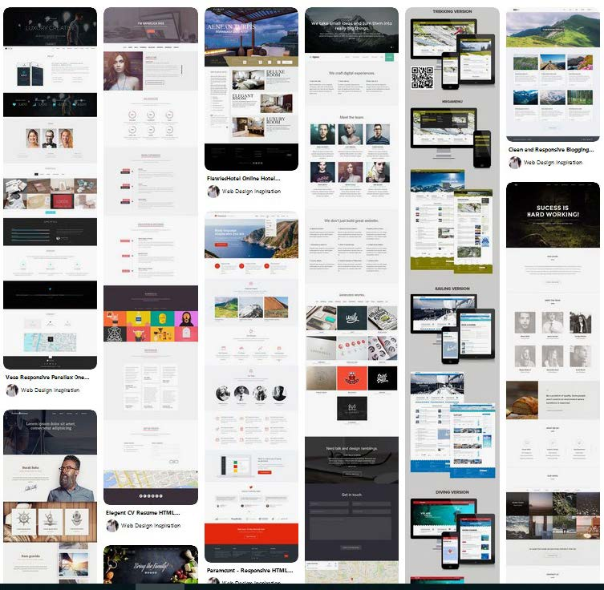

---

- **Einfluss demografischer Faktoren:**
  - **Ältere Zielgruppen:** Benötigen barrierefreies Design (z. B. größere Schriften), legen mehr Wert auf Inhalt und Seriosität als auf reines Styling.
  - **Jüngere Zielgruppen:** Erwarten ein modernes "Look and Feel" und ein hochwertiges, visuelles Design.
- **Bedürfnisse & Erwartungen:** Die optische und inhaltliche Ausrichtung muss dem Thema entsprechen (z. B. NGO-Informationsseite vs. Lifestyle-Webshop).

---
>Was ist schon schön?


https://seiten-werk.com/die-schoensten-und-besten-52-webseiten-in-deutschland-und-der-welt/

https://www.mankord.com/article/die-10-besten-websites-und-webdesign-trends-2022/

https://mkb-marketing.de/ratgeber/schoene-webseiten-design-beispiele/

---
### Benutzerfreundlichkeit

**Form follows function:**
>Jedes Design-Element muss optisch ansprechend und funktional sein.
Kein Element ohne Funktion!

---
- **Layout-Struktur nach dem F-Schema:**
  - Nutzer scannen Webseiten in F-Form
  (oben links $\rightarrow$ rechts, tiefer links $\rightarrow$ rechts, links nach unten).
  - **Typische Anordnung:** Logo oben links, Navigationsmenü im Kopfbereich, zentraler „Hero-Shot“ (Kernaussage) in der Mitte.
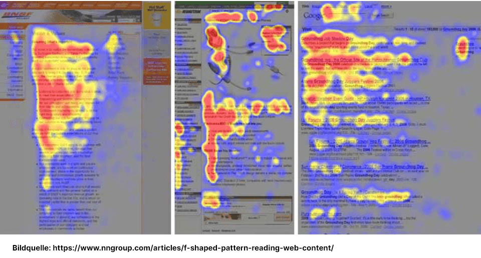


---

- **Typografie und Farbkontrast:**
  - Typografie und Farben passend zur Corporate Identity.
  - Hohe Kontraste (z. B. schwarz auf weiß) und lesbare Schriftgrößen für unterschiedliche Sehstärken und Monitore.
- **Wirkung von Weißraum (Whitespace):**
  - „Weniger ist mehr“: Weißraum strukturiert die Inhalte und lässt sie atmen.
  - Minimalistische Layouts wirken professionell und modern.

---
### Technische Korrektheit

- **Trennung von Inhalt & Design:**
  - Erleichtert Suchmaschinen die optimale Indexierung (SEO).
  - Ermöglicht Barrierefreiheit
    (z. B. einfache Navigation für Screenreader).

---

- **Ladezeiten & Performance:**
  - Kritische 3-Sekunden-Regel: Durchschnittsnutzer springen nach ca. 3 Sekunden Wartezeit ab.
  - Technische Fehlerfreiheit ist das Fundament einer positiven User Experience.

---

### Responsive Webdesign


> 64 Prozent des globalen Traffics stammt von Smartphones!
Smartphones sind für 64 Prozent des gesamten Internetverkehrs verantwortlich. In Asien ist der Smartphone-Anteil am Traffic besonders hoch.


---
- **Definition:** Flexibles Layout, bei dem sich Navigation, Inhalte und Struktur automatisch der Bildschirmauflösung des Endgeräts anpassen (Desktop, Tablet, Smartphone).
- **Notwendigkeit:** Smartphones sind ständiger Begleiter; über die Hälfte aller Nutzer surft mobil (Tendenz steigend).
- **Ziel:** Gewährleistung einer gleichwertigen Benutzerfreundlichkeit auf allen Gerätetypen.

---

### SEO - Search Engine Optimization

**Mobile-First-Indexing:**
- Google bewertet mobil-optimierte, responsive
Webseiten bevorzugt (höheres Ranking).

**Ladezeiten (Page Speed):**
- Schnelle, optimierte Seiten verringern
Absprünge.
- Performance ist ein direkter Rankingfaktor 
Core Web Vitals).


---

**Nutzererfahrung (UX) & User Signals:**
  - Intuitive Navigation erhöht die Verweildauer (Dwell Time) der Besucher.
  - Ansprechendes Design senkt die Absprungrate (Bounce Rate) – ein wichtiges Qualitätssignal für Google.
- **Semantische Struktur & Barrierefreiheit:**
  - Sinnvolle Überschriftenhierarchien (H1-H6) und beschreibende Alt-Texte helfen Screenreadern *und* Suchmaschinen-Crawlern.
- **Saubere Codestruktur:** Die klare Trennung von Inhalt (HTML) und Gestaltung (CSS) erleichtert Crawlern das effiziente Auslesen und Indexieren der Seite.

---
**20 Tips zur SEO-Optimierung:**

**Inhalt & On-Page-Faktoren**
1. Keyword-Recherche: Zielgerichtete Suchbegriffe identifizieren und passend einsetzen.
2. Einzigartiger Content: Hochwertige Inhalte mit echtem Mehrwert schaffen (Plagiate vermeiden).
3. Aussagekräftige Title-Tags: Wichtige Keywords an den Anfang setzen (max. 60 Zeichen).
4. Meta-Descriptions: Klickstarke, animierende Kurzzusammenfassungen schreiben.
5. Klare Überschriften (H1–H6): Strukturierte Text-Hierarchie mit Fokus-Keywords nutzen.

---

6. Bild-Alt-Attribute: Bildinhalte verständlich für Crawler und Screenreader beschreiben.
7. Bildkomprimierung: Dateigrößen vor dem Upload minimieren, um Ladezeiten zu sparen.
8. Sprechende URLs: Lesbare, kurze und logische URL-Strukturen verwenden.
9. Interne Verlinkung: Seitenlogik durch sinnvolle Querverweise stärken.
10. Suchintention erfüllen: Inhalte exakt an dem ausrichten, was der Nutzer sucht.

---
**Technik & Off-Page-Faktoren**

11. Responsive Webdesign: Volle Mobilfreundlichkeit auf allen Endgeräten sichern.
12. Ladezeitoptimierung: Server-Antwortzeiten senken und Skripte minimieren (Page Speed).
13. SSL-Verschlüsselung (HTTPS): Sicherheitszertifikat hinterlegen (Standard und Rankingfaktor).
14. XML-Sitemap: Den Crawling-Prozess für Google-Bots erleichtern.
15. Robots.txt pflegen: Crawling-Berechtigungen gezielt steuern.

---

16. Strukturierte Daten: Schema.org-Markup verwenden, um Rich Snippets in der Suche zu erzeugen.
17. Broken Links beheben: Defekte Verlinkungen (404-Fehler) aufspüren und umleiten.
18. Canonical Tags: Duplicate Content (doppelte Inhalte) technisch ausschließen.
19. Hochwertige Backlinks: Links von vertrauenswürdigen, themenrelevanten Webseiten erhalten.
20. Google Business Profile: Lokale Auffindbarkeit (Local SEO) einrichten und pflegen.

---
<!--_class: structural  -->

## Bevor wir beginnen!!!
- Urheberrecht
- Impressumspflicht
- Datenschutzerklärung
- Cookies


---

### Urheberrecht
>https://www.gesetze-im-internet.de/urhg/index.html

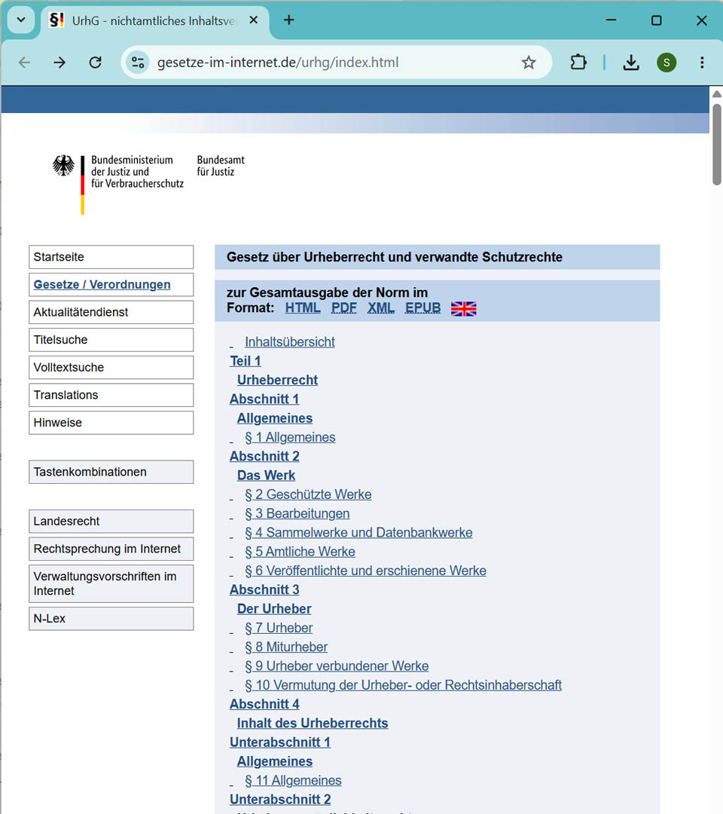

---

copy & paste?
Das Urheberrecht bezeichnet zunächst
das subjektive und absolute Recht
auf den Schutz geistigen Eigentums
in ideeller und materieller Hinsicht.

>>Recherchieren Sie VOR DER VERÖFFENTLICHUNG, ob und wer Rechte an dem Material (Bilder und Texte) Ihrer Webseite hat.


---
### Impressumspflicht

**Definition:**
Vorgeschriebene Anbieterkennzeichnung und Herkunftsangabe einer Webseite zur direkten Kontaktaufnahme.

**Gesetzliche Grundlagen:**
Geregelt in **§ 5 DDG** (Digitale-Dienste-Gesetz) und **§ 18 MStV** (Medienstaatsvertrag).

---


**Wer ist verpflichtet?**
- **Gewerbliche Nutzung (§ 5 DDG):** Alle geschäftsmäßigen Onlinedienste und Webseiten mit kommerziellem Hintergrund.
- **Redaktionelle Inhalte (§ 18 MStV):** Alle Webseiten mit journalistisch-redaktionellen Texten/Beiträgen.
- **Privat-Ausnahme:** Nur rein private/familiäre Seiten (Vorsicht: Werbeschaltung hebt die Befreiung auf).

---

> **Empfehlung:** Zur Vermeidung von Abmahnungen auch bei privaten, aber öffentlichen Seiten ein Impressum einrichten.

---
**Pflichtangaben im Impressum**

- **Name & Rechtsform:** Name des Betreibers/ Gesellschaft.
- **Anschrift:** Ladungsfähige physische Adresse (keine Postfachadresse).
- **Schneller Kontakt:** E-Mail & Telefonnummer (Fax 🙂 )
- **Register:** Registergericht & Registernummer (falls eingetragen).
- **Steuern:** Umsatzsteuer-Identifikationsnummer (USt-IdNr.) oder Wirtschafts-ID.
- **Spezialangaben:** Berufsspezifische Kammerdaten, Berufsbezeichnung sowie zuständige Aufsichtsbehörde.

---
### Datenschutzerklärung

> „Ich betreibe eine kleine Seite, auf der ich für meine Familie und Freunde Inhalte zu Verfügung stelle. Benötige ich für diese private Seite eine Datenschutzerklärung?“

---

**Antwort:**
Grundsätzlich gilt: Wer eine Webseite betreibt, muss mindestens die Informationen gem. **§ 5 Abs. 1 DDG** zur Verfügung stellen und über die Verarbeitung von personenbezogenen Daten informieren. Selbst wenn keine Analyse-Tools oder Kontaktformulare eingebaut sind, erfolgt beim Aufruf der Seite eine Datenverarbeitung, da der Webserver die **IP-Adresse** des Nutzers protokolliert (Server-Logfiles). Daher ist für so gut wie jede Webseite eine Datenschutzerklärung erforderlich, um den Informationspflichten der **DSGVO** nachzukommen.

---


**Gesetzliche Grundlage:** DSGVO (EU-Datenschutz-Grundverordnung) und BDSG (Bundesdatenschutzgesetz).

- **Wann benötigt?** Praktisch immer! Sobald personenbezogene Daten verarbeitet werden.
- **Schon gewusst?** Bereits die Übermittlung und Speicherung der **IP-Adresse** in den Server-Logfiles beim Webseitenaufruf gilt als Datenverarbeitung.
- **Fazit:** Jede öffentliche Webseite braucht eine Datenschutzerklärung (Informationspflicht nach Art. 13 DSGVO).

---

**Typische Auslöser auf Webseiten**

Sobald mindestens eines der folgenden Elemente genutzt wird:
- **Kontaktformulare** (E-Mail, Name)
- **Webanalyse & Tracking** (Google Analytics, Matomo etc.)
- **Social-Media-Anbindungen** (Share-Buttons, Widgets)
- **Externe Einbindungen** (Google Fonts, YouTube-Videos, Maps)
- **Newsletter-Registrierung**
- **Cookies** (zu Marketing- oder Analysezwecken)

---
> Muss ich dann zum Anwalt???

**Im Zweifel ja!**

Aber:
Eine Datenschutzerklärung wird häufig über einen Online-Generator erzeugt:

https://datenschutz-generator.de/
https://www.e-recht24.de/muster-datenschutzerklaerung.html


---

### Cookies

**Definition:**
Textdateien, die Informationen enthalten
und im Browser gespeichert werden können.
Sie dienen der Identifikation,
dem Merken von Zuständen oder
der Analyse des Nutzerverhaltens.
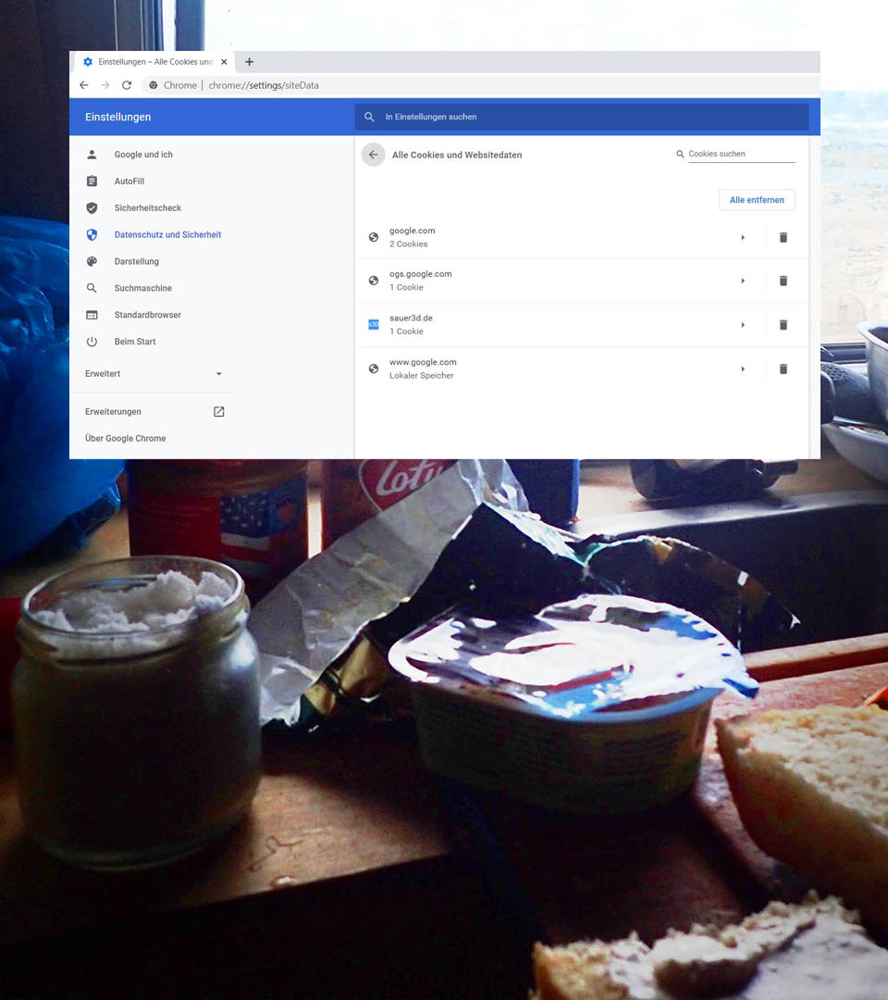

---

**Aufbau einer Cookie**
- Cookie vom Webserver an Browser
- oder im Browser von Skript (JavaScript) erzeugt
- Webserver kann bei späteren, erneuten Besuchen Cookie-Information direkt auslesen
- oder über ein Skript der Website die Cookie-Information an den Server übertragen

---
**Aufgabe von Cookies:**
- Identifizierung des Surfers (Session ID)
- Abspeichern eines Logins
- Abspeichern eines Warenkorbs
- Webtracking von Nutzern mit speziell präparierten Seiten.

---
**Brauche ich einen Cookie Warner?**

**Gesetzliche Grundlage:** **§ 25 TDDDG** (Telekommunikation-Digitale-Dienste-Datenschutz-Gesetz).

- **Nein, wenn** ausschließlich **technisch notwendige Cookies** verwendet werden (z. B. für Warenkörbe, Loginsessions, Sprachauswahl oder den Cookie-Banner selbst).
- **Ja, wenn** technisch **nicht notwendige Cookies** oder Skripte geladen werden (z. B. Tracking- & Marketing-Tools, Google Analytics, YouTube-Embeds, Google Maps).

---
**Anforderungen an ein rechtskonformes Consent-Banner**

- **Aktive Einwilligung (Opt-In):** Cookies dürfen erst nach aktiver Zustimmung des Nutzers gesetzt werden.
- **Gleichwertigkeit:** Der Button „Ablehnen“ muss auf derselben Ebene und visuell gleichwertig zum „Akzeptieren“-Button sein.
- **Keine Voreinstellungen:** Häkchen bei nicht notwendigen Diensten dürfen nicht vorab ausgefüllt sein.
- **Transparenz:** Vollständige Aufklärung über Anbieter, Zweck und Lebensdauer der gesetzten Cookies.


---

> Tipp: In Chrome können Sie unter „Einstellungen > Datenschutz und Sicherheit > Cookies und andere Websitedaten > Alle Cookies und Websitedaten“ anzeigen lassen, ob Ihr Server / Seite Cookies setzt.

---
<!--_class: structural  -->
## Entstehung der HTML-Sprache


---
### Wer hat´s erfunden?

- **Tim Berners-Lee** (britischer Physiker und Informatiker)
- **Wo:** Am **CERN** (Europäische Organisation für
Kernforschung) in Genf
- **Wann:** Entwickelt ab **1989**, vorgestellt **1990/1991**
- **Ursprünglicher Zweck:** Wissenschaftler sollten
Forschungsergebnisse unkompliziert
austauschen und verlinken können
- **Das Gesamtkonzept:** Er erfand gleichzeitig das
**HTTP-Protokoll**, die **URL** (Webadresse) sowie
den ersten Webbrowser/Webserver –
das Fundament des heutigen World Wide Web (WWW)


---
### Die Zeit vor der Entwicklung des World Wide Web
- Kein html 
- Brief? Fax? Telefon?
- Keine schnellen Möglichkeiten zum Informationsaustausch
- Kein Dokumentenaustausch mit mehreren Personen

Benötigt werden:
- Übertragungsprotokolle
- Dateiformate
- Quelloffene Standards

---
### Warum gerade am CERN?

- **Riesige Datenmengen & Forscher-Netzwerke:**
Tausende Wissenschaftler weltweit arbeiteten an gemeinsamen physikalischen Projekten.
- **Inkompatible Computersysteme:**
Forscher nutzten unterschiedlichste Hardware & Software; der Dokumentenaustausch war extrem mühsam.
- **Fehlende Verknüpfung:** Es gab keine Methode,
um Informationen auf verschiedenen Servern direkt miteinander in Beziehung zu setzen.


---

> Die Hypertext-Lösung: HTML ermöglichte es, Dokumente plattformunabhängig darzustellen und über Hyperlinks direkt miteinander zu verknüpfen.
Ein flexibles System sollte Berichte, Handbücher und Protokolle für alle Forscher netzwerkweit auffindbar machen.


---

**Filmtipp:**
Jurassic Web
Der Film erzählt die unbekannte Geschichte
dieser Wegbereiter der digitalen Welt und
ihrer Nutzungsmöglichkeiten
– die Urgeschichte der sozialen Netzwerke!

Nur erhältlich:
>Bei mir :)


---
<!--_class: structural  -->
## Basiswissen
- HTML
- Webserver
- Protokolle (http / https / ssl / ftp)
- Zertifikate
- Domain
- Webspace
- FTP-Client
- Browser

---

### HTML

> HTML = Hypertext Markup Language. Hypertext > Verlinkung von Webseiten


---


- "Markup Language" > Auszeichnungssprache > um Dokumente für Webbrowser strukturiert zu beschreiben
- Webseiten werden NICHT programmiert, sondern geschrieben
- Mit HTML-Tags werden Textpassagen ausgezeichnet
- sie kennzeichnen die logische Bedeutung des Textes.
- Bilder, Webseiten, Videos, Musik etc. werden lediglich verlinkt & nicht im html gespeichert!
- flexibel, skalierbar, plattformunabhängig
- html-Seiten werden immer interpretiert & sehen auf jedem Gerät anders aus! 

---
### Beispiel Tag Paragraph

Das Tag Paragraph steht für einen Textabsatz. Dabei leitet das Tag `<p>` den Paragraph ein und `</p>` beendet diesen.
Mit wenigen Ausnahmen (leeren Elementen) besteht ein Tag immer aus einem öffnenden und einem schließenden Element.


```html
<p>Dies ist ein Paragraph.</p>
```

---
### HTML Spezifikation

> 3ter November 1992 erschien die erste Version der HTML-Spezifikation.
- Dateiendung: .html, .htm
- MIME-Type: text/html
- Entwickelt von: World Wide Web Consortium (W3C)
- Aktuelle Version: 5.2 (Stand: 14. Dezember 2017)
- Art: Auszeichnungssprache
Erweitert zu: XHTML, HTML5

(Wikipedia)


---
### Webserver

> Wie kommt die Webseite
zum User?

- Html-Dokument =
Textdatei mit spezieller Kodierung
- Alle benötigten Dokumente müssen
auf einen Webserver
- Mit Webspace
- Webserver = Computer, der
unter bestimmter Domain
über das http Protokoll erreichbar ist


---

- Text wird als Textdatei mit Endung htm/html gespeichert und auf einem Webserver abgelegt
- Webserver = lateinisch servire ‚dienen‘; englisch server ‚Diener‘, ‚Dienst‘
- Server überträgt Dokumente an Clients wie z. B. Webbrowser
- Webserver = Computer mit Webserver-Software
- Häufig wird auch die Webserver-Software so bezeichnet


---

**Webserver können**

- lokal, in Firmennetzwerken
- oder WWW-Dienst im Internet eingesetzt werden
- Dokumente können somit lokal, firmenintern und weltweit
zur Verfügung gestellt werden

---

**Hauptaufgabe eines Webservers**

- Auslieferung von statischen Dateien
- Html-Dateien
- css
- Bild Dateien
- Script Dateien
- Videos
- Uvm


---

> Für komplette Webseite werden benötigt:
- HTML-Seite
- verknüpfter Designbeschreibungen (CSS)
- Bilddateien (JPG, PNG, GIF, SVG)
- Scripte

> Eine komplexen Webseite kann
> hunderte Anfragen und Serverantworten benötigen.

---
**Webserver ist in der Lage:**

- die Inhalte einer Webseite
- gleichzeitig
- auf viele verschiedene Rechner auszuliefern
- Scripte auszuführen
- Datenbankanbindungen bereitzustellen
- Datenbankinhalte bereitzustellen
- Geschwindigkeit abhängig von Anzahl der Nutzeranfragen & Komplexität der Webinhalte
- uvm.
- dynamische Webinhalte benötigen mehr Ressourcen als statische

---
**Bekannte Beispiele für Webserver**

- Apache / XAMPP
- Nginx
- Microsoft IIS
- uvm:
https://en.wikipedia.org/wiki/Category:Free_web_server_software

---
**Apache**

HTTP Server ist:
- quelloffene
- freies Produkt
- von der Apache Software Foundation
- einer der meistbenutzten Webserver
[https://www.apache.org/](https://www.apache.org/)


---
### Protokolle
- HTTP - Hypertext Transfer Protocol
- HTTPS - Hypertext Transfer Protocol Secure
- SSL - Secure Sockets Layer
- FTP - File Transfer Protocol

---
**HTTP-Protokoll***
> Hypertext Transfer Protocol

- Netzwerkprotokolle wie IP und TCP
- üblicherweise über Port 80 (HTTP)

---
**Schichtenmodell der Netzwerkkommunikation**

HTTP["Anwendungsschicht: HTTP (WAS wird übertragen?) Format der Webinhalte (z. B. HTML)"] 

--> TCP["Transportschicht: TCP (WIE wird es übertragen?) <br> Zuverlässigkeit, Fehlerkontrolle, Ports (z. B. Port 80)"]

--> IP["Netzwerkschicht: IP (WOHIN wird es übertragen?) <br> Adressierung (IP-Adressen) und Routing"]


---

**Definition & Zweck:**
- Zustandsloses Protokoll zur Übertragung von Daten (HTML, CSS, JS, Bilder, Videos) im Web.
- Regelt die Kommunikation zwischen Webbrowser (Client) und Webserver.

---


**Client-Server-Modell:**
- Request (Anfrage): Client fordert eine Ressource an (z. B. beim Klick auf einen Link).
- Response (Antwort): Server liefert die Ressource zurück (z. B. die HTML-Datei).

---

**Zustandslosigkeit (Stateless):**
- Jede Anfrage wird völlig unabhängig von vorherigen Anfragen behandelt.
- Der Server speichert standardmäßig keine Verbindungsinformationen (daher werden Cookies oder Sessions für Logins/Warenkörbe benötigt).

---
**Methoden:**

| Methode | Verwendung |
|---------|------------|
| GET     | Daten auslesen / Seite laden. |
| POST    | Daten übertragen (Formulare, Uploads). |
| PUT     | Daten komplett ersetzen. |
| DELETE  | Daten löschen. |

---
**HTTP-Statuscodes (Antwort des Servers):**

| Code | Status | Bedeutung |
|------|--------|-----------|
| 200  | OK     | Anfrage erfolgreich. |
| 301/302 | Redirection | Umleitung auf eine andere URL. |
| 404  | Not Found | Die angeforderte Datei existiert nicht (Client-Fehler). |
| 500  | Internal Server Error | Fehler auf dem Webserver. |

---

**Beispiel einer HTTP-Anfrage (GET):**

```
Anfrage des Browsers beim Server (vereinfacht):

GET /index.html HTTP/1.1
Host: www.beispiel.de

Antwort des Servers (vereinfacht): 

HTTP/1.1 200 OK
Content-Type: text/html

<html>...
```

--- 
**HTTP-Secure (HTTPS)**
- HTTPS ist die verschlüsselte Variante von HTTP
- SSL-Zertifikat
- Port 443

---
**Verschlüsselung zwischen Webserver und Browser**
- https-Verfahren wird von allen Browsern unterstützt
- https ist eine Sicherheits-Technologie die nicht installiert werden muss
- sofort ersichtlich
- einfach zu überwachen

---
> Eine HTTPS-Seite erkennen Sie daran, dass einerseits oben in der Adresszeile des Browsers der besagte Schriftzug steht, andererseits an dem verriegelten Schloss .


---
**SSL - Secure Sockets Layer**

- SSL ist die Verschlüsselungstechnologie,
die für HTTPS verwendet wird.
- Es stellt sicher, dass die Daten, die zwischen
Client und Server übertragen werden,
vertraulich und unverfälscht bleiben.
- SSL/TLS-Zertifikate werden von
Zertifizierungsstellen ausgestellt,
um die Identität einer Website zu verifizieren.

https://wiki.selfhtml.org/wiki/Grundlagen/HTTPS_und_TLS


---
**Zertifikate**

- Gültigkeit von ein bis zwei Jahren
- nach Ablauf kann es nicht mehr verwendet werden
- erforderlich für Online-Dienste
- erforderlich für Online-Shops
- erf


---
**digitales Zertifikat**
- ist ein digitaler Datensatz
- nach Standards der ITU-T oder der IETF
- bestätigt bestimmte Eigenschaften von Personen oder Objekten
- prüft dessen Authentizität und Integrität
- durch kryptografische Verfahren
- enthält die zu seiner Prüfung erforderlichen Daten

---

> Wer verlängert das Zertifikat?

Technisch wird ein Zertifikat nicht verlängert, sondern **durch ein neues ersetzt**.
- **Certification Authority (CA):** Stellt das neue Zertifikat aus (z. B. Let's Encrypt).
- **Webhoster:** Übernimmt bei Standard-Webspaces die Erneuerung meist vollautomatisch.
- **Server-Administratoren:** Nutzen Bots (z. B. *Certbot* über das ACME-Protokoll), um Zertifikate auf eigenen Servern automatisch alle 60 bis 90 Tage zu erneuern.

---
### Webspace

> beschreibt den Speicherplatz auf einem Server, der zur Unterbringung von Dateien einer Website genutzt wird.

---

- **Speicherplatz** für Dateien auf einem (Web)Server
- Ist über das Internet **dauerhaft verbunden**
- Online-Speicherplatz wird häufig von **Internetdienstanbietern** bereitgestellt
- Kunden stellen Dokumente und Datenbestände (wie Musikdateien), Websites etc zur Veröffentlichung online
- Das Bereitstellen von Speicherplatz im Internet wird **Webhosting** oder auch **Nethosting** genannt
- Die Webserver großer Anbieter stehen in  **Rechenzentren**, in denen hunderte von Webservern Mailservern und Diensteanbietern ihre Dienste verrichten.


---
> HTTPS funktioniert nur dann optimal, wenn alle Inhalte, die auf einer Webseite dargestellt werden, über HTTPS geladen werden.

Werden zum Beispiel auf einer HTTPS-Seite externe Ressourcen wie Bilder, Skripte oder CSS-Dateien unverschlüsselt nachgeladen, spricht man von einem sogenannten Mixed-Content, der zu Problemen bei der sicheren Darstellung führen kann.

---
**Webhoster**

- Preis
- Speicherplatz
- Traffic
- Anzahl der Datenbanken
- Anzahl der E-Mail-Adressen
- Anzahl der Domains
- SSL-Zertifikat
- Support
- Serverstandort


---

heise Webhoster-Vergleich
https://www.heise.de/download/specials/Webhosting-Vergleich-So-finden-Sie-den-passenden-Hosting-Anbieter-6037473


---
> Vorsicht bei Homepage-Baukästen:
Meist zielen die Angebote
darauf ab, den Kunden zu binden,
sodaß ein Wechsel zu einem
anderen Anbieter später nur
erschwert möglich ist.


---

**Selber hosten? Geht das?**
> Ja. Dafür muss jedoch Ihr Rechner 24/7 am Netz in Betrieb sein.


Beachten Sie allerdiengs auch,
dass Ihr Provider das erlauben muss.
Viele DSL Anbieter sehen es nicht gerne,
wenn sie viele externe Zugriffe auf
Ihren Webserver haben.

> Lesen:

https://wiki.selfhtml.org/wiki/Webserver/SELF-Hosting


---
<!-- _class: img-right -->

### Domain & DNS: Grundlagen
- **Definition:** Eine Domain (dt. *Domäne/Bereich*) ist ein weltweit eindeutiger Name im hierarchischen **Domain Name System (DNS)**.
- **Zweck:** Übersetzung von IP-Adressen (z. B. `193.175.120.40`) in menschenlesbare Namen (z. B. `www.thws.de`).


---

- **Webspace-Erreichbarkeit:** Um eine Webseite online zu stellen, werden deren Daten auf einen Webspace geladen. Der Webserver macht diese unter der zugeordneten Domain erreichbar.
- **Hierarchischer DNS-Aufbau:**
  - **Root-Label (Wurzel):** Angedeutet durch den letzten Punkt (z. B. `www.thws.de.`).
  - **Top-Level-Domain (TLD):** `.de` (länderspezifisch/ccTLD) oder `.org` (allgemein/gTLD).
  - **Second-Level-Domain:** Der eigentliche Name (z. B. `thws`).


---


### Subdomains & Technische Limits
- **Subdomains:** Einer Domain können beliebig viele weitere Subdomains vorangestellt werden
(z. B. `elearning.thws.de`), abgetrennt durch einen Punkt.
- **Längenbeschränkungen (gemäß RFC 1035):**
  - **Pro Label** (Abschnitt zwischen zwei Punkten): **Maximal 63 Zeichen**.
  - **Gesamt-FQDN** (Fully Qualified Domain Name): **Maximal 253 Zeichen**
  in Textdarstellung (bzw. 255 Byte im DNS-Format).


---
<!-- _class: img-right -->

- **Adressierung:** Mit einem FQDN kann jedes physische oder virtuelle Objekt im Netz eindeutig adressiert werden.
- **Nameserver:** Speichern DNS-Einträge (z. B. A-Record für IPv4) und verbinden den Domain-Namen mit der IP-Adresse des Servers.


---
<!-- _class: img-right -->

### Vergabestellen & DENIC

**https://www.denic.de/**

- **Registrar / NIC (Network Information Center):** Top-Level-Domain wird von Vergabestelle verwaltet: exakte Namensregeln:
- **DENIC eG (Frankfurt am Main):**
  - Zentrale Genossenschaft & Registrierungs-
  stelle für alle `.de`-Domains.
  - Verwaltet über 17 Millionen Domains (gehört weltweit zu den größten Länder-TLDs).


---

- **Namensregeln für `.de`:**
  - Erlaubt sind: Kleinbuchstaben (a-z), Ziffern (0-9) und Bindestrich (nicht an 1. oder letzter Stelle, nicht an 3. + 4. Stelle).
  - Umlaute (IDN-Domains wie `ä`, `ö`, `ü`) werden unterstützt.
  - Ein zustellungsbevollmächtigter Ansprechpartner in Deutschland wird benötigt.

---
**Muss ich dann immer zur DENIC?**
> Nein, das erledigt der Webhoster

https://www.ionos.de/
https://www.strato.de/
https://www.hostinger.com/
https://all-inkl.com/
https://checkdomain.de/

> Vergleicht die Angebote!
Welches ist das beste Angebot?

---
**Angebotskriterien:**
- Preis
- Speicherplatz
- Traffic
- Anzahl der Datenbanken
- Anzahl der E-Mail-Adressen
- Anzahl der Domains
- SSL-Zertifikat
- Support
- Serverstandort

---

<!-- _class: img-right -->
**Domainabfrage auf der DENIC-Webseite**

>Ist der gewünschte Domainname noch frei?

Hurra! Die Domain maiks-mobiler-service.de ist noch frei…

(äääh... eigentlich nicht mehr :) )


---
<!-- _class: img-right -->

### Der „sprechende“ Domain-Name
- **Definition:** Domain-Name verrät beim Lesen Inhalt / Zweck/ Anbieter
- **Suchmaschinen-Relevanz (SEO):**
  - Suchmaschinen analysieren als Erstes Domain-Namen.
  - Ein sprechender Name fungiert als
  direkter Ranking-Faktor und erhöht Klickrate (CTR).
- **Vorteil:** Nutzer verstehen sofort, worum es geht – das schafft Vertrauen und stärkt die Barrierefreiheit/Verständlichkeit.


---
<!-- _class: img-right -->

### Kriterien zur Auswahl des Domain-Namens
- **Persönliche Marke (Identität):**
  - Steht eine Person oder ein persönlicher Service im Vordergrund?
  - *Tipp:* Den eigenen Namen integrieren (z. B. `maik-caravan.de`).
- **Lokaler Bezug (Geographie):**
  - Wird ein Service in einer bestimmten Stadt/Region angeboten?
  - *Tipp:* Ortsnamen einbauen (z. B. `autoinstandsetzung-wuerzburg.de`).
- **Nischen- / Kerntätigkeit (Dienstleistung):**
  - Bieten Sie eine außergewöhnliche oder sehr spezifische Leistung an?
  - *Tipp:* Kern-Keywords verwenden (z. B. `autarker-fahrzeugausbau.de`).


---
<!-- _class: img-right -->

### Best Practices & Fallstricke
- **Kurz & Einprägsam:** So kurz wie möglich, leicht zu schreiben und sich zu merken.
- **Bindestriche sinnvoll nutzen:**
  - Verbessert die Lesbarkeit(z. B. `maiks-mobiler-service.de` statt `maiksmobilerservice.de`).
  - Vermeidet Zweideutigkeiten.
- **Rechtliche Absicherung:**
  - Vor Registrierung prüfen: Keine Markenrechte / Firmennamen / geschützte Begriffe


---
> Die richtige TLD:
Für den deutschen Markt immer primär `.de` wählen.

Aber auch spezifische Domains sind möglich:
**`.ai`** ist die TLD für "Caribbean island of Anguilla"
 :)

**`.edu`** Domain ist streng limitiert und steht offiziell fast ausschließlich US-amerikanischen, staatlich akkreditierten Bildungseinrichtungen zur Verfügung. Internationale oder private Institutionen können diese meist nicht registrieren.

**`.com`** ist die TLD für kommerzielle Unternehmen und Organisationen weltweit & wirkt professionell.

---
<!-- _class: img-right -->

### FTP: Grundlagen & Dateitransfer
- **Definition:** Das **File Transfer Protocol (FTP)** Netzwerkprotokoll zur Übertragung von Dateien über IP-Netzwerke.
- **Zustandsbehaftet:** Der Server speichert während einer Sitzung den Zustand (z. B. das aktuelle Arbeitsverzeichnis).
- **Funktionen:** Upload (Client → Server), Download (Server → Client), Datei- & Verzeichnisverwaltung (Erstellen, Löschen, Umbenennen).


---

### FTP-Verbindungsaufbau: Aktiv vs. Passiv
- **Zwei getrennte Kanäle:**
  - **Steuerkanal (Control Port 21):** Client initiiert TCP-Verbindung für Befehle & Statuscodes.
  - **Datenkanal:** Übertragung der eigentlichen Dateiinhalte.

---
<!-- _class: img-right -->
- **Aktives FTP (PORT):**
  - Server initiiert die Datenverbindung aktiv zum Client (Port 20 → Client).
  - *Problem:* Client-Firewalls/NAT blockieren oft den eingehenden Zugriff vom Server.
- **Passives FTP (PASV):**
  - Client initiiert die Datenverbindung zu
  einem vom Server vorgegebenen Port.
  - *Standard im Webhosting,* da firewallsicher für den Client.


---
<!-- _class: img-right -->

### FTP-Sicherheit & FTP-Clients
- **Das Sicherheitsrisiko:** Klassisches FTP überträgt Zugangsdaten (Benutzer/Passwort) und Dateien **unverschlüsselt** im Klartext.
- **Sichere Alternativen (Standard heute):**
  - **SFTP (SSH File Transfer Protocol):** Komplett verschlüsselte Übertragung über SSH (Port 22).
  - **FTPS (FTP over SSL/TLS):** Verschlüsseltes FTP (Port 21 mit Explicit TLS oder Port 990).


---
<!-- _class: img-right -->

- **FTP-Clients:** Spezialisierte Software wie **FileZilla** (Open Source, plattformunabhängig) ermöglicht einfache Übertragung per Drag-and-Drop.


---

## Eine Testumgebung
- XAMPP
- Mongoose
- Chrome
- Git

---
<!-- _class: img-right -->

### XAMPP: Lokale Testumgebung
- **Was ist XAMPP?** Ein kostenloses Softwarepaket zur lokalen Simulation eines Webservers.
- **Namensbedeutung:** **X** (plattformübergreifend), **A** (Apache Webserver), **M** (MariaDB/MySQL Datenbank), **P** (PHP Skriptsprache), **P** (Perl).


---
<!-- _class: img-right -->
- **Installationstipps für Einsteiger:**
  - **WICHTIG:** Unter Windows *nicht* in `C:\Program Files` installieren, sondern direkt in `C:\xampp\` ablegen (verhindert Rechteprobleme / UAC-Fehler).
  - Setup-Auswahl: Für unsere Zwecke reichen Apache, MySQL und PHP vollkommen aus.


---

<!-- _class: img-right -->

### Bedienung & Portkonflikte
- **Starten der Dienste:** Das *XAMPP Control Panel* öffnen und bei **Apache** und **MySQL** auf *Start* klicken (Status leuchtet grün).
- **Standard-Ports:** Apache belegt standardmäßig Port **80** (HTTP) und **443** (HTTPS).


---

<!-- _class: img-right -->
- **Häufiger Fehler (Apache startet nicht):**
  - Port 80 ist oft durch Skype, Teams oder
  IIS blockiert.
  - *Lösung:* Im Control Panel auf *Config* bei Apache klicken, `httpd.conf` öffnen, nach `Listen 80` suchen und auf z. B. `Listen 8080` ändern.


---
<!-- _class: img-right -->

### Webseiten ablegen & lokal testen
- **Der htdocs-Ordner:** Der zentrale Speicherort für alle eigenen Webdateien (`.html`, `.css`, `.js`) liegt unter `C:\xampp\htdocs\`.
- **Projekt-Struktur:**
  - Erstelle dort einen eigenen Ordner für dein Projekt (z. B. `htdocs\mein-projekt\`).


---
<!-- _class: img-right -->

### Aufruf im Browser
- **Startseite der Testumgebung:**
  - `http://localhost/` oder `http://127.0.0.1/` eingeben.
  - Leitet automatisch auf die XAMPP-Dashboard-Startseite weiter.
- **Dein Projekt aufrufen:**
  - Adresse zusammensetzen aus localhost + Projektverzeichnis + Datei:
  - `http://localhost/mein-projekt/index.html`


---

### Was ist „localhost“?
- **Bedeutung:** Der Standard-Hostname für den eigenen, lokalen Computer (auch *Loopback-Adresse* genannt).
- **IP-Adresse:** Löst standardmäßig auf die IP-Adresse `127.0.0.1` (IPv4) bzw. `::1` (IPv6) auf.

---

- **Funktionsweise:** Alle Anfragen an `localhost` verlassen den Rechner nicht, sondern werden 
netzwerkintern direkt an das eigene System zurückgeschleift.
- **Zweck beim Webdesign:**
  - Testen von Webseiten auf dem eigenen Server (z. B. Apache unter XAMPP), ohne dass eine Internetverbindung benötigt wird.
  - Schutz der Entwicklungsumgebung vor unbefugtem Zugriff von außen.

---

### Mongoose: Die XAMPP-Alternative
https://mongoose.ws/binary/
- **Was ist Mongoose?** Ein extrem leichtgewichtiger Webserver für statische Webseiten.
- **Vorteil:** Keine Installation nötig! Er besteht aus einer einzigen Datei (`mongoose.exe`).
- **Ideal für Einsteiger:** Wenn du nur HTML, CSS und JavaScript testen willst (kein PHP oder MySQL), ist Mongoose viel einfacher als das mächtige XAMPP.
- **So einfach geht's:**
  1. `mongoose.exe` herunterladen.
  2. Direkt in deinen Projektordner (neben die `index.html`) kopieren.
  3. Per Doppelklick starten.
  4. Webadresse `http://localhost:8080` im Browser aufrufen.

---

### Mongoose: Praxis-Tipps & Gefahren
- **Wo läuft der Server?** Nach dem Start öffnet sich kein großes Fenster. Mongoose nistet sich lautlos im **Infobereich (System Tray)** unten rechts neben der Uhr ein (rotes Symbol).
- **Beenden:** Rechtsklick auf das rote Mongoose-Symbol im Infobereich -> *Exit*.
- **⚠️ ACHTUNG: Mehrfachausführung vermeiden!**
  - Klicke die `mongoose.exe` nur **einmal** an. Startest du sie mehrfach (z. B. aus zwei Projektordnern), schlägt die Portbindung fehl.
- **⚠️ ACHTUNG: Parallelbetrieb blockiert Ports!**
  - Jeder Port (standardmäßig `8080`) kann nur von **einem** Programm belegt werden.
  - Läuft bereits XAMPP (Apache) oder ein anderes Mongoose auf demselben Port, kommt es zu Konflikten. Beende immer den alten Server, bevor du einen neuen startest!

---
<!-- _class: structural -->
## Websitedarstellung im Browser
- Rendering im Browser
- Die Browser-Welt
- Browsercache
- Entwicklertools F12
- Formatierung von Webseiten mit CSS

---
<!-- _class: img-right -->

### Was ist Browser-Rendering?
- **Definition:** Der Prozess, bei dem ein grafischer Browser aus Programmcode (HTML, CSS, JS) und Ressourcen (Bilder, Schriften) eine interaktive Webseite visuell aufbaut.
- **Rendering Engine:** Das Herzstück des Browsers zur Code-Interpretation und Darstellung.


---

- **Die drei dominierenden Engines (Stand 2026):**
  - **Blink** (Chromium-Projekt: Google Chrome, Microsoft Edge, Opera, Brave).
  - **Gecko** (Mozilla Firefox).
  - **WebKit** (Apple Safari).

---
<!-- _class: img-right -->

### Webseiten sind kein starres PDF!
- **Das fluide Web:** html ist flexibel!
- **Einflussfaktoren:** Display-Größe (Mobil bis Desktop), Betriebssystem, Auflösung, installierte Schriften, Benutzereinstellungen.
- **Paradigmenwechsel beim Design:**
  - *Früher:* Der starre Versuch, Webseiten überall exakt identisch aussehen zu lassen („Pixel-Perfect“).
  - *Heute:* **Responsive & Adaptive Webdesign** (Layouts fließen und passen sich dynamisch an).


---


### Wann ist ein Layout „korrekt“?

<br>

> Darstellungsunterschiede zwischen Browsern sind normal – solange die **Funktionalität & Usability** gewährleistet bleibt!

---
<!-- _class: img-right -->
**Die 4 goldenen Regeln der Usability:**
  1. **Lesbarkeit:** Alle Texte müssen
  ungehindert lesbar sein.
  2. **Navigation:** Bedienelemente müssen auffindbar sein & wie erwartet reagieren.
  3. **Interaktivität:** Formulare müssen sich problemlos ausfüllen & absenden lassen.
  4. **Logik:** JavaScript-Funktionen müssen fehlerfrei laufen & das richtige Ergebnis liefern.


---

<!-- _class: img-right -->

### Die Browser-Welt: Marktanteile
- **Google Chrome:** ~70% (Dominant auf Desktop und Android).
- **Apple Safari:** ~15% (Starker Marktanteil durch iOS).
- **Microsoft Edge:** ~5% (Stärker auf Windows-Desktops).
- **Mozilla Firefox:** ~2% (Unabhängige Alternative).
- *Tipp:* Marktanteile variieren regional stark – in den USA liegt Safari z. B. bei über 30%.
- **Quelle:** [Statcounter Global Stats](https://gs.statcounter.com/)


---
<!-- _class: img-right -->

**Technischer Vergleich & Engines**
**Blink (Chrome, Edge, Opera, Brave):**
  - Schnelle V8 JavaScript Engine, größte Erweiterungsauswahl.
  - *Kritik:* Hoher Arbeitsspeicherverbrauch (RAM).


---
<!-- _class: img-right -->

**WebKit (Safari):**
  - Extrem akkuschonend und tief in macOS/iOS integriert.
  - Standardbrowser auf allen Apple-Geräten.
  - *Kritik:* Manchmal zögerliche oder verzögerte Unterstützung neuer Webstandards.


---
<!-- _class: img-right -->

**Gecko (Firefox)**

  - Unabhängig und quelloffen. Starke Datenschutzfeatures (Container-Tabs).
  - *Tipp:* Beste DevTools für CSS Grid/Flexbox.
- **Quelle:** [Can I use...](https://caniuse.com/)


---


**Praxistipps für Webentwickler**
- **Cross-Browser-Testing:** Teste deine Webseiten immer auf mindestens drei unterschiedlichen Rendering-Engines (Blink, WebKit, Gecko).
- **Kompatibilität prüfen:** Nutze [Can I use...](https://caniuse.com/) vor dem Einsatz neuer CSS-/JS-Features.
- **DevTools gezielt einsetzen (F12):**
  - Firefox für Layout-Debugging (Grid/Flexbox).
  - Chrome für Performance- und JavaScript-Analysen.
- **Quelle:** [MDN Web Docs](https://developer.mozilla.org/)

---
### Der Browser-Cache in der Webentwicklung
- **Definition:** Lokaler Pufferspeicher des Webbrowsers, der bereits heruntergeladene Ressourcen (Bilder, CSS, JS, HTML) auf dem Rechner des Nutzers zwischenspeichert.
- **Vorteile:** 
  - **Page Speed:** Beschleunigt das Laden von Folgeseiten erheblich.
  - **Netzwerkschonung:** Reduziert den Datenverkehr und entlastet den Webserver.
- **Das Entwickler-Problem:** 
  - Änderungen an CSS- oder JS-Dateien werden beim einfachen Neuladen oft nicht angezeigt, weil der Browser die veraltete Version aus dem Cache lädt.
---
<!-- _class: img-right -->

### Entwicklertools: Werkzeuge für Profis
- **Definition:** Die Entwicklertools (oft *DevTools* oder *F12-Tools*) sind ein mächtiges, integriertes Werkzeugset in jedem modernen Browser.
- **Bedeutung:** Das wichtigste Instrument für Webentwickler, um Webseiten live zu analysieren, Fehler zu beheben und Performance zu optimieren.
- **Aufruf:** Taste `F12` oder `Strg + Umschalt + I` (Windows) bzw. `Cmd + Opt + I` (macOS).


---
<!-- _class: img-right -->

### Was du mit den DevTools machen kannst:
- **HTML & CSS inspizieren:** Live-Änderungen am Layout vornehmen und sofort sehen, wie sich das Design verändert.
- **Performance messen:** Ladezeiten analysieren und Optimierungspotenziale identifizieren.
- **Netzwerkverkehr beobachten:** Alle Anfragen an den Server verfolgen und prüfen, ob alle Ressourcen korrekt geladen werden.
- **JavaScript-Code debuggen:** Fehler im Skript finden und die Ausführung schrittweise nachvollziehen.
- **Mobile Ansichten simulieren:** Testen, wie die Webseite auf unterschiedlichen Gerätegrößen und Auflösungen aussieht.


---
<!-- _class: img-right -->

### 1. Elemente (Elements)
- **Das DOM inspizieren:** Zeigt den aktuellen Zustand des **DOM (Document Object Model)** an – also die Live-Baumstruktur aller HTML-Elemente.
- **Live-Editing:** Ermöglicht das temporäre Bearbeiten von HTML-Tags, Attributen und Texten direkt im Browser.
- **CSS-Entwicklung:** Stylesheets einsehen, Regeln an- und ausschalten oder neue CSS-Eigenschaften live testen.


---
<!-- _class: img-right -->

### 2. Konsole (Console)
- **Fehlerprotokoll:** Der zentrale Ort für Fehlermeldungen von JavaScript und Netzwerkproblemen (z. B. blockierte Ressourcen).
- **Interaktivität:** Erlaubt das Ausführen von JavaScript-Befehlen direkt im Kontext der geladenen Seite.
- **Debugging:** Ausgabe von Debug-Informationen mittels `console.log()`.


---
<!-- _class: img-right -->

### 3. Netzwerk (Network)
- **Datenverkehr überwachen:** Detaillierte Ansicht aller Ressourcen (HTML, CSS, JS, Bilder), die zwischen Browser und Server ausgetauscht werden.
- **Metriken:** Zeigt Ladezeiten, HTTP-Statuscodes, Dateigrößen und Antwort-Header an.
- **Fehlersuche:** Ideal zum Aufspüren von nicht gefundenen Dateien (404) oder langsamen Ladezeiten.


---
<!-- _class: img-right -->

### 4. Quellen (Sources)
- **Datei-Explorer:** Zeigt alle geladenen Quelldateien der Website an.
- **Code-Debugging:** Ermöglicht das Setzen von **Breakpoints** in JavaScript.
- **Schritt-für-Schritt-Ausführung:** Der JS-Code kann an bestimmten Zeilen angehalten und Variablen-Werte live inspiziert werden.


---
<!-- _class: img-right -->

### 5. Performance & Lighthouse
- **Laufzeit-Analyse:** Aufzeichnung und Analyse der Rendering-Performance der Seite.
- **Lighthouse-Audits:** Automatisierter Report von Google zu den vier Kernbereichen:
  - Performance (Ladezeit)
  - Accessibility (Barrierefreiheit)
  - Best Practices
  - SEO (Suchmaschinenoptimierung)


---
<!-- _class: img-right -->

### Praxistipp: Responsive Design testen
- **Geräte-Modus:** Simuliert verschiedene Smartphones und Tablets (z. B. iPhone oder Pixel) direkt auf dem Bildschirm.
- **Touch-Simulation:** Mauszeiger wird zum Touch-Cursor, um Wisch-Gesten und Touch-Events zu testen.
- **Viewport-Flexibilität:** Beliebiges Skalieren der Breite, um die Breakpoints des CSS-Layouts zu prüfen.


---

**Zusammenfassung der Tools:**

| Reiter | Hauptzweck |
|---|---|
| **Elemente** | HTML/CSS-Struktur und Live-Styling |
| **Konsole** | Debugging von JavaScript-Fehlern |
| **Netzwerk** | Analyse des Datenverkehrs & Ladezeiten |
| **Quellen** | Code-Navigation und Breakpoints |
| **Lighthouse** | Automatisierte Qualitätsprüfungen (Performance, SEO, Barrierefreiheit) |

---

### Formatierung von Webseiten mit CSS: Einführung
- **Früher: Vermischung von Inhalt und Design**
  - Jedes HTML-Element erhielt direkte Formatierungsanweisungen (z. B. `<font color="red">` oder `<b>`).
  - Dies führte zu unlesbarem Code und enormem Pflegeaufwand bei großen Websites.
- **Heute: Separation of Concerns (Trennung der Zuständigkeiten)**
  - **HTML** beschreibt ausschließlich die **Struktur & Semantik** (z. B. Überschriften, Absätze).
  - **CSS** bestimmt das komplette **visuelle Layout** (Layout, Farben, Typografie).

---

**Beispiel**

```html
<!-- index.html -->
<link rel="stylesheet" href="style.css">
<h1>Meine Überschrift</h1>
```
```css
/* style.css */
h1 { color: #ff6a00; font-size: 24px; font-weight: bold; }
```

---

**Was ist CSS? (Cascading Style Sheets)**

- **Bedeutung:** Übersetzt *Gestufte Gestaltungsbögen*. CSS ist ein lebendiger Standard (*Living Standard*), der vom W3C ständig weiterentwickelt wird.
- **Die Kaskade (Cascading):** Legt fest, welcher Style gewinnt, wenn sich Regeln widersprechen. Spezifischere Regeln überschreiben allgemeinere.
- **Das Vererbungskursmodell:** Übergeordnete Elemente vererben Styles an Kind-Elemente (z. B. eine im `<body>` definierte Schriftart gilt für alle Texte darin).

---

**Beispiel**

```css
body {
  font-family: 'Outfit', sans-serif;
  color: #333333; /* Gilt für das gesamte Dokument */
}

h1 {
  color: #005564; /* Überschreibt die vererbte Farbe für h1-Elemente */
}
```

---

**Selektoren & Mediensteuerung**

- **Selektoren:** Bestimmen präzise, welche HTML-Elemente formatiert werden.
  - **Elementname:** `a { color: blue; }` (alle Hyperlinks)
  - **Klasse:** `.highlight { background: yellow; }` (beliebige Elemente mit `class="highlight"`)
  - **ID:** `#main-header { font-size: 2em; }` (einzigartiges Element mit `id="main-header"`)
- **Mediensteuerung (Media Queries):** CSS ermöglicht unterschiedliche Formatierungen je nach Ausgabemedium (z. B. optimierte Druckansicht oder angepasstes Layout für Mobilgeräte).

---

**Beispiel**

```css
/* Normales Styling für Desktop */
body { font-size: 16px; }

/* Spezielles Styling für Smartphones (Breite maximal 600px) */
@media (max-width: 600px) {
  body {
    font-size: 14px;
    background-color: #f8f9fa;
  }
}
```
---

> Und nun?
Learning by Doing!


---
<!-- _class: structural -->
## Start Coding: Nur wie? (01)
- Notepad und html
- html Syntax
- Das html Grundgerüst
- Index.html (01)

---

<!-- _class: img-right -->
### Notepad & html

- Webseiten bestehen aus Text
- WYSIWYG Editoren („What You See Is What You Get“) schreiben häufig „schlechten“ und unsauberen Code.
- Daher > Texteditor notepad++ 
- notepad++ "versteht" html & strukturiert Code mit Textauszeichnungen
- Notepad++ > neue leere Textdatei an.
- Für korrekte Textauszeichnungen > notepad++ auf html umstellen


---
<!-- _class: img-right -->
**HTML-Syntax: Die Bausteine des Webs**

- Grundprinzip von HTML ist der sogenannte **Tag** (Markierung).
- Fast jedes HTML-Dokument besteht aus einer Abfolge von Start-Tags, Inhalten und End-Tags, die das Gerüst der Seite bilden.


---

**1. Tags und ihre Funktion**
Ein HTML-Tag besteht aus dem englischen Schlüsselwort in spitzen Klammern, z. B. `<p>` für einen Absatz oder `<h1>` für eine Hauptüberschrift. Fast alle Tags haben einen entsprechenden **Schließenden Tag**, der mit einem Schrägstrich (`/`) beginnt, z. B. `</p>`. Der Inhalt, der formatiert werden soll, steht zwischen diesen beiden Tags.

**Beispiel für einen Absatz:**

```html
<p>Hier steht der Text, den der Browser als neuen Absatz darstellt.</p>
```

---

**2. Attribute: Zusätzliche Informationen**
- Tags können durch sogenannte **Attribute** ergänzt werden
- Attribute stellen zusätzliche Informationen bereit
- Attribute stehen immer im Start-Tag & bestehen aus einem Attributnamen, einem Gleichheitszeichen und dem dazugehörigen Wert in Anführungszeichen.

**Beispiel für ein Bild mit Attributen:**

```html

```

In diesem Beispiel definieren das Attribut `src` (source) und `alt` (alternative Text) das Bild und dessen Beschriftung für Screenreader und wenn das Bild nicht geladen werden kann.

---
**3. Elemente & leere Elemente**

- HTML-Elemente können Text oder andere Elemente enthalten.
- z.B. Überschrift `<h1>`:  besteht aus einem Start-Tag `<h1>`, dem Inhalt `Meine Überschrift` und dem entsprechenden End-Tag `</h1>`.  
- Es gibt auch sogenannte **leere Elemente** wie `` oder `<br>`
- leere Elemente besitzen keinen Inhalt & somit keinen End-Tag
- Sie werden stattdessen oft mit einem abschließenden Schrägstrich (`<br />`) geschrieben, um anzuzeigen, dass das Element abgeschlossen ist. (Guter Stil, aber nicht notwendig)

---
**Groß- und Kleinschreibung in HTML**
- Keine Case-Sensitivity: HTML-Element- und Attributnamen sind nicht fallsensitiv (Groß-/Kleinschreibung ist für den Browser egal, z. B. <title> vs. <TITLE>).
- Übersichtlichkeit: Eine einheitliche Schreibweise verbessert die Lesbarkeit und Struktur des Codes.
- Historischer Kontext (XHTML): Im älteren Standard XHTML war die Kleinschreibung zwingend vorgeschrieben.
- Heutiger Standard: Die Kleinschreibung hat sich damals unter Entwicklern durchgesetzt und gilt auch heute noch als Best Practice („guter Stil“).

---
<!-- _class: img-right -->
### Das Grundgerüst

- Kopiervorlage.txt öffnen
- Den Code kopieren
- neue html-Datei in notepad++ anlegen
- Code einfügen
- notepad++ auf html umstellen!


---
### Ein valides HTML-Dokument: Die Bestandteile
- **`<!DOCTYPE html>` (Dokumenttyp-Deklaration):** Steht in der allerersten Zeile und teilt dem Browser mit, dass es sich um HTML5 handelt.
- **`<html>` (Wurzelelement):** Umschließt das gesamte Dokument und definiert die Hauptsprache (z. B. `<html lang="de">`).
- **`<head>` (Kopfbereich):** Umschließt unsichtbare Meta-Informationen (z. B. Zeichensatz `<meta charset="utf-8">`).
- **`<title>` (Seitentitel - PFLICHT!):**
  - Ist im `<head>` platziert und für die Validität der Seite **zwingend vorgeschrieben** (Pflichtelement).
  - Definiert den Text, der im Browser-Tab und in Suchergebnissen (z. B. Google Search) erscheint.
- **`<body>` (Inhaltsbereich):** Umschließt alle sichtbaren Elemente einer Webseite (Texte, Bilder, Links, etc.).

---

**Minimales valides HTML5-Grundgerüst**
Ein voll funktionsfähiges und standardkonformes HTML-Dokument sieht minimal so aus:

```html
<!DOCTYPE html>
<html lang="de">
<head>
    <meta charset="utf-8">
    <title>Meine erste Webseite</title>
</head>
<body>
    <h1>Hallo Welt!</h1>
    <p>Dies ist ein valides HTML5-Dokument.</p>
</body>
</html>
```

---
### Code-Einrückung (Indentation)
- **Für den Browser:** Völlig egal. Browser ignorieren überflüssige Leerzeichen (Whitespaces) und Zeilenumbrüche im Quelltext.
- **Für den Entwickler:** Essentiell für die Lesbarkeit. Man erkennt auf den ersten Blick, welche Elemente ineinander verschachtelt sind und ob Tags korrekt geschlossen wurden.
- **Die Grundregel:** Jedes Kind-Element (untergeordnetes Element) wird um eine Stufe (meist 2 oder 4 Leerzeichen oder 1 Tabulator) weiter eingerückt als sein Eltern-Element.

```html
<ul> <!-- Übergeordnetes Eltern-Element -->
    <li>Erster Eintrag</li> <!-- Untergeordnete Kind-Elemente -->
    <li>Zweiter Eintrag</li>
</ul>
```
- **Tipp:** In Notepad++ > `Tab`-Taste zum Einrücken > `Umschalt + Tab` zum „Ausrücken“

---
**Die 5 Elemente des HTML-Grundgerüsts**

- `<!DOCTYPE html>`
- `<html>`
- `<head>`
- `<title>`
- `<body>`

---
<!-- _class: img-right -->
`<!DOCTYPE html>`

- **Dokumenttyp-Deklaration:** in erster Zeile & teilt Browser mit, dass es sich um HTML5 handelt.
- früher Angabe der html-Version erforderlich (z.B. `<!DOCTYPE html PUBLIC "-//W3C//DTD XHTML 1.0 Strict//EN" "http://www.w3.org/TR/xhtml1/DTD/xhtml1-strict.dtd">`)
- Seit HTML5  `<!DOCTYPE html>`.
- rigorose Vereinfachung im Sinne von
Less-is-more


---
<!-- _class: img-right -->
`<html lang="de">`

- ist das **Wurzelelement**
- umschließt die gesamte HTML-Seite
- das Attribut `lang="de"` gibt die Sprache an (hier: Deutsch)
- Alternativ: en, fr, es, ru, etc.
- wichtig für Suchmaschinen & Screenreader


---
<!-- _class: img-right -->
`<head>`

- unsichtbar, aber unverzichtbar
- umschließt unsichtbare Meta-Informationen
- Zeichensatz `<meta charset="utf-8">`
- enthält title-Element (Pflicht für ein valides html-Dokument)
- Enthält Links zu externen CSS-Dateien und JavaScript-Dateien (optional)
- Kann Links zu externen Schriftarten enthalten (z.B. Google Fonts, optional)


---
<!-- _class: img-right -->
**Zeichensatz-Deklaration im Head**

- `<meta charset="utf-8">`
- Zeichenkodierung festlegen
- für Suchmaschinen & Screenreader wichtig
- korrekte Darstellung von Sonderzeichen, Umlauten und Emojis über verschiedene Betriebssysteme & Browser hinweg.
- erstes Element im `<head>`, vor allen anderen Elementen im `<head>` (nicht zwingend, gilt aber als Best Practice).
- muss innerhalb  erster 512 Bytes des Dokuments stehen


---
<!-- _class: img-right -->

> Wichtig: Das Dokument muss
auch in der Dateikodierung
als UTF-8 gespeichert werden!


---
<!-- _class: img-right -->

**Meta-tag Viewport**
<meta name="viewport" content="width=device-width, initial-scale=1.0" />

- sorgt dafür, dass sich die Webseite an die Bildschirmbreite des Geräts anpasst
- sorgt dafür, dass die Webseite in der korrekten Zoomstufe angezeigt wird
- **unabdingbar für Responsives Webdesign**


---

**Weitere Meta-Tags im Head**

`<meta name="description" content="Beschreibung meiner Webseite">` (für Suchmaschinen)

`<meta name="viewport" content="width=device-width, initial-scale=1.0">` (für Mobilgeräte)

`<meta name="keywords" content="mobiler Service, Camping, Fahrzeugausbau">` (für Suchmaschinen)

`<meta name="author" content="Maik Mustermann">` (für Suchmaschinen)

`<meta name="robots" content="index, follow">` (für Suchmaschinen)

`<meta name="language" content="German">` (für Suchmaschinen)
...

---
<!-- _class: img-right -->

**<title>**

- umschließt den Titel der Webseite
- erscheint im Browser-Tab und in Suchergebnissen
- für die Validität der Seite **zwingend vorgeschrieben** (Pflichtelement)
- SEO-Relevanz!


---
<!-- _class: img-right -->
`<body>`

- umschließt alle **sichtbaren** Elemente der Webseite
- Texte, Bilder, Links, Tabellen, etc. sind hier platziert
- Verlinkung von Javascript-Datei (optional) am Ende des body-tags


---
<!-- _class: img-right -->

**Weitere Elemente der Kopiervorlage**

`<h1>` – `<h6>` **Überschriften**
- h steht für heading
- Die Zahl gibt die Wichtigkeit der Überschrift an.
- normalerweise reicht h1-h2
- bei technischen Dokumenten h1-h6


---


> h1 ist semantisch wichtig!
Nicht nur für Darstellung, sondern auch für SEO und Barrierefreiheit.

<br>

> Es ist nur eine h1 pro Seite erlaubt!


---

 `<p>` **Absätze: Gliederung & Syntax**
- **Funktion:** Dienen der Strukturierung von Fließtext in logische Absätze (engl. *paragraph*).
- **Syntax:** `<p>` leitet einen Absatz ein, `</p>` beendet ihn.
- **Schließendes Tag optional?**
  - In HTML5 ist das schließende `</p>` technisch optional (der Browser schließt den Absatz bei bestimmten Folgeelementen implizit).
  - In XHTML ist es zwingend **Pflicht**.
  - **Guter Stil:** Das schließende `</p>` sollte immer angegeben werden. Es umschließt einen zusammenhängenden Textblock – es steht nicht für den Zwischenraum.

---

**Verschachtelung & Abstände bei Absätzen**
- **Keine Block-Elemente im Absatz:** Ein `<p>`-Element darf keine anderen blockerzeugenden Elemente (z. B. Überschriften, Listen `<ul>`, Tabellen `<table>` oder andere Absätze) enthalten.
- **Implizites Schließen:** Erkennt der Browser ein unzulässiges Element innerhalb eines offenen `<p>`, schließt er den Absatz automatisch vorzeitig. Ein späteres schließendes `</p>` ist dann ein verwaister Fehler.
- **Abstände gestalten:**
  - **Falsch:** Leere Absätze (`<p>&nbsp;</p>`) oder mehrere `<br>`-Tags zur Abstandserzeugung missbrauchen.
  - **Richtig:** Abstände sauber über die CSS-Eigenschaft `margin` definieren.


---
**`<br>` :Zeilenumbruch (Line Break)**
- **Bedeutung:** Das `<br>`-Element (*break*) erzeugt einen logischen Zeilenumbruch innerhalb eines Textes.
- **Best Practice:** Nur nutzen, wenn der Umbruch **Bestandteil des Inhalts** ist. Fließtext sollte niemals manuell umgebrochen werden (das regelt der Viewport).
- **Ausnahmen (sinnvoller Einsatz):**
  - Postadressen (wichtig für die korrekte Gliederung der Anschrift).
  - Gedichte, Songtexte oder Liedzeilen.
- **Syntax:** Es ist ein *leeres Element* ohne Inhalt (in HTML `<br>`, in XHTML `<br />` geschrieben, kein End-Tag erforderlich).
- **Quelle:** [SelfHTML: br-Element](https://wiki.selfhtml.org/wiki/HTML/Textauszeichnung/br)

---
### Datei speichern: WIE und WOHIN?
- **Das Grundprinzip:** Bevor Sie Ihre erste HTML-Seite speichern, ist das **WIE** und **WOHIN** in der Webentwicklung von besonderer Bedeutung.
- **Schritt-für-Schritt-Anleitung für XAMPP:**
  1. Öffnen Sie das **XAMPP Control Panel** `1)` und starten Sie den **Apache Webserver** und **MySQL** `2)`.
  2. Öffnen Sie mit **Explorer** `3)` das **XAMPP Root-Verzeichnis** `4)`.
  3. In diesem liegt das **`htdocs`-Verzeichnis** `4)` (dieses wird vom Apache Webserver gehostet).
  4. Legen Sie darin ein **beliebiges Unterverzeichnis** an.
  5. *Empfehlung:* Zur Versionierung empfehlen sich weitere Unterverzeichnisse `5)`.
  6. Nun können Sie im **Notepad++** das HTML-Grundgerüst als HTML-Datei speichern `6)`.

---


---
**Die Alternative mit dem Mongoose Webserver**

- Projektordner anlegen.
- HTML-Datei als index.html darin abspeichern.
- mongoose.exe herunterladen und in denselben Projektordner kopieren.
- Per Doppelklick ausführen.
- Adresse http://localhost:8080 im Webbrowser aufrufen.
- Wichtiger Sicherheitshinweis zum Thema Mehrfachausführung/Port-Konflikt
und Beenden über den Windows-Infobereich.

---

**Die Startseite (Einstiegsseite)**
- **Definition:** Die Startseite bzw. Einstiegsseite ist dasjenige HTML-Dokument, das standardmäßig ausgeliefert wird, wenn ein Besucher Ihren Webauftritt ohne Angabe einer bestimmten Seite aufruft.
- **Namensgebung:**
  - Wie Sie die Startseite benennen müssen, sodass sie vom Webserver als solche erkannt wird, schreibt Ihr Webspace-Provider vor.
  - Meistens ist der Name `index.html`, `index.htm`, `default.html` oder `default.htm`.
  - Bei manchen Providern können Sie einen beliebigen Namen definieren.
- **Wichtigste Regel:**
  - Die Startseite Ihrer Webseite heißt **IMMER `index.html`**!
  - Beim Aufruf der Domain sucht der Webserver immer nach einer Datei mit diesem Namen, um sie anzuzeigen.

---

<!-- _class: img-right -->

**Darstellen der Seite**

- Webbrowser Chrome undöffnen & Eingabe von:
http://localhost/
- Sollte der Webserver laufen zeigt XAMPP Konfigurationsseite an
- XAMPP hostet Dateien, die im htdocs Verzeichnis liegen und springt automatisch in den Ordner xampp


---
<!-- _class: img-right -->

- Um die eigene Webseite anzuzeigen:
-> in das entsprechende Verzeichnis wechseln

Zur Versionierung der Daten > fortlaufende Nummerierung der Verzeichnisse:
http://localhost/maiks-mobiler-service/01/

- Chrome zeigt unsere erste Webseite an.
- Beachten Sie, dass Chrome im Tab den **Title Tag** wiedergibt.
- Beachten Sie ebenfalls die Darstellung des **strukturierten Textes**.


---
**Entwicklertools**
In den Einstellungen > Weitere Tools > Entwicklertools
stellt Chrome Ihnen umfangreiche
Debugging-Werkzeuge zur Verfügung.
>Testen Sie diese.

---


---
<!-- _class: structural img-right -->
## Start Coding: Und los geht`s (02)
- Erste eigene Inhalte (02)
- Bilder
- ... und Texte

---

<!-- _class: img-right -->

### Coden mit Notepad++

**Bilder einfügen**

Als visuelle Menschen sprechen uns als erstes hochwertige und spannende Bilder an. Häufig findet sich auf der Startseite ein aussagekräftiges Bild im Header oder im Seitenhintergrund.

Im Rahmen Ihres Studiums lernen Sie, hochwertige Bilder zu erzeugen und zu verarbeiten. Nutzen Sie diese Fähigkeiten, um einen überzeugenden ersten Eindruck zu hinterlassen.


---

<!-- _class: img-right -->

- neuen Ordner "img" neben index.html anlegen
- "header.jpg" in diesen Ordner kopieren
- Folgenden Code in der index.html einfügen:   


```html
<!-- Sichtbarer Dokumentinhalt im body -->

<h1>Blindtext.</h1>
```


---
**Texte einfügen**

>Herzlich willkommen auf der Webseite von Maik!
Schlimmer geht es nicht!

Wenn Sie gelesen werden wollen:
- Fassen Sie sich kurz.
- Werden Sie originell.
- Transportieren Sie Information.
- Fangen Sie nicht an zu labern.
- Strukturieren Sie Ihre Texte semantisch und inhaltlich!


---
**Think Semantik**

- Semantik ist die Lehre von der Bedeutung
von Zeichen und sprachlichen Ausdrücken.
- Im Zusammenhang mit HTML bezieht sich
Semantik auf die Bedeutung von HTML-Tags.
- HTML-Tags werden verwendet, um die Struktur
und den Inhalt einer Webseite zu beschreiben.
- Semantik ist wichtig, da sie es Suchmaschinen
ermöglicht, den Inhalt einer Webseite zu
verstehen und zu indexieren.


---
<!-- _class: structural -->
### Tags zur Strukturierung von Text
**HTML-Elemente für Semantik und Lesbarkeit**

- Übersicht der wichtigsten Text-Tags
- Eigenschaften von Block- und Inline-Elementen
- Code-Beispiele für die Praxis

---

**Überschriften (h1 - h6)**

Dienen der Strukturierung und Gewichtung:
- **`<h1>` bis `<h6>`**: Abstufung der Wichtigkeit
- **Eigenschaften**:
  - Block-Elemente (erzeugen eine neue Zeile)
  - Suchmaschinen (SEO) nutzen sie zur Gewichtung
  - Pro Seite sollte es nur genau eine `<h1>` geben
- **Code-Beispiel**:
  ```html
  <h1>Hauptüberschrift</h1>
  <h2>Unterüberschrift</h2>
  ```

---

**Textabsätze (p)**

Der Standard für Fließtext:
- **`<p>` (Paragraph)**: Umschließt Textabschnitte
- **Eigenschaften**:
  - Block-Element mit automatischen Abständen
  - Verbessert den Lesefluss durch visuelle Pausen
  - Ignoriert aufeinanderfolgende Leerzeichen im Quelltext
- **Code-Beispiel**:
  ```html
  <p>Dies ist ein Absatz.</p>
  <p>Dies ist der nächste Absatz.</p>
  ```


---

**Ungeordnete Listen (ul)**

Für Sammlungen ohne feste Reihenfolge:
- **`<ul>` (Unordered List)**: Umschließt Listenelemente
- **`<li>` (List Item)**: Einzelne Listenpunkte
- **Eigenschaften**:
  - Block-Elemente
  - Standardmäßig mit Aufzählungspunkten (Bullets)
- **Code-Beispiel**:
  ```html
  <ul>
    <li>HTML5 Semantik</li>
    <li>CSS Styling</li>
  </ul>
  ```


---
**Geordnete Listen (ol)**

Für Abläufe, Rezepte und Anleitungen:
- **`<ol>` (Ordered List)**: Umschließt Listenelemente
- **`<li>` (List Item)**: Einzelne Listenpunkte
- **Eigenschaften**:
  - Block-Elemente
  - Werden automatisch nummeriert (1., 2., 3...)
  - Attribute wie `start` oder `type` möglich
- **Code-Beispiel**:
  ```html
     <ol>
    <li>HTML-Datei anlegen</li>
    <li>Struktur im Browser prüfen</li>
  </ol>
  ```


---

**Zeilenumbruch (br) & Trenner (hr)**

Für feine Text- und Layoutsteuerung:
- **`<br>` (Line Break)**: Erzwingt einen Zeilenumbruch
- **`<hr>` (Horizontal Rule)**: Thematischer Bruch
- **Eigenschaften**:
  - **Leere Elemente** (haben keinen schließenden Tag!)
  - `<br>` wirkt auf Inline-Ebene (bricht nur Text um)
  - `<hr>` wirkt auf Block-Ebene (erzeugt eine Linie)
- **Code-Beispiel**:
  ```html
     Erste Zeile<br>Zweite Zeile
  <hr>
  Anderes Thema...
  ```


---

**Vorformatierter Text (pre & code)**

Für Quellcode und exakte Abstände:
- **`<pre>` (Preformatted)**: Behält alle Leerzeichen und Zeilenumbrüche exakt bei
- **`<code>`**: Kennzeichnet Text als Programmcode
- **Kombination**: `<pre><code>...</code></pre>`
- **Code-Beispiel**:
  ```html
     <pre><code>
    function init() {
    console.log("Start");
  }
  </code></pre>

---

**Starke Betonung (strong)**

Für besonders wichtige Inhalte:
- **`<strong>` (Strong Importance)**: Kennzeichnet Text von großer Bedeutung
- **Eigenschaften**:
  - Inline-Element (fließt im Text mit)
  - Drückt Wichtigkeit, Dringlichkeit oder Ernsthaftigkeit aus
  - Browser stellen den Text standardmäßig **fett** dar
  - Wichtig für Screenreader (akustische Hervorhebung)
  - *Hinweis*: Nutze `<strong>` für Semantik, nicht das rein dekorative `<b>`
- **Code-Beispiel**:
  ```html
     Achtung: Die Steckdose steht <strong>unter Strom</strong>!
  ```

---

**Hervorhebung (em)**

Für sprachliche Betonung:
- **`<em>` (Emphasis)**: Hebt Wörter oder Phrasen im Satz hervor
- **Eigenschaften**:
  - Inline-Element (fließt im Text mit)
  - Ändert je nach betontem Wort die Aussage des Satzes
  - Browser stellen den Text standardmäßig *kursiv* dar
  - Wird von Screenreadern akustisch betont (Intonation)
  - *Hinweis*: Nutze `<em>` für Semantik, nicht das rein dekorative `<i>`
- **Code-Beispiel**:
  ```html
     Das müssen Sie <em>heute</em> noch erledigen!
  ```

---
<!-- _class: structural center -->
### Quick Check: Semantik
**Welches Tag eignet sich am besten für...**

1. ...eine Zutatenliste für eine Pizza?
2. ...eine Schritt-für-Schritt-Anleitung?
3. ...die wichtigste Überschrift der Seite?
4. ...einen einfachen Fließtext?

**Überlegen Sie kurz und besprechen Sie es mit Ihrem Nachbarn!**


---
<!-- _class: img-right -->

Ihre Text-Inhalte fügen Sie nun nach dem Bild ein:
Den Vorlagetext findet Ihr im material-Ordner in der Datei:

**HomeSweetHome.txt**


---


---

### Coden mit Visual Studio Code

Der weltweite Standard für moderne Webentwicklung:
- **Plattformunabhängig & kostenlos**: Läuft auf Windows, macOS und Linux.
- **Riesiger Extension Marketplace**: Tausende Erweiterungen zur Anpassung.
- **IntelliSense**: Intelligente Autovervollständigung für HTML, CSS und JS.
- **Integriertes Terminal & Git**: Alle Werkzeuge an einem zentralen Ort.


---

**Emmet – Schneller HTML schreiben**

Integriertes Feature, das Tipparbeit spart:
- **Funktionsweise**: Kurzschreibweisen eintippen
und mit der **Tab-Taste** expandieren lassen.
- **Wichtige Shortcuts für den Einstieg**:
  - `!` + Tab $\rightarrow$ Erzeugt das komplette
  HTML5-Grundgerüst.
  - `p` + Tab $\rightarrow$ Erzeugt `<p></p>`.
  - `ul>li*3` + Tab $\rightarrow$ Erzeugt eine
  Liste mit 3 Listeneinträgen.
  - `h1{Titel}` + Tab $\rightarrow$ Erzeugt
  `<h1>Titel</h1>`.


---

**Live Server & Auto-Verwaltung**

Die wichtigsten Erweiterungen für Einsteiger:
- **Live Server (Extension)**:
  - Startet mit einem Klick lokalen Webserver.
  - Aktualisiert den Browser automatisch
  beim Speichern (Live Reload).
- **Auto Rename Tag**:
  - Ändert das schließende Tag automatisch,
  wenn das öffnende Tag geändert wird.
- **Prettier (Code Formatter)**:
  - Formatiert den Code beim Speichern
  automatisch nach festen Regeln.


---

**Bedienung: Live Server**

Lokale Entwicklung mit sofortigem Feedback:
- **Starten**: Klicke unten rechts in der Statusleiste
auf **"Go Live"** oder nutze den
Shortcut `Alt + L, Alt + O`.
- **Lokaler Server**: Startet die Seite
unter `http://127.0.0.1:5500/index.html`.
- **Live Reload**: Nach jedem Speichern
(`Strg + S`) lädt der Browser die Seite
automatisch neu. Keine manuelle
Aktualisierung nötig!


---

**Bedienung: Auto Rename Tag**

Verhindert Syntaxfehler durch
unvollständige HTML-Tags:
- **Automatische Anpassung**: Läuft nach der
Installation komplett im Hintergrund.
- **Funktionsweise**:
  - Wenn du ein öffnendes Tag änderst
  (z. B. `<div>` zu `<section>`), wird das
  schließende Tag (`</div>` zu `</section>`)
  zeitgleich angepasst.
- **Vorteil**: Spart Zeit und eliminiert Fehler.


---

**Bedienung: Prettier**

Code-Formatierung per Knopfdruck:
- **Format on Save**: Richtet VS Code so ein, dass
beim Speichern automatisch formatiert wird.
  1. Einstellungen öffnen (`Strg + ,`).
  2. Nach **"Format on Save"**
  suchen und aktivieren.
  3. Prettier als Standard-Formatierer festlegen.
- **Vorteil**: Garantiert saubere Einrückungen
und einheitlichen Code beiDreamteam html & css (03)
jedem Speichern (`Strg + S`).


---
<!-- _class: structural img-right -->
## Dreamteam html & css (03)

Webseiten funktionieren auch mit reinem html!
> Aber hübsch ist anders ;)


<style scoped>
section.img-right img {
  background-color: #343a40;
}
</style>
---

`<body bgcolor="blue">`
> Das ist tabu!

Das Stylen einzelner Elemente ist möglich aber:
- arbeitsaufwendig
- unübersichtlich
- schwer zu pflegen

**-> Daher css: Trennung von Inhalt und Gestaltung**

---

**CSS-Grundprinzip & Syntax**

Cascading Style Sheets
(Mehrstufige Formatvorlagen):
- **Zweck**: Bestimmt das Design, Layout
und die Darstellung von HTML-Elementen.
- **Grundregel**: Selektor wählt das Element,
Deklarationen definieren das Design.
- **Aufbau einer Deklaration**:
  - **Eigenschaft (Property)**: Was soll
  geändert werden (z. B. `color`)?
  - **Wert (Value)**: Wie soll es
  aussehen (z. B. `blue`)?


---

**Die drei Wege der CSS-Einbindung**

Wie kommt das CSS-Design in den HTML-Code?
- **1. Inline-Styles**:
  - Direkt im HTML-Tag mit
  dem `style`-Attribut.
- **2. Interne Stylesheets**:
  - Im `<head>`-Bereich in einem `<style>`-Tag.
- **3. Externe Stylesheets (Best Practice)**:
  - In einer eigenen `.css`-Datei
  (z. B. `style.css`).
  - Verknüpfung im `<head>` über
  ein `<link>`-Tag.


---

**Code-Beispiele der CSS-Einbindung**

- **Inline-Style (Direkt am Element)**:
  ```html
  <p style="color: orange; font-size: 20px;">Maiks Service</p>
  ```
- **Internes Stylesheet (Im HTML-Kopf)**:
  ```html
  <style>
    p { color: orange; font-size: 20px; }
  </style>
  ```
- **Externes Stylesheet (Saubere Trennung)**:
  ```html
  <!-- Im HTML-Kopf verlinkt: -->
  <link rel="stylesheet" href="css/style.css">
  ```

---
**Und wann verwende ich was?**
- Inlinestyle > **Nur in Ausnahmefällen**
- Internes Stylesheet > **Hauptsächlich bei One-Pagern**
vereinfacht die Dateiverwaltung 
- Externes Stylesheet > **Immer verwenden bei größeren Webauftritten**

---

**Das Kaskaden-Prinzip (Cascading)**

Welche CSS-Regel gewinnt, wenn es Konflikte gibt?
- **1. Die Reihenfolge**:
  - Später definierte CSS-Regeln überschreiben frühere Regeln.
- **2. Die Spezifität (Gewichtung)**:
  - Spezifischere Selektoren überschreiben allgemeinere.
  - *Reihenfolge*: Inline-Style $>$ ID-Selektor $>$ Klasse $>$ Element-Tag.
- **3. Die Vererbung (Inheritance)**:
  - Viele Eigenschaften (z. B. `font-family`, `color`) werden an untergeordnete Elemente vererbt.

---


**... wie jetzt?**

Na, Microsoft Word macht das nicht anders:
> Formatvorlagen heißt dort
das Zauberwort


---

**Vererbung in CSS (Inheritance)**

- **Grundprinzip**: CSS-Regeln für ein Element gelten für alle Instanzen dieses Elements auf der Webseite (z. B. Schriftart für alle `<p>`-Elemente).
- **Definition**: Vererbung ist die Übertragung von Eigenschaften von übergeordneten (Eltern-) Elementen auf untergeordnete (Kinder-) Elemente.
- **Vorteil**: Vermeidung redundanter CSS-Regeln – Layouts können effizient an zentraler Stelle gepflegt werden.
- **Vererbte vs. nicht-vererbte Eigenschaften**:
  - *Vererbt*: Text- und Schrifteigenschaften (z. B. `font-family`, `color`, `line-height`).
  - *Nicht vererbt*: Layout- und Box-Eigenschaften (z. B. `margin`, `padding`, `border`, `background-color`).


---
**Praxisaufgabe:**

Neues Textdokument, Umbenennen  -> style.css.
Einbinden der style.css in html:

```
<html lang="de"> <head>
<meta charset="utf-8" />
<meta name="viewport" content="width=device-width, initial-scale=1.0" />


<link rel="stylesheet" href="style.css">


<title>Titel der Seite | Name der Website</title>
</head>

```

---


---

**Im css-file dann:**

```

body {
font-family: tahoma,arial,helvetica,verdana,sans-serif;
}

```


---

**Praxisbeispiele zur Vererbung**

- **Zentrale Standardschriftart**:
  - Wird die Schriftart Arial für das `<body>`-Element festgelegt, gilt sie für alle untergeordneten Elemente.
  - Da alle sichtbaren Elemente vom `<body>` abstammen, fungiert dies als globale Standardschriftart der Seite.
- **Das img-Element & Alternativtext**:
  - Ein Bild (``) selbst ändert sein Aussehen nicht durch Schriftarten.
  - Falls das Bild jedoch nicht geladen werden kann, wird der Alternativ-Text (`alt="..."`) angezeigt.
  - Da das `` dem `<p>`-Element untergeordnet ist, erbt dieser Text automatisch dieselbe Schriftart wie der restliche Absatz.

---

**Weitere css Formatierungen**

```
h1, h2 {
  display: inline;
  color: #FFFFFF ;
  background-color: #303030;
  font-family: "Trebuchet MS", Georgia, Verdana, Geneva, Arial, Helvetica, sans-serif;
  font-size: 1.4em;
  text-align: left;
  margin: 0px;
  padding: 2px;
}
```
---

**display:** inline; 
=>  Schrift wird nicht in einer eigenen Zeile dargestellt
**color:** #FFFFFF ; =>  Schriftfarbe weiß
**background-color:** #303030; =>  Hintergrundfarbe grau
**font-family:** "Trebuchet MS", Georgia, Verdana, Geneva, Arial, Helvetica, sans-serif; 
=>  Schriftart Festlegung
**font-size:** 1.4em; 
=>  Schriftgröße 1,4 mal größer als die Standardschriftgröße
**text-align:** left; =>  Schrift linksbündig
**margin:** 0px; =>  kein Außenabstand
**padding:** 2px; =>  Innenabstand 2px

---


---
<!-- _class: structural-->
## Das CSS-Boxmodell

Jedes HTML-Element wird vom Browser als rechteckige Box dargestellt.
Diese Box besteht aus vier verschachtelten Bereichen.

> Entwicklertools -> rechte Maustaste -> Inspect (inspizieren) -> Box-Model

---
<!-- _class: img-right -->
- **Content (Inhalt):** Der eigentliche Inhalt wie Text, Bilder oder andere Elemente.
- **Padding (Innenabstand):** Transparenter Bereich zwischen Inhalt und Rahmen. Erbt die Hintergrundfarbe des Elements.
- **Border (Rahmen):** Begrenzungslinie der Box, die das Padding umschließt.
- **Margin (Außenabstand):** Transparenter Abstand zum nächsten Element außerhalb der Box.


---
<!-- _class: img-right -->
**Die Box-Dimensionen & box-sizing**

Berechnung der Gesamtbreite einer Box:

- **Entweder: content-box (Standard):**
  - `width` definiert nur die Breite des Inhalts.
  - Gesamtbreite = `width` + `2 * padding` + `2 * border`.
- **Oder: border-box (Best Practice):**
  - `width` definiert die Gesamtbreite (inkl. Padding & Border).
  - Verhindert, dass Boxen unerwartet aus dem Layout ausbrechen.

```css
* {
  box-sizing: border-box;
}
```

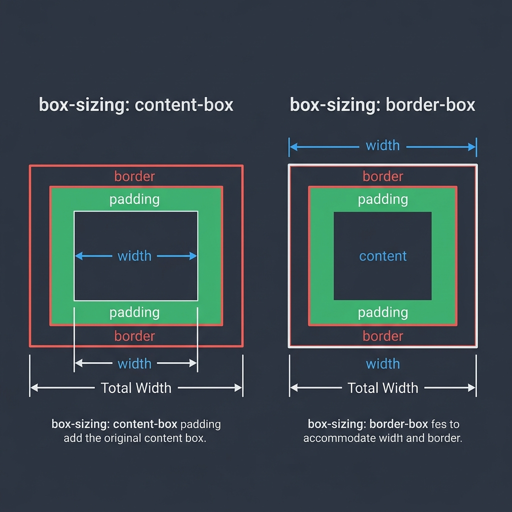

---
**Margin & Padding im Detail**

Wie steuert man Abstände im CSS?
Für beide Eigenschaften gibt es flexible Schreibweisen:

- **Eigenschaften im Uhrzeigersinn definieren:**
  - `margin: 10px;` (alle vier Seiten erhalten 10px)
  - `margin: 5px 20px;` (oben/unten: 5px, links/rechts: 20px)
  - `margin: 10px 15px 20px 25px;` (oben, rechts, unten, links)
- **Wichtige Unterschiede:**
  - **Margin (Außenabstand):**
  Kann negative Werte annehmen und kollabieren (Margins verschmelzen).
  - **Padding (Innenabstand):** Kann keine negativen Werte haben.
  Vergrößert die Hintergrundfläche und die Klickfläche von Elementen.

--- 

<!-- _class: structural -->
## Fonts & Google-Fonts

HTML ist kein Word.
Schriftarten sind nicht im Dokument eingebettet.
Das bedeutet der Browser greift auf die
lokal installierten Fonts des Clients zurück.

---

**Schriftarten im Web: Die Verfügbarkeit**

- **System-Schriftarten:**
Standardmäßig stehen nur Schriftarten zur Verfügung,
die auf dem Gerät des Betrachters lokal installiert sind.

> Welche Schriftarten kennt Ihr?
> Welche verwendet Ihr?


---

- **Problem:**
Endgeräte (PC, Mac, Smartphones, Tablets,
Smartwatches, E-Reader) haben stark
unterschiedliche Schriftarten vorinstalliert.
- **Lösung: Der Font-Stack**
  - Definition einer Prioritätenliste
  (Fallback-Liste) in CSS.
  - Der Browser liest die Liste von
  links nach rechts: Die erste verfügbare
  Schriftart wird gerendert.

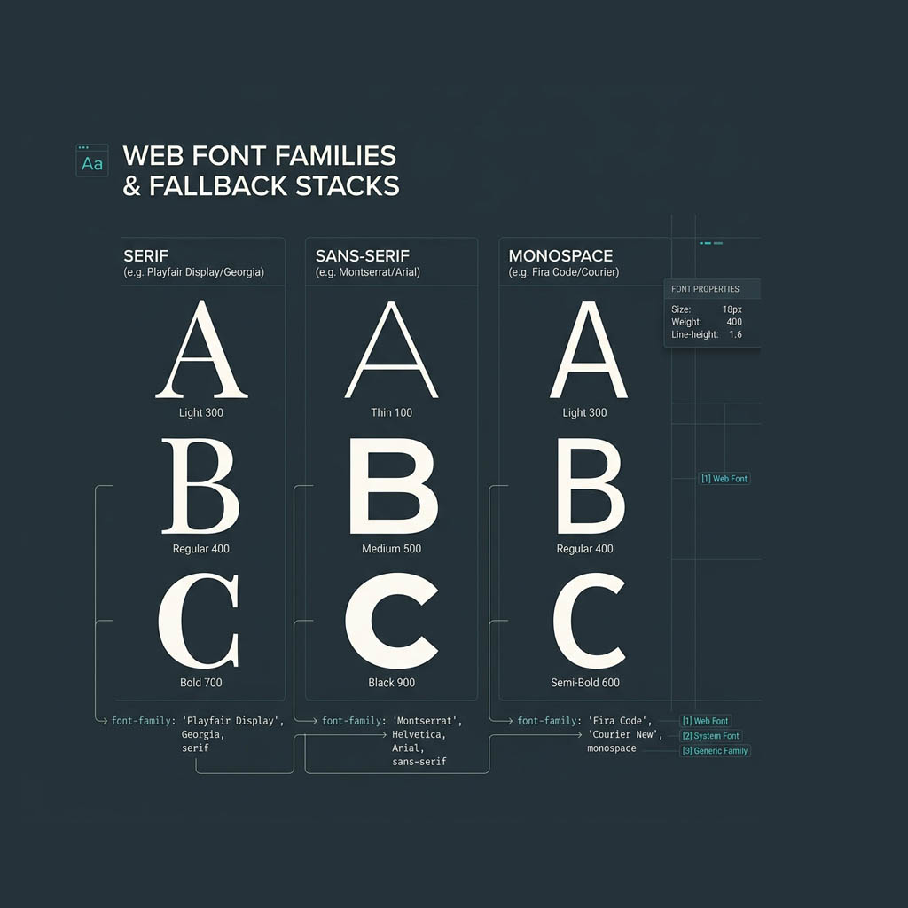

---
**Font-Stack:**
```css
body {
  font-family: "Helvetica Neue", Arial, sans-serif;
}
```

> Am Ende eines Font-Stacks sollte immer eine generische Schriftart stehen


---
** Generische Schriftarten:**

- serif
- sans-serif
- monospace
- cursive
- fantasy
- system-ui


---
**Websichere Schriftarten:**

- **Definition:**
Schriftarten, die auf fast allen Betriebssystemen
(Windows, macOS, Linux, iOS, Android)
standardmäßig vorinstalliert sind.
- **Der große Vorteil:**
Sehr hohe Wahrscheinlichkeit, dass die
Schriftart auf dem Gerät des Nutzers vorhanden ist
$\rightarrow$ keine Ladezeitverzögerung und
vollkommen DSGVO-konform.
- **Die Kehrseite:**
Die Auswahl an websicheren Schriftarten ist
sehr stark limitiert
(Gefahr von visuellem Einheitsbrei).

---

- Arial & Arial Black
- Courier New
- Georgia
- Helvetica
- Lucida Sans/Lucida Grande
- Tahoma
- Times New Roman
- Trebuchet MS
- Verdana

---

**Best Practices: Anführungszeichen & Generische Fallbacks**

- **Umgang mit Leerzeichen im Schriftnamen:**
  - **W3C-Empfehlung:** Namen mit Leerzeichen (z. B. `"Times New Roman"`, `"Tw Cen MT"`) sollten in einfache/doppelte Anführungszeichen (Quotes) gesetzt werden.
  - *Hinweis:* Moderne Browser stellen diese oft auch ohne Quotes fehlerfrei dar, dennoch bleibt es Best Practice zur Sicherung der Validität.
- **Generische Schriftfamilie am Ende:**
  - Jeder Font-Stack sollte mit einer generischen Familie (z. B. `serif`, `sans-serif`, `monospace`) enden.
  - Falls gar keine spezifische Schriftart installiert ist, wählt der Browser so die passende Standard-Kategorie des Systems.

---
**Google Fonts**

- **Was sind Google Fonts?**
  - Google Fonts ist ein kostenloser Online-Dienst
    von Google, der eine riesige Bibliothek
    an Schriftarten zum Einbinden in
    Webseiten bereitstellt.
- **Vorteile:**
  - Große Auswahl an Schriftarten
  - Einfache Einbindung
  - Kostenlos
  - DSGVO-konform (unter bestimmten
    Voraussetzungen)

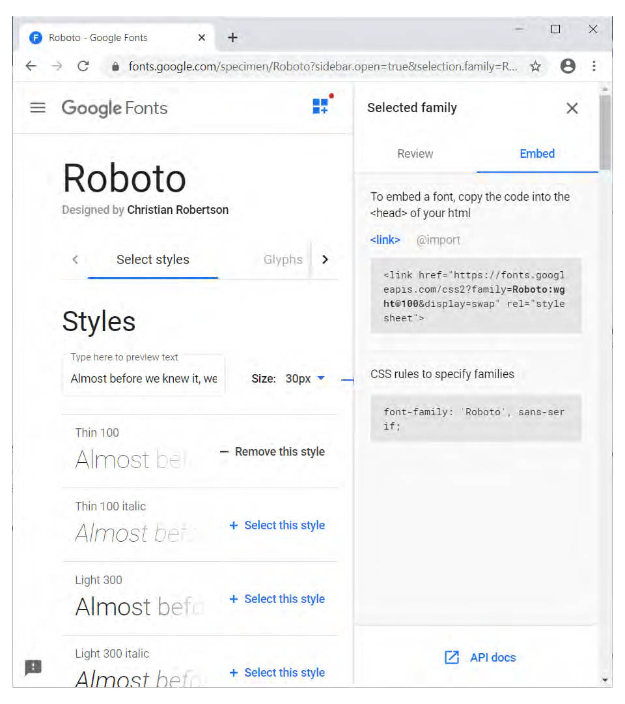

---


> Achtung Datenschutz

- Da Google Fonts auf den Servern von Google gehostet werden, unterliegen sie deren Datenschutzrichtlinien.
- Sobald ein Nutzer eine Webseite besucht, die Google Fonts verwendet, wird eine Anfrage an die Google-Server gesendet.
- Google kann diese Anfrage protokollieren (einschließlich der IP-Adresse des Nutzers), was als Verarbeitung personenbezogener Daten gilt.
- Nach deutschem Recht (DSGVO) ist dies ohne vorherige Einwilligung des Nutzers in der Regel nicht gestattet.
- Um rechtssicher zu sein, sollten Organisationen, die Google Fonts nutzen, vorher eine informierte Einwilligung (Opt-in) von ihren Nutzern einholen oder eine selbstgehostete Alternative wählen.

**Achtung Abmahnfalle!**

---

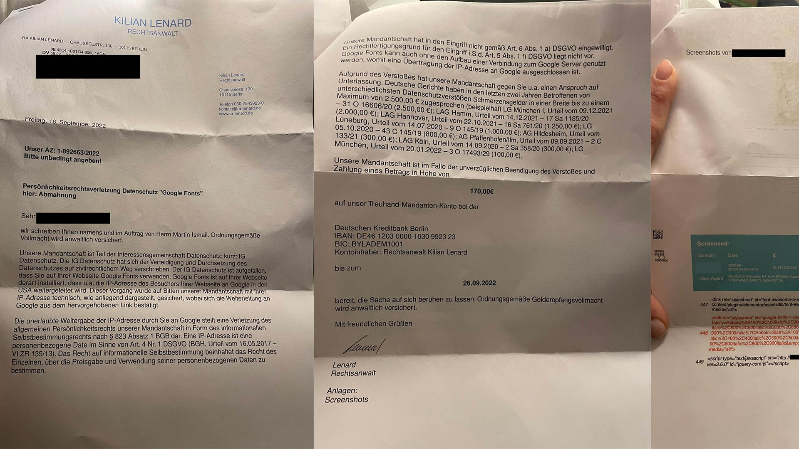

---
**Alternative mit @font-face:**

Herunterladen und Einbinden der Fonts auf dem eigenen Server.

Beispiel:
```css
@font-face {
  font-family: "MeineSchriftart";
  src: url("pfad/zu/meiner-schriftart.woff2") format("woff2"),
       url("pfad/zu/meiner-schriftart.woff") format("woff");
  font-weight: normal;
  font-style: normal;
  font-display: swap;
}
```

---
> Vorsicht! Auch Schriftarten unterliegen dem Urheberrecht.

Es ist legal z.B. .ttf Fonts auf der eigenen Domain anzubieten,
aber man darf nicht beliebige .ttf Fonts von anderen Webseiten
herunterladen und für eigene Zwecke verwenden.

---
**Woher nehmen, wenn nicht stehlen?**

**Google Fonts**
Beschreibung: Die populärste Quelle für kostenlose und Open-Source-Schriftarten. Sie bietet eine riesige Auswahl und die Schriften lassen sich einfach herunterladen, um sie DSGVO-konform selbst zu hosten.
URL: https://fonts.google.com/

**Adobe Fonts**
Beschreibung: Ein professioneller Dienst mit einer extrem hochwertigen Auswahl an kommerziellen Schriftarten. Der Zugriff ist in jedem aktiven Adobe Creative Cloud-Abonnement enthalten.
URL: https://fonts.adobe.com/

---

**Font Squirrel**
Beschreibung: Bietet ausschließlich Schriften an, die zu 100 % für die kommerzielle Nutzung lizenziert und kostenlos sind. Ein besonderes Highlight ist der integrierte Webfont-Generator, der Desktop-Schriften in Web-Formate (.woff2, .woff) umwandelt.
URL: https://www.fontsquirrel.com/

**Bunny Fonts**
Beschreibung: Eine datenschutzfreundliche Open-Source-Alternative zu Google Fonts. Sie wurde speziell so konzipiert, dass sie als direkter Ersatz (Drop-in-Replacement) dient und vollkommen DSGVO-konform ohne Nutzer-Tracking arbeitet.
URL: https://fonts.bunny.net/

---

**MyFonts**
Beschreibung: Der weltweit größte Marktplatz für kommerzielle und professionelle Schriftarten. Perfekt, wenn man für ein Projekt exklusive, kostenpflichtige Fonts namhafter Type-Designer sucht.
URL: https://www.myfonts.com/

**ffonts.net**
Beschreibung: Eine kostenlose Ressource für Designer, die eine große Auswahl an Schriftarten für ihre Projekte suchen. 
URL: https://www.ffonts.net/


---

> Beispiel
 https://www.ffonts.net/1-Punk.font

Font herunterladen und in ein Verzeichnis **fonts** neben der css und html Datei entpacken.

```
/css
/fonts
/html
/img
```

---

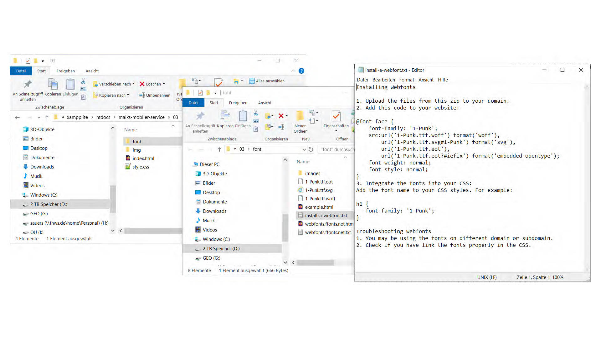

---

Anpassungen im css:
```
@font-face {
font-family: '1-Punk';
src:url('font/1-Punk.ttf.woff') format('woff'),
url('font/1-Punk.ttf.svg#1-Punk') format('svg'),
url('font/1-Punk.ttf.eot'), url('font/1-Punk.ttf.eot?#iefix') format('embedded-opentype'); font-weight: normal;
font-style: normal;}
und
h1{
font-size: 1.8em; font-family: '1-Punk',Georgia,"Trebuchet MS",verdana,arial,helvetica,sans-serif; }
```
---
<!-- _class: img-right-->

Aktuelle CSS-Datei

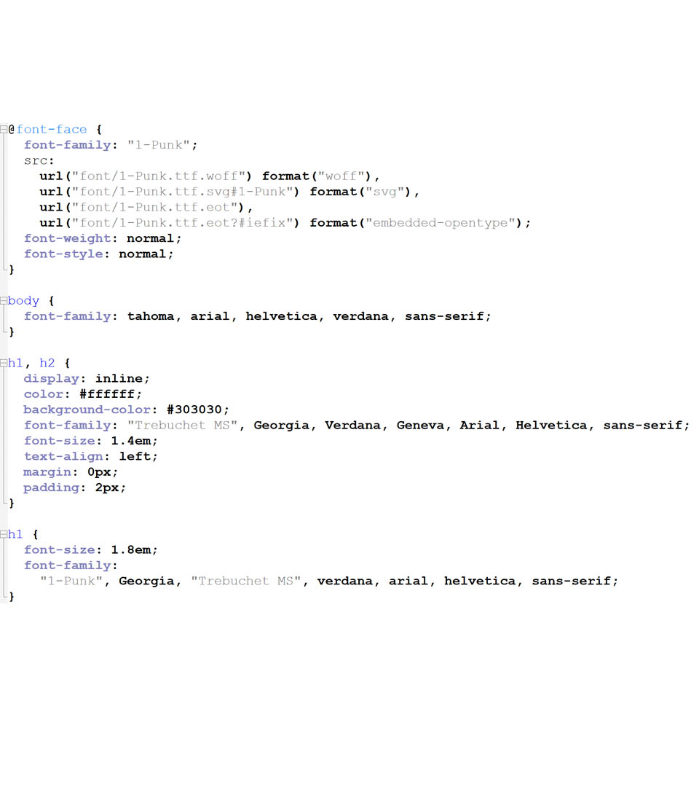

---

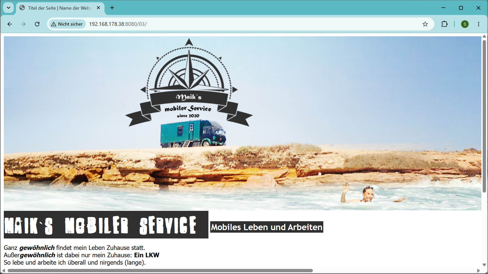

---
<!-- _class: structural center-->
## Gestaltung mit Schrift

>Ob Bachelorarbeit, Plakat oder Webseite, Schriften werden meist nur dann wahrgenommen, wenn Sie NICHT passen.

---
<!-- _class: structural -->
**Die 10 Schriftgebote**

Regeln für professionelle Typografie und Lesbarkeit im Web.

---
<!-- _class: img-right -->
**1. Schriftgröße**

- Richtet sich nach dem grundsätzlichen Design und dem verwendeten Font.
- **Wichtig:** Nutzer können Schriftgrößen im Browser/Smartphone jederzeit individuell anpassen.
- **Best Practice:** Verwenden Sie stets relative Schriftgrößen (`%`, `em`, `rem`) statt fester Pixelwerte, um Barrierefreiheit zu sichern.

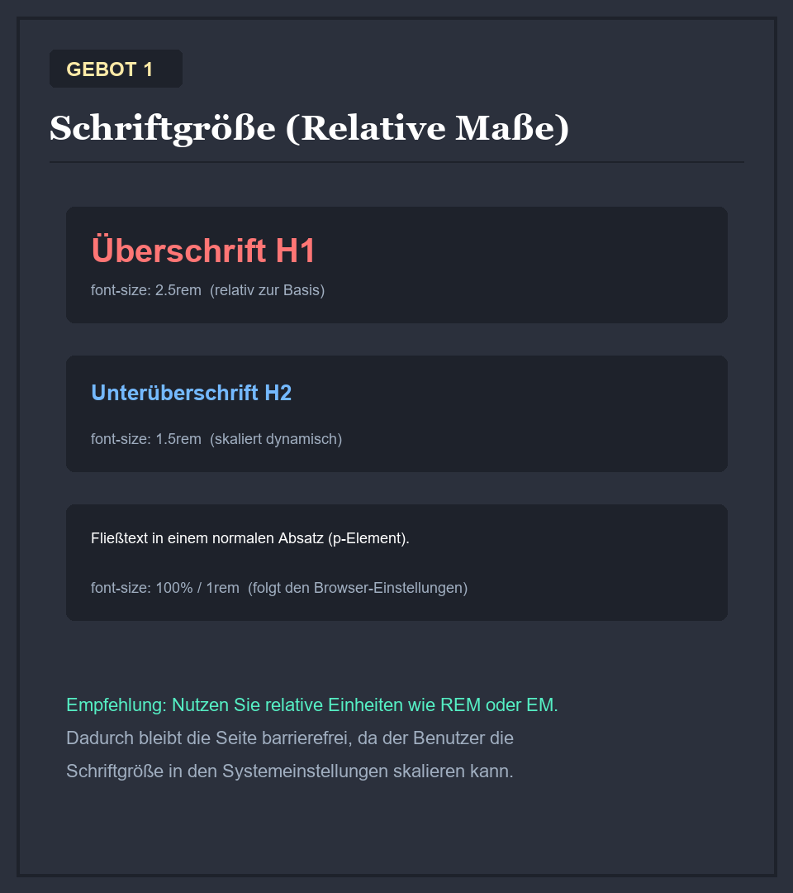

---
<!-- _class: img-right -->
**2. Zeilenbreite**

- Wird häufig unterschätzt, beeinflusst die Lesbarkeit aber massiv.
- **Optimalwert:** Maximal ca. 70 Zeichen pro Zeile (entspricht etwa einer DIN-A4-Textbreite).
- Zu breite Textblöcke erschweren dem Auge den Zeilensprung am Zeilenende.

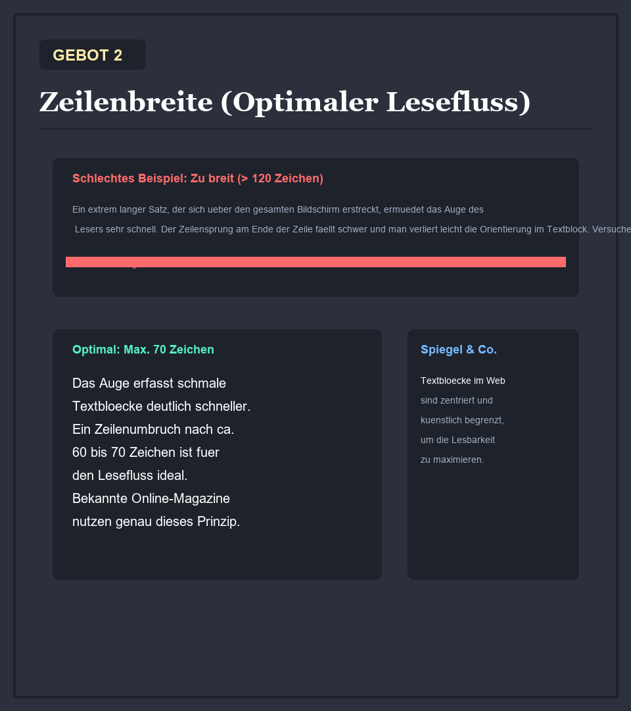

---
<!-- _class: img-right -->
**3. Zeilenabstand**

- Der Zeilenabstand (Durchschuss) ist essenziell für die Erfassung von Textblöcken.
- **Empfehlung:** Ein Wert von `140%` bis `150%` (`line-height: 1.4` bis `1.5`) hat sich im Web etabliert.
- Zu geringer Abstand führt zum optischen Verschmelzen der Zeilen.

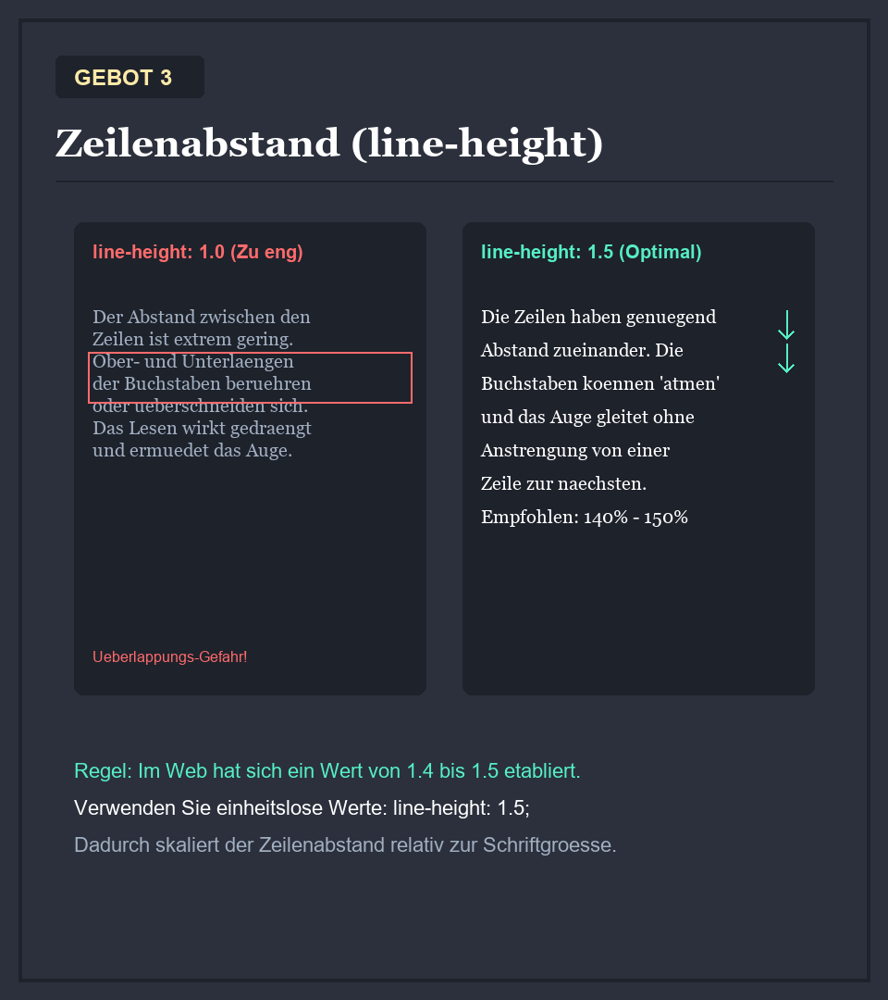

---
<!-- _class: img-right -->
**4. Laufweite**

- Beschreibt den horizontalen Abstand zwischen Buchstaben (`letter-spacing`).
- Sollte nur mit äußerster Vorsicht und Bedacht manupuliert werden.
- **Tipp:** Vor allem für Akzente bei Überschriften einsetzen. Im Zweifelsfall unverändert lassen.

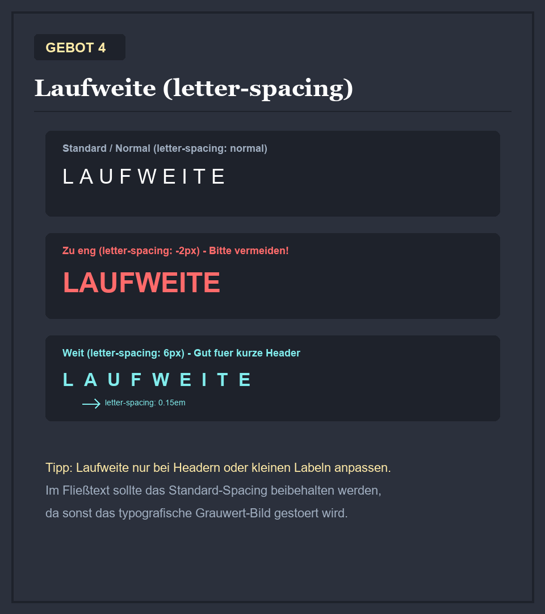

---
<!-- _class: img-right -->
**5. Kontrast**

- Das Helligkeitsverhältnis zwischen Textfarbe und Hintergrund.
- Fließtexte erfordern maximalen Kontrast (z. B. schwarzer Text auf weißem Grund).
- Hoher Kontrast schützt das Auge vor Ermüdung und sichert Barrierefreiheit.


---
<!-- _class: img-right -->
**6. Struktur**

- Gut strukturierte Texte fördern das Verständnis und die Semantik.
- **Werkzeuge:** Überschriften-Tags (`<h1>` bis `<h3>`), Absätze (`<p>`), Listen (`<ul>`, `<ol>`) sowie gezielte Auszeichnungen (`<strong>`, `<em>`).
- Eine saubere Struktur verbessert zudem das Google-Ranking (SEO).


---
<!-- _class: img-right -->
**7. Maximal zwei Schrifttypen**

- Für ein harmonisches Gesamtbild reichen meist ein bis zwei Schrifttypen pro Dokument vollkommen aus.
- **Kombination:** Typischerweise eine Serifenschrift für Überschriften und eine Sans-Serif-Schrift für Fließtext.
- Mehr als zwei Fonts wirken unruhig und unprofessionell.

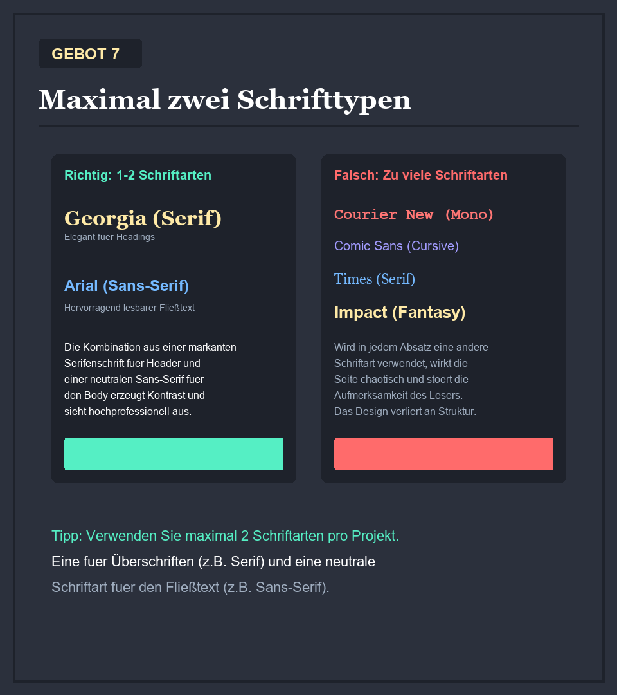

---
<!-- _class: img-right -->
**8. Versalien**

- Reine Großbuchstaben (Versalien) sind im Fließtext und in Menüs sehr schwer lesbar.
- **Ausnahme:** Kurze Wörter, z. B. in der Hauptnavigation.
- **Best Practice:** Texte normal schreiben und die Umwandlung in Großbuchstaben per CSS über `text-transform: uppercase;` steuern.

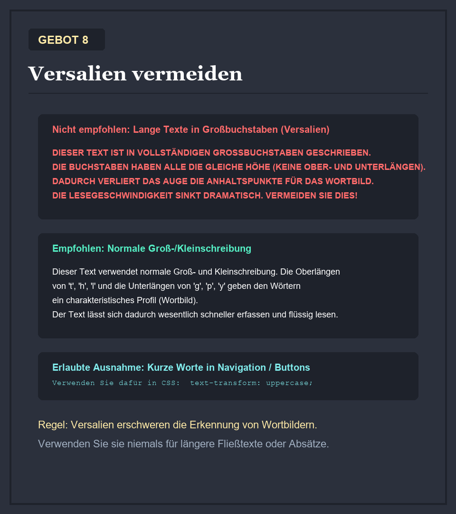

---
<!-- _class: img-right -->
**9. Standardschriften**

- Nutzen Sie bewährte Systemschriftarten als verlässlichen Fallback am Ende Ihres Font-Stacks.
- Klassiker wie *Arial*, *Verdana* oder *Georgia* sind auf fast jedem Gerät vorinstalliert.
- Dies garantiert eine saubere und schnelle Darstellung, falls Webfonts nicht geladen werden können.

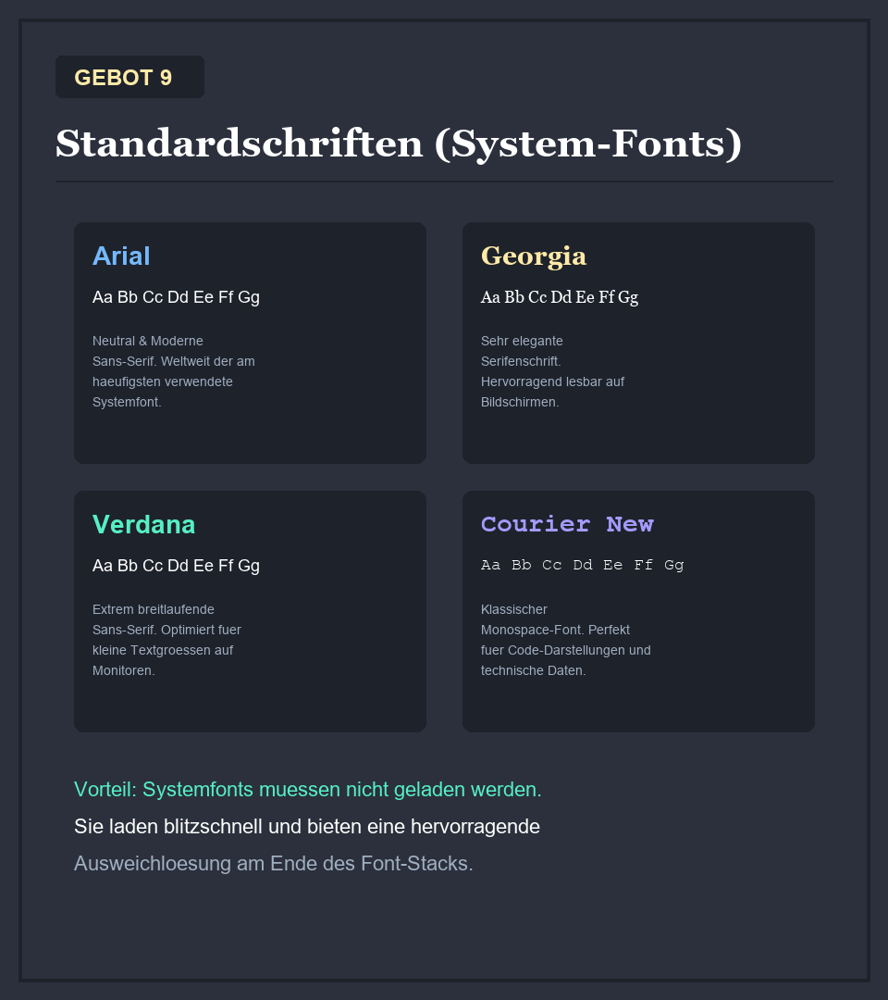

---
<!-- _class: img-right -->
**10. Fortbildung**

- Typografie ist eine Kunst und ein Handwerk zugleich.
- **Tipp:** Bilden Sie sich kontinuierlich weiter – durch Fachliteratur, Workshops, Design-Magazine oder informative Lehrvideos.
- Schärfen Sie Ihr Auge durch die bewusste Analyse gelungener Web-Layouts.


---
<!-- _class: structural -->

## Farbwerte definieren


> Farben auf Computermonitoren entstehen durch die Mischung von rotem, grünem und blauem Licht. Aus diesem Grund wird das Farbsystem RGB genannt (von den englischen Bezeichnungen Red, Green und Blue).

Wie werden Farben im html & css verwendet?

---
<!-- _class: img-right -->
**1. Farbnamen (Keywords)**

- **Eigenschaften:**
  - Ignoriert Groß- und Kleinschreibung (`red` oder `Red`).
  - Sehr einfach zu merken und schnell geschrieben.
- **Einschränkung:**
  - begrenzte Palette 141 Namen


```css
h1 {
  color: tomato;
}
```


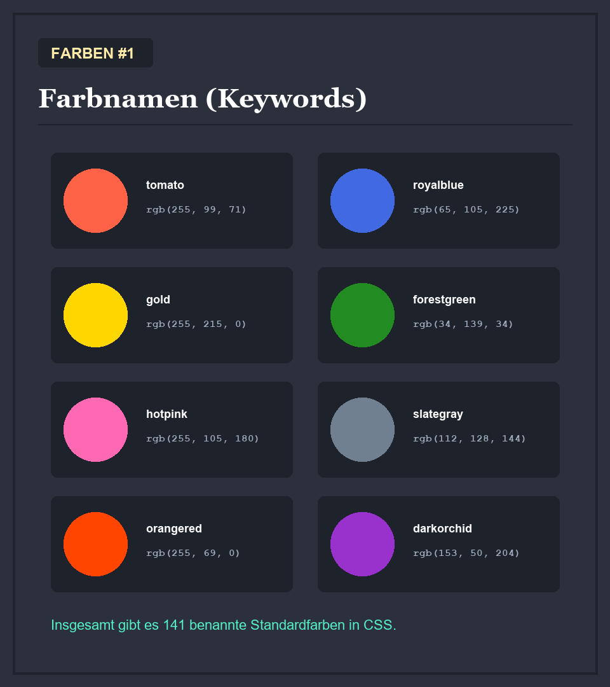

---

Liste mit allen Farbnamen:
https://wiki.selfhtml.org/wiki/Farbe/Farbangaben#Farbnamen

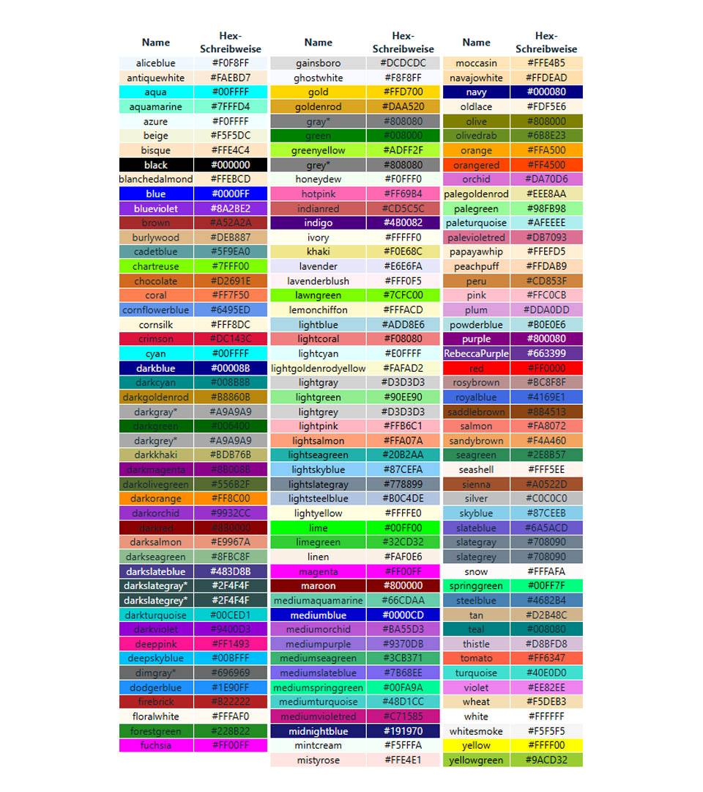

---

<!-- _class: img-right -->
**2. RGB- und RGBA-Schreibweise**

- **RGB-Parameter:**
  - Angabe als `rgb(R, G, B)`, wobei jeder Kanal Werte von `0` (kein Licht) bis `255` (maximale Helligkeit) annehmen kann.
- **RGBA (Transparenz):**
  - Ermöglicht über den vierten Wert (`Alpha-Kanal`) eine Deckkraft-Steuerung.
  - Der Alpha-Wert reicht von `0.0` (vollständig transparent) bis `1.0` (vollständig deckend).

```css
h1 {
  color: rgba(255, 118, 117, 0.8);
}
```

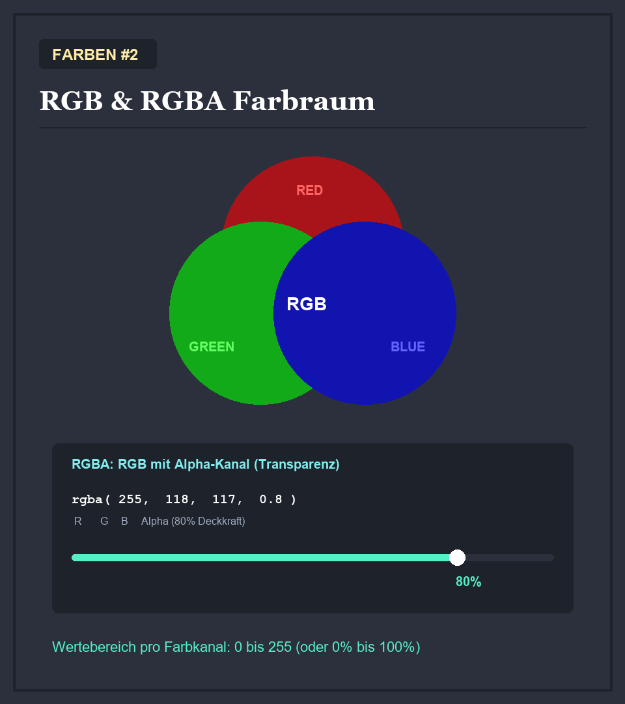

---
<!-- _class: img-right -->
**3. Hexadezimal(Hex)-Codes** sehr häufig

- **Aufbau:**
  - Beginnt mit einem Doppelkreuz `#` plus 6 Zeichen: `#RRGGBB`.
  - Nutzt das Hexadezimalsystem (Basis 16: Ziffern `0-9` und Buchstaben `A-F`).
- **Kurzschreibweise:**
  - Kürzen auf 3 Zeichen, wenn die Paare für RGB identisch sind (`#FF0055` -> `#F05`).

```css
h1 {
  color: #ff7675;
}
```

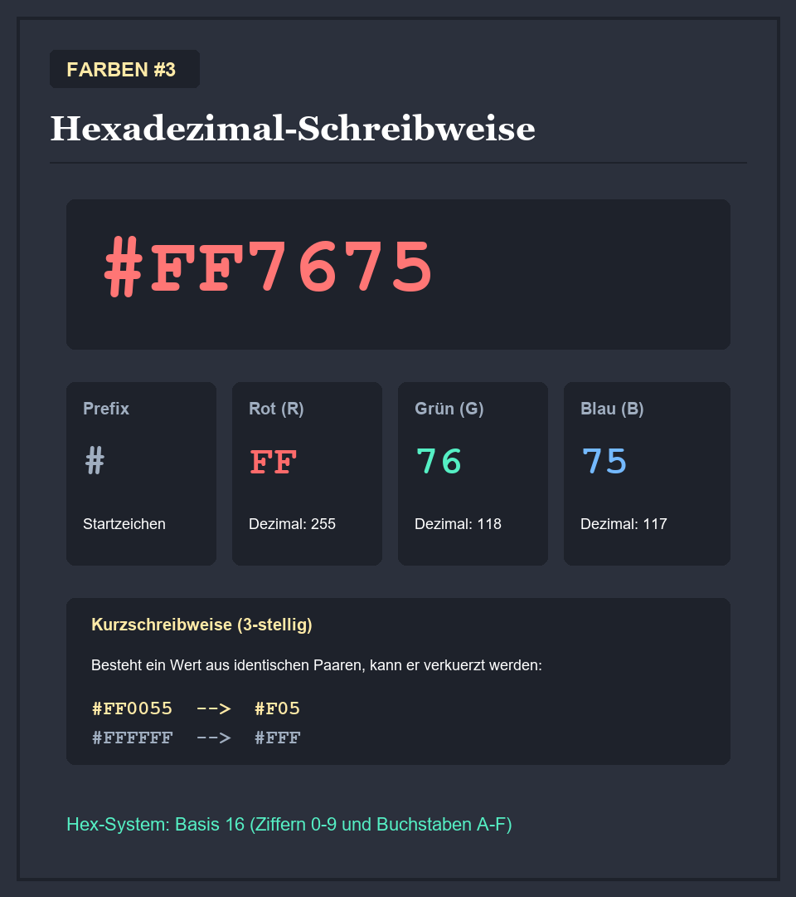

---
<!-- _class: img-right -->
**4. HSL- und HSLA-Schreibweise** (intuitiv)


- **Die Komponenten:**
  - **Hue (Farbton):** Winkel auf dem Farbkreis (`0°` bis `360°`). `0` = Rot, `120` = Grün, `240` = Blau.
  - **Saturation (Sättigung):** Anteil an Grauwerten (`0%` bis `100%`).
  - **Lightness (Helligkeit):** Helligkeit (`0%` = Schwarz, `100%` = Weiß).
- **Vorteil:** Designer können Farbpaletten extrem einfach manipulieren (z. B. durch Erhöhung der Helligkeit).

```css
h1 {
  color: hsl(197, 100%, 50%);
}
```

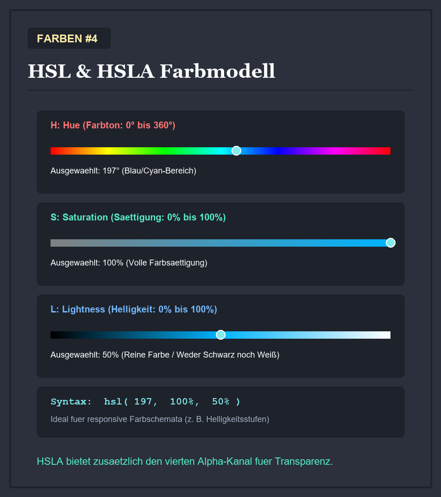

---
<!-- _class: structural -->
## Maßeinheiten in CSS festlegen

Zur Angabe von Höhen, Breiten, Innen- und Außenabständen müssen Sie in CSS einen Wert und eine Maßeinheit angeben.

---
<!-- _class: img-right -->
**Absolute Maßeinheiten**

Absolute Werte: kein Bezug zu anderen Angaben, unabhängig von der Umgebung.

- **Pixel (px):** Standard im Webdesign
  - Entspricht  Bildpunkten des Monitors
- **Physische Maßeinheiten:**
  - **pt (Punkt):** Typograf. Maß (1/72 Inch).
  - **in (Inch), cm (Zentimeter), mm (Millimeter).**
  - *Wichtig:* Physische Einheiten sind nur für **Druck-Stylesheets** (`@media print`) geeignet, da Bildschirme zu ungenau sind.

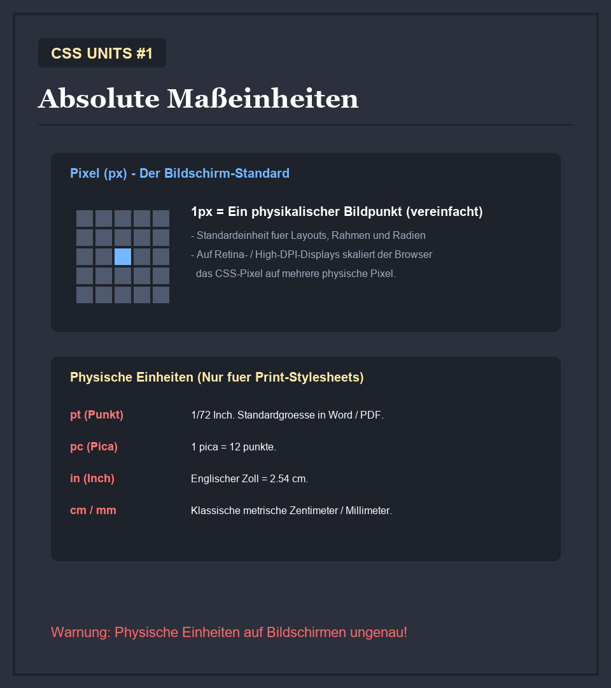

---
<!-- _class: img-right -->
**Relative Maßeinheiten: em & rem**

Relative Einheiten skalieren dynamisch und stehen immer in Bezug zu anderen Werten, meist Schriftgrößen:

- **em (Element-relativ):**
  - Bezieht sich auf die Schriftgröße des **Elternelements**.
  - `1em` entspricht der vererbten Schriftgröße.
  - *Problem:* Kann sich kaskadierend verschachteln (Multiplikations-Effekt bei verschachtelten Listen).


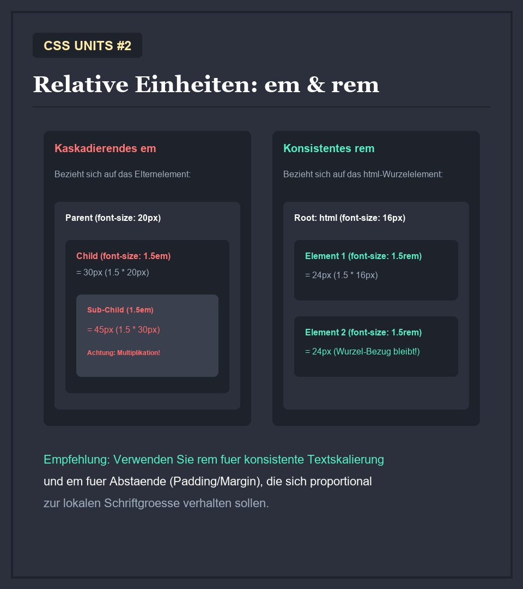

---
<!-- _class: img-right -->
**Beispiel: Der em-Multiplikations-Effekt**

Wenn verschachtelte Listen (`<ul>`) relative `em`-Schriftgrößen verwenden, multipliziert sich der Wert auf jeder Ebene des DOM-Baums:

- **Ebene 1 (Basis 16px):** `1.5em` $\rightarrow$ **24px**
- **Ebene 2 (verschachtelt):** `1.5 * 24px` $\rightarrow$ **36px**
- **Ebene 3 (tief verschachtelt):** `1.5 * 36px` $\rightarrow$ **54px**
- **Das Ergebnis:** Der Text wächst unkontrolliert an (Faktor `3.375`).

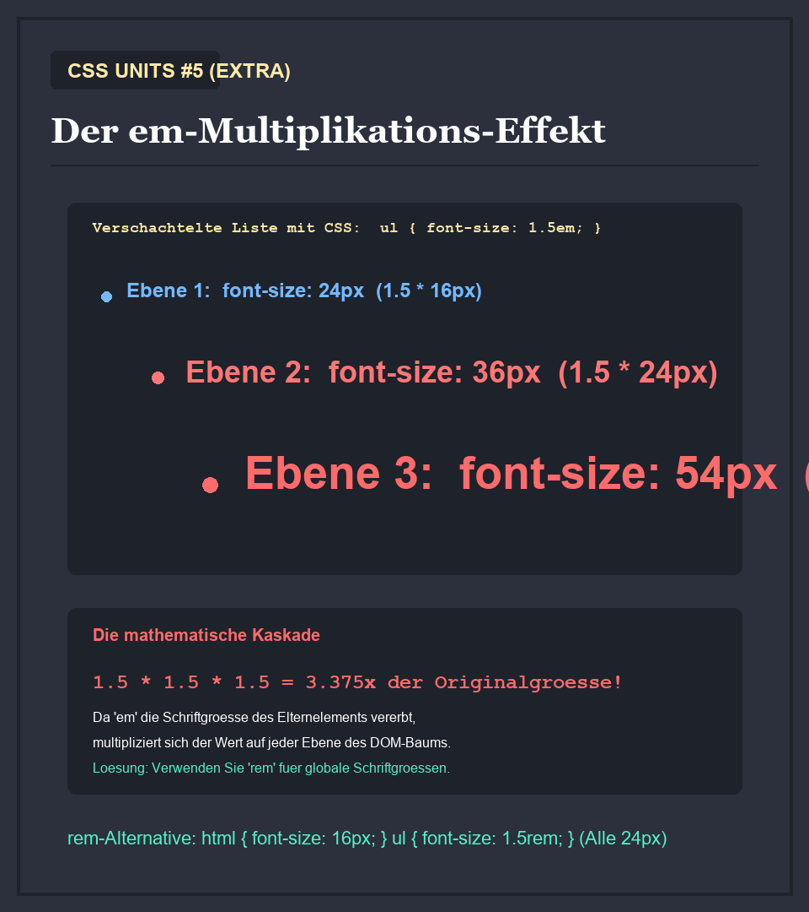

---

- **rem (Root-em):**
  - Bezieht sich immer auf die Schriftgröße
  des **html-Wurzelelements** (standardmäßig 16px).
  - Verhindert unerwünschte Skalierungs-Effekte
  in tiefen Dokumentstrukturen.


---
<!-- _class: img-right -->
**Relative Maßeinheiten: Viewport**

Viewport-Einheiten beziehen sich direkt auf die aktuellen Dimensionen des Browser-Fensters:

- **vw (Viewport Width):**
  - `1vw` entspricht 1% der Viewport-Breite.
- **vh (Viewport Height):**
  - `1vh` entspricht 1% der Viewport-Höhe
  (ideal für bildschirmfüllende Hero-Sektionen).

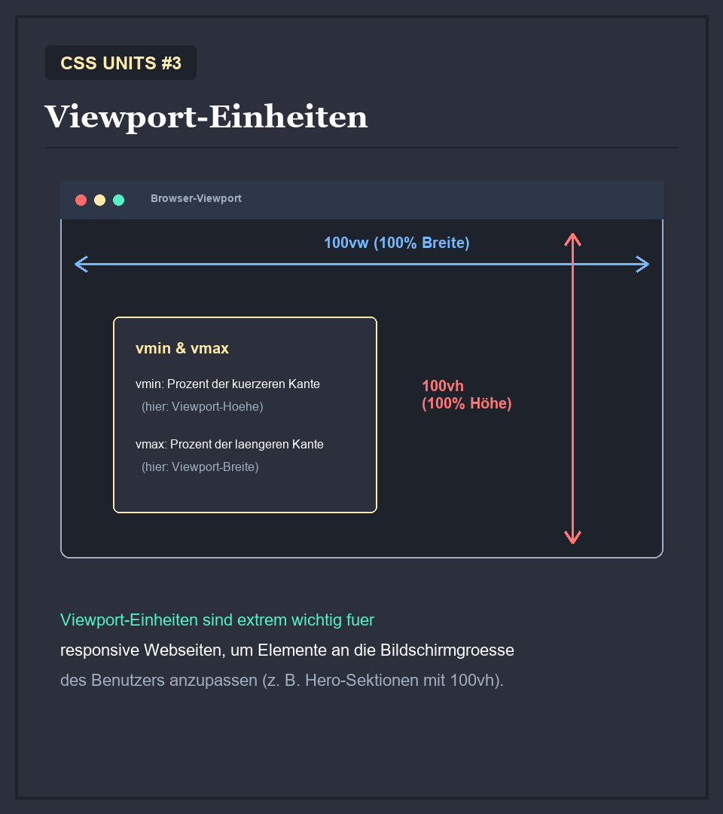

---

<!-- _class: img-right -->
**Viewport-Grenzbereiche: vmin & vmax**

- **vmin (Viewport Minimum):**
  - Nutzt den Prozentwert der jeweils kürzeren Viewport-Seite (Breite im Hochformat, Höhe im Querformat).
- **vmax (Viewport Maximum):**
  - Nutzt den Prozentwert der jeweils längeren Viewport-Seite.
- **Vorteil:**
  - Ermöglicht proportionales Skalieren bei Orientierungswechseln auf Mobilgeräten.

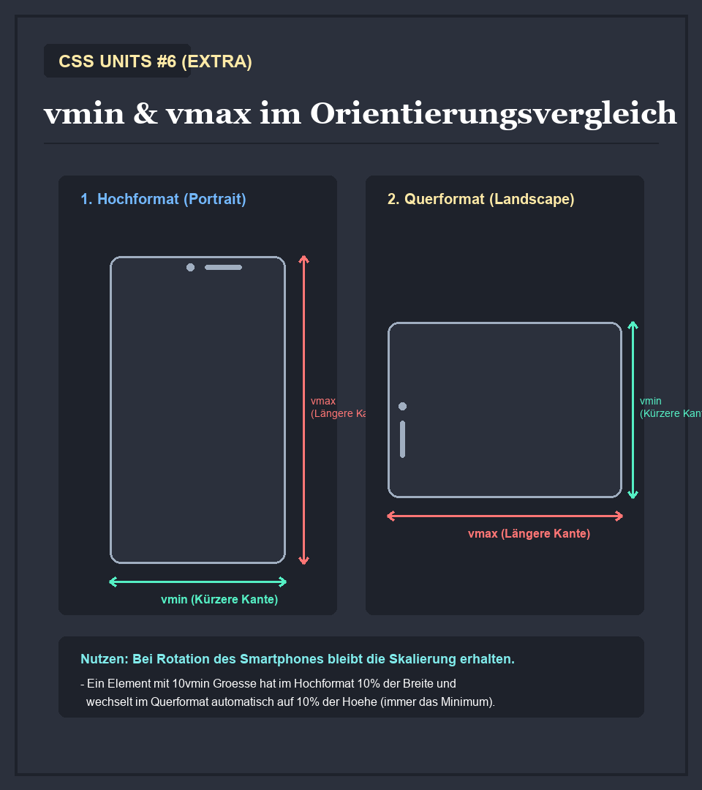


---
<!-- _class: img-right -->
**Prozent (%) & Best Practices**

- **Prozentwert (%):**
  - **Layouts (Breiten/Höhen):** Bezieht sich auf umschließenden Container (z. B. Bild `width: 50%` in einer `600px` Box ist `300px` breit).
  - **Schriftgrößen:** Bezieht sich auf die vererbte Schriftgröße des Elternelements (75% bei 16px = 12px).

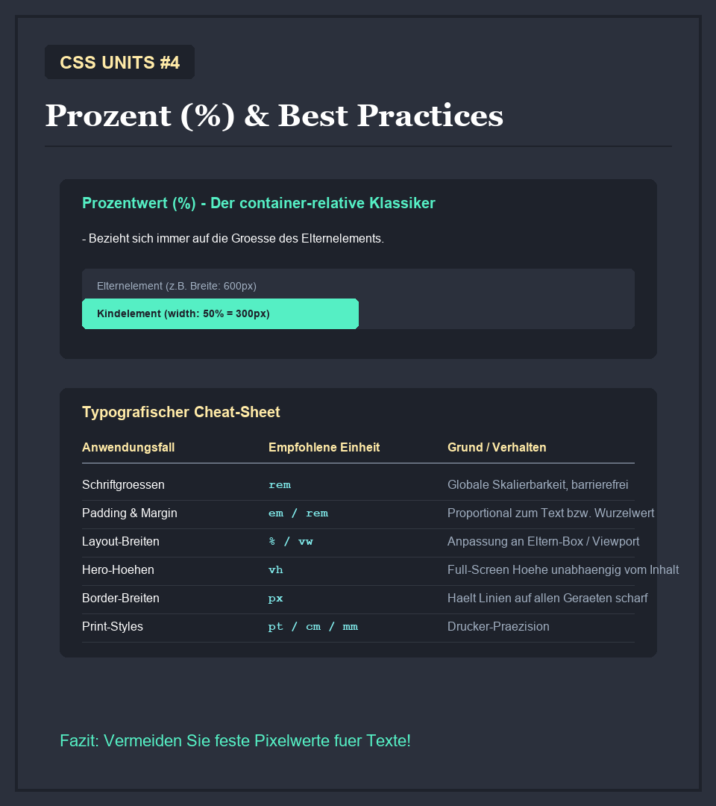

---

- **Best Practices:**
  - **Schriftgrößen:** bevorzugt **rem** nutzen > Browser ermöglicht Barrierefreiheit durch Skalieren.
  - **Layout-Raster:** Verwenden Sie **Prozent (%)** oder **Flexbox/Grid**.
  - **Rahmen:** Nutzen Sie **px** für absolute Randschärfe.


---
<!-- _class: structural img-right -->
## Organisation und Struktur (04)
- Ordner und Dateien benennen
- Referenzieren in html
- Chaos im Code
- Stylesheets mit Kommentaren versehen
- Selektoren im Allgemeinen und Speziellen


---
<!-- _class: img-right -->

### Ordnerstruktur für Webprojekte

Für Übersicht und fehlerfreie Verlinkung ist eine saubere Struktur im **Wurzelverzeichnis (Root)** essenziell:

- **index.html (Startseite):** Muss direkt im Stammverzeichnis liegen (darf nicht in Unterordnern platziert werden).

- Startseite muss (fast) immer index.html heißen

---
<!-- _class: img-right -->

**Warum fast immer?**

Server sucht automatisch im angeforderten Verzeichnis nach  `index.html`.

Der Webserver kann aber auch so konfiguriert werden, dass er nach einer anderen Datei sucht:
- httpd.conf öffnen &  "DirectoryIndex" suchen
- kann umkonfiguriert werden, dass page.php die Startseite ist

> Standard ist aber index.html

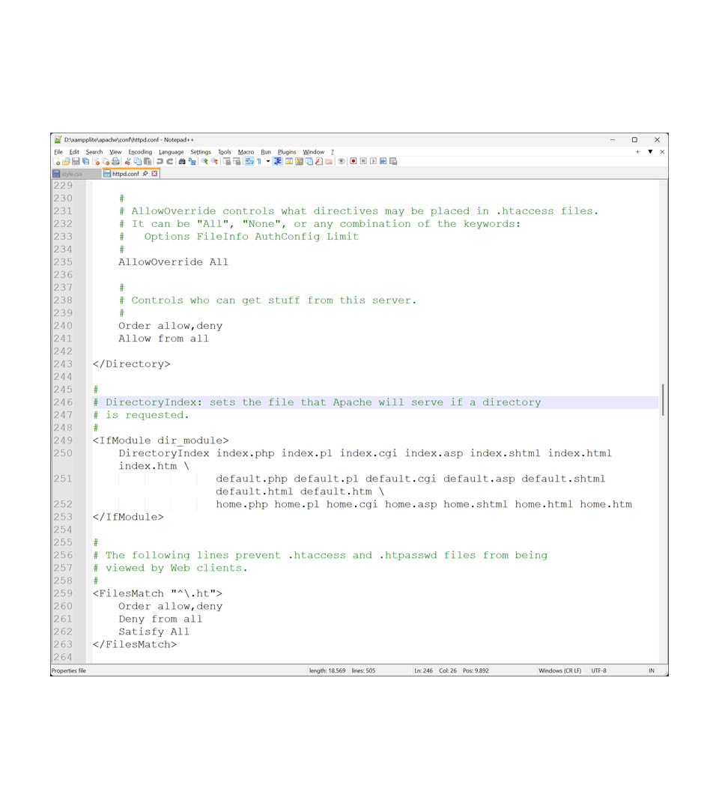

---

- **Sinnvolle Unterordner zur Organisation:**
  - `css/` – Stylesheets (z. B. `style.css`)
  - `img/` – Alle Bilder und Grafikdateien
  - `font/` – Lokale Schriftarten (z. B. `1-Punk.ttf`)
  - `html/` – Weitere Unterseiten der Webpräsenz
- **Vorteil:** Erleichtert das Referenzieren relativer Pfade und vermeidet Chaos bei wachsenden Projekten.


---
### Datei- und Ordner-Benennung

Webserver (meist UNIX-basiert) unterscheiden strikt zwischen Groß- und Kleinschreibung. Befolgen Sie daher stets diese Konventionen:

| Konvention | Beschreibung | Richtig vs. Falsch |
| :--- | :--- | :--- |
| **Kleinschreibung** | Dateinamen immer komplett klein schreiben. | `index.html` $\leftrightarrow$ `Index.HTML` |
| **Keine Umlaute** | Umlaute umschreiben (`ae`, `oe`, `ue`). | `ueber-uns.html` $\leftrightarrow$ `über-uns.html` |
| **Keine Sonderzeichen** | Keine Zeichen wie `ß`, `=`, `@`, `%` oder `_`. | `fuss.html` $\leftrightarrow$ `fuß.html` |
| **Keine Leerzeichen** | Worttrennung per Bindestrich `-` oder camelCase. | `kontakt-formular.html` $\leftrightarrow$ `kontakt formular.html` |

---
<!-- _class: img-right -->

### Referenzieren in HTML: Relative Pfade

Relative Pfade beziehen sich auf die Position der aktuellen HTML-Datei.
Sie sind ideal für die interne Verlinkung einer Website.

> Relative Pfade beziehen sich
IMMER auf die eigene Position! Wobei ICH die Datei bin, in der ich mich gerade befinde.


---

- **Gleiches Verzeichnis:**
  * Die Zieldatei liegt im selben Ordner wie das HTML-Dokument.
  * Code: ``
- **Unterverzeichnis (Abwärts navigieren):**
  * Die Zieldatei liegt in einem Unterordner (z. B. `img/`).
  * Code: ``

---

- **Übergeordnetes Verzeichnis (Aufwärts navigieren):**
  * Mit `../` springen Sie in der Ordnerstruktur eine Ebene höher.
  * Mehrere Ebenen überspringen Sie mit `../../`.
  * Code: ``
- **Absolute Pfadangabe relativ zur Basis-URI:**
  * Beginnt mit `/` (Slash) und geht vom Hauptverzeichnis (Root) des Webservers aus.
  * Code: ``
  * *Hinweis:** Sollte bei lokaler Entwicklung vermieden werden, da oft Pfadfehler entstehen.


---
<!-- _class: img-right -->

### Referenzieren in HTML: Absolute Pfade

Absolute Pfade existieren systemweit nur ein einziges Mal und sind eindeutig.

> Absolute Pfade haben keinen Bezug zur eigenen Position. Sie beziehen sich immer eine absolute, systemweit erreichbare Adresse!!


---

- **Externe Quellen im WWW:**
  * Verwendung für Links auf fremde Websites oder externe Ressourcen.
  * Erfordert immer die Angabe des Protokolls (`http` oder `https`) und die vollständige Domain:
  * Code: `<a href="https://www.maiks-service.de">Maiks Website</a>`
- **Lokale absolute Pfade (Windows):**
  * Dateipfade mit Laufwerksbuchstabe, z. B. `C:\Projekte\img\header.jpg`.
  * **Achtung:** Ungeeignet für Webseiten! Diese Pfade existieren auf den Computern der Webseitenbesucher nicht.

---
<!-- _class: small-text -->

### Wiederholung: HTTP vs. HTTPS

Netzwerkprotokolle regeln die Kommunikation zwischen Browser und Webserver:

- **HTTP (Hypertext Transfer Protocol):**
  * Datenübertragung erfolgt im Klartext.
  * **Gefahr:** Passwörter, Logins und Formulardaten können leicht abgehört oder manipuliert werden.
- **HTTPS (Hypertext Transfer Protocol Secure):**
  * Verschlüsselte Verbindung mittels **TLS/SSL**.
  * Bietet Server-Authentifizierung und Schutz vor Datenmanipulation.
- **Vorteile von HTTPS:**
  * **Sicherheit & Vertrauen:** Pflicht bei Zahlungs- und Formulardaten.
  * **SEO-Vorteil:** Google wertet HTTPS als positives Ranking-Signal.
  * **Browser-Hinweise:** Browser markieren HTTP-Seiten als "nicht sicher".

---
<!-- _class: img-right -->

### Block- und Inline-Elemente

HTML unterscheidet im Textfluss grundlegend zwei Arten von Elementen
- Blockbildende Elemente
- Inline-Elemente


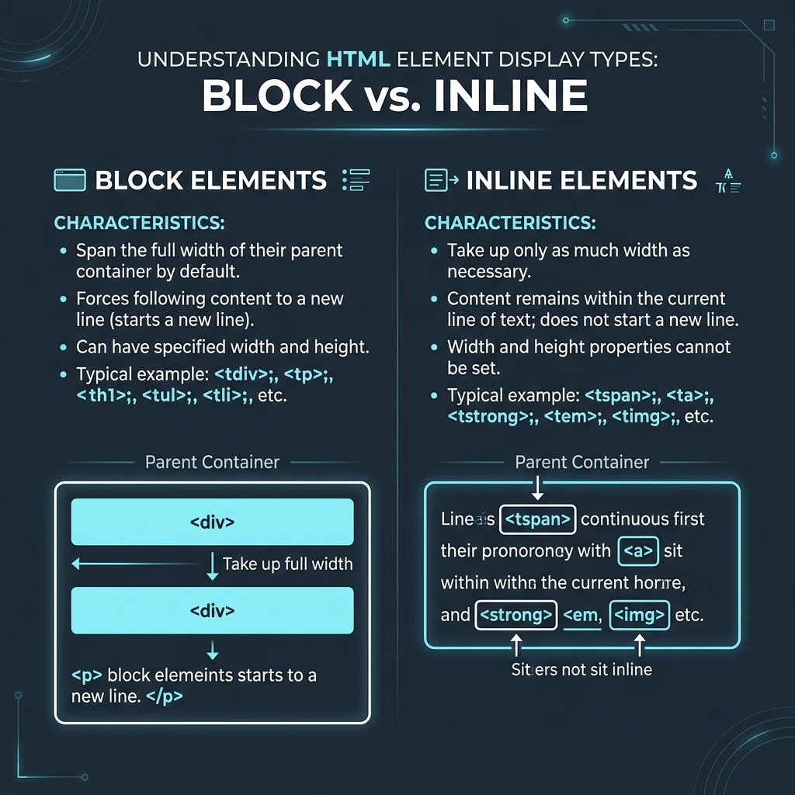

---

- **Block-Elemente:**
  * Erzeugen automatisch eine neue Zeile und nehmen die volle verfügbare Breite ein.
  * *Beispiele:* `<p>`, `<h1>`–`<h6>`, `<ul>`, `<div>`, `<table>`.
- **Inline-Elemente:**
  * Bleiben im normalen Textfluss (keine neue Zeile) und sind nur so breit wie ihr Inhalt.
  * *Beispiele:* `<a>`, `<strong>`, `<em>`, `<span>`, ``.
> Elemente immer nach ihrer semantischen Bedeutung nutzen, nicht nach ihrem Standard-Aussehen.


---
<!-- _class: img-right -->

### Semantische Seitenstruktur

HTML5 führt spezifische Strukturelemente ein, um Bereichen eine klare logische Bedeutung zu geben:

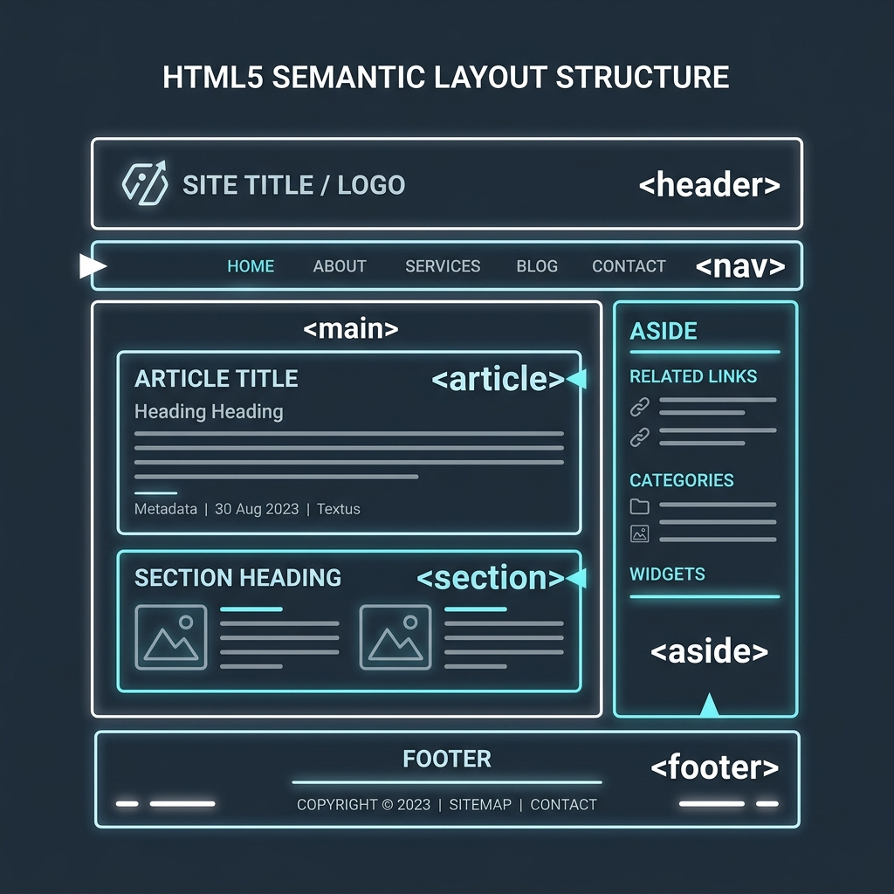

---

- **`<header>` & `<footer>`:** Kopf- und Fußbereiche von Seiten oder Artikeln.
- **`<nav>`:** Navigationsbereich (Haupt- und Subnavigation).
- **`<main>`:** Umschließt den einzigartigen Hauptinhalt einer Webseite.
- **`<section>` & `<article>`:**
  * `section` definiert thematische Abschnitte (z. B. Kapitel).
  * `article` steht für in sich geschlossene, eigenständige Inhalte.
- **`<aside>`:** Randspalten für Zusatzinfos, Werbung oder Verweise.


---
<!-- _class: img-right -->

### Strukturelemente ohne Semantik

Für rein gestalterische Gruppierungen (z. B. Styling oder Layout-Wrapper) existieren neutrale Container.

> Wenn keine semantische Bedeutung gewünscht, erforderlich oder erkennbar ist > SPAN und DIV

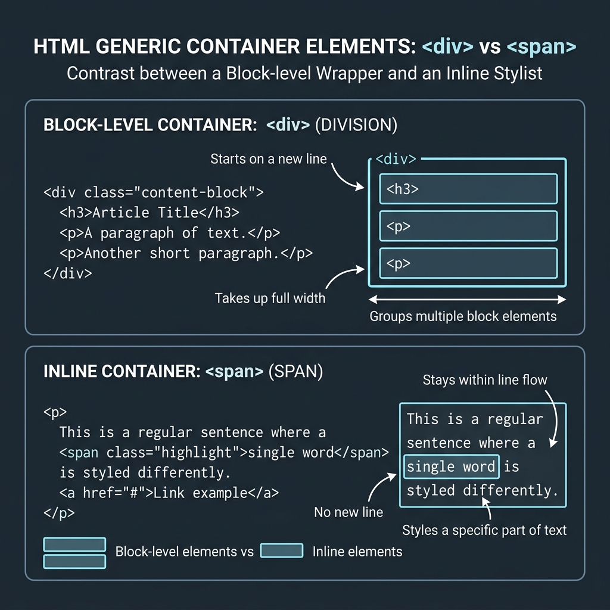

---


- **`<div>` (Division):**
  * Block-Element. Gruppiert Block-Elemente, Bilder oder Tabellen.
  * Dient meist als Layout-Grid-Container.
- **`<span>`:**
  * Inline-Element. Gruppiert Wörter, Phrasen oder Inline-elemente direkt im Fließtext.
- **Best Practice:** Wrapper-Divs vermeiden („Div-Suppe“). CSS-Regeln bevorzugt direkt den semantischen Tags zuweisen.


---
<!-- _class: img-right -->

### Kommentare in HTML und CSS

Kommentare dokumentieren den Quellcode für Entwickler und helfen bei der Fehlersuche. Sie werden vom Browser ignoriert.

> Lässt man sich Code von einer KI entwickeln, kann man sich in den Kommentaren den Code erklären lassen :)

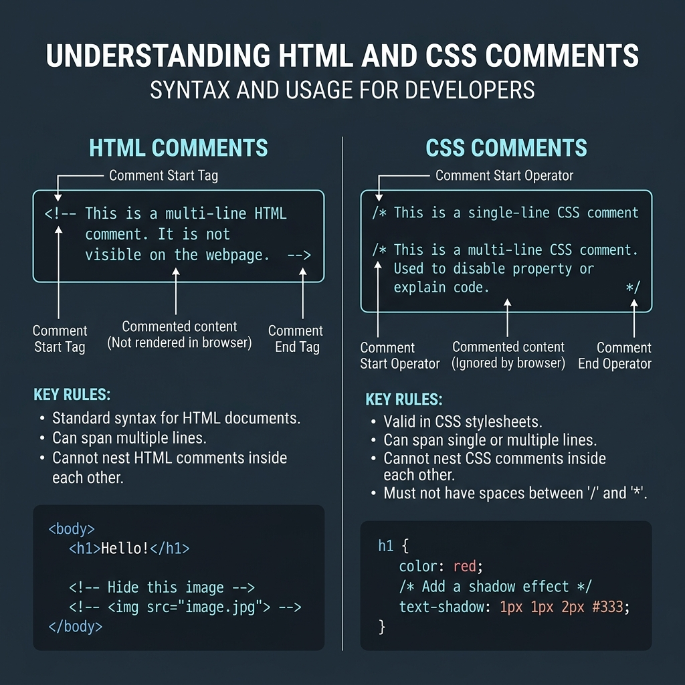

---

- **HTML-Kommentare:**
  * Syntax: `<!-- Kommentartext -->`
  * *Einsatz:* Strukturierung von Abschnitten, temporäres Deaktivieren von Code zur Fehlersuche.
- **CSS-Kommentare:**
  * Syntax: `/* Kommentartext */`
  * *Einsatz:* Gliederung des Stylesheets (z. B. Header, Navigation, Footer-Styles).
- **Tipp:** Kommentare nutzen, um unübersichtlichen Code-Bereichen klare Start- und Endpunkte zu geben.

---

**Ergänzen des Quellcodes mit den semantisch
richtigen HTML5 Elementen**

- header
- nav
- article
- footer

> Auch wenn sich die Seite dadurch optisch kaum verändert hat, ist sie jetzt für Suchmaschinen deutlich besser lesbar geworden.

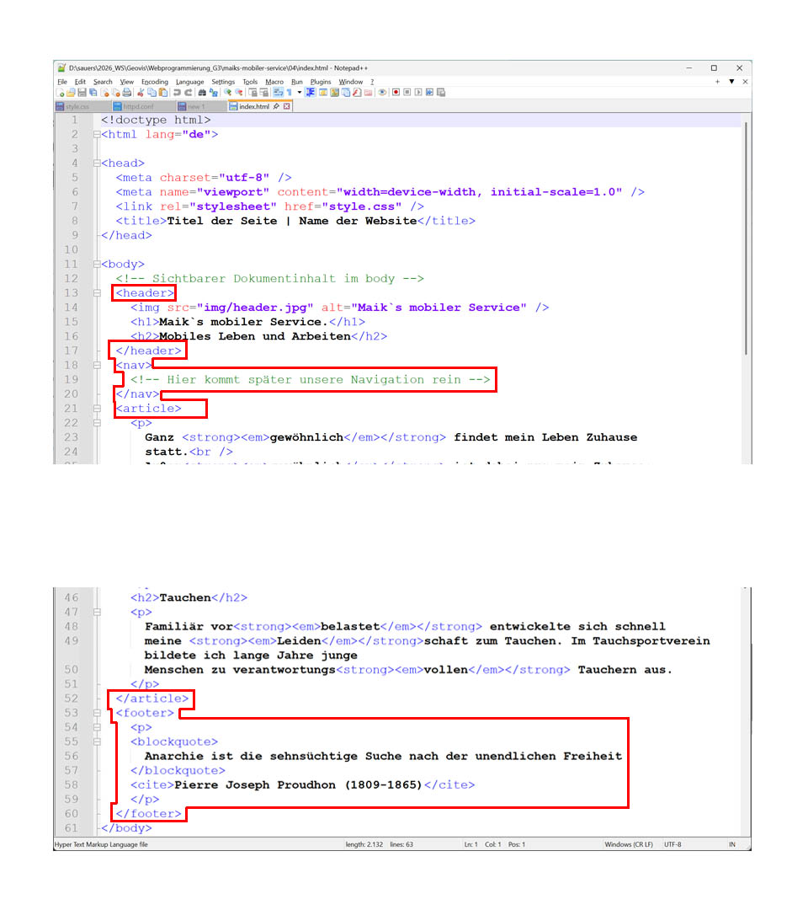

---
<!-- _class: structural -->

## Navigation (05)
- Hauptnavigation
- Subnavigation
- Große Bilder
- Email Links


---
<!-- _class: img-right -->

### Die Macht der Vernetzung: Hyperlinks

Hyperlinks sind das Herzstück des WWW. Sie verknüpfen isolierte Seiten zu einem weltweiten Informationsnetz:

> **Entstehung des Netzes:** Erst durch Verknüpfung entsteht das Internet. Inhalte leben davon, vernetzt zu sein.

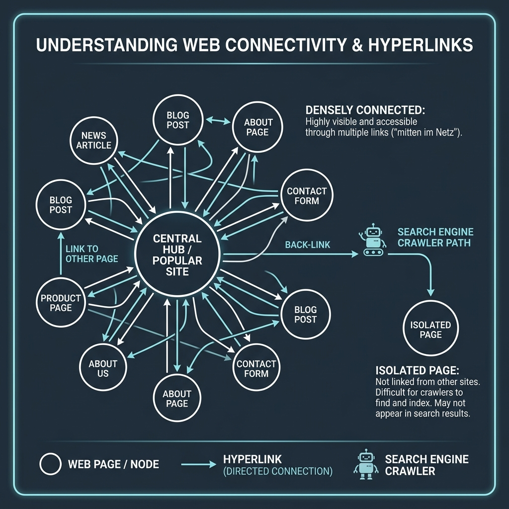

---

- **Keine Angst vor ausgehenden Links:**
  * Surfer kann man nicht festhalten – sie kommen zurück,
  wenn der Inhalt durch Qualität überzeugt!
- **Das Google-Prinzip:**
  * Suchmaschinen und Besucher finden Seiten über Links.
  * Eine Seite mit wenigen Verknüpfungen rankt niedriger als eine, die „mitten im Netz“ steht.

---

> Macht KI das Web kaputt?
Was ist Eure Meinung...


---
<!-- _class: img-right -->

### Hauptnavigation & Nutzerführung

Links sind neben Inhalt und Design das stärkste Instrument zur Benutzerführung
urch die Anordnung und Präsentation von Links wird aktiv gesteuert, wie sich Besucher durch die Seiten bewegen.

- Rückgrat der Website-Informationsarchitektur
- Dient dem Erschließen der gesamten Inhalte
- Muss die geplante Struktur der Site direkt widerspiegeln

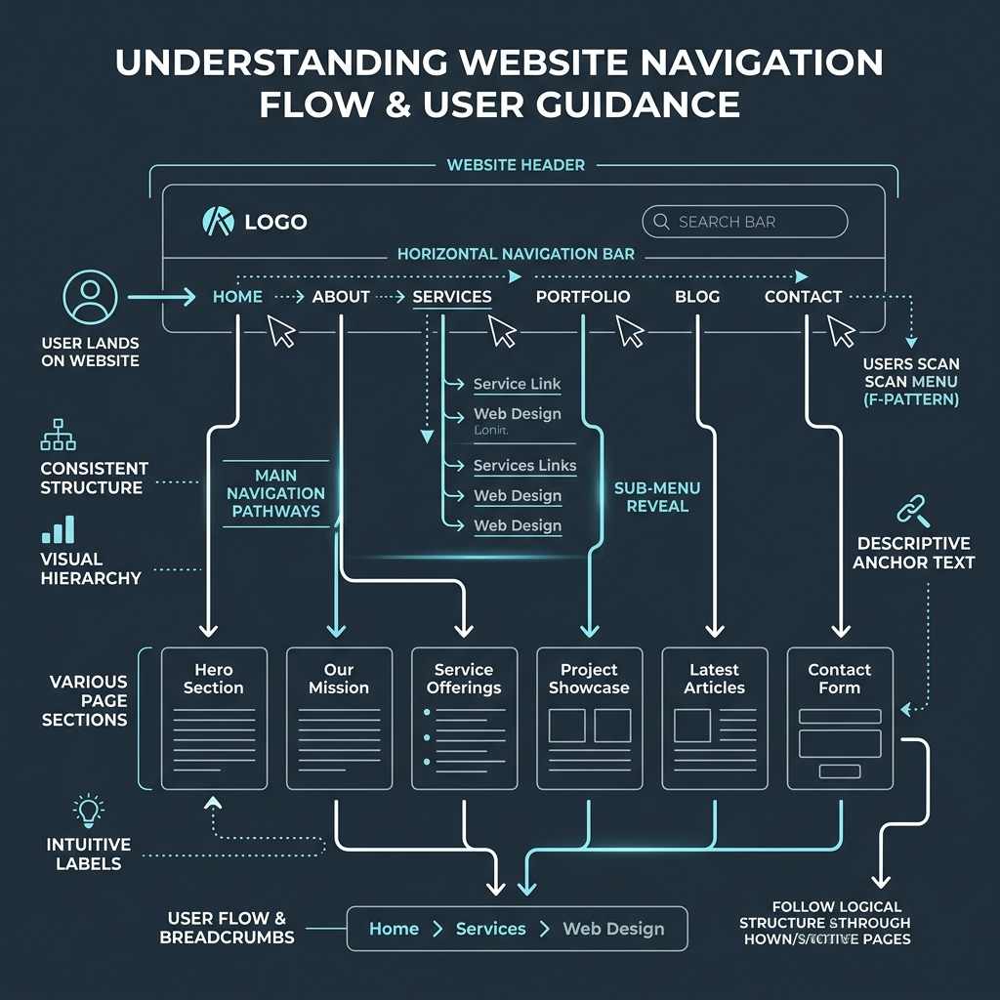

---


### Hyperlinks in HTML: Syntax & Best Practices

Ein Link verbindet Dokumente im Web. In HTML wird dafür das Anchor-Tag (`<a>`) genutzt:

- **Syntax:** `<a href="Linkziel">Linktext</a>`
- **Sprechende Linktexte:**
  * Beschreibt Linkziel klar, damit Besucher und Suchmaschinen sofort wissen, was sich dahinter verbirgt.
  * *Schlecht:* „Hier klicken“, „Weiter“, „Zurück“.
  * *Gut:* „Unser Service-Angebot“, „Aktueller Wetterbericht“.


---
<!-- _class: img-right small-text -->

- **Die target="_blank" Kontroverse:**
  * Zwingt den Browser, den Link in einem neuen Tab/Fenster zu öffnen.
  * **Kritik:** Schränkt die Benutzerkontrolle ein (Browser-Voreinstellung wird übergangen).
- Lasst lieber die Entscheidung, ob der Link in einem neuen Tab oder Fenster geöffnet werden soll, beim Nutzer, indem ihr dieses Attribut weglasst.

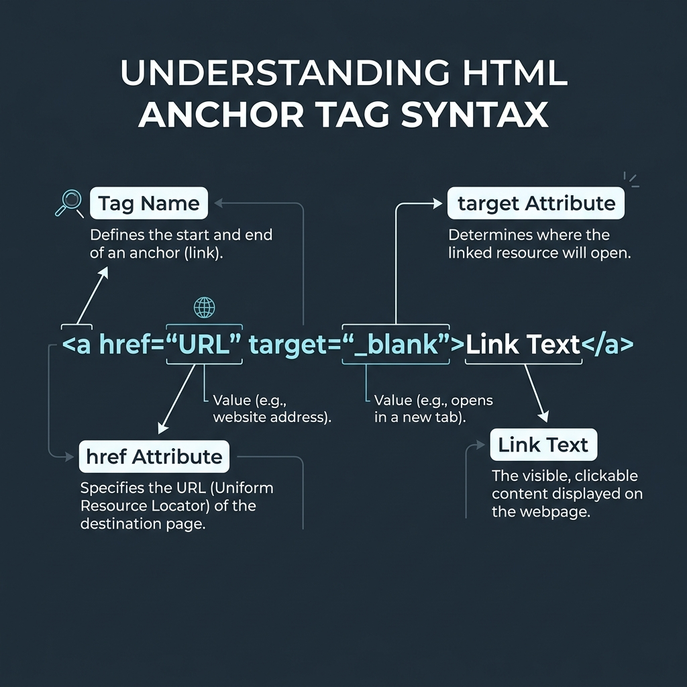

---
### Aufbau einer URL

`<a href="http://www.wetter.com">Wetterinfo</a>`


> Eine URL kann durchaus beliebig komplex werden,
besteht jedoch immer aus denselben Bestandteilen:

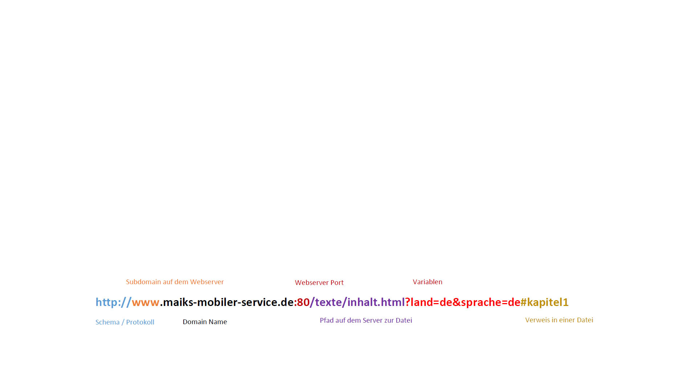

---
### Relative Links erstellen

Die Hauptnavigation führt in der Regel zu Dokumenten des eigenen Webauftritts.
Wir ergänzen daher auf unserer Startseite folgenden Code


```html
<nav>
  <!-- Hier kommt später unsere Navigation rein -->
  <ul>
    <li><a href="index.html">Heyhoo!</a></li>
    <li><a href="html/dienstleistungen.html">What I do for YOU!</a></li>
    <li><a href="html/mobiles-Leben-im-LKW.html">LKW @home</a></li>
    <li><a href="html/reisen.html">UNTERwegs</a></li>
    <li><a href="html/tauchen.html">UNTERwasser</a></li>
    <li><a href="html/kontakt.html">...DU zu MIR</a></li>
  </ul>
</nav>
```

---
<!-- _class: img-right-->


> Ein Klick auf einen der Links produziert aktuell jedoch noch einen sogenannten **404**


- Fehlermeldung, die der Webserver ausgibt, wenn das Linkziel nicht gefunden wurde.
- Fehlermeldungen sind auf dem Webserver konfigurierbar
- Webserver erwartet unter dem Link
„LKW @home“ eine Webseite mit dem Namen „mobiles-Leben-im-LKW.html“ im Unterordner „html“.

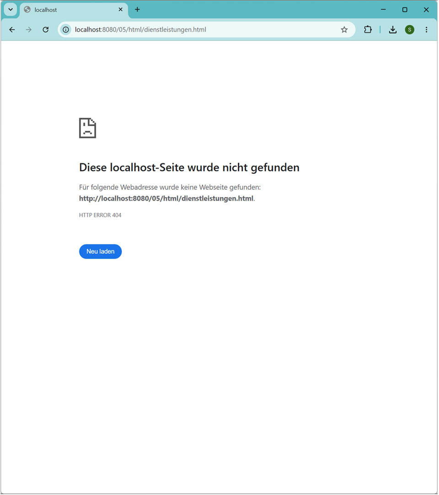

---

###### aktueller Stand

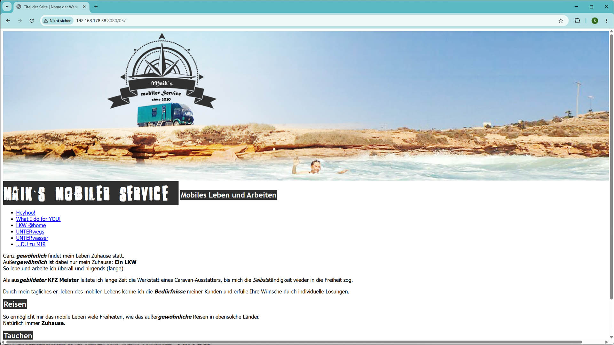

---
<!-- _class: structural -->
## CSS Experimente

Aktuell sieht die Webseite noch nicht besonders schick aus. Das werden wir jetzt gemeinsam ändern, indem wir uns die Styling-Möglichkeiten von CSS ansehen.

1. Wir verschaffen uns einen Überblick über die Stylingmöglichkeiten des jeweiligen Themas
2. Wir probieren die Stylingmöglichkeiten gemeinsam aus (Hands on)
3. Wir arbeiten uns zurück zu Maiks Website und ergänzen die Stylingmöglichkeiten nach und nach in die vorhandene Struktur ein.

---
<!-- _class: img-right-->
### Selektoren im Allgemeinen und Speziellen


**allgemeine Syntax**
- Eigenschaft: Wert;
- Eigenschaft = Eigenschaft, die angesprochen wird
- Wert = Wert, der zugewiesen wird
- Semikolon = Trennzeichen zwischen den Eigenschaften
- Letzte Deklaration kann ohne Semikolon geschriebenwerden,
gilt jedoch als guter Stil.

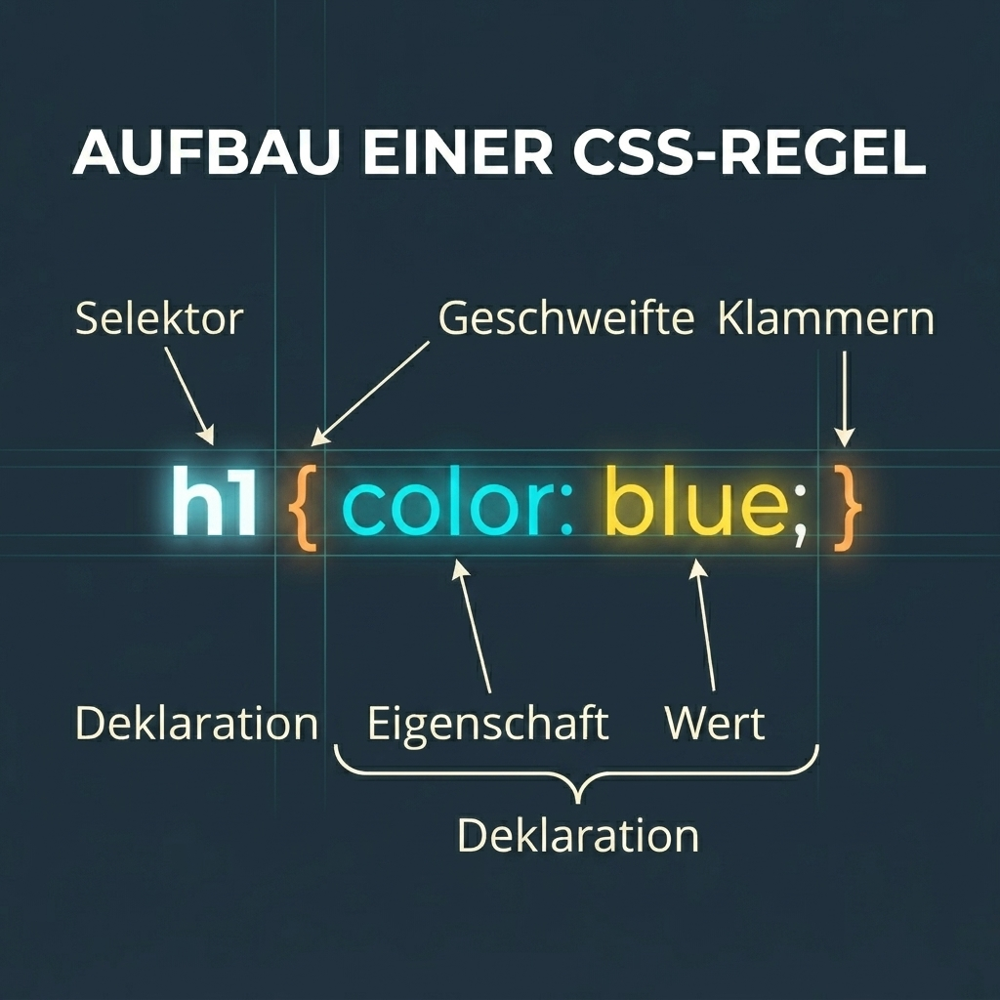

---

**Unser Testfeld:**
Der Bachelor of Harz
- Definition eines Style Bereiches
- Styles immer im Head
- Kommentarbereiche im Style mit /* xyz */

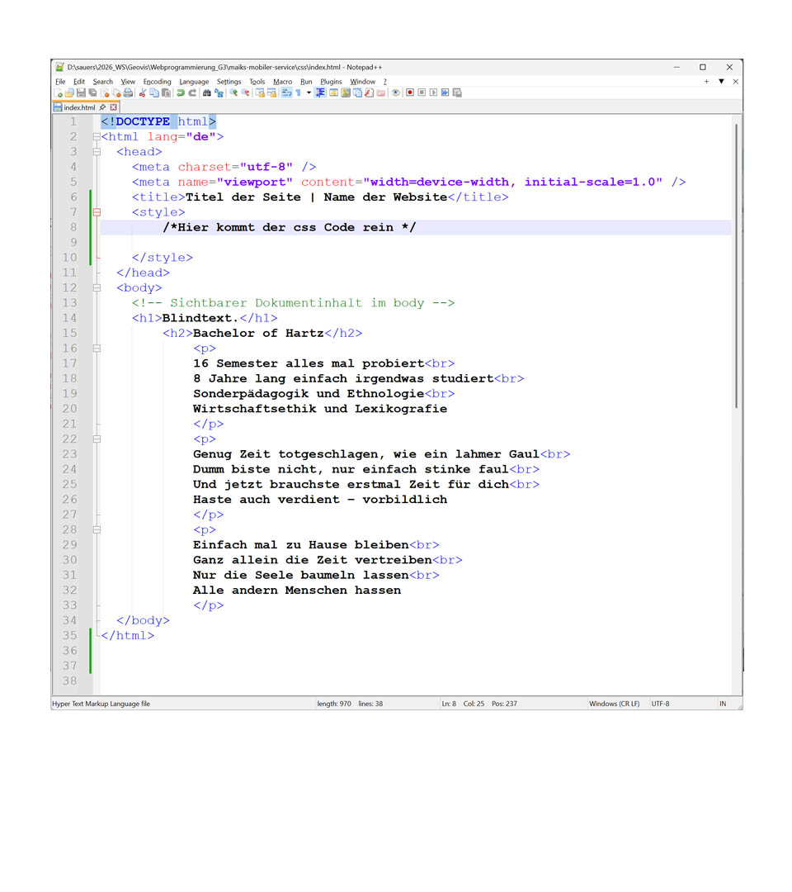

---
<!-- _class: small-text-->

**Element- oder Typ-Selektoren**
- Selektor = Name des Elements, das angesprochen werden soll
- Alle Elemente eines Typs werden angesprochen
- **Keine Präfixe**: Werden direkt als HTML-Tag-Name geschrieben (ohne `.` oder `#`, z. B. `p`, `h1`, `body`).
- **Globale Wirkung**: Betrifft *alle* Vorkommen dieses Elements auf der gesamten Webseite. Ideal für allgemeine Standards (z. B. Schriftart auf `body`).
- **Geringe Spezifität**: Besitzen eine sehr niedrige Gewichtung (Spezifität = 1) und lassen sich leicht durch Klassen oder IDs überschreiben.
- **Gruppierung**: Können per Komma kombiniert werden (z. B. `h1, h2, h3 { ... }`), um redundanten Code zu vermeiden.


```css
p {color: red;}
```

---
<!-- _class: small-text-->
**Klassenselektoren**
- Selektor ist das CSS class Attribut
- frei wählbarer Name (ohne Leerzeichen, Umlaute, etc.)
- Kann mehrmals auf der Seite verwendet werden
- Kann auch mit Element Selektoren kombiniert werden
- Selektor wird in CSS mit einem Punkt (.) versehen

```html
<h2 class="meineKlasse">Bachelor of Hartz</h2>
```
```css
.meineKlasse { color: green; }
```

---
<!-- _class: small-text-->

**Kombination von Typ- und Klassen- Selektoren**

```html
<p class="meineKlasse">
Genug Zeit totgeschlagen, wie ein lahmerGaul<br>
Dumm biste nicht, nur einfach stinke faul<br>
...
```
```css
p.meineKlasse {font-style:italic;}
```
oder auch
```html
<p class="meinezweiteKlasse">
Einfach mal zu Hause bleiben<br>
...
```


```css
.meinezweiteKlasse {background-color: yellow;}
```

---
<!-- _class: small-text-->
**Kombination von Klassen**

- Klassen lassen sich miteinander kombinieren
- beide Klassen mit Leerzeichen angeben

```html
<h2 class="meineKlasse undnocheineKlasse">Bachelor of Hartz</h2>
```

```css
.undnocheineKlasse {background-color: red;}
```

---
<!-- _class: small-text-->
**Kombinierte Style-Angaben**

- gleichzeitiges Gestalten mehrerer Klassen & Elemente
- Selektoren mit Kommata trennen

```html
<h1>Blindtext.</h1>
```

```css
.undnocheineKlasse, h1 {background-color: red;}
```

---
<!-- _class: small-text-->

**DIVs & Klassen**

- $\text{<div>}$ ist das Allzweckwerkzeug der Web-Entwicklung
- &nbsp;&nbsp; flexibler Container für beliebige Inhalte
- &nbsp;&nbsp; keine eigene semantische Bedeutung
- &nbsp;&nbsp; ideal für Gruppierungen & Layouts

```html
<div class="einedivKlasse">
  <p>
    16 Semester alles mal probiert<br>
    8 Jahre lang einfach irgendwas studiert<br>
    Sonderpädagogik und Ethnologie<br>
    Wirtschaftsethik und Lexikografie
  </p>
</div>
```

```css
div.einedivKlasse {
   background-color:lightgrey;
   padding: 20px;
}
```


---
<!-- _class: structural -->
## CSS Layout

### Konzepte, Typen & Moderne Techniken


- **Verständnis** der klassischen Layout-Typen (Fixed, Fluid, Elastic)
- **Unterscheidung** von Adaptive vs. Responsive Webdesign
- **Einsatzszenarien**: Wann setzt man was ein?
- **Moderne Werkzeuge**: Flexbox und Grid-Layout im Überblick

---

### Was ist CSS-Layout?

Das Layout bestimmt, wie Elemente auf einer Webseite angeordnet werden und wie sie auf unterschiedliche Bildschirmgrößen (Viewports) reagieren.

#### Klassische Unterteilung:
1. **Fixed** Layout
2. **Fluid** Layout
3. **Elastic** Layout

Diese Begriffe beschreiben vor allem das *Verhalten* des Layouts bei Größenänderungen des Browserfensters.

---

<!-- _class: img-right -->

### Fixed Layout (Starr)

Das Layout hat **feste Abmessungen**, meist definiert in Pixeln (`px`).

- **Verhalten:** Die Breite ändert sich nicht, egal wie groß der Bildschirm ist.
- Ist der Bildschirm kleiner, erscheint ein Scrollbalken. Ist er größer, entsteht ungenutzter Leerraum.
- **Heute:** Wird fast nicht mehr für ganze Seiten verwendet, höchstens noch für spezifische UI-Komponenten.


###### **Quellen:** [MDN Layout Modes](https://developer.mozilla.org/en-US/docs/Learn/CSS/CSS_layout), [Smashing Magazine](https://www.smashingmagazine.com/2009/04/fixed-vs-fluid-vs-elastic-layout-whats-the-right-one-for-you/)

---

<!-- _class: img-right -->

### Fluid Layout (Flüssig)

Das Layout nutzt **relative Einheiten**, meist Prozentwerte (`%`) in der Breite, in der Länge können feste Pixelwerte verwendet werden -> Vertikales Scrollen.

- **Verhalten:** Die Elemente dehnen sich aus oder schrumpfen proportional zur Fensterbreite.
- Es füllt immer den verfügbaren Platz aus.
- **Heute:** Ein sehr wichtiger und grundlegender Baustein für Responsive Webdesign.


###### **Quellen:** [MDN CSS Layout](https://developer.mozilla.org/en-US/docs/Learn/CSS/CSS_layout)

---

<!-- _class: img-right -->

### Elastic Layout (Elastisch)

Das Layout basiert auf der **Schriftgröße**, definiert in Einheiten wie `em` oder `rem`.

- Bleibt proportional zum Text lesbar, auch wenn der Nutzer den Text im Browser vergrößert.
- Ausgezeichnet für Barrierefreiheit (Accessibility).
- Schwer zu gestalten


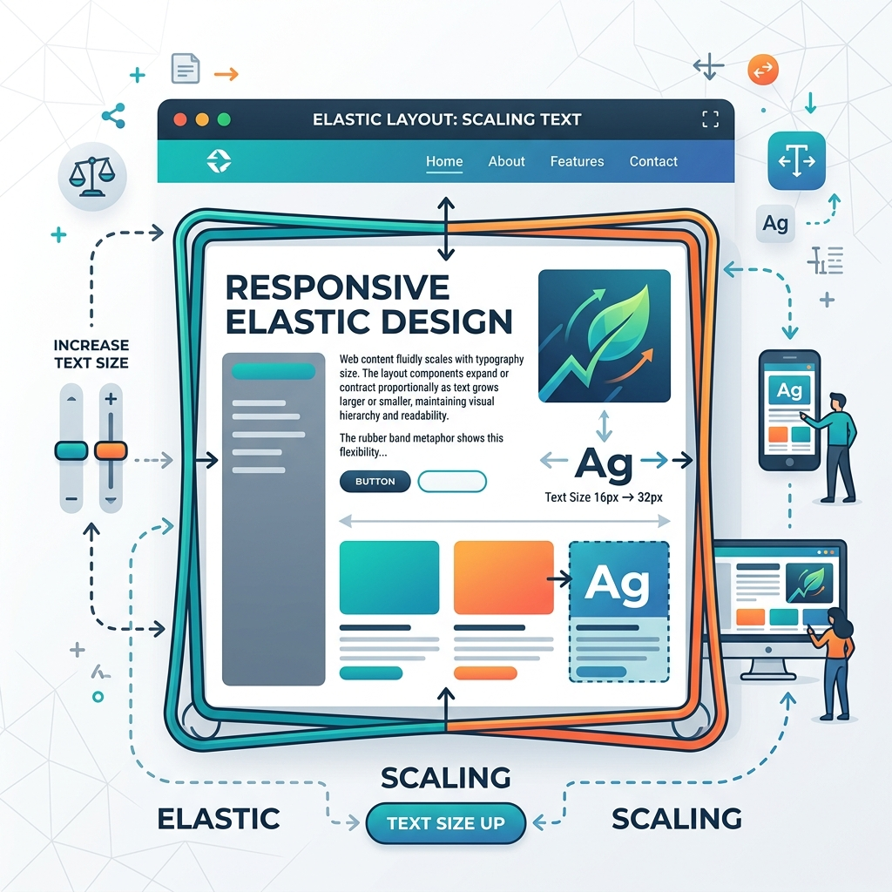

---
<!-- _class: structural -->
### Adaptive vs. Responsive 


Zwei grundlegend unterschiedliche Konzepte im Webdesign.

---
<!-- _class: img-right small-text -->

**Responsive Webdesign (RWD):**
- Ein **einziges, flüssiges Layout**, mit Media Queries
- nutzt Fluid Grids und flexible Bilder.
- Webseite skaliert auf alle Bildschirmgrößen
- Einziges Layout für alle Geräte


**Adaptive Webdesign (AWD):**
- **Mehrere feste Layouts** für spezifische Breakpoints (z. B. Mobile, Tablet, Desktop).
- Server oder Client entscheidet über das Layout
- *Maßgeschneidert pro Gerät.*


###### **Quellen:** [CSS-Tricks: Responsive vs. Adaptive](https://css-tricks.com/the-difference-between-responsive-and-adaptive-design/)

---

### Wann setzt man was ein?

#### Responsive Design (Der Standard)
- Für **Neuentwicklungen** und die allermeisten modernen Websites.
- Besser wartbar (nur eine Codebase) und zukunftssicher (passt auch für unbekannte Zwischengrößen von Displays).

#### Adaptive Design (Der Spezialist)
- Wenn Mobile-Nutzer eine **völlig andere User Experience** oder stark reduzierte Funktionen brauchen (Performance!).
- Um sehr alte, starre Seiten für Mobile nutzbar zu machen, ohne sie von Grund auf komplett neu zu schreiben.

---

<!-- _class: structural -->

### Moderne CSS Layout-Techniken
#### Flexbox und CSS Grid

---

<!-- _class: img-right -->

### Flexbox 

Flexbox (Flexible Box Layout) ist ein **eindimensionales** Layout-Modell (Zeile *oder* Spalte).

- Ideal, um Platz zwischen Elementen zu verteilen und sie auszurichten (endlich einfaches Zentrieren!).
- Reagiert dynamisch auf den verfügbaren Platz.
- Perfekt für UI-Komponenten, Navigationen und Toolbars.

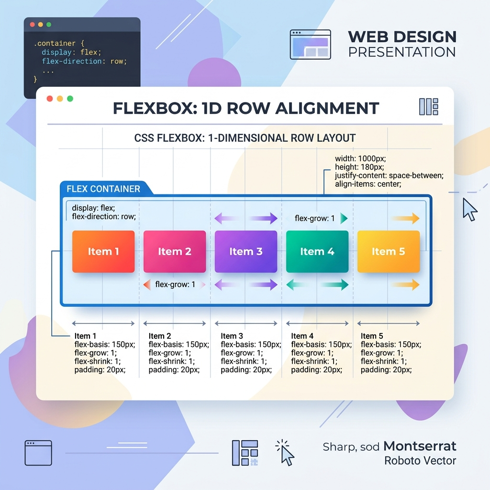

###### **Quellen:** [MDN: Flexbox](https://developer.mozilla.org/en-US/docs/Learn/CSS/CSS_layout/Flexbox), [CSS-Tricks Flexbox Guide](https://css-tricks.com/snippets/css/a-guide-to-flexbox/)

---

<!-- _class: img-right -->

### CSS Grid 

Grid ist ein **zweidimensionales** Layout-Modell (Zeilen *und* Spalten gleichzeitig).

- Das mächtigste Werkzeug für komplexe Seitenstrukturen in CSS.
- Ermöglicht das exakte Platzieren von Elementen auf einem Raster.
- Deutlich strikter und strukturierter als Flexbox.

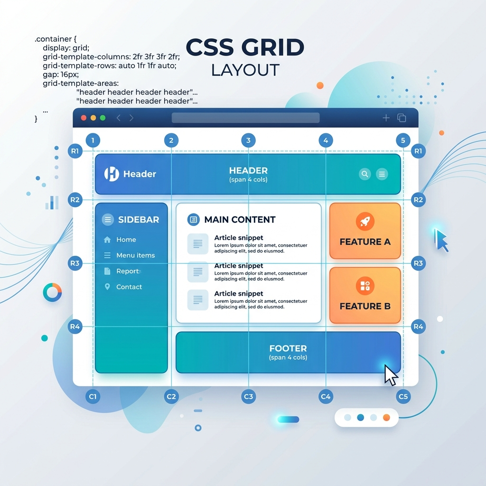

###### **Quellen:** [MDN: Grids](https://developer.mozilla.org/en-US/docs/Learn/CSS/CSS_layout/Grids), [CSS-Tricks Grid Guide](https://css-tricks.com/snippets/css/complete-guide-grid/)

---

<!-- _class: structural -->

### Zusammenfassung

1. **Fixed, Fluid, Elastic:** Historische und konzeptionelle Begriffe für Layout-Verhalten.
2. **Responsive Webdesign:** Der moderne Standard (ein flüssiger Code für alle Größen).
3. **Adaptive Webdesign:** Feste, gerätespezifische Layouts für spezielle Use Cases.
4. **Flexbox:** Eindimensional, perfekt für die Ausrichtung von Elementen in einer Reihe.
5. **Grid:** Zweidimensional, ideal für das grobe und feine Seitenlayout.

---

<!-- _class: end -->

### Fragen?

> "The web is inherently responsive. We just keep breaking it with fixed pixels."
> — *John Allsopp (A Dao of Web Design)*

---
<!-- _class: structural -->
### Code-Beispiele
- Fixed layout
- Responsive Fluid Layout
- Elastic Layout
- Flexbox Layout
- Grid Layout

---

<!-- _class: img-right -->
#### **Fixed Layout**
- Feste Breitenangaben in absoluten Pixeln (`px`)
- Layout passt sich **nicht** an den Bildschirm an
- Führt bei kleinen Bildschirmen zu horizontalen Scrollbalken

[Code-Beispiel ansehen](Samples/Layout/fixed.html)

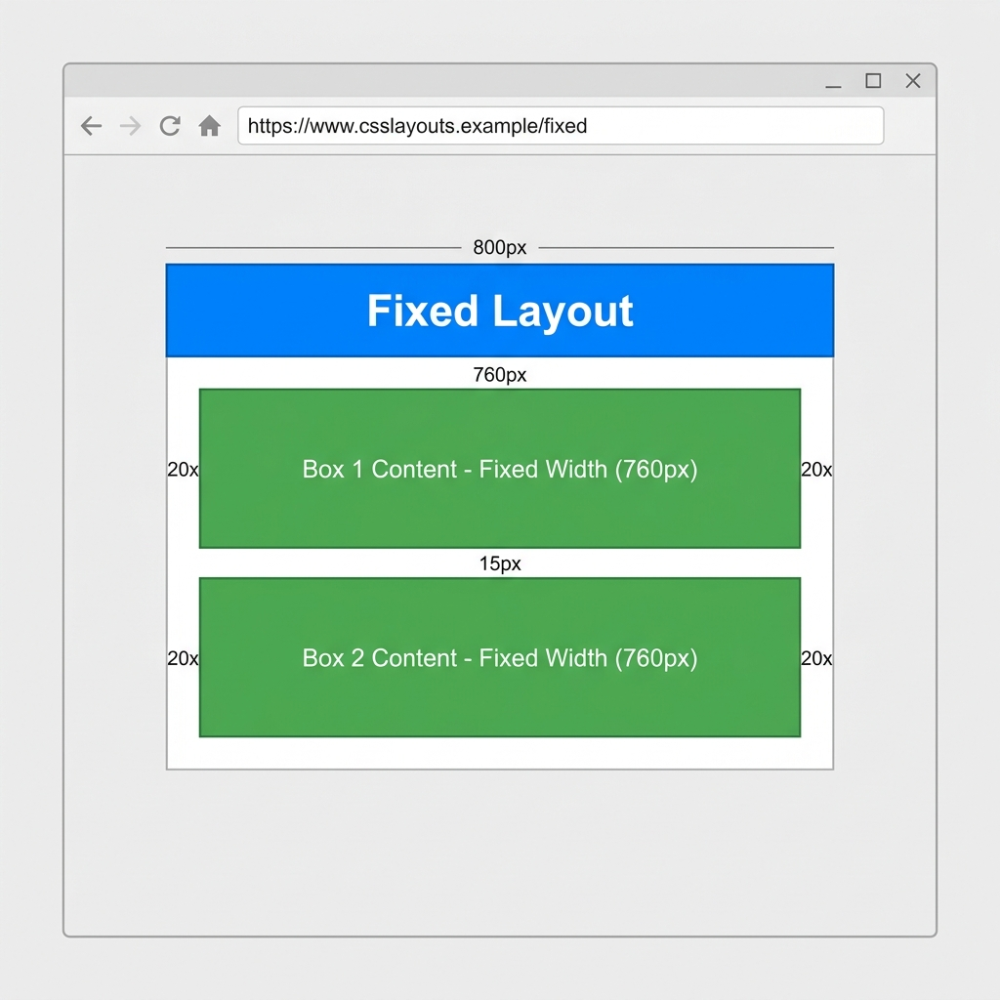

---

<!-- _class: img-right -->
#### **Responsive Fluid Layout**
- Breitenangaben in relativen Prozentwerten (`%`)
- Layout fließt und füllt den Viewport flexibel aus
- Zentrale Grundlage für modernes Responsive Design

[Code-Beispiel ansehen](Samples/Layout/fluid.html)

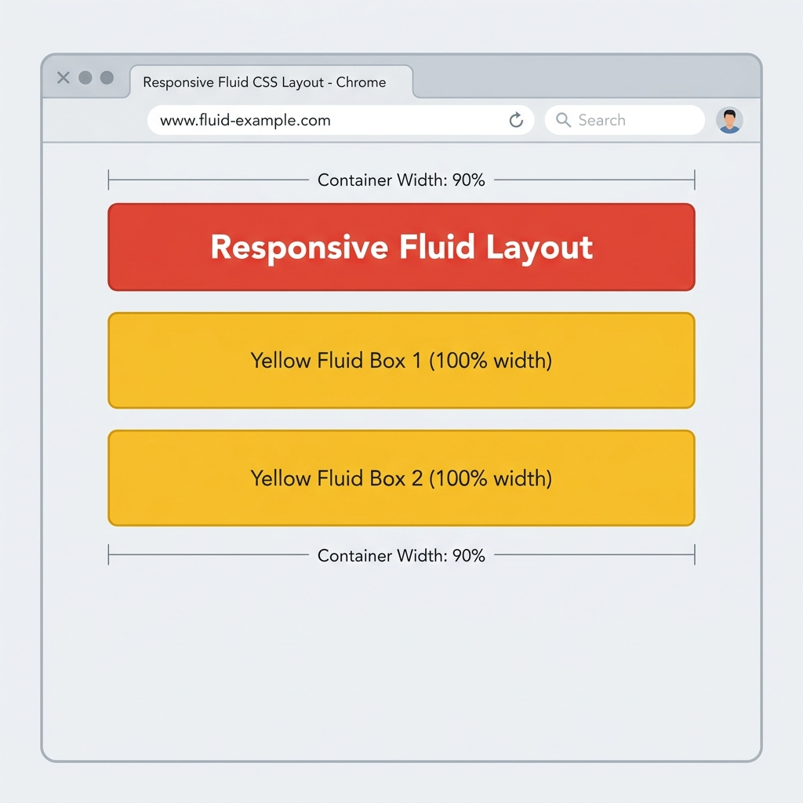

---

<!-- _class: img-right -->
#### **Elastic Layout**
- Größen skalieren mit der gewählten Schriftgröße (`em` / `rem`)
- Layout wächst proportional, wenn der Nutzer die Schrift vergrößert (Strg. + Mausrad)
- Sehr gut für Barrierefreiheit, jedoch komplexer im Design

[Code-Beispiel ansehen](Samples/Layout/elastic.html)

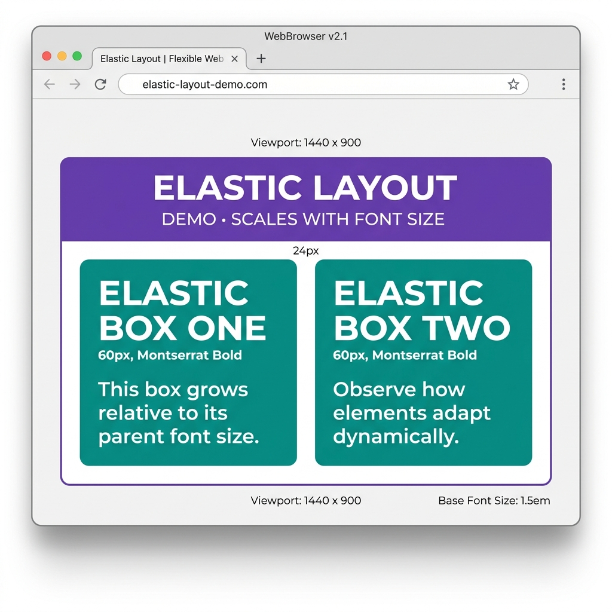

---

<!-- _class: img-right -->
#### **Flexbox Layout**
- Eindimensionales Verteilungssystem (Zeile *oder* Spalte)
- Boxen verteilen den verfügbaren Platz dynamisch (z.B. `flex: 1`)
- Ideal zur Ausrichtung von Elementen und UI-Komponenten

[Code-Beispiel ansehen](Samples/Layout/flexbox.html)

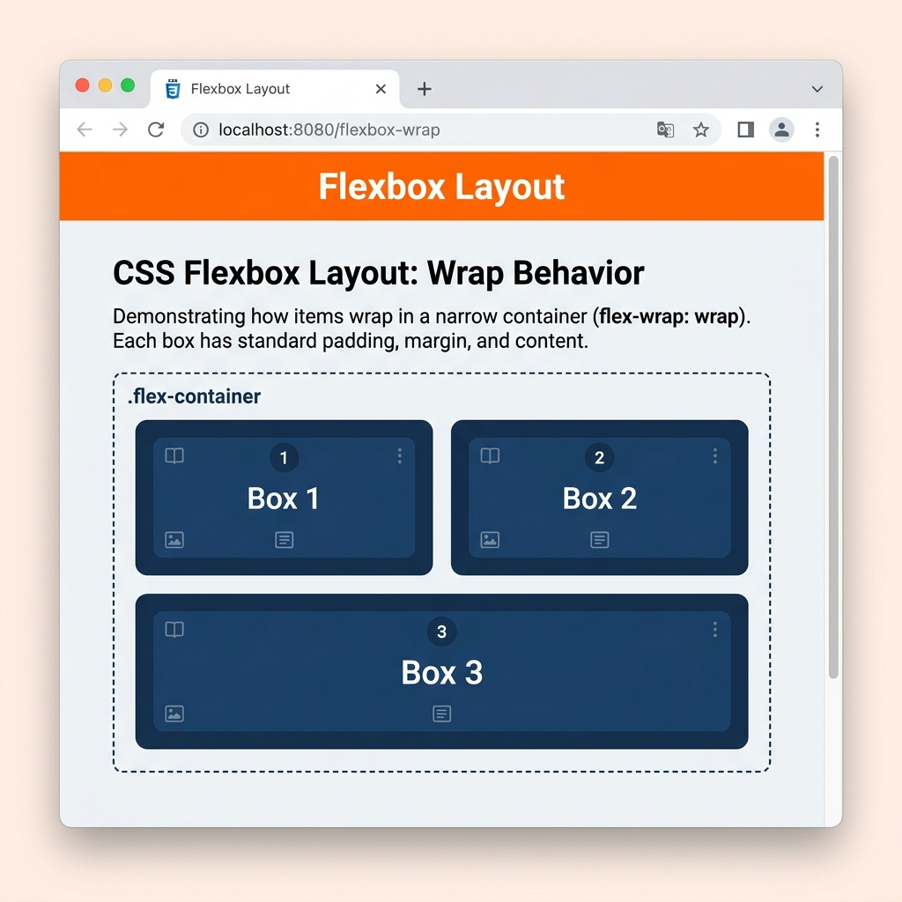

---

<!-- _class: img-right -->
#### **Grid Layout**
- Zweidimensionales Rastersystem (Zeilen *und* Spalten gleichzeitig)
- Elemente lassen sich exakt auf vordefinierten Spuren platzieren
- Das mächtigste CSS-Werkzeug für das strukturelle Seitenlayout

[Code-Beispiel ansehen](Samples/Layout/grid.html)

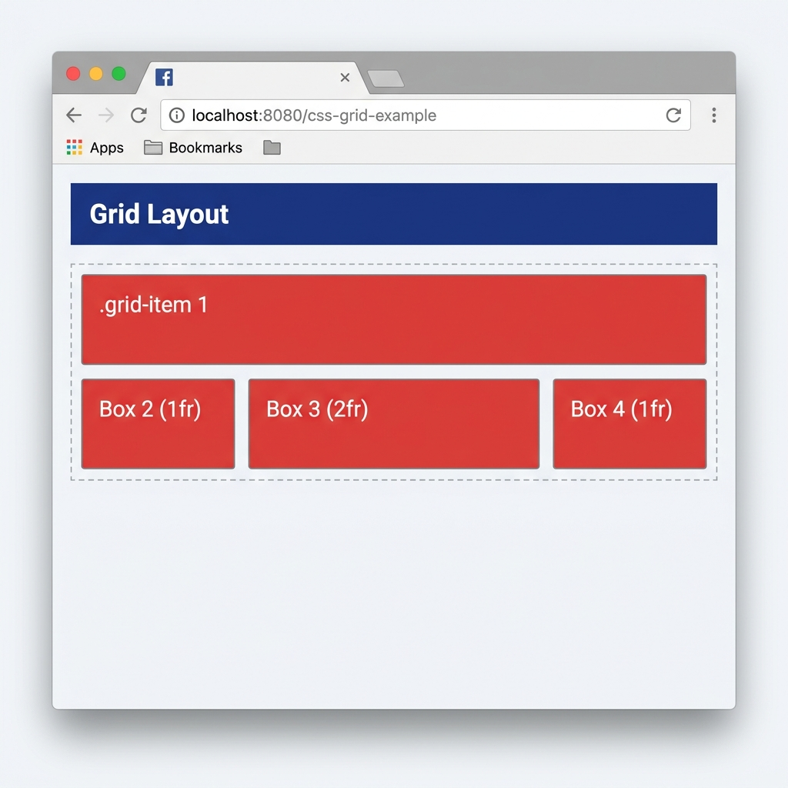---


---
<!-- _class: structural -->

## Maik's Responsive Layout (06)

- klassisches Zweispalten Layout
- Header & Footer
- Navigationsbar links
- Content-Bereich wird durch
umschließenden Bereich begrenzt


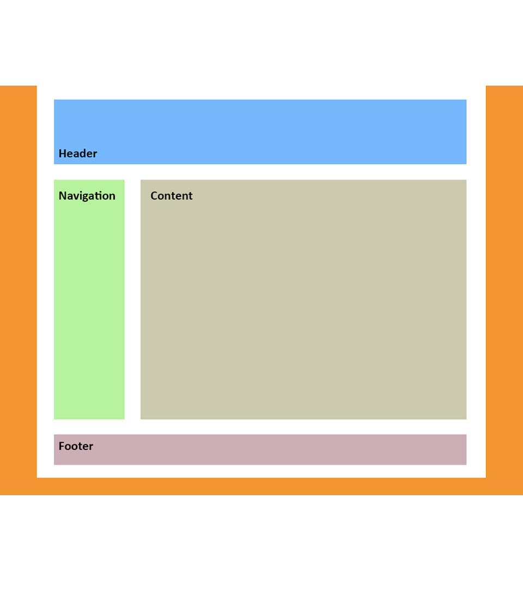

---
<!-- _class: twocolumns -->
#### Wrapper und body (06a)
- Wrapper fasst den gesamten Inhalt zusammen
- bildet einen Rahmen um das layout
- begrenzt maximale breite auf einen definierten Wert
- zentriert das layout auf der seite
- keine semantische Bedeutung, daher DIV

in index.html ist der wrapper das div-Element mit der id="wrapper"

```html
<body>
<!-- Sichtbarer Dokumentinhalt im body -->
<div id="wrapper">
<header>
....
</footer>
</div>
</body>
```

---
<!-- _class: twocolumns -->


- weißer Hintergrund
- schwarzer text
- Breite 80 % des Bildschirms
- Maximalbreite 1600 px, damit der Inhalt auf großen Monitoren nicht zu breit wird.
- Ränder oben 0 px und seitlich automatisch gleich breit

Wir ergänzen im css:
```css
#wrapper {
background-color: #FFFFFF;
color: #000000;
margin: 0 auto;
padding: 0px;
width: 80%; max-width: 1600px;
}
```

---
<!-- _class: fullscreen -->

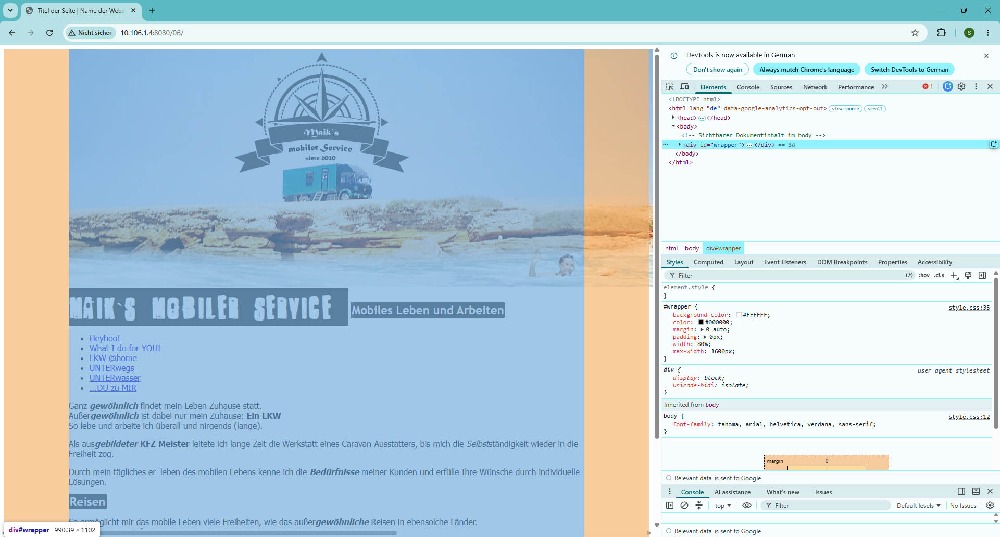

---
<!-- _class: twocolumns -->
#### Ein neuer Header
- Wrapper funktioniert
- Bild weigert sich im Container zu bleiben
- h1 soll in den Header
- Bild aus dem Header entfernen
- Bild wird über das css geladen

```html

<header>
<div id="h1container"><h1>
  Maik`s mobiler Service</h1></div>
</header>

```

---
<!-- _class: twocolumns -->
##### im css


- Außenabstand des headers von 0 Pixeln
- Innenabstand von 10px nach oben, damit Überschrift nicht am oberen Rand klebt
- Laden des Header-Bildes als background-Image
- keine Wiederholung des Bildes
- Bild wird an die breite des umgebenden Elements angepasst
- Hintergrundfarbe für den Fall, dass das Bild nicht geladen werden kann
- Minimale Höhe des Headers von 360 Pixeln

```css
header {
margin: 0px;
padding-top: 10px;
background:url(img/header.jpg) no-repeat;
background-size: cover;
background-color: #eef1f0;
min-height: 360px;
}

```

---
<!-- _class: twocolumns -->
##### weitere css Anpassungen
- zur besseren Integration der h1
- Entfernen des grauen Hintergundes bei der h1
- Nur bei h2 grauer Hintergrund
- h1container wird rechts ausgerichtet

```css
h1, h2 { display: inline;
color: #FFFFFF ;
font-family: "Trebuchet MS", ...
font-size: 1.4em;
text-align: left;
margin: 0px;
padding: 2px}

h1{font-size: 1.8em;
font-family: '1-Punk',...
color: #138492;
margin-right: 30px;}

h2{ background-color: #303030;}

#h1container {text-align: right;}
```

---
<!-- _class: fullscreen -->


---
<!-- _class: twocolumns -->
#### Der Body
- Content und Body sollen sich abheben
- Einfügen eines schwarzen Hintergrundes
- css Reset des Bodys

```css
body {
font-family: tahoma,arial,helvetica,verdana,sans-serif;
margin: 0px;
padding: 0;
background-color: #000000; }

```

---
<!-- _class: fullscreen -->


---
<!-- _class: twocolumns -->
#### Ein Zweispalter
- Nutzung von html5-Tags
- aside für Seitenspalte mit Menü
- main-tag für die


```html
<div id="body" class="col-1">
<aside>
  <nav>
    <!-- Hier kommt später unsere Navigation rein -->
    ...
  </nav>
</aside>
```

```html
<main>
  <article>
    <h2>Mobiles Leben und Arbeiten</h2>
    ....
  </article>
</main>
```
---
<!-- _class: twocolumns -->
#### Im css

- feste Breite von 220px (erwartbare Textlänge)
- float > Element wird nach links gerückt
- Umfließen durch nachfolgende Elemente
- main-Container wird als Block in eine Rechteck gezwungen
- fester Abstand nach links wegen nav

```css
/*Navigation*/
aside {
  float: left;
  width: 220px;
  padding: 0px 0px 0px 20px;
  margin: 20px 0px 0px 0px;}
```
```css
/*Hauptinhalt*/
main {
  padding: 10px;
  margin: 20px 0px 0px 250px;
  display: block;
}
```

---
<!-- _class: fullscreen -->


---
<!-- _class: twocolumns -->
#### Der Footer
- weißer Text
- auf grauem Grund
- im Punk-Style
- zentriert

```css
/* und unten der Footer */
footer { color: #ffffff;
font-family: '1-Punk',Georgia,"Trebuchet MS"
verdana,arial
helvetica,sans-serif;
background-color: #303030;
margin: 20px 0px 0px 0px;
padding: 10px 20px;
text-align: center; font-size: 0.8em;
}
```
---
<!-- _class: fullscreen -->


---

<!-- _class: twocolumns -->
#### Die vertikale Navigation
- Listenabstände / Bullets reseten
- Hintergrund weiß, text schwarz bei normalen Links
- Beim Hovern helle Schrift auf dunklem Grund


```css
nav ul {
  padding: 0;
  margin-top: 7px; list-style: none;
}
nav ul a:link, nav ul a:visited, nav ul a:active {
  color: #000000;
  background-color: #FFFFFF;
  padding: 3px 3px 3px 8px;
  margin: 0;
  text-decoration: none;
  font-size: 1em;
  font-family: Georgia,"Trebuchet MS",
  verdana,arial,helvetica,sans-serif;
  display: block;
  font-weight: bold;
  line-height: 25px;
  border-bottom: 1px dotted #5F5F5F;
}
nav ul a:hover, nav ul a:focus {
  font-size: 1.2em;
  color: #FFFFFF;
  background-color: #303030;
}
```

---

<!-- _class: twocolumns -->
#### Die horizontale Navigation
- Navigationsleiste als unterer Abschluss des Headers
- Einfügen DIV mit ID "navihor"

```html

<header>
  <div id="h1container">
  <h1>Maik`s mobiler Service</h1>
  <p>mobiles Leben und Arbeiten<p> 
  </div>
  <div id="navihor">
    <a href="#">Kontakt</a>
    <a href="#">Impressum</a>
    <a href="#">Datenschutz</a>
  </div>
</header>
```

---
<!-- _class: twocolumns -->
#### CSS für horizontale Navigation
- Header wird 360 Pixel hoch
- Abstand der Navigationsleiste zum oberen Header wird 320px
- horizontale Navigation zentrieren


```css
#h1container p{
  margin: 0 30px;
  padding: 0;
  background-color: #none;
  font-size: 1.2em;
  font-family: '1-Punk',Georgia,"Trebuchet MS"
  verdana,arial,helvetica,sans-serif; 
  text-align: right;
  color: #138492;
}

#navihor {
  height: 33px;
  background-color: #303030;
  text-align: center;
  margin-top: 320px;
}

```
---
<!-- _class: twocolumns -->
- Style für die Links in der Navigation
- weißer Text auf grauem Grund
- beim Hovern grün hinterlegt
- Padding für Vergrößerung der klickbaren Fläche


```css
#navihor a:link,
#navihor a:active,
#navihor a:visited {
  color: #FFFFFF;
  background-color: #303030;
  text-decoration: none;
  font-family: tahoma, arial,
  helvetica, verdana, sans-serif;
  font-size: 1em;
  line-height: 33px;
  padding-left: 30px;
  padding-right: 30px;
  padding-top: 3px;
  padding-bottom: 3px; font-weight: bold;
}

#navihor a:hover, a:focus { 
  color: #000000;
  background-color: #1499a9;
}

```

---

<!-- _class: fullscreen -->

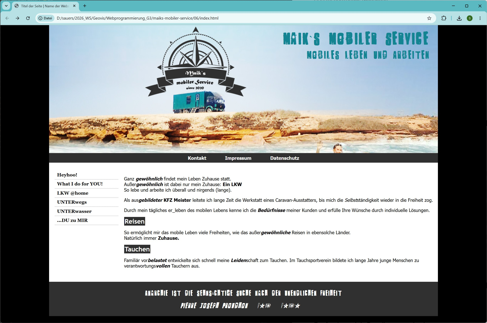

---
<!-- _class: twocolumns -->
#### Bilder im Fließtext
- max Zeichen pro Zeile cs. 75
- Bilder im Fließtext können umflossen werden
- margin für Abstand des Bildes vom Text
- Kopieren des Bildes thatsme.jpg in den Ordner "img" aus dem Material-Ordner

```html
<main>
<article>
    
    <h2>Mobiles Leben und Arbeiten</h2>
    <p> … </p>
</article>
</main>
```


```css
article {
  width: 100%;
  display: inline-block;}

.bildImFliesstext {
  float:right;
  width: 30%;
  margin-top: 0px;
  margin-right:20px;
  margin-bottom: 10px; 
  padding: 10px;}
```

---

<!-- _class: fullscreen -->

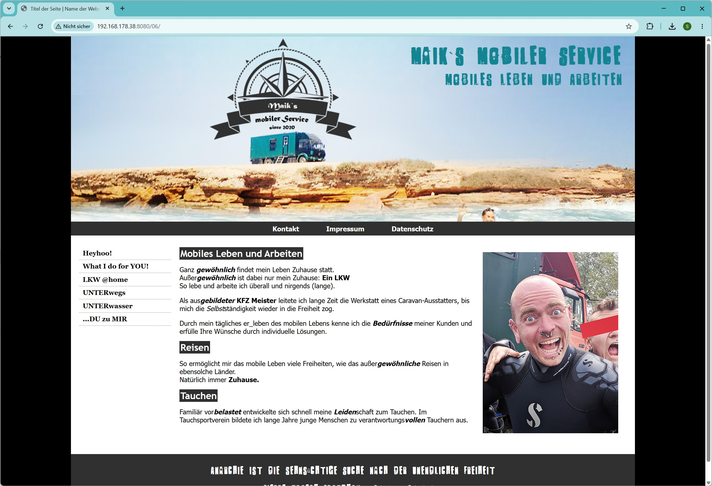


---
<!-- _class: structural -->
## Mobile First!
- 44,2 % der Deutschen Internetnutzer greifen mobil zu.
- Im internationalen Vergleich sind dies relativ wenige.
- Weltweit sind es im durschnitt über 53%.
- Interessant: Mobile steigt KI
- Desktop gewinnt an Boden im Web


##### https://statistiken-aktuell.de/smartphone-internetnutzung/


---
<!-- _class: structural -->
### Warum mobile First?
- Ladezeitoptimierung
- zuerst Inhalte für Mobilgeräte laden
- danach Desktop-Inhalte
- Lösung durch Media-Queries

---

<!-- _class: img-right -->
### CSS Media Queries

- **Was sind Media Queries?**
  - Ermöglichen, CSS-Regeln nur dann anzuwenden, wenn bestimmte Bedingungen (wie Bildschirmbreite) erfüllt sind.
  - Webseite passt sich automatisch an Smartphones, Tablets, Desktops an

```css
@media (max-width: 768px) {
  body {
    background-color: lightblue;
  }
}
```

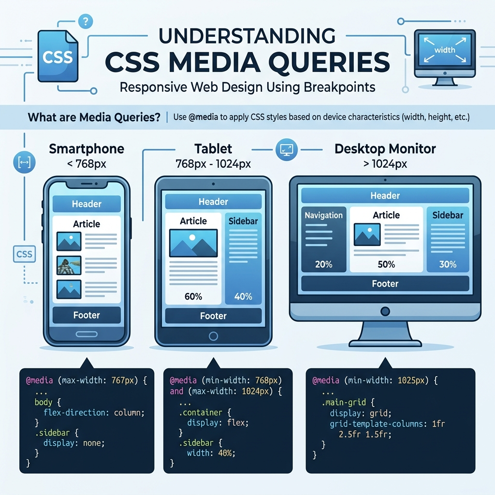

---

#### Medientypen (Media Types)**

- **Allgemeine Kategorien** von Ausgabegeräten:
  - `all`: Für alle Geräte (Standard).
  - `print`: Für den Druckmodus (z. B. wenn die Seite als PDF exportiert wird).
  - `screen`: Für Bildschirme (Smartphones, Monitore).

```css
/* Wird nur beim Ausdrucken angewendet */
@media print {
  nav {
    display: none; /* Navigation beim Drucken ausblenden */
  }
}
```

---

#### Medienmerkmale (Media Features)**

- **Spezifische Eigenschaften** des Geräts oder Browsers:
  - `width` / `height`: Breite oder Höhe des Browserfensters.
  - `max-width` / `min-width`: Sehr oft genutzt, um Breakpoints (Umbruchpunkte) zu definieren.
  - `orientation`: `portrait` (Hochformat) oder `landscape` (Querformat).

```css
/* Gilt für Geräte im Querformat */
@media (orientation: landscape) {
  .sidebar {
    display: block;
  }
}
```

---

#### Logische Operatoren in Media Queries**

- Bedingungen lassen sich mit `and`, `not`, und `only` verknüpfen.
- Man kann auch Kommas `,` verwenden (entspricht einem logischen "ODER").

```css
/* Bildschirm UND mindestens 1024px breit */
@media screen and (min-width: 1024px) {
  .container {
    display: flex;
  }
}

/* Bildschirm ODER Druck */
@media screen, print {
  /* Gemeinsame Stile */
}
```


---
<!-- _class: structural -->
### Praxis-Beispiel: Media Queries im Einsatz

Wir betrachten unsere Beispielseite `Samples/Media Querie/index.html`. 
Diese ändert ihr Layout sowie die Hintergrundfarbe dynamisch je nach verfügbarem Platz im Browserfenster.

---
<!-- _class: twocolumns -->
#### Die Mobile Ansicht (Default)

- **Mobile First:** Die Basis-Regeln gelten für kleine Bildschirme.
- Die Boxen nehmen `100%` der Breite ein und stapeln sich vertikal.
- Der Hintergrund ist ein helles Grau (`#f4f4f9`).

```css
.box {  flex: 1 1 100%; /* 1 Spalte */}
```


---
<!-- _class: twocolumns -->
#### Die Tablet Ansicht (ab 600px)

- Sobald der Bildschirm **mindestens 600px** breit ist, greift die erste Media Query.
- Das Layout wechselt auf **2 Spalten** (jede Box ca. 50%).
- Zur Verdeutlichung wechselt der Hintergrund auf Hellblau (`#e3f2fd`).

```css
@media screen and (min-width: 600px) {
  body { background-color: #e3f2fd; }
  .box { flex: 1 1 calc(50% - 20px); }}
```


---
<!-- _class: twocolumns -->
#### Die Desktop Ansicht (ab 900px)

- Ab einer Bildschirmbreite von **900px** wird die nächste Query aktiv.
- Das Flexbox-Layout verteilt die Boxen nun in **3 Spalten** (je ca. 33%).
- Die Hintergrundfarbe wird auf Hellgrün (`#e8f5e9`) gesetzt.

```css
@media screen and (min-width: 900px) {
  body { background-color: #e8f5e9; }
  .box { flex: 1 1 calc(33.333% - 20px); }}
```


---
<!-- _class: structural -->
## Maik`s mobile Seite mit Media Queries (07)

> Mobile First heißt deswegen Mobile First weil zuerst die mobile Ansicht gestaltet wird.

ups... 🙄

> Eine mobile Ansicht ist aber schnell gemacht...

---
<!-- _class: twocolumns -->

### Maik`s Mobile First
- Bild header-mobile.jpg in img kopieren
- wrapper zurücksetzen
- headerbild ersetzen
- Bild zentrieren
- Höhedes headers reduzieren

```css
#wrapper {
background-color: #FFFFFF;
color: #000000;
margin: 0 auto;
padding: 0px;
width: 100%; max-width: 1600px;
}
```

```css
header {
margin: 0px;
padding-top: 10px;
background:url(img/header-mobile.jpg) no-repeat;
background-size: cover;
background-position: center;
background-color: #eef1f0;
min-height: 320px;
}
```
---
<!-- _class: twocolumns -->
- Überschrift unsichtbar machen
- wird in der Desktop-Ansicht wieder sichtbar gemacht
- h1-container wird zu h1-container-desktop

Im HTML:
```html
<div id="h1container-desktop">
    <h1>Maik`s mobiler Service</h1>
    <p>mobiles Leben und Arbeiten<p>
</div>
```
Im CSS:

```css
#h1container-desktop {
    text-align:right;
    display: none;}

#h1container-desktop p{
    margin: 0 30px; 
    padding: 0;
    background-color: #none;
    font-size: 1.2em;
    font-family: '1-Punk',Georgia,
    "Trebuchet MS",verdana,arial,helvetica,sans-serif;
    text-align: right;
    color: #138492;}
```

---
<!-- _class: twocolumns -->
- Anpassen der horizontalen Navigationsleiste
- Unterbrechen des Floatens der Hauptnavigation
- Padding links hinzufügen
```css
#navihor {
  height: auto;
  background-color: #303030;
  text-align: center;
  margin-top: 320px;}

aside {
  float: clear;
  width: 100%;
  padding: 0px; 
  margin: 0px;}

nav ul a:link, nav ul a:visited, nav ul a:active {
...
padding-left: 20px;
...;
}
```
---
<!-- _class: twocolumns -->
- Anpassen des Main-Containers
- Zurücksetzen der Abstände
- Anpassen des Bildes im Fließtext
- Verkleinerung der h1
- Verkleinerung des Footers


```css
main {
  padding: 0px 0px 0px 20px;
  margin: 20px 0px 0px 0px;
  display: block;
}
```
```css
.bildImFliesstext {
...
  width: 50%;
...}
```

```css
h1, h2 {
...
  font-size: 1.2em  ...}
```

```css
footer {
...
  font-size: 0.6em  ...}
```

---
<!-- _class: structural -->
>> Fertig ist die mobile Webseite!

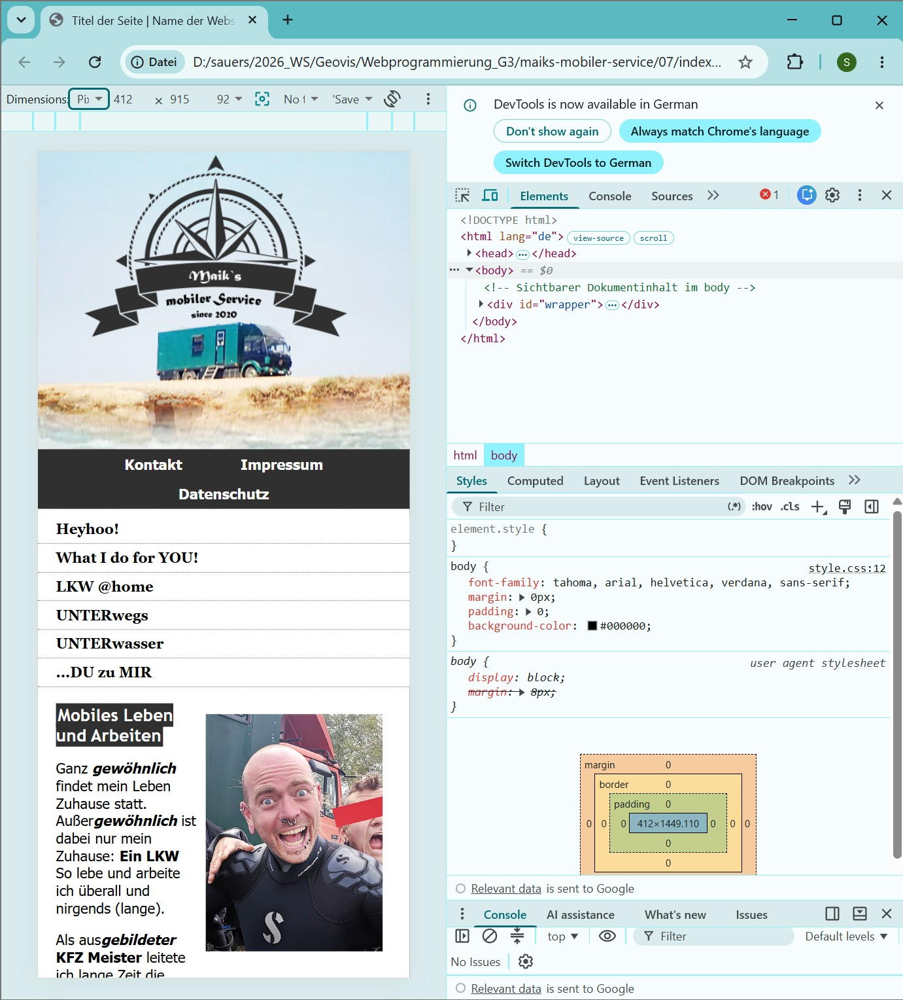

---
> Nun testen Sie die Seite in der Desktop-Ansicht.
Gruselig?
... Dann brauchen wir eine neue Desktop-Version

---
<!-- _class: structural -->
## Maik`s Desktop-Version (08)

An Breakpoints bricht mit Media-Queries das Design um.
Anzahl der Breakpoints ist nicht festgelegt / limitiert.
Schrittweises Anpassen des Designs, immer dann, wenn "etwas nicht passt"


Sinnvolle Breakpoints sind:
- Smartphones @media (min-width: 576px) { ... }
- Tablets @media (min-width: 768px) { ... }
- Desktops @media (min-width: 992px) { ... }
- Large desktops @media (min-width: 1200px) { ... }


---
<!-- _class: structural -->
>> Wichtig!
Breakpoints werden immer am Ende der css-Regeln definiert.
Sie überschreiben die vorherigen Definitionen


---

- erster Breakpoint, Ränder aktivieren
- zweiter Breakpoint (768 Pixel)
Floaten aktivieren, Zweispaltigkeit einrichten


```css
@media screen and (min-width: 576px) {
    #wrapper {
    width: 80%;
    } }
```
```css
@media screen and (min-width: 768px) {
aside {
float: left;
width: 30%;
margin-right: 20px; }
main {
width: 60%;
margin-left: 30%;
} }
```
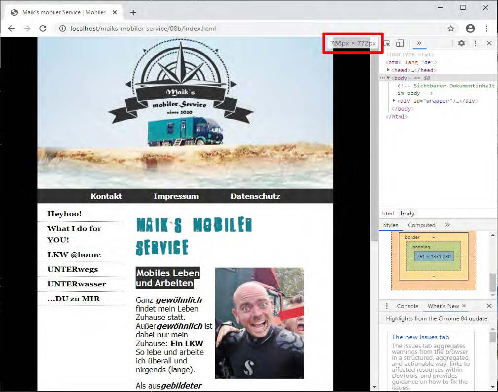

---
- Tabletversion ab ca. 1024 Pixel
- Austausch des Headerbildes, Verschieben der horizontalen Navigation

```css
@media screen and (min-width: 1024px) {
header {
background:url(img/header.jpg) no-repeat;
min-height: 368px;
}
#navihor {
margin-top: 368px; }}
```

---
<!-- _class: fullscreen -->

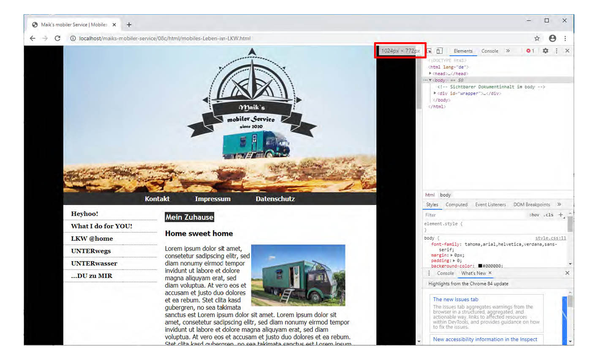

---
<!-- _class: twocolumns -->
- zurück zum Desktop ab 1200 px
- Den mobile-Container blenden wir aus.
- Dem Header geben wir noch etwas mehr Luft.
- Die Hauptnavigation im aside Container erhält eine feste Breite, damit die Navigation nicht zu breit wird.
- Daher können wir den main-Container jetzt wieder etwas breiter machen.
- So passt auch wieder etwas mehr Text hinein.
- Die Bilder dürfen dafür wieder etwas kleiner sein.

```css

@media screen and (min-width: 1200px) {
#h1container-desktop {
display: block;
}
#h1container-mobile {
display: none;}
#navihor {
margin-top: 320px;}
aside {
width: 220px;}
main {
width: 70%;
margin-left: 25%;}
p {
max-width: 75ch; }
.bildImFliesstext {
width: 30%;}}
```
---
<!-- _class: fullscreen -->


---
<!--_class: structural -->
## KI Workflows (Future of Development)

> Und das muss ich alles tippen?

**KI-gestützte Webentwicklung** transformiert den Prozess
von einem handwerklichen Schreiben von Code zu einer
**orchestrierten Systemintegration**, bei der Entwickler
als Dirigenten agieren, die KI-Modelle steuern und
deren Ergebnisse validieren.

---

### Handwerkliche Kodierung (Status Quo):
Softwareentwicklung als zeilenweises Schreiben von Syntax;
Fokus auf Implementierungsdetails und das Beheben von Syntax fehlern.

### KI-gestützte Orchestrierung (Zukunft):
Der Entwickler agiert als „Dirigent“ (Orchestrator), der Anforderungen definiert, KI-Modelle steuert und deren Ergebnisse validiert.

### Kernkompetenz:
Die Fähigkeit zur präzisen Problemformulierung und Systemintegration ersetzt das reine Auswendiglernen von Programmiersprachen.

---
## Spec-Driven Development (SDD)

### Die neue Ära des Workflows

Workflow-Zyklus: Specify → Plan → Tasks → Implement. Der Prozess beginnt bei der Spezifikation, nicht beim Code.

Verschiebung der Wertschöpfung: Produktivitätssprünge durch automatisiertes Scaffolding (Grundgerüst-Erstellung) von HTML, CSS und JS.

Menschliche Rolle: Der Entwickler fungiert als „Digital Shepherd“ (Hirte), der die Qualität, Sicherheit und Semantik des KI-Outputs überwacht.


---
## KI-native Entwicklungsumgebungen
### Vom Texteditor zur intelligenten Plattform

### Werkzeugwechsel:
Übergang von klassischen Editoren (wie Notepad++) zu KI-nativen Umgebungen (z. B. Cursor, Antigravity oder GitHub Copilot etc.), die Kontext über das gesamte Projekt verstehen.

### Kontextbewusstsein:
Nutzung von agentischen Regeln und ähnlichen Konfigurationen, um der KI projekt-spezifische Architekturregeln beizubringen.

### Echtzeit-Refactoring:
KI-gestützte Identifikation von „Code Smells“ und automatische Optimierung auf moderne Standards.

---
<!-- _class: structural -->
## Eine Unterseite mit KI erstellen (09)

Nun wollen wir auf Basis der index html in möglichst kurzer Zeit eine Unterseite erstellen, die "HomeSweetHome" heißt.
Statt manuell Texte zu kopieren und html-Tags zu schreiben, soll die KI das für uns erledigen!

---

 Kopieren sie nun folgende Dateien in den img-Ordner:
- dasBuero.jpg
- dasFuehrerHaus.jpg
- dieGarage.jpg
- dieSanitaerenAnlagen.jpg
- dieWerkstatt.jpg
- maiksLKWaussen.jpg
- willkommenInDerKueche.jpg
- wohnenUndSchlafen.jpg
- und den gesamten Ordner "1600"!

---
### Antigravity, VS-Code mit Copilot oder Cursor

Installiert / wählt  ein Tool Eurer Wahl und meldet Euch entsprechend an:
- Cursor
https://cursor.com/de/home
- Antigravity IDE
https://antigravity.google/product/antigravity-ide
- VS-Code mit Copilot
https://github.com/features/copilot


Meine Wahl ist Antigravity, da ich ein registriertes Google-Konto mit Altersbestätigung besitze.

---
### Arbeiten in Antigravity
Öffnet Euch in Antigravity doch mal den Projektordner (09)
Analysiert die Projektstruktur
und die Tools der Software:
- Explorer
- Inhaltsfenster
- Agent


---
<!-- _class: fullscreen -->


---


Erstellt nun einen detaillierten Prompt,
oder kopiert den Prompt aus meiner
Datei prompt.txt (im Materialordner)
in das "Agent-Fenster" von Antigravity.

> Lest Euch Euren Prompt mehrmals durch!


---
> Dann: Feuer frei!

Allow read access to this path? (mehrfach)
Allow running this command?
Accept all

---
<!-- _class: fullscreen -->


---

<!-- _class: structural -->
> Fertig ist die Unterseite!

Überprüfen der Inhalte
Testen der Verlinkungen
Lesen der Inhalte


---
### Sub-Navigation

Die Seite ist nun serh lang geworden. Wir müssen die Inhalte der Unterseite also über eine Sub-Navigation anspringen können.

Erstellt Euch dafür einen Prompt:

"Erstelle im main-Bereich eine Liste mit einer Subnavigation.
Die Liste soll gut lesbarer Text in schwarz auf weißem Grund sein und den style der Klasse "subnavi" in der "style.css" haben. Die Texte sollen keinen List-Style haben, sondern stattdessen mit schwarz-gepunkteten Linien horizontal abgegrenzt werden.
Jeder Punkt der Subnavi soll dann einen entsprechenden Anchor der h2-Überschriften in den Articlen anspringen. Erstelle unter jedem Article einen Link "nach oben" zur Subnavigation. Der Inhalt der Navigation sollen die h2-Überschriften der einzelnen Article sein."

---
<!-- _class: fullscreen-->


---
<!-- _class: structural-->
## KI ist geil?

Erstellt Euch mit eigenen Bildern, Texten und Beispielen aus dem Internet eine eigene Webseite.
Gebt der KI ausreichend Content und die passenden Prompts.
- Beispielseiten
- Bilder
- eigenen Texte (auch KI-generiert)
- Responsive-Design
- mobile-fähig und barrierefrei
- ...

---

Denkt daran: 
> "Computer machen uns nicht arbeitslos, aber sie verändern unseren Arbeitsalltag stark. Neue Technik nimmt uns viele schwere oder langweilige Aufgaben ab."

Zitat von Bill Gates


---

---
<!-- _class: structural -->

## Javascript Grundlagen

> Wenn html das Grundgerüst und css das Design ist, dann ist Javascript das was Leben einhaucht!

---
<!-- _class: structural-->
### Einführung & Moderne Sprachgrundlagen
**Übersicht:**
- Woher kommt JavaScript
- Was javascript (nicht) kann
- Sicherheit
- ECMAscript 
- Entwicklertools

---

#### Woher kommt JavaScript?

- Erfunden 1995 von "Netscape"
- später später mit ECMA
(European Computer Manufacturers Association) weiter entwickelt
- Javascript ist nicht gleich Java!

---
#### Was Javascript kann
- kann komplette Anwendungen entwickeln
- kann grafische Objekte manipulieren und animieren
- kann Elemente dynamisieren
- kann Daten zwischen Browser und Webserver austauschen,
ohne dass Seite neu geladen werden muss
- kann Daten auf dem Client speichern
- kann lokalisierte Informationen anzeigen
- kann Daten des Clientrechners auswerten und  Seiten und Inhalte an die Gegebenheiten des Besuchers anpassen

---
#### Was Javascript nicht kann
- keine Datenbank abfragen
- keine Dateien auf dem Server speichern oder organisieren
- kann keine Programme auf dem Server ausführen
- kann keine Informationen aus anderen Webseiten abrufen, da diese mit CORS-Mechanismen geschützt sein können.
- kann Standardmäßig nicht direkt auf das Dateisystem des Computers zugreifen (aus Sicherheitsgründen)
- kann nicht direkt auf die Hardware des Computers zugreifen (aus Sicherheitsgründen)

---
#### Javascript und Sicherheit

Früher war Javascript ein Sicherheitsrisiko.
Heute ist es das nicht mehr. Die Programmiersprache
wird von den Herstellern der Browser stark reglementiert.

> Javascript läuft also nur im "Sandkasten" (Sandbox) des Browsers!

---
#### ECMAScript vs. JavaScript-Engines
- **ECMAScript (ES):** Der offizielle **Bauplan** (Standard & Spezifikation)
  - Legt Regeln, Syntax und neue Features fest (z. B. ES6, `const`/`let`, Arrow Functions).
  - Sagt, *wie* JavaScript geschrieben werden muss.
- **JS-Engine:** Der **Motor** (die Software im Browser)
  - Liest den JavaScript-Code und übersetzt ihn in Maschinencode (Ausführung).
  - Setzt den ECMAScript-Bauplan in der Praxis um.
- **Die bekanntesten Engines:**
  - **V8:** Google Chrome, Node.js, Microsoft Edge, Brave
  - **JavaScriptCore (Nitro):** Apple Safari (iOS / macOS)
  - **SpiderMonkey:** Mozilla Firefox

---

ECMAScript ist das **Rezept**,
die JS-Engine ist der **Koch**,
der das **Gericht** zubereitet!

> Javascript wird  zur Laufzeit von der JS-Engine des Browsers übersetzt, interpretiert und ausgeführt.

---
#### Entwicklertools & Debugging

Entwicklertools der Browser (Console, Sources, Debugging)


- **Überblick:** Alle modernen Browser (Chrome, Firefox, Edge, Safari) bieten integrierte Entwicklerwerkzeuge (DevTools).
- **Zugriff:** Taste `F12` oder `Rechtsklick -> Element untersuchen`.
- **Die wichtigsten Tabs:**
  - **Console:** Interaktives Terminal für JS-Befehle, Fehlermeldungen & Ausgaben (`console.log()`, `console.error()`).
  - **Sources:** Einsicht in geladene `.js`-Dateien, Quellcode-Inspektion & Breakpoints.
  - **Network:** Überwachung aller Netzwerkanfragen (z. B. API-Aufrufe/Fetch).


---

> Die DevTools sind das Röntgengerät des Webentwicklers – sie machen die unsichtbare Laufzeit im Browser sichtbar!

---
#### Breakpoint-Debugging: Code anhalten & untersuchen
- **Warum Breakpoints statt nur `console.log()`?**
  - `console.log()` vermüllt den Code und zeigt nur statische Momentaufnahmen.
  - Breakpoints halten das Programm zur Laufzeit in der JS-Engine an!
- **Workflow im Sources-Tab:**
  1. Klick auf die Zeilennummer im Code setzt einen **Breakpoint**.
  2. Die Ausführung stoppt sofort, wenn die Zeile erreicht wird.
  3. **Scope & Inspector:** Live-Einsicht in alle aktuellen Variablenwerte und den Aufrufstapel (Call Stack).
- **Steuerung im Debugger:**
  - **Step Over ($F10$):** Zur nächsten Zeile springen.
  - **Step Into ($F11$):** In die Funktionsausführung hineinspringen.
  - **Resume ($F8$):** Normale Programmausführung fortsetzen.

---
#### Das `debugger;`-Statement & Konsole-Fehler verstehen
- **Code-Stopp per Befehl:**
  - Das Statement `debugger;` im JS-Code wirkt wie ein fest eingebauter Breakpoint (sofern die DevTools geöffnet sind).
- **Die 3 häufigsten JS-Fehler in der Console lesen:**
  - **ReferenceError:** Variable ist nicht deklariert oder falsch geschrieben (`x is not defined`).
  - **TypeError:** Zugriff/Methode auf `null` oder `undefined` (`Cannot read properties of undefined`).
  - **SyntaxError:** Code verstößt gegen die Syntaxregeln (z. B. fehlende Klammer `)`).

> **Praxis-Tipp:** Ein Klick auf die Zeilennummer rechts neben der Fehlermeldung in der Konsole springt direkt zur Fehlerquelle im Sources-Tab!

---
#### Praxis-Beispiel zum Nachbasteln: Bug-Hunting
```html
<button id="calcBtn">Summe berechnen</button>
<p id="result"></p>

<script>
  function berechneSumme(a, b) {
    debugger; // Stoppt automatisch bei geöffneten DevTools!
    return a + b;
  }
  document.getElementById("calcBtn").addEventListener("click", () => {
    let eingabeA = "5"; // Achtung: Wert aus Input-Feld ist ein String!
    let eingabeB = 10;
    let summe = berechneSumme(eingabeA, eingabeB);
    document.getElementById("result").innerText = "Ergebnis: " + summe;
  });
</script>
```

---
#### Schritt-für-Schritt: Vorgehensweise beim Debuggen
- **1. DevTools öffnen:** Seite laden und `F12` (oder `Rechtsklick -> Untersuchen`) drücken.
- **2. Aktion ausführen:** Klick auf den Button "Summe berechnen".
  - 🛑 Browser stoppt automatisch bei `debugger;` in der Funktion `berechneSumme()`.
- **3. Variablen inspizieren (Sources-Tab -> Scope):**
  - Fahre mit der Maus über `a` und `b` oder prüfe das **Scope-Panel**.
  - Erkenne den Typ: `a = "5"` (String) vs. `b = 10` (Number).
- **4. Fehlerursache:** `a + b` führt wegen String-Konkatenation zu `"510"` statt `15`.
- **5. Live-Fix in der Console testen:** In der Konsole `Number(a) + b` ausführen -> `15`.

---
<!-- _class: fullscreen-->

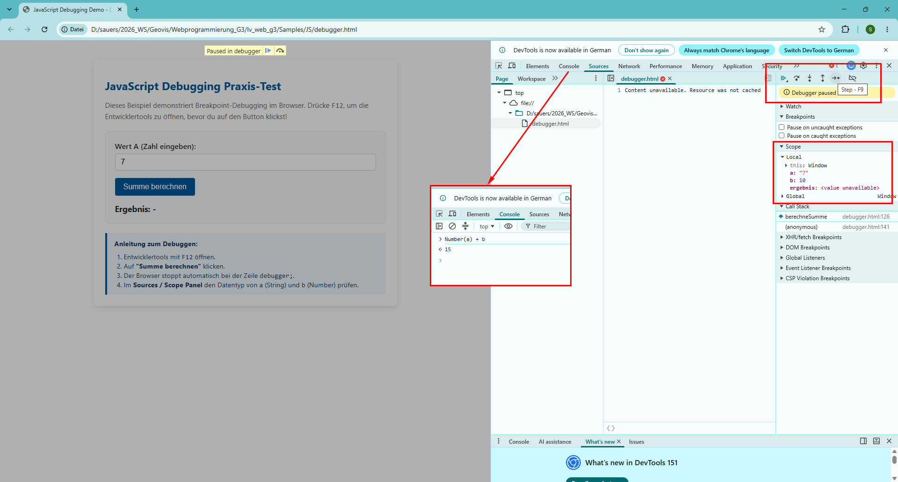


---
#### Der didaktische Debugging-Workflow
- **1. Konsole prüfen:** Gibt es rote Fehlermeldungen (z. B. `TypeError`)?
- **2. Breakpoint setzen:** Zeilennummer im *Sources-Tab* anklicken oder `debugger;` einbauen.
- **3. Variablenzustand durchleuchten:** Werte im *Scope*-Fenster zur Laufzeit analysieren.
- **4. Code Schritt für Schritt ausführen:** Mit $F10$ (Step Over) den Ablauf kontrollieren.
- **5. Fehler beheben:** Typumwandlung ergänzen (`Number(...)`) & Code korrigieren.

>Debuggen ist systematische Hypothesenprüfung – nicht Raten!

---
### Einbindung von Javascript

Saubere Einbindung im HTML: <script defer> und ES-Module (type="module")
- **Drei Wege zur Einbindung:** Inline (veraltet), Intern (`<script>`), Extern (`<script src="...">`).

---
#### Die 3 Arten der JavaScript-Einbindung

1. **Inline-Event-Handler (Veraltet / No-Go):**
   - `<button onclick="alert('Hallo!')">Klick</button>`
   - ❌ Vermischt HTML & Logik, schwer wartbar, Sicherheitsrisiken.
2. **Internes Skript (`<script>`-Tag im HTML):**
   - `<script> console.log("Hallo Welt"); </script>`
   - ✅ Gut für kleine Test-Skripte & Demos. ❌ Nicht wiederverwendbar.
3. **Externes Skript (Standard & Best Practice):**
   - `<script src="app.js"></script>`
   - ✅ **Saubere Trennung**, Browser-Caching, wiederverwendbar.

---
#### Vergleich: Vor- und Nachteile der Einbindung

| Methode | Beispiel | Vorteile | Nachteile |
| :--- | :--- | :--- | :--- |
| **Inline** *(veraltet)* | `onclick="..."` | Schnell für 1-Zeiler | Vermischt HTML & JS, kein Caching, Sicherheitsrisiko |
| **Intern** | `<script>...</script>` | Kein Extra-HTTP-Request | Kein Caching für JS, macht HTML unübersichtlich |
| **Extern** *(Standard)* | `<script src="..."></script>` | **Wiederverwendbar**, **Browser-Caching**, saubere Struktur | Benötigt Netzwerk-Request (gecached) |

---

 **Grundregel:**
Trenne immer:
- Inhalt (HTML)
- Layout (CSS)
- Verhalten (JS)

**Hinweis:**
Veraltete Attribute wie **language="javascript"**
werden nicht mehr genutzt.

---
### Ladeverhalten optimieren: Das `defer`-Attribut

- **Klassisches Verhalten (ohne Attribut):**
  - Skript lädt & führt sofort aus -> **blockiert das Parsen des HTML-DOMs**.
- **Die moderne Lösung: `<script defer src="app.js">`**
  - **`defer` (Aufschieben):** Lädt das Skript im Hintergrund herunter.
  - Ausführung erfolgt **erst, nachdem das HTML vollständig aufgebaut (geparst) ist**.
  - Garantiert die korrekte Ausführungsreihenfolge mehrerer Skripte.
- **Unterschied zu `async`:**
  - `async` führt das Skript sofort nach dem Download aus (gut für unabhängige Analyse-Tools).

---

> **Best Practice:**
Platziere externe Skripte im <head> und nutze immer defer!

---
### Modern & Modular: ES-Module (`type="module"`)

- **Einbindung:**
  - `<script type="module" src="app.js"></script>`
- **Die wichtigsten Eigenschaften von ES-Modulen:**
  - **`import` & `export`:** Code lässt sich in wiederverwendbare Dateien aufteilen.
  - **Automatisches `defer`:** Modul-Skripte werden standardmäßig aufschiebend geladen.
  - **Eigener Scope:** Variablen verschmutzen nicht den globalen `window`-Namensraum.
  - **Strict Mode:** Läuft automatisch im modernen `"use strict"`-Modus.

```javascript
// math.js (Funktion exportieren)
export function summe(a, b) { return a + b; }

// app.js (Funktion importieren & nutzen)
import { summe } from './math.js';
```


---
### Praxis-Beispiel: Modularer Code (`calculator.js`)

```javascript
// calculator.js (Hilfsmodul)

// Privat: Nicht exportiert -> Von außen unsichtbar!
function formatierErgebnis(wert) {
    return `[Ergebnis: ${wert}]`;
}

// Öffentlich: Durch 'export' für andere Dateien verfügbar
export function addieren(a, b) {
    return formatierErgebnis(Number(a) + Number(b));
}

export function subtrahieren(a, b) {
    return formatierErgebnis(Number(a) - Number(b));
}
```

---

### Hauptskript & HTML-Einbindung (`main.js` & HTML)

```javascript
// main.js (Hauptprogramm)
import { addieren, subtrahieren } from './calculator.js';

document.getElementById('addBtn').addEventListener('click', () => {
    const valA = document.getElementById('numA').value;
    const valB = document.getElementById('numB').value;
    document.getElementById('output').innerText = addieren(valA, valB);
});
```

```html
<!-- HTML-Einbindung: type="module" aktiviert import/export -->
<script type="module" src="main.js"></script>
```

---
### Wichtige Stolperfallen bei ES-Modulen

- **1. Pfadangabe beim Import:**
  - ❌ `import { addieren } from 'calculator.js';` *(Fehler im Browser!)*
  - ✅ `import { addieren } from './calculator.js';` *(Relativer Pfad mit `./` Pflicht!)*
- **2. Browser-Sicherheitsregel (CORS / `file://`):**
  - Öffnen per Doppelklick (`file:///...`) wird aus Sicherheitsgründen blockiert.
  - **Lösung:** Ausführung über lokalen Server (z. B. VS Code Extension *Live Server*).

> **Beispiel zum Ausprobieren:** Liegt spielfertig unter `Samples/JS/modules-demo.html`.

---
<!-- _class: structural-->
## Variablen und Datentypen

**Übersicht:**
- Variablendeklaration (`const`, `let`)
- 7 primitive Typen
- strikte Vergleiche (`===`).

---
### Variablen deklarieren: `const` vs. `let` (vs. `var`)

- **`const` (Standard):**
  - Für Variablen, deren Referenz **nicht verändert** wird.
  - Verhindert unbeabsichtigtes Überschreiben (`const pi = 3.14159;`).
- **`let` (Veränderlich):**
  - Für Variablen, deren Wert sich **später ändert** (z. B. Zähler in Schleifen).
  - Gültig nur im jeweiligen Code-Block (*Block Scope* `{ ... }`).
- **❌ Entfall: Kein `var` mehr nutzen!**
  - `var` hat keinen Block-Scope und leidet unter *Hoisting* (Hochziehen von Variablen). Führt in der Praxis zu schwer auffindbaren Bugs.

---
### Was ist Hoisting ("Hochziehen")?

Die JS-Engine zieht Deklarationen vor der Ausführung gedanklich an den Anfang des Scopes:

- **`var` (Gefährlich):**
  - Deklaration wird hochgezogen, Zuweisung bleibt stehen
  ➔ Zugriff vor Zeile ergibt `undefined` (kein Fehler!).
- **`let` & `const` (Sicher):**
  - Liegen vor der Zuweisungszeile in der **Temporal Dead Zone (TDZ)**
  ➔ Zugriff erzeugt einen sauberen `ReferenceError`.
- **`function` (Bequem):**
  - Werden komplett hochgezogen ➔ Können im Code auch oberhalb ihrer Definition aufgerufen werden.

```javascript
console.log(a); // undefined (mit var)
var a = 5;

console.log(b); // ReferenceError: Cannot access 'b' before initialization
let b = 10;
```

---

> **Regel:** Nutze immer *const*. Erst wenn der Wert neu zugewiesen werden muss, ändere es zu *let*!

Weitere Informationen unter:
https://www.cancode.de/blog-article/die-eigenheiten-von-var-let-und-const-in-javascript


---
### Die 7 primitiven Datentypen in JavaScript

Primitive Daten sind **unveränderlich** (*immutable*) und werden direkt als Wert gespeichert:

1. **`string`**: Textdaten (`"Hallo"`, `'Welt'`)
2. **`number`**: Zahlen & Kommazahlen (`42`, `3.14`, `NaN`)
3. **`boolean`**: Wahrheitswerte (`true` / `false`)
4. **`undefined`**: Variable deklariert, aber noch kein Wert zugewiesen (`let x;`)
5. **`null`**: Bewusste Abwesenheit eines Werts (`const daten = null;`)
6. **`bigint`**: Beliebig große Ganzzahlen (`9007199254740991n`)
7. **`symbol`**: Eindeutiger Identifikator (`Symbol("id")`)

Typprüfung im Code mit dem Operator `typeof` (z. B. `typeof "Hallo"` ➔ `"string"`).

---
### Vergleiche: Strikte (`===`) vs. Lose (`==`) Gleichheit

- **Lose Gleichheit (`==`): Gefährlich!**
  - Führt eine **automatische Typkonvertierung** (*Type Coercion*) durch.
  - `"5" == 5` ➔ `true` | `0 == false` ➔ `true` | `"" == 0` ➔ `true`
- **Strikte Gleichheit (`===`): Best Practice!**
  - Vergleicht **Wert UND Datentyp** (ohne implizite Typumwandlung).
  - `"5" === 5` ➔ `false` *(String vs. Number)*
  - `5 === 5` ➔ `true`

> **Merksatz:** Verwende in JavaScript immer `===` und `!==`, um unerwartete Typ-Bugs zu vermeiden!

---
### Praxis-Check: Datentypen & Vergleiche in der Konsole

```javascript
const name = "Anna";   // String
let alter = 22;        // Number
let istStudent = true; // Boolean

console.log(typeof name);  // "string"
console.log(typeof alter); // "number"

// Vergleichstest:
console.log("22" == alter);  // true  (Lose Gleichheit -> Typumwandlung!)
console.log("22" === alter); // false (Strikte Gleichheit -> Sicherer Standard!)
```

> **Sonderfall / Kuriosität:** `typeof null` gibt historisch bedingt `"object"` zurück (bekannter JS-Bug seit 1995).

---
### String-Verarbeitung & Template Literals

Strings erstellen und verarbeiten (Eigenschaften & Methoden)

 **Übersicht:**
 -Nützliche String-Methoden
 - Template Literals (Backticks)
 - mehrzeilige Strings.

---
### Strings verarbeiten: Wichtige Eigenschaften & Methoden

Strings sind Zeichenketten mit vielen eingebauten Hilfsmitteln:

- **`text.length`**: Anzahl der Zeichen im String (`"Hallo".length` ➔ `5`).
- **`text.toUpperCase()` / `.toLowerCase()`**: Wandelt den Text um (`"hi".toUpperCase()` ➔ `"HI"`).
- **`text.includes("web")`**: Prüft, ob ein Teiltext enthalten ist (liefert `true` / `false`).
- **`text.trim()`**: Entfernt Leerzeichen am Anfang und Ende.
- **`text.slice(0, 4)`**: Schneidet einen Teilstring heraus (`"JavaScript".slice(0, 4)` ➔ `"Java"`).

---
### Template Literals: Die Macht der Backticks (`` ` ``)

Mit Backticks (`` `...` ``) werden Strings dynamisch und lesbar:

- **String-Interpolation (`${...}`):**
  - Bette Variablen & Ausdrücke direkt im Text ein: `` `Preis: ${preis * 1.19} €` ``.
- **Mehrzeilige Strings (Multiline):**
  - Zeilenumbrüche können direkt im Code getippt werden (kein `\n` erforderlich!).

```javascript
const name = "Alex";
const punkte = 42;

// Dynamisch & Mehrzeilig:
const nachricht = `Hallo ${name},
willkommen zurück! 
Deine Punkte: ${punkte}`;
```

---
### Vorher vs. Nachher: `+`-Konkatenation vs. Backticks

- ❌ **Veraltet (unübersichtliche `+`-Verknüpfung):**
  ```javascript
  const info = "User: " + vorname + " " + namename + " (" + alter + " Jahre)";
  ```
- ✅ **Modern & Sauber (Template Literals):**
  ```javascript
  const info = `User: ${vorname} ${namename} (${alter} Jahre)`;
  ```

> **Regel:** Nutze für jeden zusammengesetzten oder mehrzeiligen Text immer Template Literals (Backticks)!

---
<!-- _class: structural-->
## Kontrollstrukturen, Funktionen & Scope

### Kontrollstrukturen & Entscheidungen

**Übersicht:**
- Verzweigungen (`if/else`)
- Mehrfachauswahl (`switch/case`)
- ternärer Operator (`? :`).

---
### Verzweigungen: `if`, `else if` und `else`

Steuere den Programmfluss basierend auf Wahrheitswerten (`true` / `false`):

```javascript
const alter = 18;

if (alter >= 18) {
    console.log("Volljährig: Zutritt gestattet.");
} else if (alter >= 16) {
    console.log("Zutritt in Begleitung gestattet.");
} else {
    console.log("Kein Zutritt.");
}
```

- **Ablauf:** Bedingungen werden sequenziell von oben nach unten geprüft.
- **Logik:** Sobald eine Bedingung `true` ergibt, wird dieser Block ausgeführt und der Rest übersprungen.

---
### Mehrfachauswahl: `switch` / `case`

Ideal, wenn eine einzelne Variable auf **mehrere konkrete Werte** geprüft werden soll:

```javascript
const rolle = "admin";

switch (rolle) {
    case "admin":
        console.log("Vollzugriff gewährt.");
        break; // Verhindert das Durchfallen in den nächsten Case!
    case "editor":
        console.log("Inhalte bearbeiten erlaubt.");
        break;
    default:
        console.log("Standard: Nur Lesezugriff.");
}
```

> **Wichtig:** Ohne *break*; führt JS automatisch die darunterliegenden *case*-Blöcke aus (*Fallthrough*).

---
### Der Ternäre Operator (*Bedingung ? Wert1 : Wert2*)

Kompakte Kurzschreibweise für einfache `if / else`-Entscheidungen, die einen Wert zurückliefern:

```javascript
const alter = 20;

// Klassisch (if / else):
let statusText;
if (alter >= 18) { statusText = "Erwachsen"; } else { statusText = "Minderjährig"; }

// Elegant mit Ternärem Operator:
const statusText = alter >= 18 ? "Erwachsen" : "Minderjährig";
```

> **Best Practice:** Nutze den ternären Operator für prägnante Einzeiler. Vermeide Schachtelungen!

---
### Praxis-Beispiel: Kombination aller 3 Entscheidungen

```javascript
// 1. IF / ELSE IF / ELSE: Bereichsprüfung (Alter)
if (alter < 6) { basispreis = 0; }
else if (alter < 18) { basispreis = 8.00; } // Ermäßigt
else { basispreis = 12.00; }               // Standard

// 2. SWITCH / CASE: Exakter Abgleich (Wochentag)
switch (tag) {
    case "Dienstag": endpreis = basispreis * 0.8; break; // Kinotag
    case "Mittwoch": endpreis = basispreis - 2.0; break; // Studententag
    default: endpreis = basispreis; break;
}

// 3. TERNÄRER OPERATOR: Einzeiler für Statusmeldung
const seatText = isVip ? "VIP-Lounge (+ 5 €)" : "Standard-Platz";
```

---
### Entscheidungs-Matrix: Wann nutzt man was?

| Kontrollstruktur | Ideal für... | Beispiel-Usecase |
| :--- | :--- | :--- |
| **`if / else`** | **Bereichstests** (`<`, `>`, `>=`) & komplexe Bedingungen (`&&`, `\|\|`) | Altersprüfungen, Notenberechnung |
| **`switch / case`** | **Exakte Wertabgleiche** einer Variable bei vielen Alternativen | Wochentage, Benutzerrollen, Menüauswahl |
| **Ternär (`? :`)** | **Kompakte Zuweisungen** auf Basis einer Ja/Nein-Frage | Status-Texte, Standardwerte setzen |

**Beispiel zum Ausprobieren:**
Liegt spielfertig unter
 `Samples/JS/decisions-demo.html`.

---
## Schleifen & moderne Iteration

**Klassische Schleifen:**
- for
- while
- do-while

**Moderne Iteration:**
- for...of für Werte
- for...in für Objekteigenschaften

---
### Klassische Schleifen: `for`, `while` & `do-while`

- **Zählschleife (`for`):** Bekannte Anzahl an Durchläufen.
  ```javascript
  for (let i = 0; i < 3; i++) {
      console.log(`Durchlauf: ${i}`); // 0, 1, 2
  }
  ```
- **Kopfgesteuerte Schleife (`while`):** Prüft Bedingung **vor** dem Durchlauf.
  ```javascript
  let countdown = 3;
  while (countdown > 0) { console.log(countdown--); }
  ```
- **Fußgesteuerte Schleife (`do...while`):** Wird **mindestens 1-mal** ausgeführt (Prüfung danach).
  ```javascript
  let eingabe;
  do { eingabe = "ja"; } while (eingabe !== "ja");
  ```

---
### Moderne Iteration: `for...of` vs. `for...in`

- **`for...of` (Für Werte in Arrays / Iterables):**
  - Iteriert direkt über die **Elemente** (sauber & ohne Index-Stress).
  ```javascript
  const staedte = ["Würzburg", "Nürnberg", "München"];
  for (const stadt of staedte) {
      console.log(stadt); // "Würzburg", "Nürnberg", ...
  }
  ```
- **`for...in` (Für Schlüssel / Objekteigenschaften):**
  - Iteriert über die **Keys** eines Objekts.
  ```javascript
  const user = { name: "Anna", rolle: "Admin" };
  for (const key in user) {
      console.log(`${key}: ${user[key]}`); // "name: Anna", ...
  }
  ```
---
> **Faustregel:** *for...of* für Arrays (Werte),
*for...in* für Objekte (Keys)!

---
### Schleifensteuerung: `break` & `continue`

Steuere den Ablauf innerhalb einer laufenden Schleife gezielt:

- **`break` (Sofortiger Abbruch):**
  - Beendet die Schleife komplett und springt dahinter.
  ```javascript
  for (let i = 1; i <= 10; i++) {
      if (i === 4) break; // Stoppt die Schleife bei 4!
      console.log(i); // Gibt 1, 2, 3 aus
  }
  ```
- **`continue` (Überspringen des aktuellen Durchlaufs):**
  - Bricht nur den aktuellen Durchgang ab und springt zum nächsten.
  ```javascript
  for (let i = 1; i <= 4; i++) {
      if (i === 3) continue; // Überspringt nur die 3!
      console.log(i); // Gibt 1, 2, 4 aus
  }
  ```

---
### Übersicht & Best Practices der Iteration

| Schleife | Liest... | Haupt-Anwendungsfall |
| :--- | :--- | :--- |
| **`for`** | Index (`i++`) | Feste Anzahl / komplexe Zählschritte |
| **`while`** | Bedingung (`true`) | Warten auf Ereignis / dynamischer Zustand |
| **`for...of`** *(Standard)* | **Werte** | **Arrays & Kollektionen** durchlaufen |
| **`for...in`** | **Keys (Schlüssel)** | **Objekt-Eigenschaften** inspizieren |

> **Best Practice:** Nutze in modernem JavaScript für Arrays fast immer *for...of* – das vermeidet Typfehler und ist am lesbarsten.

---
### Praxis-Check: Schleifen & Iteration im Einsatz

- **Ausführbare Demodatei:** `Samples/JS/loops-demo.html`
- **Interaktiver Test im Browser:**
  1. **`for...of`:** Liest Werte eines Arrays direkt aus (`const frucht of fruechte`).
  2. **`for...in`:** Inspiziert Schlüssel-Wert-Paare eines Objekts (`const key in produkt`).
  3. **`while`:** Zählt einen Lagerbestand herunter, solange er größer als `0` ist.
  4. **`break` & `continue`:** Demonstriert das Überspringen (`continue`) und den Abbruch (`break`).

**Ausprobieren:**
Öffne *Samples/JS/loops-demo.html* im Browser und teste die Buttons mit Live-Konsolenausgabe!
Code und dessen Funktion lesen und verstehen.

---
<!-- _class: structural-->
## Funktionen & Arrow Functions

**Übersicht:**
- Deklarationen vs. Arrow Functions
- Default- & Rest-Parameter
- Scope & Closures.

---
### Function Declaration vs. Function Expression

- **Function Declaration (Klassische Funktion):**
  - Wird per *Hoisting* an den Anfang des Scopes gezogen -> vor ihrer Deklaration aufrufbar.
 ```javascript
  function gruss(name) {
      return `Hallo ${name}!`;
  }
  ```
- **Function Expression (Funktionsausdruck):**
  - Funktion wird in einer Variable gespeichert -> erst **ab der Zuweisung** aufrufbar.
```javascript
  const gruss = function(name) {
      return `Hallo ${name}!`;
  };
  ```

---

> **Unterschied:**
Declarations sind global/funktional verfügbar
Expressions folgen den normalen Variablen-Regeln (*const*).

---
### Modern & Kompakt: Arrow Functions (`=>`)

Die prägnanteste Schreibweise für Funktionen in modernem JavaScript:

```javascript
// Standard-Schreibweise:
const quadrat = (x) => { return x * x; };

// Kurzschreibweise (Impliziter Return bei Einzeilern):
const quadrat = x => x * x;
```

- **Die 3 Kern-Merkmale von Arrow Functions:**
  1. **Kompakte Syntax:** Kein `function`-Keyword erforderlich.
  2. **Implizites `return`:** Bei einzeiligen Ausdrücken ohne geschweifte Klammern `{}`.
  3. **Lexikalisches `this`:** Erbt das `this` aus dem umgebenden Kontext (ideal für Event-Handler).

---
### Standard-Parameter & Rest-Parameter (`...args`)

- **Standard-Parameter (Default Parameters):**
  - Beugt `undefined`-Fehlern vor, indem Standardwerte hinterlegt werden.
```javascript
  function erstelleUser(name = "Anonym", rolle = "Gast") {
      return `${name} (${rolle})`;
  }
  ```
- **Rest-Parameter (`...args` statt veraltetem `arguments`):**
  - Bündelt beliebig viele Argumente in ein **echtes Array**.
```javascript
  function summiere(...zahlen) {
      return zahlen.reduce((summe, n) => summe + n, 0);
  }
  summiere(5, 10, 15); // 30
  ```

---
### Scope, Lexical Environment & Closures

- **Global Scope vs. Block Scope:**
  - `const` / `let` sind streng im umschließenden Block `{ ... }` geschützt.
- **Was ist eine Closure (Funktionsabschluss)?**
  - Eine innere Funktion hat Zugriff auf Variablen ihres **äußeren Entstehungs-Scopes** – selbst nachdem die äußere Funktion beendet ist!

```javascript
function erstelleZaehler() {
    let count = 0; // Kapselung im Scope der Closure
    return () => ++count;
}

const zaehler = erstelleZaehler();
console.log(zaehler()); // 1
console.log(zaehler()); // 2
```

---
### Vergleich & Best Practices für Funktionen

| Merkmal | Function Declaration | Arrow Function (`=>`) |
| :--- | :--- | :--- |
| **Syntax** | `function name() {}` | `const name = () => {}` |
| **Hoisting** | ✅ Ja (überall aufrufbar) | ❌ Nein (erst nach Zeile verfügbar) |
| **`this`-Bindung** | Dynamisch (hängt vom Aufrufer ab) | Lexikalisch (erbt vom Umfeld) |
| **Impliziter Return** | ❌ Nein (benötigt `return`) | ✅ Ja (bei Einzeiler ohne `{}`) |

> **Best Practice:** Nutze **Arrow Functions** für Helper, Array-Methoden & Event-Handler. Nutze **Function Declarations** für zentrale Skript-Funktionen.

---
### Praxis-Check: Funktionen & Arrow Functions im Einsatz

- **Ausführbare Demodatei:** `Samples/JS/functions-demo.html`
- **Gezeigte Funktions-Konzepte:**
  1. **Default-Parameter:** `formatierPreis(betrag, waehrung = "€")` schützt vor `undefined`.
  2. **Rest-Parameter:** `berechneSumme(...preise)` fasst beliebige Werte in ein Array zusammen.
  3. **Arrow Functions (`=>`):** Implizite Rückgabe bei `.map(brutto => (brutto / 1.19).toFixed(2))`.
  4. **Closures:** `erstelleWarenkorbTracker()` kapselt den Zählerstand privat im Scope.

> **Ausprobieren:** Öffne `Samples/JS/functions-demo.html` im Browser und teste die Interaktionen!

---
<!-- _class: structural-->

## Komplexe Datenstrukturen (Objekte & Arrays)
**Übersicht:**
- Moderne Objektorientierung mit `class`
- Schlüssel-Wert-Speicher: Objekte & JSON-Notation
- Moderne Array-Methoden
- Destructuring & Spread-Operator

---
### Objekte & JSON-Notation (Schlüssel-Wert-Speicher)

- **Objekte in JavaScript:**
  - Sammlungen von Eigenschaften (*Key-Value Pairs*).
```javascript
  const user = { name: "Anna", alter: 22, geovisStudent: true };
  console.log(user.name);     // Punkt-Notation: "Anna"
  console.log(user["alter"]); // Klammer-Notation: 22
  ```
- **JSON (JavaScript Object Notation):**
  - Standardformat für den Datenaustausch im Web (Web-APIs & Server).
  - **`JSON.stringify(obj)`**: Wandelt ein JS-Objekt in einen JSON-String um.
  - **`JSON.parse(jsonString)`**: Wandelt einen JSON-String zurück in ein JS-Objekt.

---
### Moderne Objektorientierung mit `class`

JS-Version ES6 führte die saubere `class`-Syntax ein (ersetzt alte Prototypen-Konstruktoren):

```javascript
class Person {
    #geheimnis = 42; // Privates Feld (#) -> von außen nicht direkt lesbar!

    constructor(name, rolle) {
        this.name = name;  // Instanz-Variable
        this.rolle = rolle;
    }

    vorstellen() { // Methode
        return `Ich bin ${this.name} (${this.rolle}).`;
    }
}

const p = new Person("Max", "Dozent");
console.log(p.vorstellen()); // "Ich bin Max (Dozent)."
```

---
### Vererbung mit `extends` und `super`

Klassen können Eigenschaften und Methoden von Elternklassen erben:

```javascript
class Student extends Person {
    constructor(name, matrikelnummer) {
        // super() ruft den Konstruktor der Elternklasse (Person) auf:
        super(name, "Student");
        this.matrikelnummer = matrikelnummer;
    }

    lernen() {
        return `${this.name} (Matrikel: ${this.matrikelnummer}) lernt JS.`;
    }
}

const s = new Student("Lisa", 632217);
console.log(s.vorstellen()); // Von Person geerbt!
console.log(s.lernen());     // Eigene Methode
```

---
### Praxis-Check: Objekte & JSON im Einsatz

- **Ausführbare Demodatei:** `Samples/JS/objects-json-demo.html`
- **Gezeigte Kernkonzepte im Code:**
  1. **JS-Objekt & Zugriffe:** Punkt-Notation (`student.name`) vs. Klammer-Notation (`student['id']`) & verschachtelte Objekte.
  2. **`JSON.stringify(obj, null, 2)`:** Wandelt ein JS-Objekt in ein lesbares JSON-String-Format um.
  3. **`JSON.parse(jsonText)`:** Parst empfangenen JSON-Text vom Server zurück in ein echtes JS-Objekt für Berechnungen.
  4. **Objekt-Methoden & `this`:** Funktions-Methoden innerhalb von Objekten mit Zugriff auf eigene Eigenschaften via `this`.

**Ausprobieren:**
Öffne `Samples/JS/objects-json-demo.html` im Browser und teste die Live-Konsole!

---
### Arrays erstellen & Grundlagen (Array-Literale `[]`)

Arrays sind **geordnete Listen** von Elementen mit 0-basiertem Index:

```javascript
// 1. Erstellung per Array-Literal [] (Best Practice!):
const staedte = ["Würzburg", "Nürnberg", "München"];

// 2. Zugriff über den 0-basierten Index & Länge prüfen:
console.log(staedte[0]);     // "Würzburg" (Erstes Element)
console.log(staedte.length);  // 3 (Gesamtzahl der Elemente)

// 3. Element am Index verändern:
staedte[1] = "Bamberg";      // Ersetzt "Nürnberg"
```

- **Eigenschaft:** Arrays können beliebige Datentypen mischen (Strings, Zahlen, Objekte).
- **Merksatz:** Nutze immer `[]` statt `new Array()`.

---
### Moderne Array-Methoden (Funktionaler Stil)

Methoden zur sauberen Datenverarbeitung ohne manuelle `for`-Schleifen:

- **`map()` (Transformieren):** Wandelt jedes Element um.
  - `[1, 2, 3].map(x => x * 2)` ➔ `[2, 4, 6]`
- **`filter()` (Filtern):** Behält nur Elemente, die die Bedingung erfüllen.
  - `[10, 5, 20].filter(x => x >= 10)` ➔ `[10, 20]`
- **`reduce()` (Aggregieren):** Berechnet einen einzelnen Gesamtwert.
  - `[10, 20, 30].reduce((sum, n) => sum + n, 0)` ➔ `60`
- **`find()` & `includes()`:** Sucht Ersttreffer (`find`) oder prüft Existenz (`includes`).

---
### Destructuring Assignment (Werte entpacken)

Kompaktes Extrahieren von Werten aus Objekten und Arrays in eigene Variablen:

```javascript
// 1. Objekt-Destructuring:
const user = { name: "Sarah", stadt: "Würzburg", alter: 24 };
const { name, stadt } = user; // Erzeugt Variablen 'name' und 'stadt'
console.log(`${name} aus ${stadt}`); // "Sarah aus Würzburg"

// 2. Array-Destructuring:
const koordinaten = [49.79, 9.93];
const [lat, lng] = koordinaten; // lat = 49.79, lng = 9.93
```

> **Vorteil:** Erspart unübersichtliches `const name = user.name; const stadt = user.stadt;`.

---
### Der Spread-Operator (`...`)

Vervielfältigt oder kombiniert Arrays und Objekte in einer neuen Struktur:

```javascript
// 1. Arrays zusammenfügen / klonen:
const primaer = ["Rot", "Blau"];
const alleFarben = [...primaer, "Grün", "Gelb"]; // ["Rot", "Blau", "Grün", "Gelb"]

// 2. Objekte erweitern / unveränderlich anpassen (Immutable Update):
const basisConfig = { theme: "dark", fontSize: 16 };
const userConfig = { ...basisConfig, fontSize: 18, sidebar: true };
```

> **Unterschied:** **Spread (`...`)** entpackt Elemente; **Rest (`...`)** packt Elemente in ein Array zusammen!


---
### Praxis-Check: Arrays & Moderne Methoden im Einsatz

- **Ausführbare Demodatei:** `Samples/JS/arrays-demo.html`
- **Gezeigte Kernkonzepte im Code:**
  1. **Grundlagen (Array-Literale `[]`):** Erstellung, 0-basierter Indexzugriff (`staedte[0]`) & `.length`-Eigenschaft.
  2. **`map()` (Transformieren):** Erzeugt neues Array mit berechneten Bruttopreisen (`netto * 1.19`).
  3. **`filter()` (Filtern):** Selektiert eine Untermenge von Objekten auf Basis von Bedingungen (`nettoPreis < 50`).
  4. **`reduce()` (Aggregieren):** Summiert den gesamten Datenbestand schrittweise auf 1 Gesamtwert herunter.

**Ausprobieren:**
Öffne `Samples/JS/arrays-demo.html` im Browser und teste die interaktiven Buttons!

---
<!-- _class: structural-->
## DOM-Manipulation & Modernes Event-Handling

**Übersicht:**
- DOM-Baumstruktur & Selektion (`querySelector`)
- Dynamische DOM-Manipulation (`createElement`, `classList`)
- Modernes Event-Handling (`addEventListener`, `event.target`)
- Event Flow & Delegation

---

### Die DOM-Baumstruktur & Selektion
Das Document Object Model: Dokument-, Element- und Textknoten
Gezieltes Selektieren: querySelector() und querySelectorAll()
Traversierung im Baum: parentElement, children, closest()
Entfall: Keine Vorgehensweisen mit document.write() oder alten getElementsByName-Tricks.

---
### Das Document Object Model (DOM) & Knotenarten

- **Was ist das DOM?**
  - Die objektorientierte Repräsentation des HTML-Dokuments als **Baumstruktur** im Arbeitsspeicher des Browsers.
  - Ermöglicht JavaScript den dynamischen Lese- und Schreibzugriff auf Inhalt, Struktur und CSS-Styles.
- **Die 3 wichtigsten Knotenarten (*Node Types*):**
  1. **Dokument-Knoten (`document`):** Die Wurzel des gesamten Baums.
  2. **Element-Knoten (`Element`):** HTML-Tags (z. B. `<h1>`, `<div>`, `<button>`).
  3. **Text-Knoten (`Text`):** Der tatsächliche Textinhalt innerhalb von Elementen.

---

> **Analogie:**
HTML ist der statische Bauplan;
das DOM ist das lebendige Bauwerk im Arbeitsspeicher!

---
### Gezieltes Selektieren: `querySelector` & `querySelectorAll`

Der moderne Standard zur Elementauswahl mittels flexibler **CSS-Selektoren**:

- **`document.querySelector(selector)`:**
  - Liefert das **erste passende Element** zurück (oder `null`).
```javascript
  const titel = document.querySelector("h1");         // Per Tag-Name
  const mainBtn = document.querySelector("#submitBtn"); // Per ID (#)
  const activeCard = document.querySelector(".card.active"); // Per Klasse (.)
  ```
- **`document.querySelectorAll(selector)`:**
  - Liefert eine **NodeList** (Sammlung) **aller passenden Elemente** zurück.
```javascript
  const alleButtons = document.querySelectorAll("button.btn");
  alleButtons.forEach(btn => btn.disabled = true);
  ```

---
### Traversierung im DOM-Baum (Navigieren)

Gezieltes Wandern zwischen Eltern-, Geschwister- und Kind-Elementen:

- **`parentElement`:** Springt zum übergeordneten Vater-Element.
- **`children`:** Liefert alle direkten Kind-Elemente als Sammlung.
- **`closest(selector)`:** Wandert nach **oben** und sucht das nächste passende Eltern-Element
(ideal für Event-Handling!).

```javascript
const item = document.querySelector(".list-item");

const elternNode = item.parentElement; // Vater-Element
const form = item.closest("form");     // Nächstes <form> nach oben
const kinder = form.children;          // Direkte Kinder von form
```

---
### Übersicht: DOM-Selektion & Traversierung

| Methode / Eigenschaft | Funktion | Rückgabewert |
| :--- | :--- | :--- |
| **`querySelector('sel')`** | Erstes Treffer-Element | `Element` oder `null` |
| **`querySelectorAll('sel')`** | Alle Treffer-Elemente | `NodeList` |
| **`parentElement`** | Übergeordnetes Vater-Element | `Element` |
| **`children`** | Direkte Kind-Elemente | `HTMLCollection` |
| **`closest('sel')`** | Nächstes Eltern-Element nach oben | `Element` oder `null` |

**Best Practice:**
- Nutze ausschließlich `querySelector` / `querySelectorAll` mit CSS-Selektoren.
- Veraltete Methoden wie `document.write()` entfallen komplett.
---
### Praxis-Check: DOM-Selektion & Traversierung im Einsatz

- **Ausführbare Demodatei:** `Samples/JS/dom-selection-demo.html`
- **Gezeigte Kernkonzepte im Code:**
  1. **`querySelector()`:** Greift gezielt das erste Element per ID (`#mainContainer`) oder CSS-Klasse (`.card-item.active`).
  2. **`querySelectorAll()`:** Selektiert alle Treffer als `NodeList` und durchläuft diese per `.forEach()`.
  3. **`parentElement` & `children`:** Navigiert eine Ebene nach oben zum Vaterknoten bzw. liest direkte Kindknoten aus.
  4. **`closest(selector)`:** Wandert im Baum nach oben, um das nächstgelegene passende Eltern-Element zu finden.

**Ausprobieren:**
Öffne `Samples/JS/dom-selection-demo.html` im Browser und teste die interaktiven Buttons!

---
### Dynamische DOM-Manipulation
(`createElement` & `append`)

**Knoten im Speicher erzeugen (`document.createElement`):**
```javascript
   const newCard = document.createElement("div");
   newCard.textContent = "Neue Karte";
   ```

**In den DOM-Baum einfügen (`append` vs. `prepend`):**
   - **`parent.append(child)`**: Fügt das Element am **Ende** der Kinder ein.
   - **`parent.prepend(child)`**: Fügt das Element am **Anfang** der Kinder ein.

---

**HTML-Strings direkt einfügen (`insertAdjacentHTML`):**
```javascript
   const list = document.querySelector("#kundenListe");
   // Positionen: 'beforebegin', 'afterbegin', 'beforeend', 'afterend'
   list.insertAdjacentHTML("beforeend", `<li class="item">Neuer Kunde</li>`);
   ```

---
### Klassen & Stile dynamisch steuern (`classList`)

Verwende **`classList`** zur sauberen Steuerung von CSS-Klassen (Trennung von JS & Styling!):

```javascript
const btn = document.querySelector(".action-btn");

btn.classList.add("active");       // Klasse hinzufügen
btn.classList.remove("disabled");  // Klasse entfernen
btn.classList.toggle("highlight"); // Umschalten (an/aus)

if (btn.classList.contains("active")) {
    console.log("Button ist aktiv!");
}
```

- **Direkte Inline-Styles (nur bei dynamischen Werten):**
```javascript
element.style.backgroundColor = "#005a9c"; // CamelCase-Schreibweise!
  ```

---
### Data-Attribute nutzen (`data-*` & `dataset`)

Koppelung von HTML-Struktur und JavaScript-Daten über benutzerdefinierte Attribute:

- **HTML-Quellcode:**
```html
<button class="user-btn" data-user-id="42" data-role="admin">Profil</button>
```
- **JavaScript-Zugriff über `element.dataset`:**
```javascript
const btn = document.querySelector(".user-btn");

// Auslesen (data-user-id wird automatisch zu CamelCase userId):
console.log(btn.dataset.userId); // "42" (immer vom Typ String!)
console.log(btn.dataset.role);   // "admin"

// Schreiben / Ändern:
btn.dataset.role = "superadmin";
  ```

---
### Übersicht: Dynamische DOM-Manipulation

| Aufgabe | Modernes Verfahren | Nutzen |
| :--- | :--- | :--- |
| **Element erzeugen** | `document.createElement('div')` | Sicheres Erzeugen von Knoten im Speicher |
| **Element anhängen** | `parent.append(child)` | Fügt Knoten am Ende der Kinder ein |
| **HTML einfügen** | `el.insertAdjacentHTML('beforeend', html)` | Schnelles Einfügen von Template-Strings |
| **Klassen umschalten** | `el.classList.toggle('active')` | Sauberes Trennen von JS & CSS-Design |
| **Metadaten lesen** | `el.dataset.userId` | Zugriff auf `data-user-id` im HTML |

**Best Practice:**
Nutze `classList` für visuelle Änderungen anstelle von direkten Inline-Styles in `element.style`.

---

### Praxis-Check: Dynamische DOM-Manipulation im Einsatz

- **Ausführbare Demodatei:** `Samples/JS/dom-manipulation-demo.html`
- **Gezeigte Kernkonzepte im Code:**
  1. **`document.createElement()` & `.append()`:** Erzeugen von Knoten im Speicher und Einfügen am Ende des Ziel-Containers.
  2. **`insertAdjacentHTML('beforeend', html)`:** Direktes Parsen und Einfügen von HTML-Template-Strings.
  3. **`classList.toggle('highlight')`:** Dynamisches Umschalten von CSS-Klassen für visuellen Status.
  4. **`dataset`:** Auslesen (`dataset.cardId`) und dynamisches Setzen (`dataset.status`) von Data-Attributen.

**Ausprobieren:**
Öffne `Samples/JS/dom-manipulation-demo.html` im Browser und teste die interaktiven Buttons!


---
<!-- _class: structural -->

## Modernes Event Handling
### Interaktivität, Event-Listener & Event-Delegation

**Übericht:**
- Event-Listener
- Event-Objekt
- Event-Flow
- Event Delegation 

-> **Paradigmenwechsel:** Saubere Trennung von HTML (Struktur) und JS (Verhalten)
-> **Flexibilität:** Beliebig viele Listener pro Event auf einem Element registrieren
-> **Effizienz:** Event Delegation für dynamische DOM-Strukturen und Speicherschonung

---

### Entfall: Keine Inline-Eventhandler (`onclick=""` im HTML)

**Veralteter Ansatz (Anti-Pattern):**
```html
<!-- NICHT VERWENDEN: Vermischt Struktur mit Logik -->
<button onclick="speichernData()">Speichern</button>
```

**Warum Inline-Handler problematisch sind:**
- **Verletzung der Trennung von Belangen (Separation of Concerns):** HTML steuert Layout, JS das Verhalten.
- **Verschmutzung des globalen Scope:** Funktionen müssen global verfügbar sein.
- **Sicherheitsrisiko (CSP):** Verstößt gegen strikte Content Security Policies.
- **Einschränkung:** Nur ein einzelner Event-Handler pro Event möglich.

---

**Modernes Verfahren:**
```html
<button id="saveBtn">Speichern</button>
```
```javascript
const saveBtn = document.querySelector('#saveBtn');
saveBtn.addEventListener('click', speichernData);
```
Fügt dem Button ein Event-Listener hinzu.
-> Das Event "click" wird aufgerufen, wenn der Button geklickt wird.
-> Die Funktion "speichernData" wird aufgerufen, wenn der Button geklickt wird.

---

### Event-Listener registrieren & verwalten (`addEventListener`)


```javascript
const btn = document.querySelector('.action-btn');

// 1. Anonyme Arrow-Function als Listener:
btn.addEventListener('click', (event) => {
    console.log('Button wurde geklickt!');
});

// 2. Benannte Funktion (erforderlich für removeEventListener):
function handleMouseOver(event) {
    console.log('Maus über Element!');
}
btn.addEventListener('mouseover', handleMouseOver);
btn.removeEventListener('mouseover', handleMouseOver);

// 3. Option: Event nur 1x ausführen:
btn.addEventListener('click', () => console.log('Einmalig!'), { once: true });
```

---

### Das Event-Objekt (`event`)

Beim Auslösen eines Events übergibt der Browser ein **Event-Objekt** mit Metadaten an den Handler:

- **`event.target`**: Das konkrete Element, das das Event **ausgelöst** hat (z. B. das geklickte Bild/Icon).
- **`event.currentTarget`**: Das Element, an dem der **Listener registriert** wurde.
- **`event.preventDefault()`**: Unterdrückt das standardmäßige Browserverhalten.
- **`event.stopPropagation()`**: Stoppt die Weiterleitung des Events im DOM-Baum.

**Beispiel: Standardverhalten bei Formularen verhindern:**
```javascript
const form = document.querySelector('#loginForm');

form.addEventListener('submit', (event) => {
    event.preventDefault(); // Verhindert Neuladen der Seite!
    console.log('Formular wird per JavaScript (z. B. fetch) verarbeitet.');
});
```

---

### Event-Flow: Bubbling & Capturing

Ereignisse durchlaufen den DOM-Baum in **drei Phasen**:

1. **Capturing Phase (Erfassungsphase):** Das Event wandert von `window` / `document` nach unten zum Ziel-Element.
2. **Target Phase (Zielphase):** Das Event erreicht das eigentliche Ziel-Element (`event.target`).
3. **Bubbling Phase (Bubbling-Phase):** Das Event steigt vom Ziel-Element wieder nach oben durch alle Elternknoten.

```
[ window ]   | 1. Capturing   ^ 3. Bubbling
  └─ [ <body> ]  | Phase          | Phase
       └─ [ <div#card> ]        |
            └─ [ <button> ] <-- 2. Target Phase
```

*Standard:* `addEventListener()` lauscht standardmäßig in der **Bubbling-Phase** (`{ capture: false }`).

---

### Event Delegation (Effiziente Event-Steuerung)

**Problem:** Viele einzelne Listener auf Liste-Items oder Tabellenzeilen fressen Speicher und funktionieren nicht bei dynamisch erzeugten Elementen.

**Lösung:** **Ein** einziger Event-Listener am übergeordneten Vater-Container.
Nutze `event.target` und `.closest()`:

```javascript
// Listener wird an der übergeordneten Liste <ul> registriert
const todoList = document.querySelector('#todoList');

todoList.addEventListener('click', (event) => {
    // Wandert vom geklickten Punkt nach oben zum nächsten .delete-btn
    const btn = event.target.closest('.delete-btn');
    if (!btn) return; // Klick war nicht auf/in einem Löschen-Button    
    const listItem = btn.closest('li');
    listItem.remove(); // Löscht den zugehörigen Listeneintrag
});
```

---

### Übersicht: Modernes Event Handling

| Konzept | Syntax / Methode | Zweck / Vorteile |
| :--- | :--- | :--- |
| **Listener registrieren** | `el.addEventListener('click', fn)` | Mehrere Handler möglich, saubere Trennung von HTML & JS |
| **Listener entfernen** | `el.removeEventListener('click', fn)` | Speicher freigeben / Events deaktivieren (benötigt Funktionsreferenz) |
| **Formular-Stop** | `event.preventDefault()` | Verhindert Seitenneuladen bei Formular-Submits & Links |
| **Event-Auslöser** | `event.target` | Das exakte Unterelement ermitteln, auf das geklickt wurde |
| **Event Delegation** | `parent.addEventListener(...)` + `closest()` | Speicher sparen, funktioniert automatisch bei dynamisch eingefügten Elementen |

---

### Praxis-Check: Modernes Event Handling im Einsatz

- **Ausführbare Demodatei:** `Samples/JS/event-handling-demo.html`
- **Gezeigte Kernkonzepte im Code:**
  1. **`addEventListener('click', handler)`:** Ereignisse sauber ohne Inline-Code abfangen.
  2. **`event.preventDefault()`:** Verhindern von Formular-Reloads.
  3. **`event.target` & `closest()`:** Auslesen von Attributen und gezieltes Verarbeiten geklickter Elemente.
  4. **Event Delegation:** Zentrale Steuerung dynamischer UI-Elemente.

**Ausprobieren:**
Öffne `Samples/JS/event-handling-demo.html` im Browser und teste die interaktiven Buttons und Event-Handler!

---
<!-- _class: structural -->

## Asynchrone Programmierung & Fetch API
### Geodaten & externe APIs in JavaScript laden

**Übersicht:**
- **Synchron vs. Asynchron:** Warum Webseiten beim Datenladen nicht einfrieren dürfen
- **Daten abrufen mit `fetch()`:** Der moderne Browser-Standard für externe Ressourcen
- **Elegante Steuerung mit `async / await`:** Asynchroner Code, so einfach lesbar wie synchroner Code
- **Geodaten-Praxis:** GeoJSON-Dateien laden, parsen & im DOM verarbeiten

---

### Warum Asynchronität?

- **Synchroner Ablauf (Problem):**
  - Befehle werden streng nacheinander ausgeführt.
  - Beim Laden großer Dateien (z. B. 5 MB GeoJSON) **blockiert** der gesamte Browser: Die Webseite friert ein, Buttons reagieren nicht mehr!

- **Asynchroner Ablauf (Lösung):**
  - Der Browser fordert die Datei im Hintergrund an.
  - Die Webseite bleibt sofort bedienbar und flüssig.
  - Sobald die Daten eingetroffen sind, verarbeitet eine Funktion das Ergebnis.

---

> Externe Geodaten, Karten-Tiles oder APIs werden in JavaScript **immer asynchron** geladen!

---

### Daten abrufen mit der `fetch()`-API

Die **`fetch()`-API** ist die moderne Schnittstelle zur Kommunikation mit Webservern:

```javascript
// Sendet eine HTTP-Anfrage an den Server
fetch('orte.geojson');
```

- **Entfall veralteter Methoden:**
  - Kein `XMLHttpRequest` (XHR) und kein `jQuery.ajax()` mehr!
- **Das Grundprinzip in 2 Schritten:**
  1. **Anfrage senden:** Server gibt ein Antwort-Objekt (*Response*) zurück.
  2. **JSON parsen:** `response.json()` konvertiert den Text-String in echte JS-Objekte.

---

### Lesbarer Code durch `async` / `await`

Das Schlüsselwort-Paar **`async / await`** macht asynchronen Code extrem übersichtlich:

- **`async`**: Kennzeichnet eine Funktion als asynchron (`async function ...`).
- **`await`**: Pausiert die Ausführung *innerhalb* der Funktion, bis die Antwort vorliegt.

```javascript
// Asynchrone Funktion zum Laden von Geodaten
async function ladeGeodaten() {
    // 1. Auf Antwort des Servers warten:
    const response = await fetch('orte.geojson');
    
    // 2. Auf das Konvertieren der GeoJSON-Daten warten:
    const geodaten = await response.json();
    
    console.log('Geladene Orte:', geodaten);
}

ladeGeodaten();
```

---

### Fehlerbehandlung mit `try ... catch`

Was passiert, wenn die GeoJSON-Datei nicht existiert (404) oder das Netzwerk ausfällt?

Verwende **`try ... catch`**, um Fehler abzufangen, ohne dass die Webanwendung abstürzt:

```javascript
async function ladeGeodatenSicher(url) {
    try {
        const response = await fetch(url);
        
        // Prüfen, ob der HTTP-Status erfolgreich war (z. B. Code 200)
        if (!response.ok) {
            throw new Error(`HTTP-Fehler! Status: ${response.status}`);
        }        
        const data = await response.json();
        return data;
    } catch (error) {console.error('Fehler beim Geodaten-Abruf:', error.message);}
}
```

---

### Übersicht: `fetch()` & `async / await`

| Baustein | Syntax / Befehl | Zweck in der Praxis |
| :--- | :--- | :--- |
| **`async`** | `async function ladeDaten() {..}` | Erlaubt die Nutzung von `await` in der Funktion |
| **`fetch()`** | `await fetch('datei.geojson')` | Fordert Geodaten/APIs asynchron im <br> Hintergrund an |
| **`json()`** | `await response.json()` | Konvertiert den GeoJSON-String in ein <br> nutzbares JS-Objekt |
| **`try ... catch`**| `try { ... } catch (err) { ... }` | Fängt Netzwerkfehler oder falsche <br> Dateipfade ab |


**Best Practice:**
Verwende ausschließlich `async / await` in Kombination mit `fetch()` für alle Netzwerkanfragen.

---

### Praxis-Check: Asynchrone Geodaten-Verarbeitung im Einsatz

- **Ausführbare Demodatei:** `Samples/JS/async-fetch-demo.html`
- **Gezeigte Kernkonzepte im Code:**
  1. **`async / await`:** Sauberer, schrittweiser Ablauf ohne verschachtelte Callbacks.
  2. **`fetch('orte.geojson')`:** Asynchrones Laden von Geodaten-Dateien.
  3. **`try ... catch` & `response.ok`:** Zuverlässige Fehlerbehandlung bei Netzwerk- oder Serverproblemen.
  4. **DOM-Integration:** Automatische Generierung von UI-Karten aus den geladenen Geodaten.

**Ausprobieren:**
Öffne `Samples/JS/async-fetch-demo.html` im Browser und teste den asynchronen Geodaten-Abruf!

---
---
<!-- _class: structural -->

## Clientseitige Speicherung, Web APIs & KI-Integration
### Web Storage, Browser APIs & KI-gestützte Workflows (SDD)

- **Die JavaScript Sandbox:** Sicherheitsarchitektur & isolierte Speicherung
- **Clientseitige Speicherung:** `localStorage` vs. `sessionStorage` & JSON-Serialisierung
- **Moderne Web APIs:** Die Geolocation API zur Standortabfrage in GIS-Apps
- **KI-Integration & SDD:** KI-Tools (Antigravity, Cursor) & Spec-Driven Development

---

### Clientseitige Speicherung & die JS-Sandbox

JavaScript läuft aus Sicherheitsgründen in einer strikten **Sandbox** im Browser:

- **Sandbox-Prinzip (Same-Origin Policy):**
  - Kein direkter Zugriff auf das lokale Dateisystem der Benutzer.
  - Daten sind isoliert pro Domäne/Protokoll gespeichert.
- **Web Storage API (Zwei Speicherarten):**
  - **`localStorage`**: Speichert Daten **dauerhaft** im Browser-Profil (übersteht Neustarts).
  - **`sessionStorage`**: Speichert Daten **temporär** (wird beim Schließen des Tabs gelöscht).

```javascript
// Schlüssel-Wert-Paar dauerhaft ablegen
localStorage.setItem('theme', 'dark');
```

---

### Daten-Serialisierung mit `JSON.stringify` & `JSON.parse`

Web Storage kann ausschließlich **Strings** speichern. Objekte müssen vorher umgewandelt werden!

- **Serialisierung (Objekt -> String):** `JSON.stringify(obj)`
- **Deserialisierung (String -> Objekt):** `JSON.parse(string)`

```javascript
const userConfig = { layer: 'OSM', zoom: 12 };

// 1. Objekt in JSON-String umwandeln & speichern
localStorage.setItem('userConfig', JSON.stringify(userConfig));

// 2. String auslesen & zurück in JS-Objekt verwandeln
const rawData = localStorage.getItem('userConfig');
const configObj = JSON.parse(rawData);
console.log(configObj.zoom); // 12
```

---

### Praxis-Check: Clientseitige Speicherung im Einsatz

- **Ausführbare Demodatei:** `Samples/JS/storage-demo.html`
- **Gezeigte Kernkonzepte im Code:**
  1. **Sandbox-Isolierung:** Daten bleiben sicher im Web-Browser des Nutzers.
  2. **`localStorage` vs. `sessionStorage`:** Vergleich von permanenter und sitzungsbasierter Speicherung.
  3. **`JSON.stringify()` & `JSON.parse()`:** Saubere Serialisierung komplexer Einstellungs-Objekte.

**Ausprobieren:**
Öffne `Samples/JS/storage-demo.html` im Browser und teste das Speichern von Karten-Einstellungen!

---

### Dateiverarbeitung im Browser: Export & Import

Neben Web Storage ermöglichen spezialisierte **Web APIs** den echten Dateiaustausch mit dem Nutzergerät:

- **Datei-Export (Download per Blob API):**
  - Daten im JS-Arbeitsspeicher in ein `Blob`-Objekt verpacken.
  - Temporäre Objekt-URL erzeugen (`URL.createObjectURL(blob)`) und Download per `<a download>` starten.
- **Datei-Import (Upload per FileReader API):**
  - Datei über `<input type="file">` vom Nutzer auswählen lassen.
  - Mit `FileReader.readAsText(file)` den Dateiinhalt (z. B. GeoJSON) asynchron einlesen & parsen.

---

### Praxis-Check: Dateiverarbeitung (Blob & FileReader API) im Einsatz

- **Ausführbare Demodatei:** `Samples/JS/file-io-demo.html`
- **Gezeigte Kernkonzepte im Code:**
  1. **Formular -> GeoJSON Transformation:** Dynamisches Auslesen von Formulardaten zur Erzeugung strukturierter GeoJSON-Features.
  2. **Blob API & Download Trigger:** `new Blob()` und `URL.createObjectURL()` erzeugen die herunterladbare GeoJSON-Datei.
  3. **`FileReader.readAsText()`:** Sicheres Wieder-Einlesen der selbst erzeugten `.geojson`-Datei zur Überprüfung im DOM.

**Ausprobieren:**
Öffne `Samples/JS/file-io-demo.html` im Browser, fülle das Formular aus und lade deine eigene GeoJSON-Datei herunter!

---

### Moderne Web APIs: Die Geolocation API

Browser bieten viele eingebaute Schnittstellen (**Web APIs**), die speziell in der Geovisualisierung wichtig sind:

- **`navigator.geolocation`**: Abfrage des aktuellen Benutzer-Standorts (GPS / IP / WLAN).
- **Datenschutz & Permission Model:** Der Browser verlangt explizit die Zustimmung des Benutzers.

```javascript
// Standort abfragen (asynchron per Callback)
navigator.geolocation.getCurrentPosition(
    (position) => {
        console.log('Breitengrad:', position.coords.latitude);
        console.log('Längengrad:', position.coords.longitude);
    },
    (error) => console.error('Standortfehler:', error.message)
);
```

---

### Praxis-Check: Moderne Web APIs (Geolocation) im Einsatz

- **Ausführbare Demodatei:** `Samples/JS/web-apis-demo.html`
- **Gezeigte Kernkonzepte im Code:**
  1. **`'geolocation' in navigator`:** Browser-Kompatibilität sicher prüfen.
  2. **`getCurrentPosition()`:** Asynchroner Aufruf mit Success- und Error-Callbacks.
  3. **Berechtigungsverwaltung:** Sauberes Abfangen von Ablehnungen (`PERMISSION_DENIED`).

**Ausprobieren:**
Öffne `Samples/JS/web-apis-demo.html` im Browser und teste die Standort-Ermittlung!

---

### KI-gestützte Entwicklung & KI-Integration (SDD)

Moderne KI-Tools revolutionieren die Webentwicklung durch **Spec-Driven Development (SDD)**:

- **Spec-Driven Development (SDD):**
  - Präzise Spezifikationen (Prompts / Specs) steuern die KI-Generierung von JS-Code, GeoJSON oder Tests.
  - KI-Tools (z. B. Antigravity, Cursor) unterstützen beim Schreiben, Refaktoren und Fehlerbeheben.
- **KI-Integration in Web-Apps:**
  - KI-Modelle / APIs können per `fetch()` angebunden werden, um aus Freitext-Eingaben Geodaten zu erzeugen.

```javascript
// Beispiel: KI-Spezifikation an API senden
const response = await fetch('/api/ai-generate', {
    method: 'POST',
    body: JSON.stringify({ prompt: 'Erstelle GeoJSON für Würzburg' })
});
```

---

### Praxis-Check: KI-Integration & Spec-Driven Workflows

- **Ausführbare Demodatei:** `Samples/JS/ai-integration-demo.html`
- **Gezeigte Kernkonzepte im Code:**
  1. **HTTP POST Request per `fetch()`:** Aufbau von Anfragen an KI-APIs mit JSON-Payload (`Content-Type` & `Authorization: Bearer`).
  2. **System-Prompts / Structured Output:** Zwingen der KI zur Ausgabe von meerschichtigen GeoJSON-Strukturen.
  3. **SDD-Workflow:** Nutzung von Spezifikationen zur automatischen Datentransformation.

**Ausprobieren:**
Öffne `Samples/JS/ai-integration-demo.html` im Browser und inspiziere die HTTP-POST Protokoll-Struktur von KI-APIs!

---

### Übersicht: Speicherung, Web APIs & KI

| Thema | Schlüsseltechnologie | Einsatz in der Geovisualisierung |
| :--- | :--- | :--- |
| **Web Storage** | `localStorage` / `sessionStorage` | Speichern von Benutzereinstellungen, Kartenausschnitten & Tokens |
| **Datei-Export** | `Blob` + `URL.createObjectURL()` | Download von GeoJSON-Dateien & Karten-Exporte |
| **Datei-Import** | `<input type="file">` + `FileReader` | Einlesen von lokalen Geodaten-Dateien (.geojson) |
| **Web APIs** | `navigator.geolocation` | Abfragen des eigenen Standorts für z. B. Routen- & Standortkarten |
| **KI & SDD** | Spec-Driven Dev / LLM APIs | Automatische Code-Generierung, Prompt-basierte GeoJSON-Erstellung |

---

**Best Practice:**
Nutze `localStorage` für persistenten Status, `Blob` / `FileReader` für den Dateiaustausch, sichere Web APIs mit Permission-Handling und erstelle Code KI-gestützt auf Basis klarer Spezifikationen (SDD).

---

---
<!-- _class: structural -->

## Formularverarbeitung & Validierung
### Benutzereingaben abfangen, Daten extrahieren & native Validierung

**Übersicht:**
- **Formular-Ereignisse:** `submit`, `input` & `change` richtig einsetzen
- **Datenextraktion mit `FormData`:** Automatische Formularauswertung ohne Handarbeit
- **Native Validierung:** Constraint Validation API (`required`, `checkValidity()`)
- **Praxis-Check:** Interaktives Formular zur Geodaten-Erfassung

---

### Formular-Ereignisse (`submit`, `input`, `change`)

Formulare in JavaScript reagieren auf verschiedene Interaktions-Ereignisse:

- **`submit`**: Feuert beim Absenden (per Button oder Enter).
  - Wichtig: Stets `event.preventDefault()` aufrufen!
- **`input`**: Feuert **sofort bei jedem Tastendruck** / Ändern des Textes.
  - Ideal für Live-Validierung, Zeichenzähler oder Echtzeit-Suchfilter.
- **`change`**: Feuert beim Verlassen des Feldes (`blur`) oder bei Auswahl im Dropdown (`<select>`).

```javascript
// Live-Reaktion auf jeden Tastendruck im Textfeld
inputElem.addEventListener('input', (e) => {
    console.log('Aktueller Text:', e.target.value);
});
```

---

### Die `FormData`-API (Kompakte Datenextraktion)

Statt jedes Formularfeld einzeln per `document.querySelector()` auszulesen, liest `FormData` das gesamte Formular automatisch auf einmal aus:

```javascript
const form = document.querySelector('#poiForm');

form.addEventListener('submit', (event) => {
    event.preventDefault();
    
    // 1. FormData aus dem Formular-Element erzeugen (erfordert name="..." Attribute)
    const formData = new FormData(form);
    
    // 2. Direkt in ein einfaches JavaScript-Objekt umwandeln
    const dataObjekt = Object.fromEntries(formData);
    
    console.log(dataObjekt); // { title: 'Festung', category: 'sightseeing' }
});
```

---

### Native Formularvalidierung (Constraint Validation API)

Browser bieten eingebaute Prüfungen, um fehlerhafte Eingaben vor dem Absenden abzufangen:

- **HTML5-Attribute:** `required`, `minlength="3"`, `type="email"`, `pattern="..."`
- **JavaScript-Validierung:**
  - **`form.checkValidity()`**: Liefert `true`, wenn alle Felder gültig sind.
  - **`input.validity.valid`**: Einzelstatus eines Feldes abfragen.
  - **`form.reportValidity()`**: Stoppt den Ablauf und zeigt die HTML5-Fehlerblasen an.

```javascript
if (!form.checkValidity()) {
    console.log('Formular ist unvollständig!');
    form.reportValidity(); // Fehlermeldungen anzeigen
    return;
}
```

---

### Übersicht: Formularverarbeitung & Validierung

|  Event | Syntax / API | Zweck / Praxis-Nutzen |
| :--- | :--- | :--- |
| **`submit`** | `form.addEventListener('submit', fn)` | Formular-Absenden abfangen (stets `preventDefault()`) |
| **`input`** | `input.addEventListener('input', fn)` | Reagiert sofort bei jedem Tastendruck (Live-Suche) |
| **`change`** | `select.addEventListener('change', fn)` | Reagiert bei Wertänderung in Dropdowns oder nach Fokusverlust |
| **`FormData`** | `new FormData(form)` | Liest alle Eingabefelder automatisch als Key-Value aus |
| **Validierung** | `form.checkValidity()` | Prüft native HTML5-Regeln vor der Weiterverarbeitung |

---

### Praxis-Check: Formularverarbeitung & Validierung im Einsatz

- **Ausführbare Demodatei:** `Samples/JS/form-validation-demo.html`
- **Gezeigte Kernkonzepte im Code:**
  1. **`input` & `change` Events:** Live-Zeichenzähler und Sofort-Reaktion bei Dropdown-Auswahl.
  2. **FormData API:** Datenextraktion mit `new FormData(form)` & `Object.fromEntries()`.
  3. **Constraint Validation:** Native Validierung mit `checkValidity()` & `validity.typeMismatch`.

**Ausprobieren:**
Öffne `Samples/JS/form-validation-demo.html` im Browser und teste die Formular-Validierung & Extraktion!

---
<!-- _class: structural -->

## Zurück zum Maik: Ein Hamburger Menü (10)

- **Begriff & Form:** Icon mit drei waagerechten,
parallelen Strichen;
benannt nach der optischen Ähnlichkeit zu den
drei Lagen eines Hamburgers.
Symbolisiert eine Menüliste.
- **Einsatzzweck:** Platzsparende Navigation
auf kleinen Bildschirmen (Smartphones/Tablets)
im Responsive Webdesign.

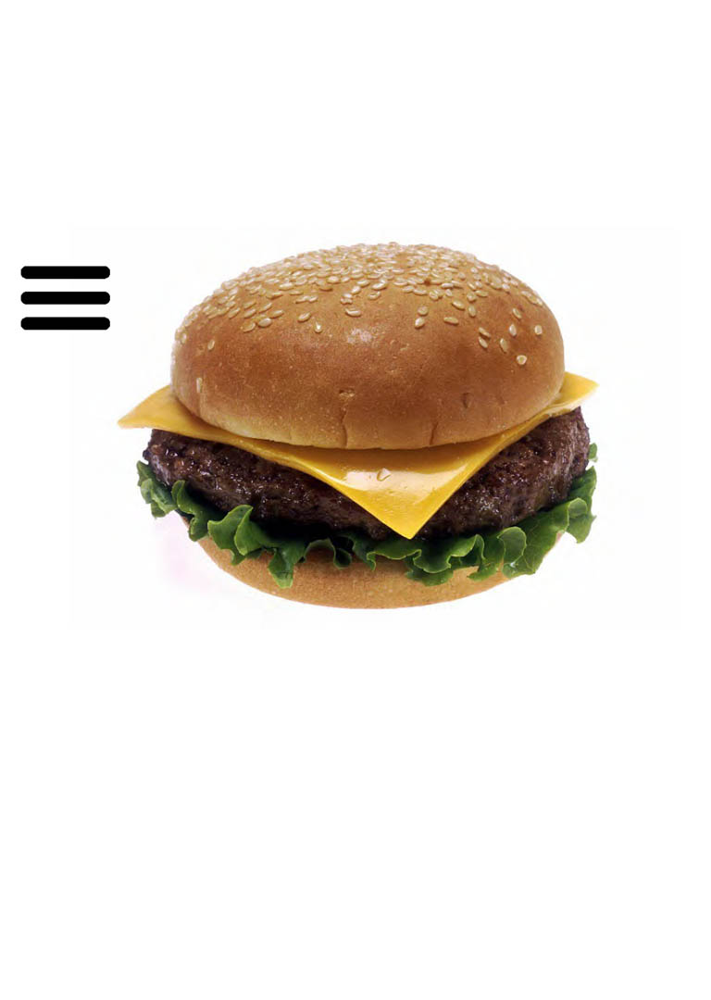

---

- **Kritik & Usability:**
  - *Vorteil:* Sehr hohe Wiedererkennbarkeit & aufgeräumtes Layout.
  - *Nachteil:* Versteckt Navigationsoptionen und erfordert einen zusätzlichen Klick.
- **HTML- & Unicode-Ersetzung:**
  - `☰` (`&#x2630;` – *TRIGRAM FOR HEAVEN*)
  - `≡` (`&#x2261;` – *IDENTICAL TO*)

---

### Lösung mit Antigravity

- Kopieren der Webseite in einen
neuen Ordner (10)
- Öffnen des Ordners in Antigravity
- Einfügen des Prompts:
"..
Füge in der index.html in der horizontalen
Navigationsleiste (navihor) ein
Hamburger-Icon ein, das zum Stil der
Webseite und deren Farben passt..."


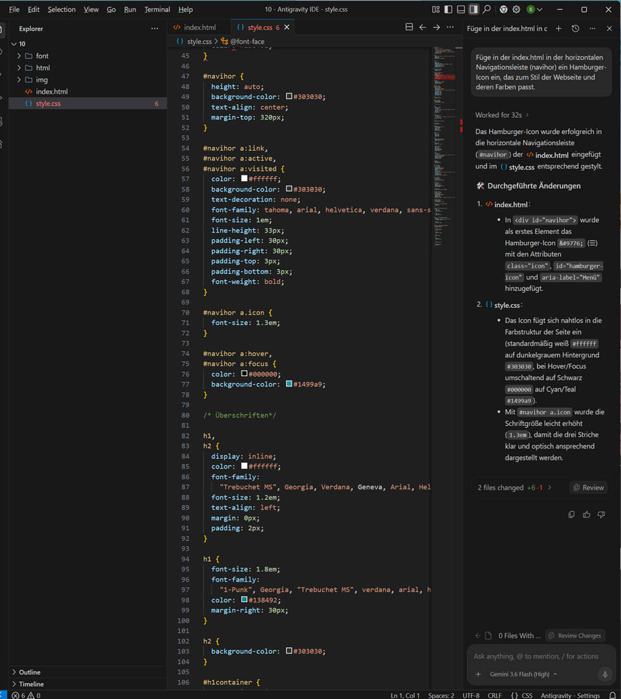

---
### Händische Lösung
**index.html**

Ergänzen der Navihor:
```html
<div id="navihor">
    <a href="#" class="icon" id="hamburger-icon" aria-label="Menü">&#9776;</a>
    <a href="#">Kontakt</a>
    <a href="#">Impressum</a>
    <a href="#">Datenschutz</a>
</div>
```
Das Attribut aria-label="Menü" stellt zusätzlich die Barrierefreiheit für Screenreader sicher.

---
**style.css**
Einfügen des neuen Styles für den Hamburger
```css
#navihor a.icon {
  font-size: 1.3em;
}
#navihor a:hover,
#navihor a:focus {
  color: #000000;
  background-color: #1499a9;
}
```

---
Der Hamburger sieht gut aus, soll aber erst ab 768 Pixeln abwärts sichtbar sein.

-> Prompt:
*"Der Hamburger-Button passt so. Er soll jedoch nur sichtbar sein, wenn das Hauptmenü im aside>nav-Container ab 768 Pixeln über den main-Container rutscht.
Passe also dementsprechend im css die @Media-Styles an, so dass der Hamburger über 768 Pixeln unsichtbar ist."*

```css
@media screen and (min-width: 768px) {
  #navihor a.icon {
    display: none;
  }
  aside {/*alles so belassen, wie es ist*/}
  main {/*alles so belassen, wie es ist*/}
}
```
---
- Webseite mit Hamburger-Button
- Testen der Media-Queries
- Öffnen der "Entwicklertools" (F12)
- Ein/Ausblenden des Handy-Menüs

-> Aktuell ohne Interaktion

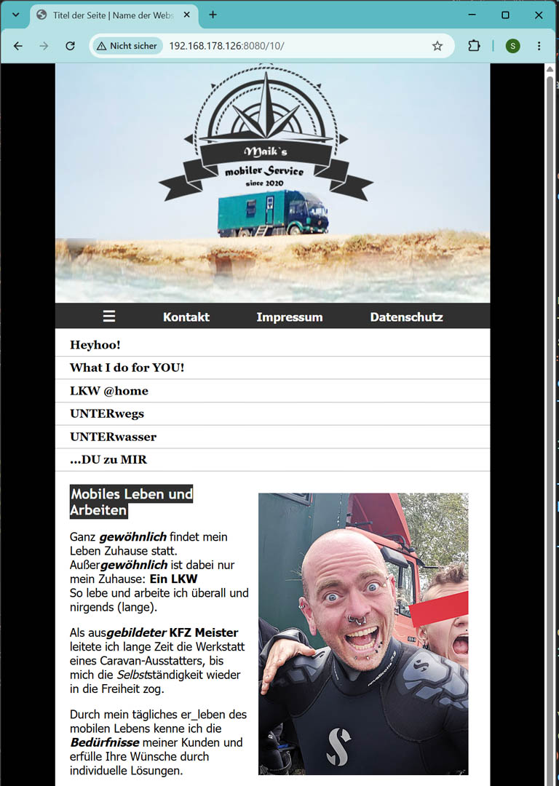

---
### JS-Interaktion

Mit dem Hamburger soll sich nun das vertikale Menü öffnen und schließen lassen.

-> Prompt:
*"Erstelle nun einen Ordner "js" in dem Du zukünftig alle erzeugten Javscript-Dateien anlegst.
Erstelle nun ein JS mit dem die Hauptnavigation im aside>nav-Container mit einem Klick ein- und ausgeblendet werden kann.
Das JS soll simpel, leicht verständlich und gut kommentiert sein."*

---
### Händische Lösung
- Erstellen eines neuen Javascriptes im neuen Unterordner "js"
(siehe nächste Seite)
- Einbindung in index.html im Head-Bereich:
```html
<script src="js/script.js" defer></script>
```


---

```javascript
// Warten, bis der DOM-Inhalt der Webseite vollständig geladen ist
document.addEventListener("DOMContentLoaded", function () {
  // 1. Auswählen des Hamburger-Buttons (über seine ID)
  const hamburgerBtn = document.getElementById("hamburger-icon");

  // 2. Auswählen der Hauptnavigation im aside>nav-Container
  const navMenu = document.querySelector("aside nav");
  
  // Überprüfen, ob beide Elemente auf der Seite vorhanden sind
  if (hamburgerBtn && navMenu) {

    // 3. Event-Listener für das Klick-Ereignis hinzufügen
    hamburgerBtn.addEventListener("click", function (event) {
      // Standard-Linkverhalten des <a>-Tags (Seiten-Springen durch #) verhindern
      event.preventDefault();

      // 4. Klasse 'active' umschalten:
      navMenu.classList.toggle("active");
    });
  }
});
```

---
Anpassungen im css:
```css
@media screen and (max-width: 767px) {
  aside nav {
    display: none;
  }
  aside nav.active {
    display: block;
  }
}

@media screen and (min-width: 768px) {
  #navihor a.icon {
    display: none;
  }
  aside nav {
    display: block;
  }
  ...}
```
---
Was ist nötig, damit die Navigation auch auf der LKW @home Seite funktioniert?
- Einbinden des JS (auf korrekte Pfade achten)
- Anpassen des Headers

-> Prompt:
*"Passe nun die html-Seite "mobiles-Leben-im-LKW.html" so an, dass hier der Hamburger identisch eingebunden ist und funktioniert."*

---
<!--_class: structural -->

## Wie gehts weiter? (11)

Für einen fertigen Web-auftritt gibt es noch viel zu tun:
- weitere Unterseiten erstellen
- Funktionen eibinden
- Standort
- Kontaktformular

---
<!-- _class: vielText -->
**-> Prompt:**
*"Erstelle nun eine Unterseite "kontakt.html" im html Ordner im gleichen Stil
wie die anderen beiden Unterseiten und binde in diese Datei mehrere Article ein:
Article-Text:
"Kontaktadresse:
Maik Anonym, Maikstrasse 66, Berlin"
Article-Text:
"Mein aktueller, ungefährer Standort"
Füge darunter eine interaktive OpenStreetMap Karte ein, die den Standort Berlin anzeigt.
Article-Text:
"Du suchst Kontakt zu Gleichgesinnten und Selbstausbauer*innen, dann fülle
das Formular aus und sende mir eine E-Mail"
Darunter fügst Du ein Formular ein, das folgende Felder enthält:
Vorname (required, text), Nachname (required, text),
Mein Fahrzeug (Dropdown mit Auswahlliste: Sonstiges, PKW,
LKW, Wohnmobil, Wohnwagen),
Mein Anliegen (required, Textfeld mit folgendem Standardtext
"...das Reh springt hoch, das Reh springt weit, warum auch nicht, es hat ja Zeit....").
Prüfe das Formular mit Javascript, ob es korrekt ausgefüllt wurde und ob der Standardtext
angepasst wurde. Nach der erfolgreichen Prüfung soll aus dem Formular eine
E-Mail mit dem Standard-E-Mail-Programm geöffnet werden, als Betreff
verwendest Du  "hallihallo" und als Empfängeradresse "mail@example.com"."*

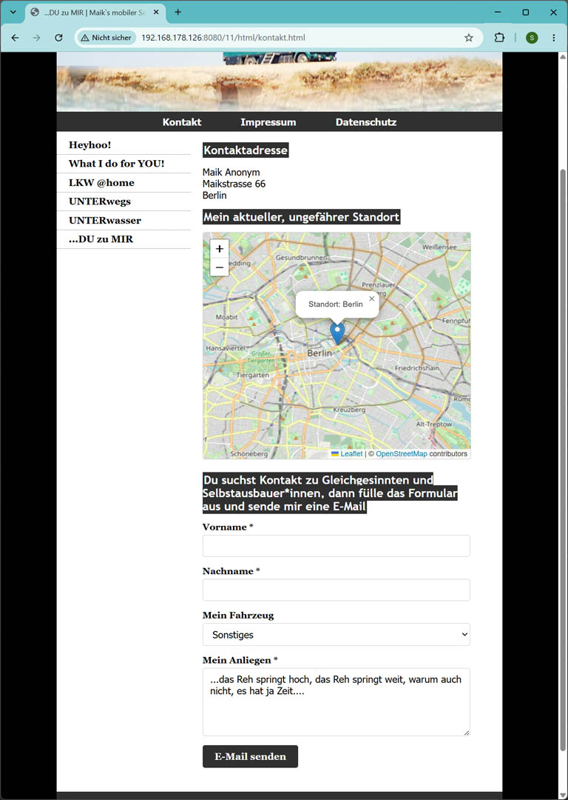

---


