<!-- _class: titlepage -->
# Webprogrammierung: html5 und Webseiten-Struktur


**Fachlehrer  Stefan Sauer**
**THWS Geovisualisierung**


---
<!-- _class: structural -->
# Inhaltsverzeichnis

- [Entstehung der HTML-Sprache](#entstehung-der-html-sprache)
- [Basiswissen](#basiswissen)
- [Eine Testumgebung](#eine-testumgebung)
- [Websitedarstellung im Browser](#websitedarstellung-im-browser)
- [Start Coding: Nur wie? (01)](#start-coding-nur-wie-01)
- [Start Coding: Und los geht`s (02)](#start-coding-und-los-gehts-02)
- [Dreamteam html & css (03)](#dreamteam-html-css-03)

---

<!-- _class: structural -->
## Entstehung der HTML-Sprache
> Wie, wo und warum brauchte die Welt das Internet?

---
### Wer hat´s erfunden?

- **Tim Berners-Lee** (britischer Physiker und Informatiker)
- **Wo:** Am **CERN** (Europäische Organisation für
Kernforschung) in Genf
- **Wann:** Entwickelt ab **1989**, vorgestellt **1990/1991**
- **Ursprünglicher Zweck:** Wissenschaftler sollten
Forschungsergebnisse unkompliziert
austauschen und verlinken können
- **Das Gesamtkonzept:** Er erfand gleichzeitig das
**HTTP-Protokoll**, die **URL** (Webadresse) sowie
den ersten Webbrowser/Webserver –
das Fundament des heutigen World Wide Web (WWW)


---
### Die Zeit vor der Entwicklung des World Wide Web
- Kein html 
- Brief? Fax? Telefon?
- Keine schnellen Möglichkeiten zum Informationsaustausch
- Kein Dokumentenaustausch mit mehreren Personen

Benötigt werden:
- Übertragungsprotokolle
- Dateiformate
- Quelloffene Standards

---
### Warum gerade am CERN?

- **Riesige Datenmengen & Forscher-Netzwerke:**
Tausende Wissenschaftler weltweit arbeiteten an gemeinsamen physikalischen Projekten.
- **Inkompatible Computersysteme:**
Forscher nutzten unterschiedlichste Hardware & Software; der Dokumentenaustausch war extrem mühsam.
- **Fehlende Verknüpfung:** Es gab keine Methode,
um Informationen auf verschiedenen Servern direkt miteinander in Beziehung zu setzen.


---

> Die Hypertext-Lösung: HTML ermöglichte es, Dokumente plattformunabhängig darzustellen und über Hyperlinks direkt miteinander zu verknüpfen.
Ein flexibles System sollte Berichte, Handbücher und Protokolle für alle Forscher netzwerkweit auffindbar machen.


---

**Filmtipp:**
Jurassic Web
Der Film erzählt die unbekannte Geschichte
dieser Wegbereiter der digitalen Welt und
ihrer Nutzungsmöglichkeiten
– die Urgeschichte der sozialen Netzwerke!

Nur erhältlich:
>Bei mir :)


---
<!--_class: structural  -->
## Basiswissen
- HTML
- Webserver
- Protokolle (http / https / ssl / ftp)
- Zertifikate
- Domain
- Webspace
- FTP-Client
- Browser

---

### HTML

> HTML = Hypertext Markup Language. Hypertext > Verlinkung von Webseiten


---


- "Markup Language" > Auszeichnungssprache > um Dokumente für Webbrowser strukturiert zu beschreiben
- Webseiten werden NICHT programmiert, sondern geschrieben
- Mit HTML-Tags werden Textpassagen ausgezeichnet
- sie kennzeichnen die logische Bedeutung des Textes.
- Bilder, Webseiten, Videos, Musik etc. werden lediglich verlinkt & nicht im html gespeichert!
- flexibel, skalierbar, plattformunabhängig
- html-Seiten werden immer interpretiert & sehen auf jedem Gerät anders aus! 

---
### Beispiel Tag Paragraph

Das Tag Paragraph steht für einen Textabsatz. Dabei leitet das Tag `<p>` den Paragraph ein und `</p>` beendet diesen.
Mit wenigen Ausnahmen (leeren Elementen) besteht ein Tag immer aus einem öffnenden und einem schließenden Element.


```html
<p>Dies ist ein Paragraph.</p>
```

---
### HTML Spezifikation

> 3ter November 1992 erschien die erste Version der HTML-Spezifikation.
- Dateiendung: .html, .htm
- MIME-Type: text/html
- Entwickelt von: World Wide Web Consortium (W3C)
- Aktuelle Version: 5.2 (Stand: 14. Dezember 2017)
- Art: Auszeichnungssprache
Erweitert zu: XHTML, HTML5

(Wikipedia)
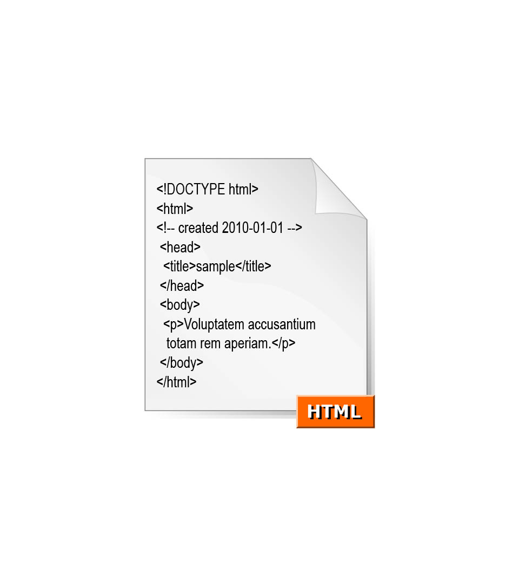


---
### Webserver

> Wie kommt die Webseite
zum User?

- Html-Dokument =
Textdatei mit spezieller Kodierung
- Alle benötigten Dokumente müssen
auf einen Webserver
- Mit Webspace
- Webserver = Computer, der
unter bestimmter Domain
über das http Protokoll erreichbar ist
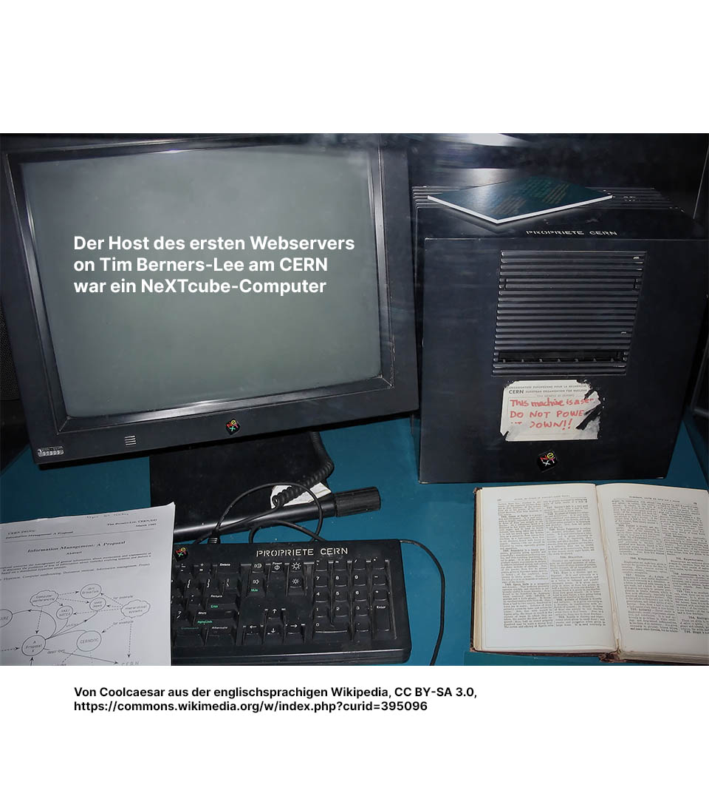

---

- Text wird als Textdatei mit Endung htm/html gespeichert und auf einem Webserver abgelegt
- Webserver = lateinisch servire ‚dienen‘; englisch server ‚Diener‘, ‚Dienst‘
- Server überträgt Dokumente an Clients wie z. B. Webbrowser
- Webserver = Computer mit Webserver-Software
- Häufig wird auch die Webserver-Software so bezeichnet


---

**Webserver können**

- lokal, in Firmennetzwerken
- oder WWW-Dienst im Internet eingesetzt werden
- Dokumente können somit lokal, firmenintern und weltweit
zur Verfügung gestellt werden

---

**Hauptaufgabe eines Webservers**

- Auslieferung von statischen Dateien
- Html-Dateien
- css
- Bild Dateien
- Script Dateien
- Videos
- Uvm
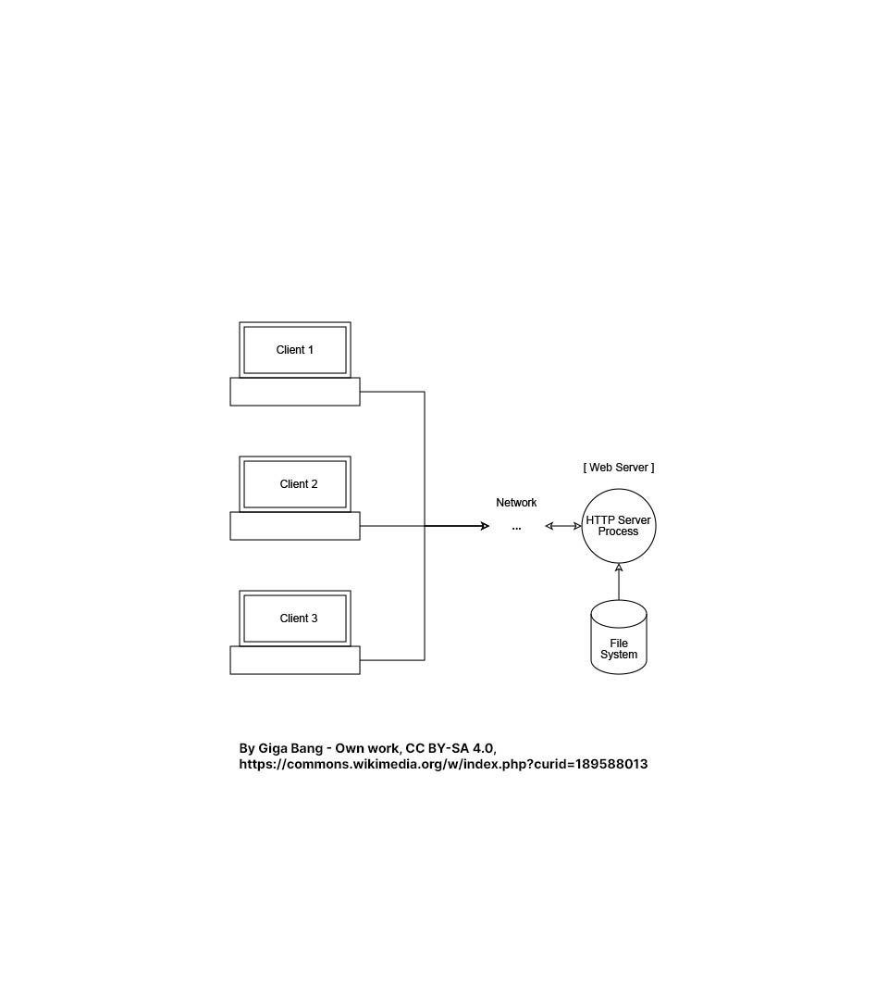

---

> Für komplette Webseite werden benötigt:
- HTML-Seite
- verknüpfter Designbeschreibungen (CSS)
- Bilddateien (JPG, PNG, GIF, SVG)
- Scripte

> Eine komplexen Webseite kann
> hunderte Anfragen und Serverantworten benötigen.

---
**Webserver ist in der Lage:**

- die Inhalte einer Webseite
- gleichzeitig
- auf viele verschiedene Rechner auszuliefern
- Scripte auszuführen
- Datenbankanbindungen bereitzustellen
- Datenbankinhalte bereitzustellen
- Geschwindigkeit abhängig von Anzahl der Nutzeranfragen & Komplexität der Webinhalte
- uvm.
- dynamische Webinhalte benötigen mehr Ressourcen als statische

---
**Bekannte Beispiele für Webserver**

- Apache / XAMPP
- Nginx
- Microsoft IIS
- uvm:
https://en.wikipedia.org/wiki/Category:Free_web_server_software

---
**Apache**

HTTP Server ist:
- quelloffene
- freies Produkt
- von der Apache Software Foundation
- einer der meistbenutzten Webserver
[https://www.apache.org/](https://www.apache.org/)


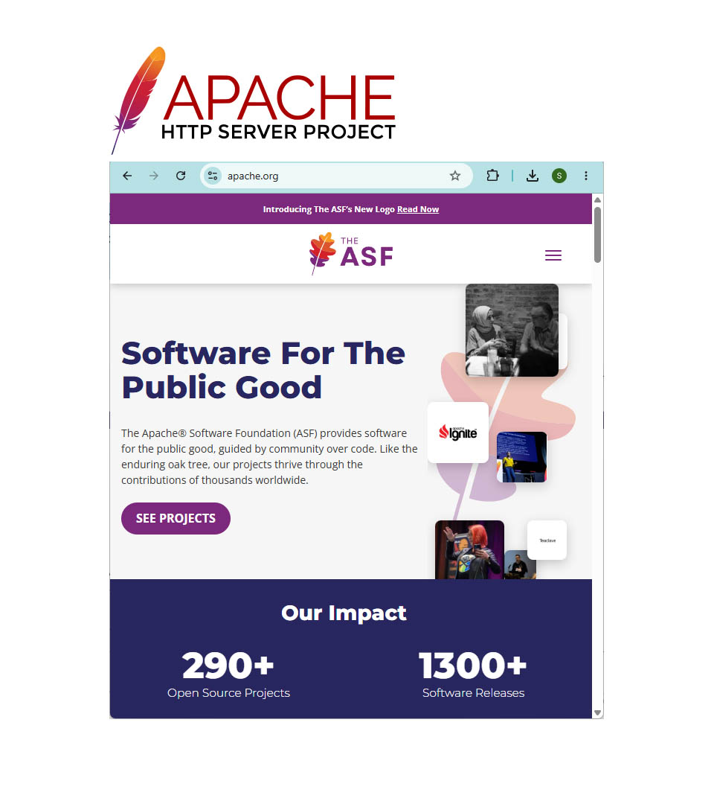

---
### Protokolle
- HTTP - Hypertext Transfer Protocol
- HTTPS - Hypertext Transfer Protocol Secure
- SSL - Secure Sockets Layer
- FTP - File Transfer Protocol

---
**HTTP-Protokoll***
> Hypertext Transfer Protocol

- Netzwerkprotokolle wie IP und TCP
- üblicherweise über Port 80 (HTTP)

---
**Schichtenmodell der Netzwerkkommunikation**

HTTP["Anwendungsschicht: HTTP (WAS wird übertragen?) Format der Webinhalte (z. B. HTML)"] 

--> TCP["Transportschicht: TCP (WIE wird es übertragen?) <br> Zuverlässigkeit, Fehlerkontrolle, Ports (z. B. Port 80)"]

--> IP["Netzwerkschicht: IP (WOHIN wird es übertragen?) <br> Adressierung (IP-Adressen) und Routing"]


---

**Definition & Zweck:**
- Zustandsloses Protokoll zur Übertragung von Daten (HTML, CSS, JS, Bilder, Videos) im Web.
- Regelt die Kommunikation zwischen Webbrowser (Client) und Webserver.

---


**Client-Server-Modell:**
- Request (Anfrage): Client fordert eine Ressource an (z. B. beim Klick auf einen Link).
- Response (Antwort): Server liefert die Ressource zurück (z. B. die HTML-Datei).

---

**Zustandslosigkeit (Stateless):**
- Jede Anfrage wird völlig unabhängig von vorherigen Anfragen behandelt.
- Der Server speichert standardmäßig keine Verbindungsinformationen (daher werden Cookies oder Sessions für Logins/Warenkörbe benötigt).

---
**Methoden:**

| Methode | Verwendung |
|---------|------------|
| GET     | Daten auslesen / Seite laden. |
| POST    | Daten übertragen (Formulare, Uploads). |
| PUT     | Daten komplett ersetzen. |
| DELETE  | Daten löschen. |

---
**HTTP-Statuscodes (Antwort des Servers):**

| Code | Status | Bedeutung |
|------|--------|-----------|
| 200  | OK     | Anfrage erfolgreich. |
| 301/302 | Redirection | Umleitung auf eine andere URL. |
| 404  | Not Found | Die angeforderte Datei existiert nicht (Client-Fehler). |
| 500  | Internal Server Error | Fehler auf dem Webserver. |

---

**Beispiel einer HTTP-Anfrage (GET):**

```
Anfrage des Browsers beim Server (vereinfacht):

GET /index.html HTTP/1.1
Host: www.beispiel.de

Antwort des Servers (vereinfacht): 

HTTP/1.1 200 OK
Content-Type: text/html

<html>...
```

--- 
**HTTP-Secure (HTTPS)**
- HTTPS ist die verschlüsselte Variante von HTTP
- SSL-Zertifikat
- Port 443

---
**Verschlüsselung zwischen Webserver und Browser**
- https-Verfahren wird von allen Browsern unterstützt
- https ist eine Sicherheits-Technologie die nicht installiert werden muss
- sofort ersichtlich
- einfach zu überwachen

---
> Eine HTTPS-Seite erkennen Sie daran, dass einerseits oben in der Adresszeile des Browsers der besagte Schriftzug steht, andererseits an dem verriegelten Schloss .


---
**SSL - Secure Sockets Layer**

- SSL ist die Verschlüsselungstechnologie,
die für HTTPS verwendet wird.
- Es stellt sicher, dass die Daten, die zwischen
Client und Server übertragen werden,
vertraulich und unverfälscht bleiben.
- SSL/TLS-Zertifikate werden von
Zertifizierungsstellen ausgestellt,
um die Identität einer Website zu verifizieren.

https://wiki.selfhtml.org/wiki/Grundlagen/HTTPS_und_TLS


---
**Zertifikate**

- Gültigkeit von ein bis zwei Jahren
- nach Ablauf kann es nicht mehr verwendet werden
- erforderlich für Online-Dienste
- erforderlich für Online-Shops
- erf

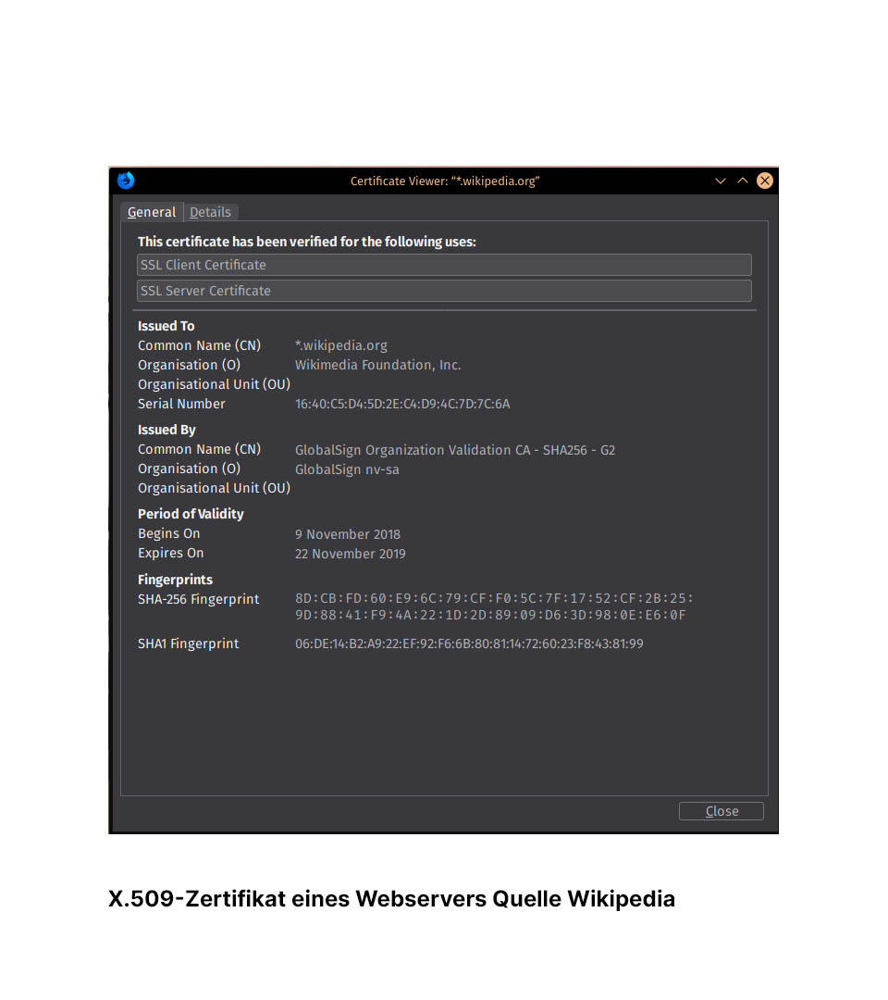

---
**digitales Zertifikat**
- ist ein digitaler Datensatz
- nach Standards der ITU-T oder der IETF
- bestätigt bestimmte Eigenschaften von Personen oder Objekten
- prüft dessen Authentizität und Integrität
- durch kryptografische Verfahren
- enthält die zu seiner Prüfung erforderlichen Daten

---

> Wer verlängert das Zertifikat?

Technisch wird ein Zertifikat nicht verlängert, sondern **durch ein neues ersetzt**.
- **Certification Authority (CA):** Stellt das neue Zertifikat aus (z. B. Let's Encrypt).
- **Webhoster:** Übernimmt bei Standard-Webspaces die Erneuerung meist vollautomatisch.
- **Server-Administratoren:** Nutzen Bots (z. B. *Certbot* über das ACME-Protokoll), um Zertifikate auf eigenen Servern automatisch alle 60 bis 90 Tage zu erneuern.

---
### Webspace

> beschreibt den Speicherplatz auf einem Server, der zur Unterbringung von Dateien einer Website genutzt wird.

---

- **Speicherplatz** für Dateien auf einem (Web)Server
- Ist über das Internet **dauerhaft verbunden**
- Online-Speicherplatz wird häufig von **Internetdienstanbietern** bereitgestellt
- Kunden stellen Dokumente und Datenbestände (wie Musikdateien), Websites etc zur Veröffentlichung online
- Das Bereitstellen von Speicherplatz im Internet wird **Webhosting** oder auch **Nethosting** genannt
- Die Webserver großer Anbieter stehen in  **Rechenzentren**, in denen hunderte von Webservern Mailservern und Diensteanbietern ihre Dienste verrichten.


---
> HTTPS funktioniert nur dann optimal, wenn alle Inhalte, die auf einer Webseite dargestellt werden, über HTTPS geladen werden.

Werden zum Beispiel auf einer HTTPS-Seite externe Ressourcen wie Bilder, Skripte oder CSS-Dateien unverschlüsselt nachgeladen, spricht man von einem sogenannten Mixed-Content, der zu Problemen bei der sicheren Darstellung führen kann.

---
**Webhoster**

- Preis
- Speicherplatz
- Traffic
- Anzahl der Datenbanken
- Anzahl der E-Mail-Adressen
- Anzahl der Domains
- SSL-Zertifikat
- Support
- Serverstandort

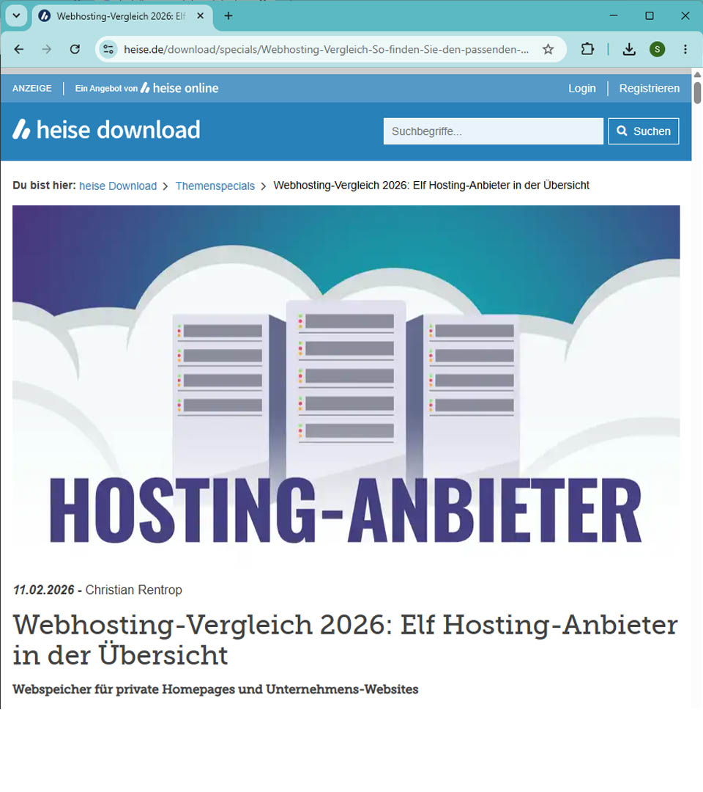

---

heise Webhoster-Vergleich
https://www.heise.de/download/specials/Webhosting-Vergleich-So-finden-Sie-den-passenden-Hosting-Anbieter-6037473


---
> Vorsicht bei Homepage-Baukästen:
Meist zielen die Angebote
darauf ab, den Kunden zu binden,
sodaß ein Wechsel zu einem
anderen Anbieter später nur
erschwert möglich ist.


---

**Selber hosten? Geht das?**
> Ja. Dafür muss jedoch Ihr Rechner 24/7 am Netz in Betrieb sein.


Beachten Sie allerdiengs auch,
dass Ihr Provider das erlauben muss.
Viele DSL Anbieter sehen es nicht gerne,
wenn sie viele externe Zugriffe auf
Ihren Webserver haben.

> Lesen:

https://wiki.selfhtml.org/wiki/Webserver/SELF-Hosting


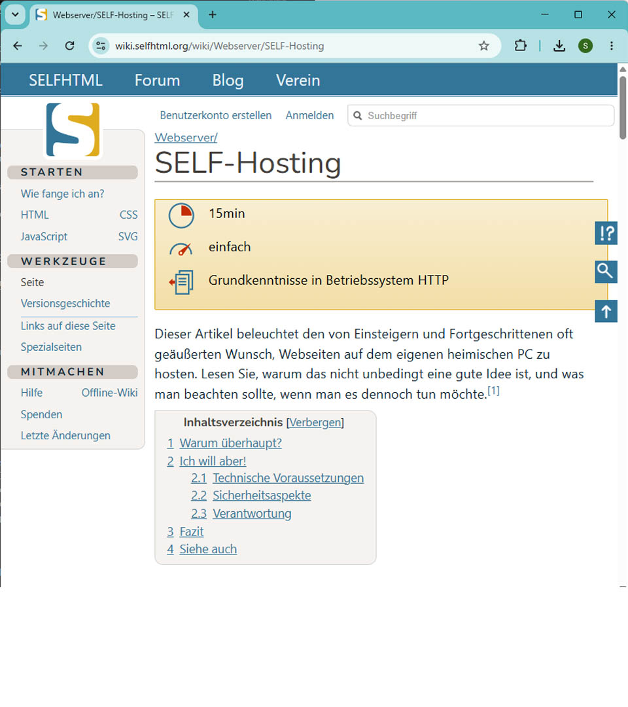


---
<!-- _class: img-right -->

### Domain & DNS: Grundlagen
- **Definition:** Eine Domain (dt. *Domäne/Bereich*) ist ein weltweit eindeutiger Name im hierarchischen **Domain Name System (DNS)**.
- **Zweck:** Übersetzung von IP-Adressen (z. B. `193.175.120.40`) in menschenlesbare Namen (z. B. `www.thws.de`).

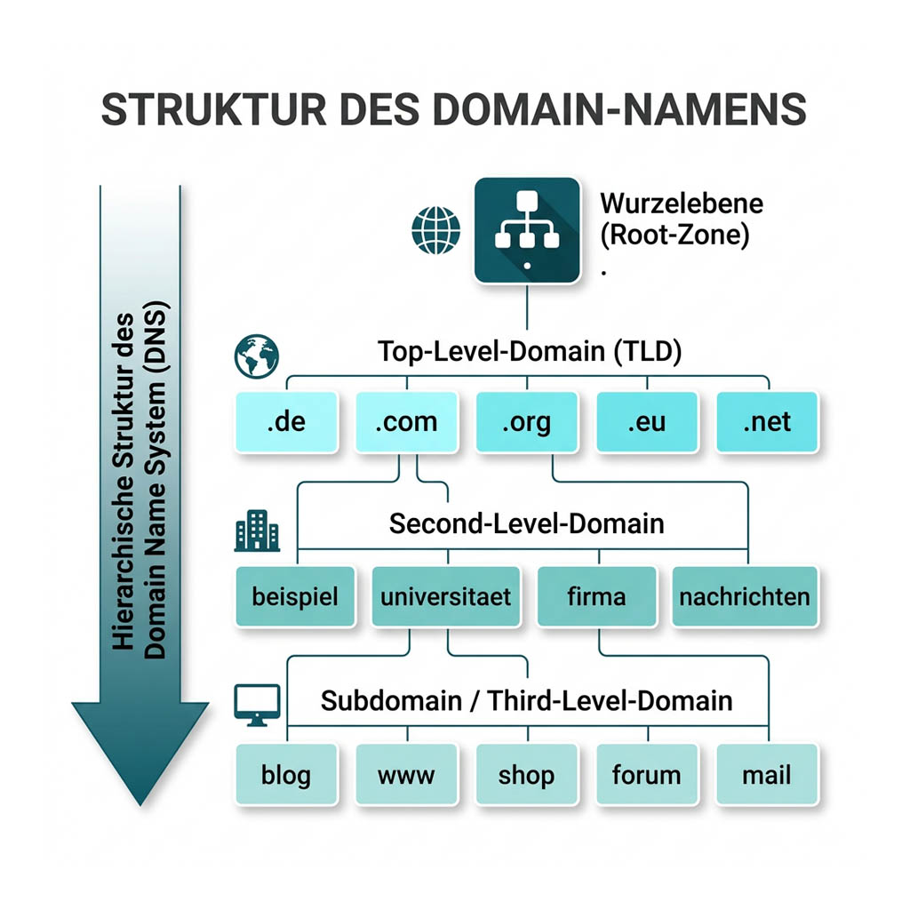

---

- **Webspace-Erreichbarkeit:** Um eine Webseite online zu stellen, werden deren Daten auf einen Webspace geladen. Der Webserver macht diese unter der zugeordneten Domain erreichbar.
- **Hierarchischer DNS-Aufbau:**
  - **Root-Label (Wurzel):** Angedeutet durch den letzten Punkt (z. B. `www.thws.de.`).
  - **Top-Level-Domain (TLD):** `.de` (länderspezifisch/ccTLD) oder `.org` (allgemein/gTLD).
  - **Second-Level-Domain:** Der eigentliche Name (z. B. `thws`).


---


### Subdomains & Technische Limits
- **Subdomains:** Einer Domain können beliebig viele weitere Subdomains vorangestellt werden
(z. B. `elearning.thws.de`), abgetrennt durch einen Punkt.
- **Längenbeschränkungen (gemäß RFC 1035):**
  - **Pro Label** (Abschnitt zwischen zwei Punkten): **Maximal 63 Zeichen**.
  - **Gesamt-FQDN** (Fully Qualified Domain Name): **Maximal 253 Zeichen**
  in Textdarstellung (bzw. 255 Byte im DNS-Format).


---
<!-- _class: img-right -->

- **Adressierung:** Mit einem FQDN kann jedes physische oder virtuelle Objekt im Netz eindeutig adressiert werden.
- **Nameserver:** Speichern DNS-Einträge (z. B. A-Record für IPv4) und verbinden den Domain-Namen mit der IP-Adresse des Servers.


---
<!-- _class: img-right -->

### Vergabestellen & DENIC

**https://www.denic.de/**

- **Registrar / NIC (Network Information Center):** Top-Level-Domain wird von Vergabestelle verwaltet: exakte Namensregeln:
- **DENIC eG (Frankfurt am Main):**
  - Zentrale Genossenschaft & Registrierungs-
  stelle für alle `.de`-Domains.
  - Verwaltet über 17 Millionen Domains (gehört weltweit zu den größten Länder-TLDs).


---

- **Namensregeln für `.de`:**
  - Erlaubt sind: Kleinbuchstaben (a-z), Ziffern (0-9) und Bindestrich (nicht an 1. oder letzter Stelle, nicht an 3. + 4. Stelle).
  - Umlaute (IDN-Domains wie `ä`, `ö`, `ü`) werden unterstützt.
  - Ein zustellungsbevollmächtigter Ansprechpartner in Deutschland wird benötigt.

---
**Muss ich dann immer zur DENIC?**
> Nein, das erledigt der Webhoster

https://www.ionos.de/
https://www.strato.de/
https://www.hostinger.com/
https://all-inkl.com/
https://checkdomain.de/

> Vergleicht die Angebote!
Welches ist das beste Angebot?

---
**Angebotskriterien:**
- Preis
- Speicherplatz
- Traffic
- Anzahl der Datenbanken
- Anzahl der E-Mail-Adressen
- Anzahl der Domains
- SSL-Zertifikat
- Support
- Serverstandort

---

<!-- _class: img-right -->
**Domainabfrage auf der DENIC-Webseite**

>Ist der gewünschte Domainname noch frei?

Hurra! Die Domain maiks-mobiler-service.de ist noch frei…

(äääh... eigentlich nicht mehr :) )


---
<!-- _class: img-right -->

### Der „sprechende“ Domain-Name
- **Definition:** Domain-Name verrät beim Lesen Inhalt / Zweck/ Anbieter
- **Suchmaschinen-Relevanz (SEO):**
  - Suchmaschinen analysieren als Erstes Domain-Namen.
  - Ein sprechender Name fungiert als
  direkter Ranking-Faktor und erhöht Klickrate (CTR).
- **Vorteil:** Nutzer verstehen sofort, worum es geht – das schafft Vertrauen und stärkt die Barrierefreiheit/Verständlichkeit.


---
<!-- _class: img-right -->

### Kriterien zur Auswahl des Domain-Namens
- **Persönliche Marke (Identität):**
  - Steht eine Person oder ein persönlicher Service im Vordergrund?
  - *Tipp:* Den eigenen Namen integrieren (z. B. `maik-caravan.de`).
- **Lokaler Bezug (Geographie):**
  - Wird ein Service in einer bestimmten Stadt/Region angeboten?
  - *Tipp:* Ortsnamen einbauen (z. B. `autoinstandsetzung-wuerzburg.de`).
- **Nischen- / Kerntätigkeit (Dienstleistung):**
  - Bieten Sie eine außergewöhnliche oder sehr spezifische Leistung an?
  - *Tipp:* Kern-Keywords verwenden (z. B. `autarker-fahrzeugausbau.de`).

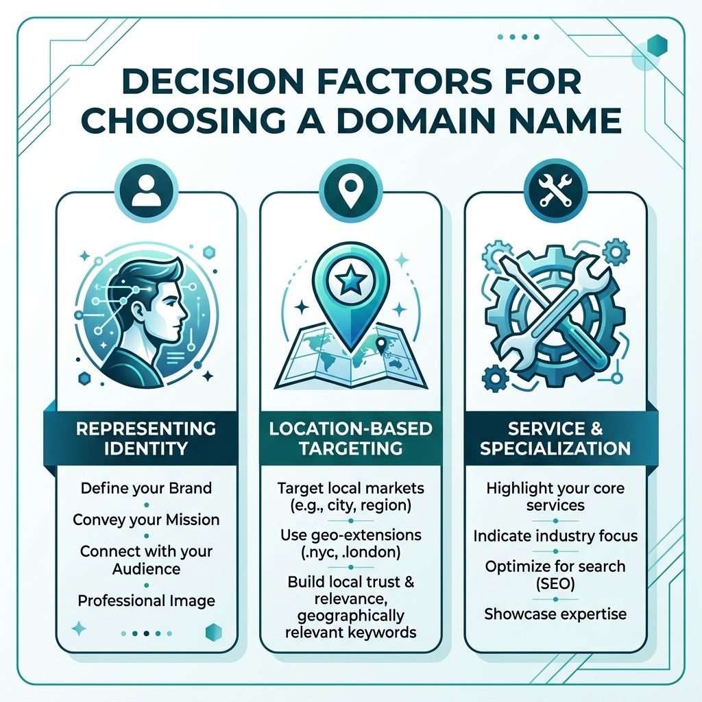

---
<!-- _class: img-right -->

### Best Practices & Fallstricke
- **Kurz & Einprägsam:** So kurz wie möglich, leicht zu schreiben und sich zu merken.
- **Bindestriche sinnvoll nutzen:**
  - Verbessert die Lesbarkeit(z. B. `maiks-mobiler-service.de` statt `maiksmobilerservice.de`).
  - Vermeidet Zweideutigkeiten.
- **Rechtliche Absicherung:**
  - Vor Registrierung prüfen: Keine Markenrechte / Firmennamen / geschützte Begriffe

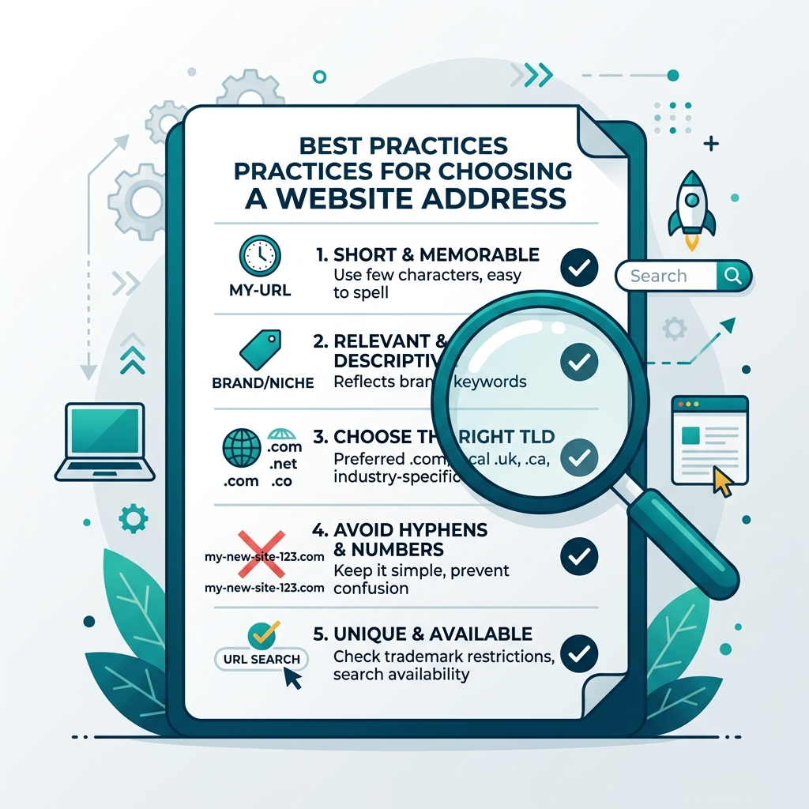

---
> Die richtige TLD:
Für den deutschen Markt immer primär `.de` wählen.

Aber auch spezifische Domains sind möglich:
**`.ai`** ist die TLD für "Caribbean island of Anguilla"
 :)

**`.edu`** Domain ist streng limitiert und steht offiziell fast ausschließlich US-amerikanischen, staatlich akkreditierten Bildungseinrichtungen zur Verfügung. Internationale oder private Institutionen können diese meist nicht registrieren.

**`.com`** ist die TLD für kommerzielle Unternehmen und Organisationen weltweit & wirkt professionell.

---
<!-- _class: img-right -->

### FTP: Grundlagen & Dateitransfer
- **Definition:** Das **File Transfer Protocol (FTP)** Netzwerkprotokoll zur Übertragung von Dateien über IP-Netzwerke.
- **Zustandsbehaftet:** Der Server speichert während einer Sitzung den Zustand (z. B. das aktuelle Arbeitsverzeichnis).
- **Funktionen:** Upload (Client → Server), Download (Server → Client), Datei- & Verzeichnisverwaltung (Erstellen, Löschen, Umbenennen).


---

### FTP-Verbindungsaufbau: Aktiv vs. Passiv
- **Zwei getrennte Kanäle:**
  - **Steuerkanal (Control Port 21):** Client initiiert TCP-Verbindung für Befehle & Statuscodes.
  - **Datenkanal:** Übertragung der eigentlichen Dateiinhalte.

---
<!-- _class: img-right -->
- **Aktives FTP (PORT):**
  - Server initiiert die Datenverbindung aktiv zum Client (Port 20 → Client).
  - *Problem:* Client-Firewalls/NAT blockieren oft den eingehenden Zugriff vom Server.
- **Passives FTP (PASV):**
  - Client initiiert die Datenverbindung zu
  einem vom Server vorgegebenen Port.
  - *Standard im Webhosting,* da firewallsicher für den Client.

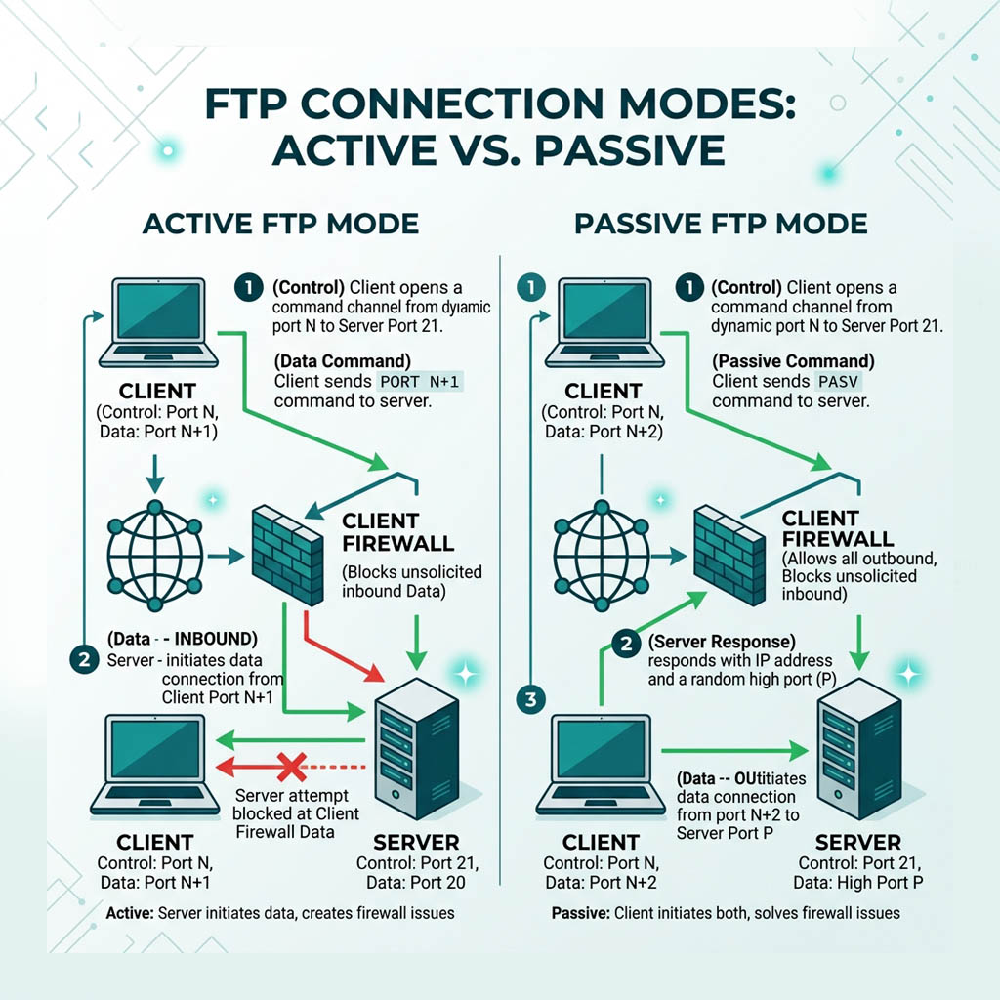

---
<!-- _class: img-right -->

### FTP-Sicherheit & FTP-Clients
- **Das Sicherheitsrisiko:** Klassisches FTP überträgt Zugangsdaten (Benutzer/Passwort) und Dateien **unverschlüsselt** im Klartext.
- **Sichere Alternativen (Standard heute):**
  - **SFTP (SSH File Transfer Protocol):** verschlüsselte Übertragung über SSH (Port 22).
  - **FTPS (FTP over SSL/TLS):** Verschlüsseltes FTP (Port 21 mit Explicit TLS oder Port 990).

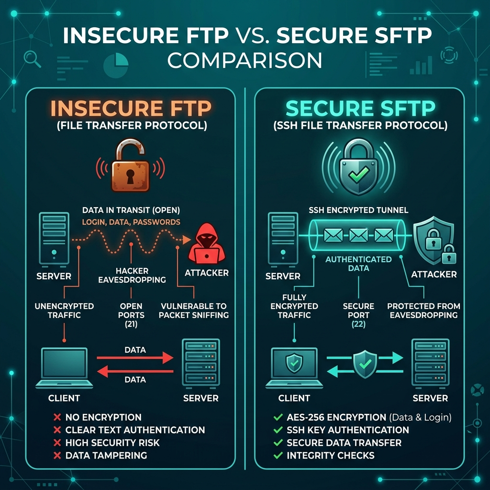

---
<!-- _class: img-right -->

- **FTP-Clients:** Spezialisierte Software wie **FileZilla** (Open Source, plattformunabhängig) ermöglicht einfache Übertragung per Drag-and-Drop.

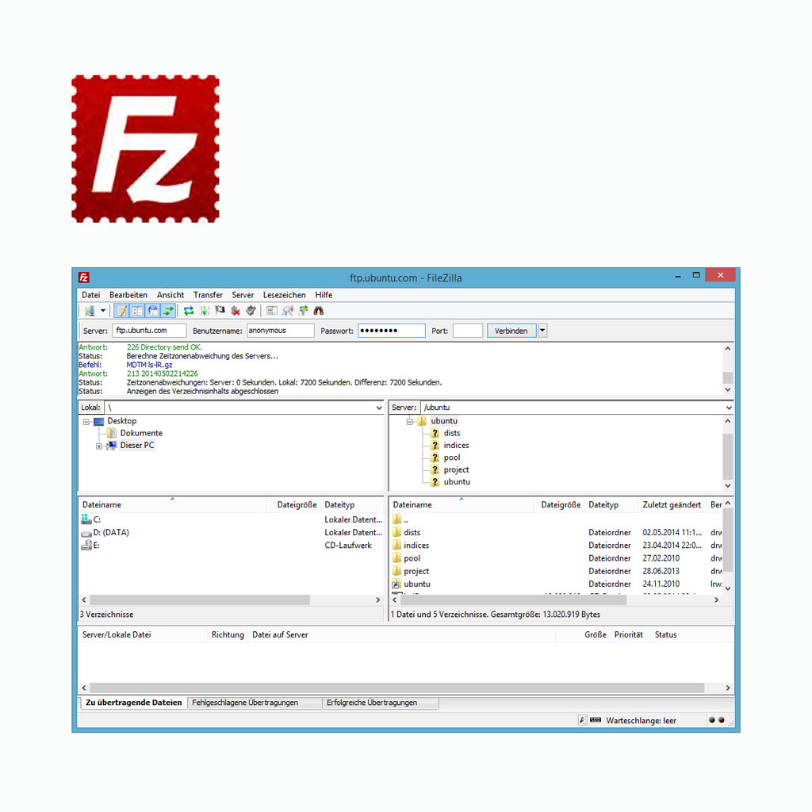


---

## Eine Testumgebung
- XAMPP
- Mongoose
- Chrome
- Git

---
<!-- _class: img-right -->

### XAMPP: Lokale Testumgebung
- **Was ist XAMPP?** Ein kostenloses Softwarepaket zur lokalen Simulation eines Webservers.
- **Namensbedeutung:** **X** (plattformübergreifend), **A** (Apache Webserver), **M** (MariaDB/MySQL Datenbank), **P** (PHP Skriptsprache), **P** (Perl).


---
<!-- _class: img-right -->
- **Installationstipps für Einsteiger:**
  - **WICHTIG:** Unter Windows *nicht* in `C:\Program Files` installieren, sondern direkt in `C:\xampp\` ablegen (verhindert Rechteprobleme / UAC-Fehler).
  - Setup-Auswahl: Für unsere Zwecke reichen Apache, MySQL und PHP vollkommen aus.


---

<!-- _class: img-right -->

### Bedienung & Portkonflikte
- **Starten der Dienste:** Das *XAMPP Control Panel* öffnen und bei **Apache** und **MySQL** auf *Start* klicken (Status leuchtet grün).
- **Standard-Ports:** Apache belegt standardmäßig Port **80** (HTTP) und **443** (HTTPS).

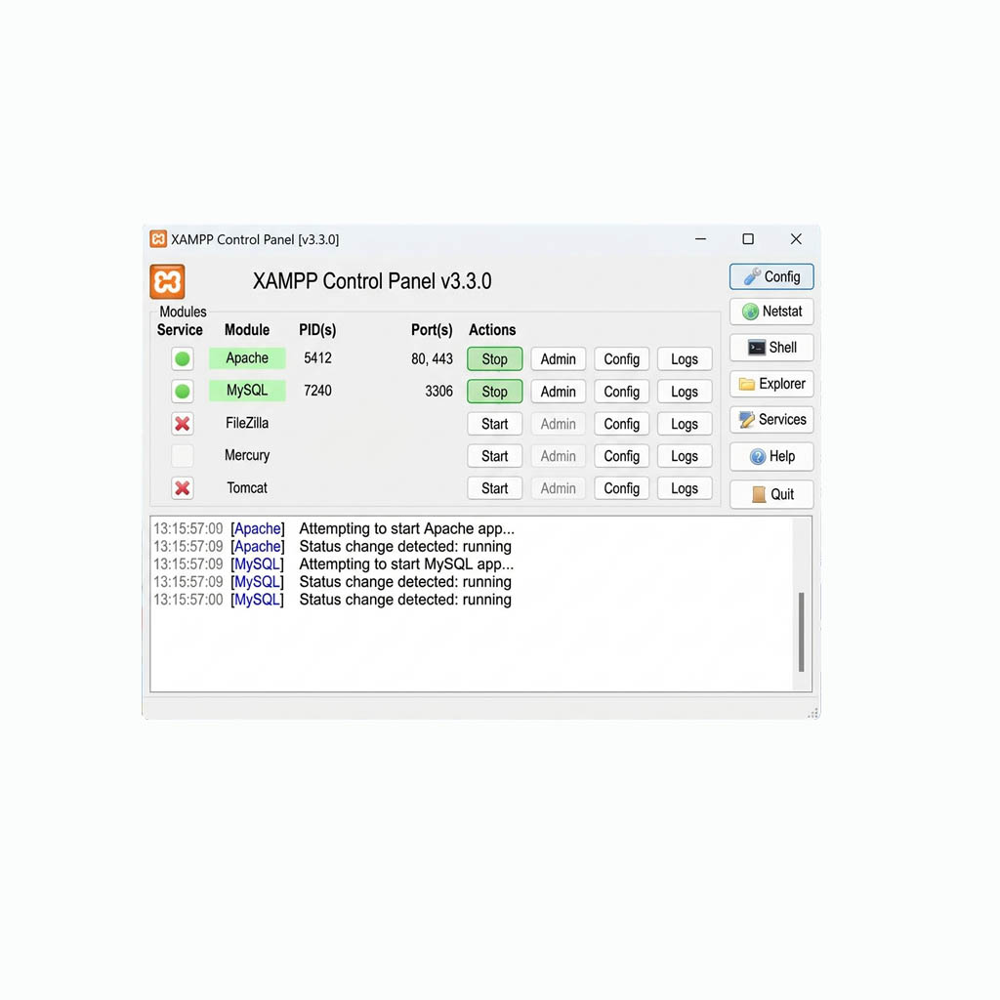

---

<!-- _class: img-right -->
- **Häufiger Fehler (Apache startet nicht):**
  - Port 80 ist oft durch Skype, Teams oder
  IIS blockiert.
  - *Lösung:* Im Control Panel auf *Config* bei Apache klicken, `httpd.conf` öffnen, nach `Listen 80` suchen und auf z. B. `Listen 8080` ändern.

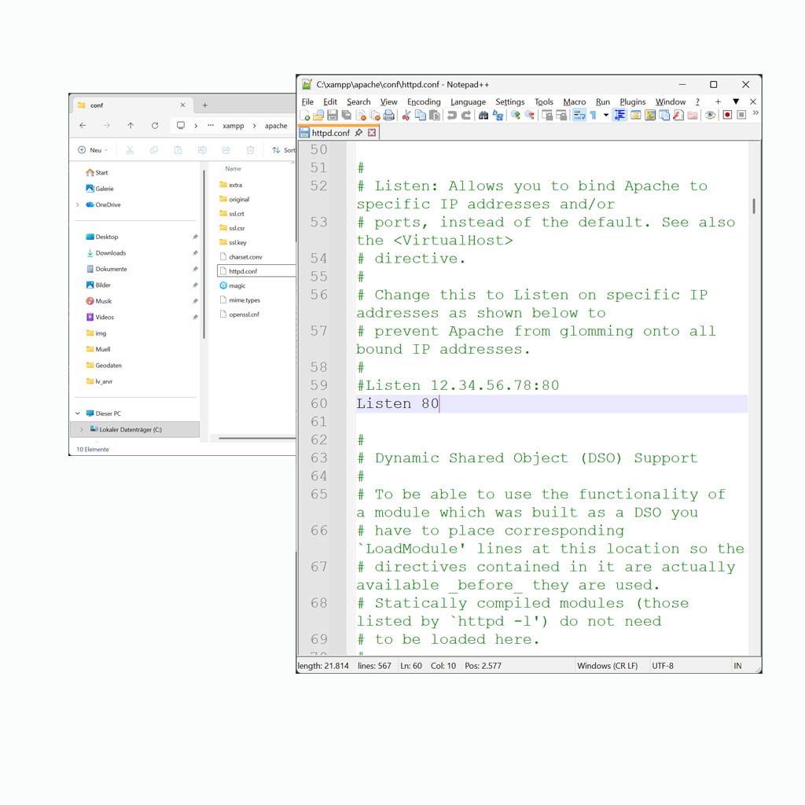

---
<!-- _class: img-right -->

### Webseiten ablegen & lokal testen
- **Der htdocs-Ordner:** Der zentrale Speicherort für alle eigenen Webdateien (`.html`, `.css`, `.js`) liegt unter `C:\xampp\htdocs\`.
- **Projekt-Struktur:**
  - Erstelle dort einen eigenen Ordner für dein Projekt (z. B. `htdocs\mein-projekt\`).

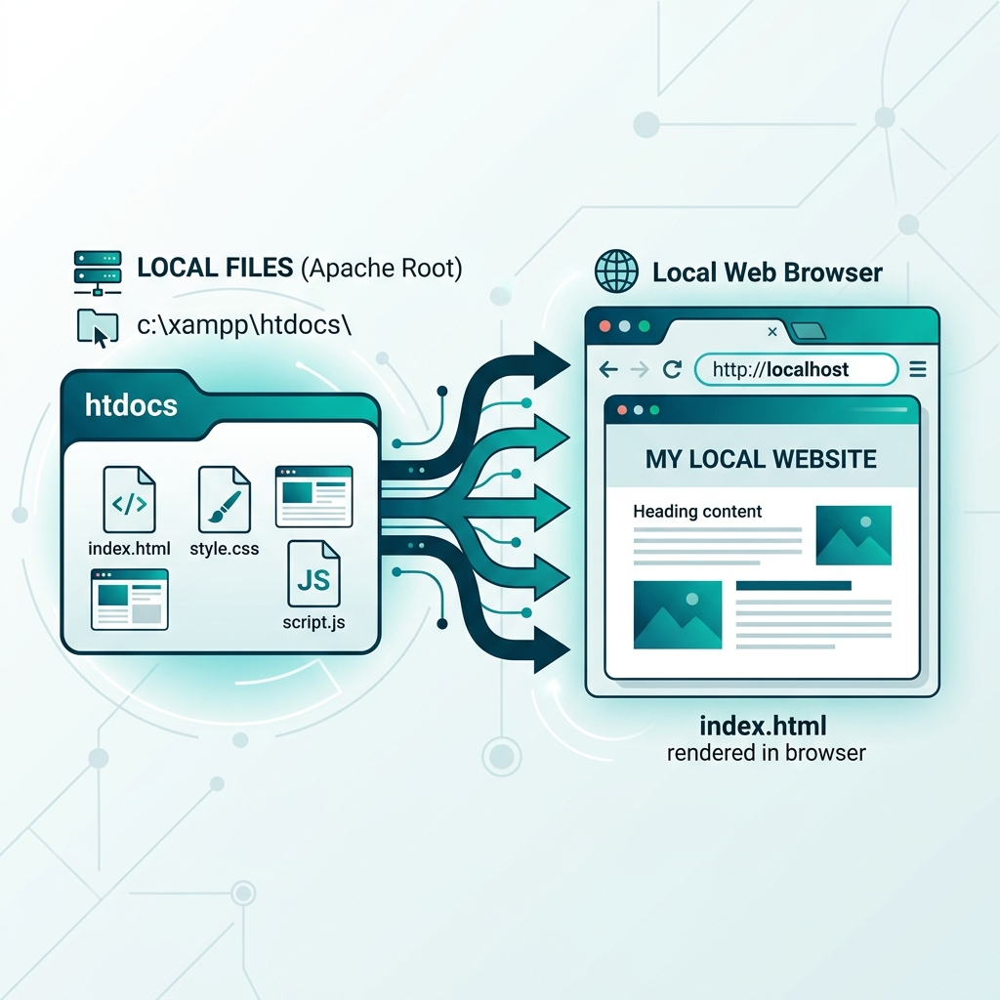


---
<!-- _class: img-right -->

### Aufruf im Browser
- **Startseite der Testumgebung:**
  - `http://localhost/` oder `http://127.0.0.1/` eingeben.
  - Leitet automatisch auf die XAMPP-Dashboard-Startseite weiter.
- **Dein Projekt aufrufen:**
  - Adresse zusammensetzen aus localhost + Projektverzeichnis + Datei:
  - `http://localhost/mein-projekt/index.html`

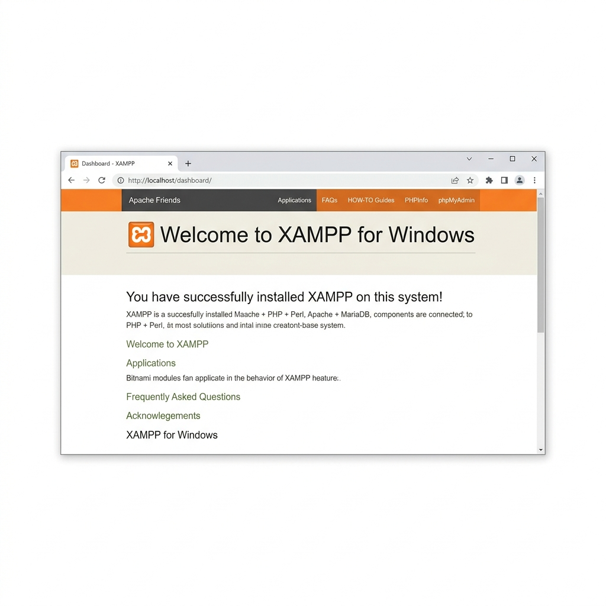

---

### Was ist „localhost“?
- **Bedeutung:** Der Standard-Hostname für den eigenen, lokalen Computer (auch *Loopback-Adresse* genannt).
- **IP-Adresse:** Löst standardmäßig auf die IP-Adresse `127.0.0.1` (IPv4) bzw. `::1` (IPv6) auf.

---

- **Funktionsweise:** Alle Anfragen an `localhost` verlassen den Rechner nicht, sondern werden 
netzwerkintern direkt an das eigene System zurückgeschleift.
- **Zweck beim Webdesign:**
  - Testen von Webseiten auf dem eigenen Server (z. B. Apache unter XAMPP), ohne dass eine Internetverbindung benötigt wird.
  - Schutz der Entwicklungsumgebung vor unbefugtem Zugriff von außen.

---

### Mongoose: Die XAMPP-Alternative
https://mongoose.ws/binary/
- **Was ist Mongoose?** Ein extrem leichtgewichtiger Webserver für statische Webseiten.
- **Vorteil:** Keine Installation nötig! Er besteht aus einer einzigen Datei (`mongoose.exe`).
- **Ideal für Einsteiger:** Wenn du nur HTML, CSS und JavaScript testen willst (kein PHP oder MySQL), ist Mongoose viel einfacher als das mächtige XAMPP.
- **So einfach geht's:**
  1. `mongoose.exe` herunterladen.
  2. Direkt in deinen Projektordner (neben die `index.html`) kopieren.
  3. Per Doppelklick starten.
  4. Webadresse `http://localhost:8080` im Browser aufrufen.

---

### Mongoose: Praxis-Tipps & Gefahren
- **Wo läuft der Server?** Nach dem Start öffnet sich kein großes Fenster. Mongoose nistet sich lautlos im **Infobereich (System Tray)** unten rechts neben der Uhr ein (rotes Symbol).
- **Beenden:** Rechtsklick auf das rote Mongoose-Symbol im Infobereich -> *Exit*.
- **⚠️ ACHTUNG: Mehrfachausführung vermeiden!**
  - Klicke die `mongoose.exe` nur **einmal** an. Startest du sie mehrfach (z. B. aus zwei Projektordnern), schlägt die Portbindung fehl.
- **⚠️ ACHTUNG: Parallelbetrieb blockiert Ports!**
  - Jeder Port (standardmäßig `8080`) kann nur von **einem** Programm belegt werden.
  - Läuft bereits XAMPP (Apache) oder ein anderes Mongoose auf demselben Port, kommt es zu Konflikten. Beende immer den alten Server, bevor du einen neuen startest!

---
<!-- _class: structural -->
## Websitedarstellung im Browser
- Rendering im Browser
- Die Browser-Welt
- Browsercache
- Entwicklertools F12
- Formatierung von Webseiten mit CSS

---
<!-- _class: img-right -->

### Was ist Browser-Rendering?
- **Definition:** Der Prozess, bei dem ein grafischer Browser aus Programmcode (HTML, CSS, JS) und Ressourcen (Bilder, Schriften) eine interaktive Webseite visuell aufbaut.
- **Rendering Engine:** Das Herzstück des Browsers zur Code-Interpretation und Darstellung.

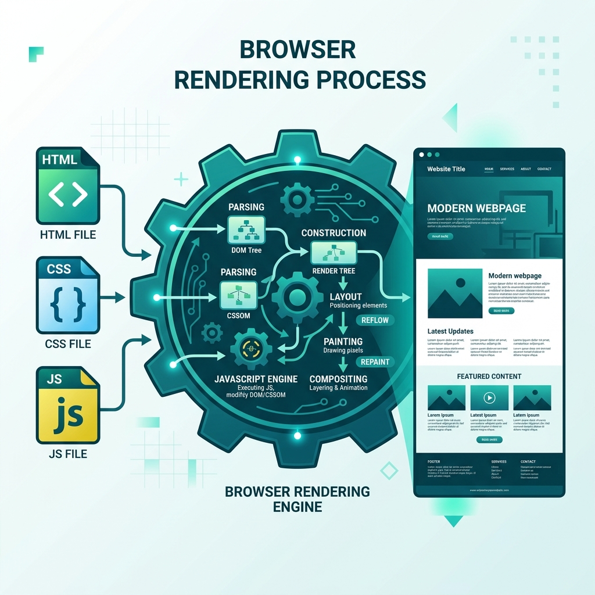

---

- **Die drei dominierenden Engines (Stand 2026):**
  - **Blink** (Chromium-Projekt: Google Chrome, Microsoft Edge, Opera, Brave).
  - **Gecko** (Mozilla Firefox).
  - **WebKit** (Apple Safari).

---
<!-- _class: img-right -->

### Webseiten sind kein starres PDF!
- **Das fluide Web:** html ist flexibel!
- **Einflussfaktoren:** Display-Größe (Mobil bis Desktop), Betriebssystem, Auflösung, installierte Schriften, Benutzereinstellungen.
- **Paradigmenwechsel beim Design:**
  - *Früher:* Der starre Versuch, Webseiten überall exakt identisch aussehen zu lassen („Pixel-Perfect“).
  - *Heute:* **Responsive & Adaptive Webdesign** (Layouts fließen und passen sich dynamisch an).


---


### Wann ist ein Layout „korrekt“?

<br>

> Darstellungsunterschiede zwischen Browsern sind normal – solange die **Funktionalität & Usability** gewährleistet bleibt!

---
<!-- _class: img-right -->
**Die 4 goldenen Regeln der Usability:**
  1. **Lesbarkeit:** Alle Texte müssen
  ungehindert lesbar sein.
  2. **Navigation:** Bedienelemente müssen auffindbar sein & wie erwartet reagieren.
  3. **Interaktivität:** Formulare müssen sich problemlos ausfüllen & absenden lassen.
  4. **Logik:** JavaScript-Funktionen müssen fehlerfrei laufen & das richtige Ergebnis liefern.

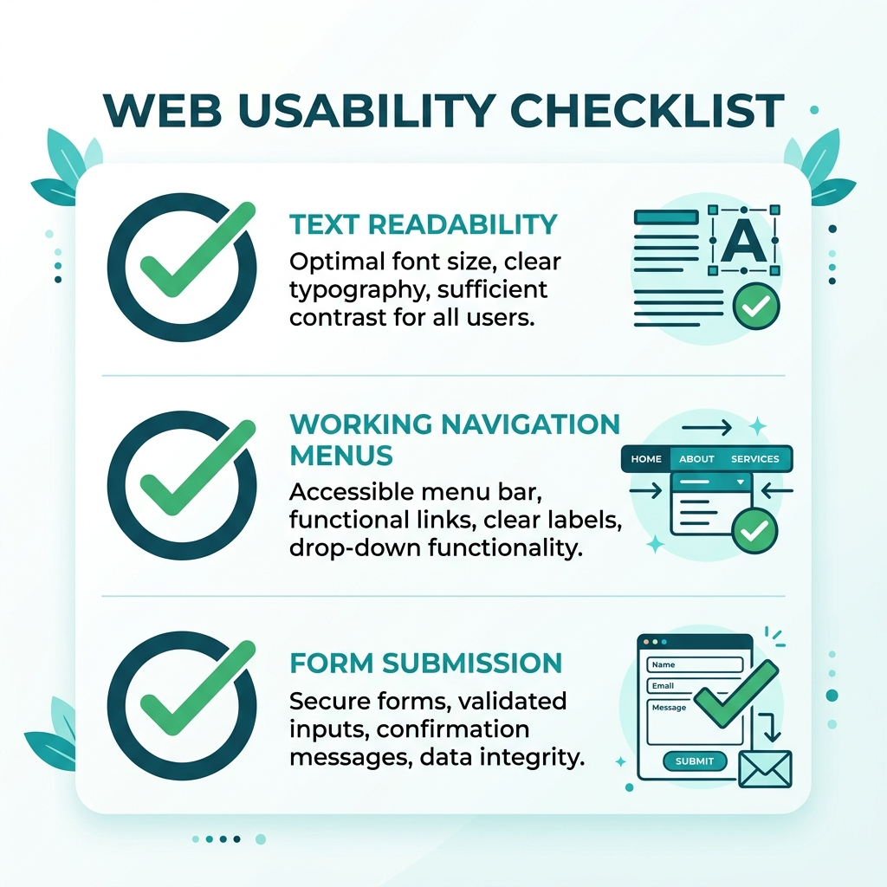

---

<!-- _class: img-right -->

### Die Browser-Welt: Marktanteile
- **Google Chrome:** ~70% (Dominant auf Desktop und Android).
- **Apple Safari:** ~15% (Starker Marktanteil durch iOS).
- **Microsoft Edge:** ~5% (Stärker auf Windows-Desktops).
- **Mozilla Firefox:** ~2% (Unabhängige Alternative).
- *Tipp:* Marktanteile variieren regional stark – in den USA liegt Safari z. B. bei über 30%.
- **Quelle:** [Statcounter Global Stats](https://gs.statcounter.com/)


---
<!-- _class: img-right -->

**Technischer Vergleich & Engines**
**Blink (Chrome, Edge, Opera, Brave):**
  - Schnelle V8 JavaScript Engine, größte Erweiterungsauswahl.
  - *Kritik:* Hoher Arbeitsspeicherverbrauch (RAM).


---
<!-- _class: img-right -->

**WebKit (Safari):**
  - Extrem akkuschonend und tief in macOS/iOS integriert.
  - Standardbrowser auf allen Apple-Geräten.
  - *Kritik:* Manchmal zögerliche oder verzögerte Unterstützung neuer Webstandards.


---
<!-- _class: img-right -->

**Gecko (Firefox)**

  - Unabhängig und quelloffen. Starke Datenschutzfeatures (Container-Tabs).
  - *Tipp:* Beste DevTools für CSS Grid/Flexbox.
- **Quelle:** [Can I use...](https://caniuse.com/)


---


**Praxistipps für Webentwickler**
- **Cross-Browser-Testing:** Teste deine Webseiten immer auf mindestens drei unterschiedlichen Rendering-Engines (Blink, WebKit, Gecko).
- **Kompatibilität prüfen:** Nutze [Can I use...](https://caniuse.com/) vor dem Einsatz neuer CSS-/JS-Features.
- **DevTools gezielt einsetzen (F12):**
  - Firefox für Layout-Debugging (Grid/Flexbox).
  - Chrome für Performance- und JavaScript-Analysen.
- **Quelle:** [MDN Web Docs](https://developer.mozilla.org/)

---
### Der Browser-Cache in der Webentwicklung
- **Definition:** Lokaler Pufferspeicher des Webbrowsers, der bereits heruntergeladene Ressourcen (Bilder, CSS, JS, HTML) auf dem Rechner des Nutzers zwischenspeichert.
- **Vorteile:** 
  - **Page Speed:** Beschleunigt das Laden von Folgeseiten erheblich.
  - **Netzwerkschonung:** Reduziert den Datenverkehr und entlastet den Webserver.
- **Das Entwickler-Problem:** 
  - Änderungen an CSS- oder JS-Dateien werden beim einfachen Neuladen oft nicht angezeigt, weil der Browser die veraltete Version aus dem Cache lädt.
---
<!-- _class: img-right -->

### Entwicklertools: Werkzeuge für Profis
- **Definition:** Die Entwicklertools (oft *DevTools* oder *F12-Tools*) sind ein mächtiges, integriertes Werkzeugset in jedem modernen Browser.
- **Bedeutung:** Das wichtigste Instrument für Webentwickler, um Webseiten live zu analysieren, Fehler zu beheben und Performance zu optimieren.
- **Aufruf:** Taste `F12` oder `Strg + Umschalt + I` (Windows) bzw. `Cmd + Opt + I` (macOS).


---
<!-- _class: img-right -->

### Was du mit den DevTools machen kannst:
- **HTML & CSS inspizieren:** Live-Änderungen am Layout vornehmen und sofort sehen, wie sich das Design verändert.
- **Performance messen:** Ladezeiten analysieren und Optimierungspotenziale identifizieren.
- **Netzwerkverkehr beobachten:** Alle Anfragen an den Server verfolgen und prüfen, ob alle Ressourcen korrekt geladen werden.
- **JavaScript-Code debuggen:** Fehler im Skript finden und die Ausführung schrittweise nachvollziehen.
- **Mobile Ansichten simulieren:** Testen, wie die Webseite auf unterschiedlichen Gerätegrößen und Auflösungen aussieht.


---
<!-- _class: img-right -->

### 1. Elemente (Elements)
- **Das DOM inspizieren:** Zeigt den aktuellen Zustand des **DOM (Document Object Model)** an – also die Live-Baumstruktur aller HTML-Elemente.
- **Live-Editing:** Ermöglicht das temporäre Bearbeiten von HTML-Tags, Attributen und Texten direkt im Browser.
- **CSS-Entwicklung:** Stylesheets einsehen, Regeln an- und ausschalten oder neue CSS-Eigenschaften live testen.

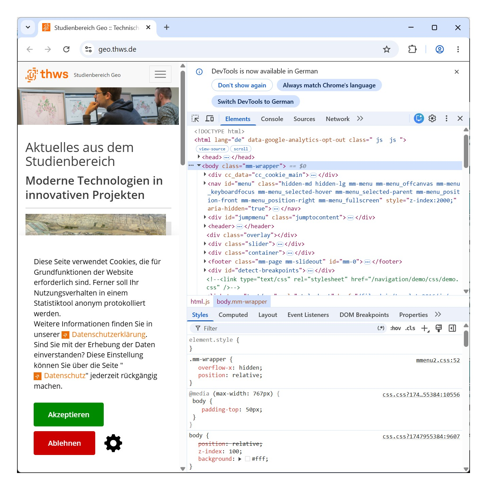

---
<!-- _class: img-right -->

### 2. Konsole (Console)
- **Fehlerprotokoll:** Der zentrale Ort für Fehlermeldungen von JavaScript und Netzwerkproblemen (z. B. blockierte Ressourcen).
- **Interaktivität:** Erlaubt das Ausführen von JavaScript-Befehlen direkt im Kontext der geladenen Seite.
- **Debugging:** Ausgabe von Debug-Informationen mittels `console.log()`.

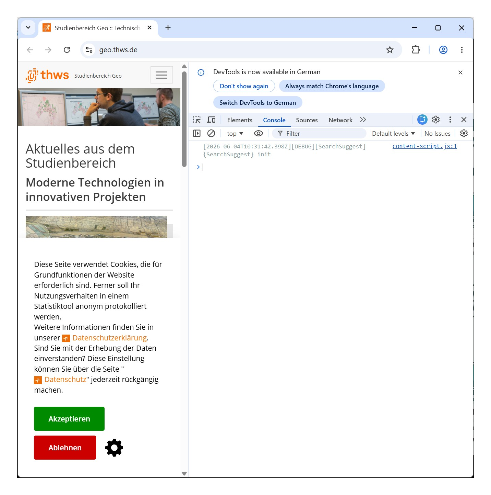

---
<!-- _class: img-right -->

### 3. Netzwerk (Network)
- **Datenverkehr überwachen:** Detaillierte Ansicht aller Ressourcen (HTML, CSS, JS, Bilder), die zwischen Browser und Server ausgetauscht werden.
- **Metriken:** Zeigt Ladezeiten, HTTP-Statuscodes, Dateigrößen und Antwort-Header an.
- **Fehlersuche:** Ideal zum Aufspüren von nicht gefundenen Dateien (404) oder langsamen Ladezeiten.


---
<!-- _class: img-right -->

### 4. Quellen (Sources)
- **Datei-Explorer:** Zeigt alle geladenen Quelldateien der Website an.
- **Code-Debugging:** Ermöglicht das Setzen von **Breakpoints** in JavaScript.
- **Schritt-für-Schritt-Ausführung:** Der JS-Code kann an bestimmten Zeilen angehalten und Variablen-Werte live inspiziert werden.

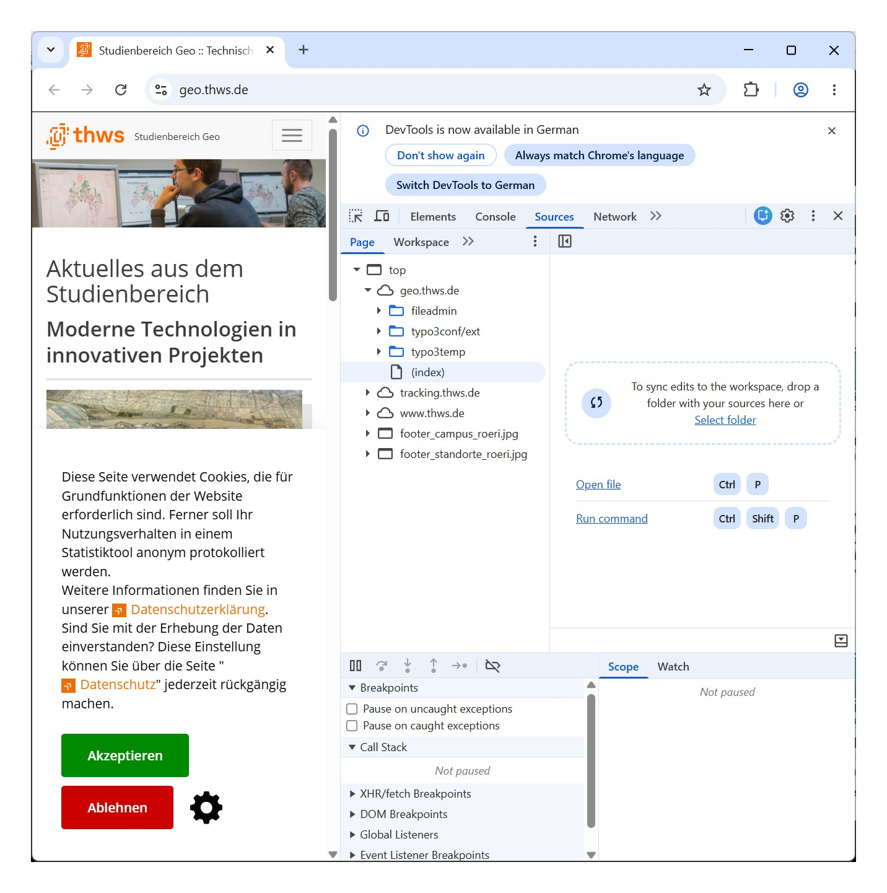

---
<!-- _class: img-right -->

### 5. Performance & Lighthouse
- **Laufzeit-Analyse:** Aufzeichnung und Analyse der Rendering-Performance der Seite.
- **Lighthouse-Audits:** Automatisierter Report von Google zu den vier Kernbereichen:
  - Performance (Ladezeit)
  - Accessibility (Barrierefreiheit)
  - Best Practices
  - SEO (Suchmaschinenoptimierung)


---
<!-- _class: img-right -->

### Praxistipp: Responsive Design testen
- **Geräte-Modus:** Simuliert verschiedene Smartphones und Tablets (z. B. iPhone oder Pixel) direkt auf dem Bildschirm.
- **Touch-Simulation:** Mauszeiger wird zum Touch-Cursor, um Wisch-Gesten und Touch-Events zu testen.
- **Viewport-Flexibilität:** Beliebiges Skalieren der Breite, um die Breakpoints des CSS-Layouts zu prüfen.

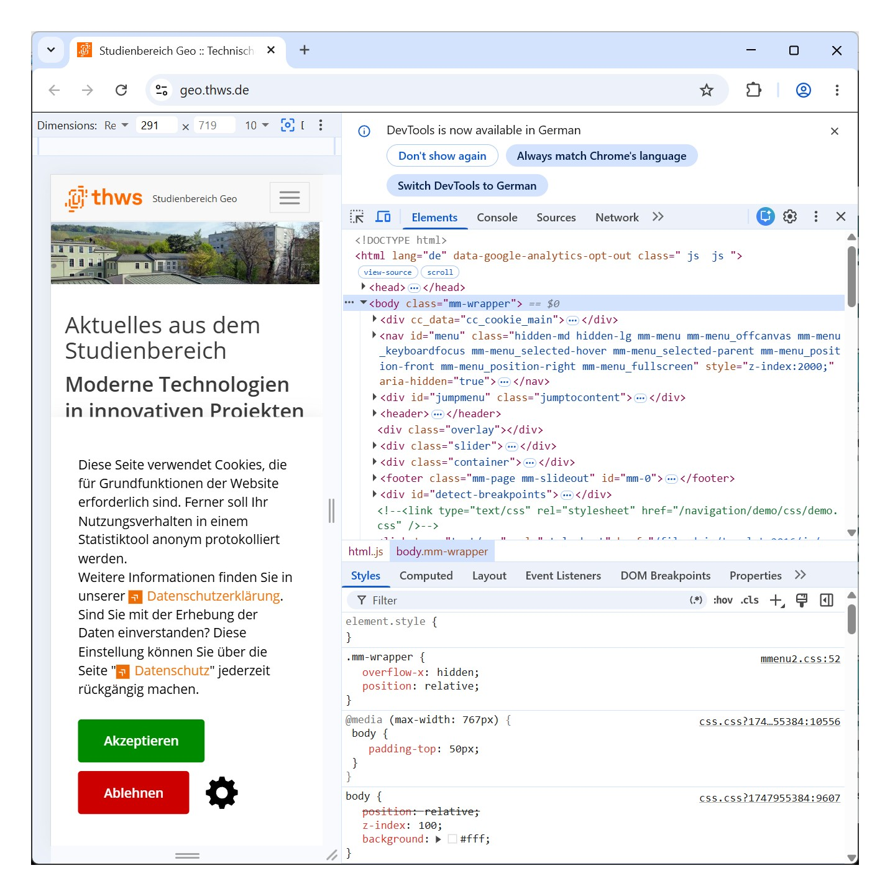

---

**Zusammenfassung der Tools:**

| Reiter | Hauptzweck |
|---|---|
| **Elemente** | HTML/CSS-Struktur und Live-Styling |
| **Konsole** | Debugging von JavaScript-Fehlern |
| **Netzwerk** | Analyse des Datenverkehrs & Ladezeiten |
| **Quellen** | Code-Navigation und Breakpoints |
| **Lighthouse** | Automatisierte Qualitätsprüfungen (Performance, SEO, Barrierefreiheit) |

---

### Formatierung von Webseiten mit CSS: Einführung
- **Früher: Vermischung von Inhalt und Design**
  - Jedes HTML-Element erhielt direkte Formatierungsanweisungen (z. B. `<font color="red">` oder `<b>`).
  - Dies führte zu unlesbarem Code und enormem Pflegeaufwand bei großen Websites.
- **Heute: Separation of Concerns (Trennung der Zuständigkeiten)**
  - **HTML** beschreibt ausschließlich die **Struktur & Semantik** (z. B. Überschriften, Absätze).
  - **CSS** bestimmt das komplette **visuelle Layout** (Layout, Farben, Typografie).

---

**Beispiel**

```html
<!-- index.html -->
<link rel="stylesheet" href="style.css">
<h1>Meine Überschrift</h1>
```
```css
/* style.css */
h1 { color: #ff6a00; font-size: 24px; font-weight: bold; }
```

---

**Was ist CSS? (Cascading Style Sheets)**

- **Bedeutung:** Übersetzt *Gestufte Gestaltungsbögen*. CSS ist ein lebendiger Standard (*Living Standard*), der vom W3C ständig weiterentwickelt wird.
- **Die Kaskade (Cascading):** Legt fest, welcher Style gewinnt, wenn sich Regeln widersprechen. Spezifischere Regeln überschreiben allgemeinere.
- **Das Vererbungskursmodell:** Übergeordnete Elemente vererben Styles an Kind-Elemente (z. B. eine im `<body>` definierte Schriftart gilt für alle Texte darin).

---

**Beispiel**

```css
body {
  font-family: 'Outfit', sans-serif;
  color: #333333; /* Gilt für das gesamte Dokument */
}

h1 {
  color: #005564; /* Überschreibt die vererbte Farbe für h1-Elemente */
}
```

---

**Selektoren & Mediensteuerung**

- **Selektoren:** Bestimmen präzise, welche HTML-Elemente formatiert werden.
  - **Elementname:** `a { color: blue; }` (alle Hyperlinks)
  - **Klasse:** `.highlight { background: yellow; }` (beliebige Elemente mit `class="highlight"`)
  - **ID:** `#main-header { font-size: 2em; }` (einzigartiges Element mit `id="main-header"`)
- **Mediensteuerung (Media Queries):** CSS ermöglicht unterschiedliche Formatierungen je nach Ausgabemedium (z. B. optimierte Druckansicht oder angepasstes Layout für Mobilgeräte).

---

**Beispiel**

```css
/* Normales Styling für Desktop */
body { font-size: 16px; }

/* Spezielles Styling für Smartphones (Breite maximal 600px) */
@media (max-width: 600px) {
  body {
    font-size: 14px;
    background-color: #f8f9fa;
  }
}
```
---

> Und nun?
Learning by Doing!


---
<!-- _class: structural -->
## Start Coding: Nur wie? (01)
- Notepad und html
- html Syntax
- Das html Grundgerüst
- Index.html (01)

---

<!-- _class: img-right -->
### Notepad & html

- Webseiten bestehen aus Text
- WYSIWYG Editoren („What You See Is What You Get“) schreiben häufig „schlechten“ und unsauberen Code.
- Daher > Texteditor notepad++ 
- notepad++ "versteht" html & strukturiert Code mit Textauszeichnungen
- Notepad++ > neue leere Textdatei an.
- Für korrekte Textauszeichnungen > notepad++ auf html umstellen


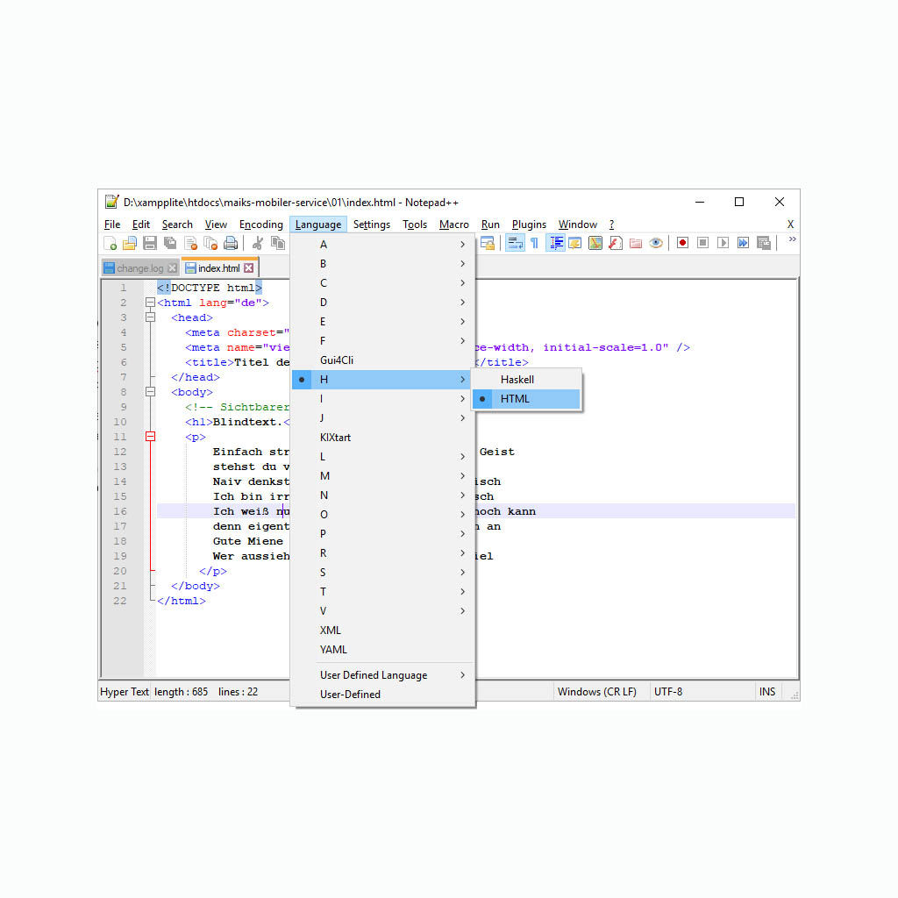

---
<!-- _class: img-right -->
**HTML-Syntax: Die Bausteine des Webs**

- Grundprinzip von HTML ist der sogenannte **Tag** (Markierung).
- Fast jedes HTML-Dokument besteht aus einer Abfolge von Start-Tags, Inhalten und End-Tags, die das Gerüst der Seite bilden.

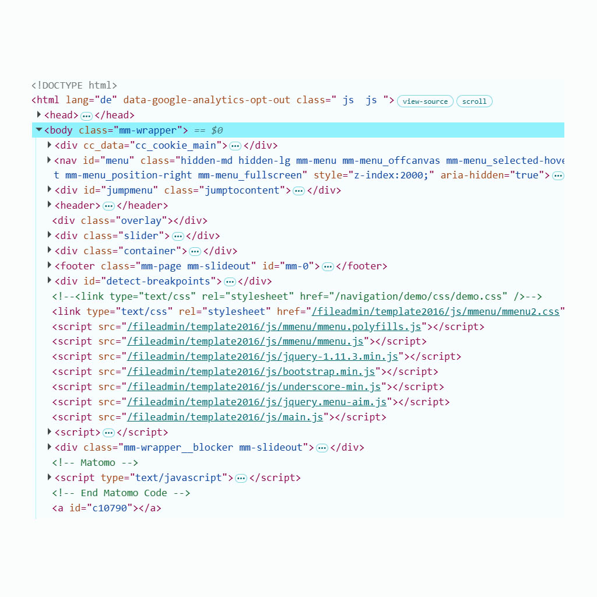

---

**1. Tags und ihre Funktion**
Ein HTML-Tag besteht aus dem englischen Schlüsselwort in spitzen Klammern, z. B. `<p>` für einen Absatz oder `<h1>` für eine Hauptüberschrift. Fast alle Tags haben einen entsprechenden **Schließenden Tag**, der mit einem Schrägstrich (`/`) beginnt, z. B. `</p>`. Der Inhalt, der formatiert werden soll, steht zwischen diesen beiden Tags.

**Beispiel für einen Absatz:**

```html
<p>Hier steht der Text, den der Browser als neuen Absatz darstellt.</p>
```

---

**2. Attribute: Zusätzliche Informationen**
- Tags können durch sogenannte **Attribute** ergänzt werden
- Attribute stellen zusätzliche Informationen bereit
- Attribute stehen immer im Start-Tag & bestehen aus einem Attributnamen, einem Gleichheitszeichen und dem dazugehörigen Wert in Anführungszeichen.

**Beispiel für ein Bild mit Attributen:**

```html

```

In diesem Beispiel definieren das Attribut `src` (source) und `alt` (alternative Text) das Bild und dessen Beschriftung für Screenreader und wenn das Bild nicht geladen werden kann.

---
**3. Elemente & leere Elemente**

- HTML-Elemente können Text oder andere Elemente enthalten.
- z.B. Überschrift `<h1>`:  besteht aus einem Start-Tag `<h1>`, dem Inhalt `Meine Überschrift` und dem entsprechenden End-Tag `</h1>`.  
- Es gibt auch sogenannte **leere Elemente** wie `` oder `<br>`
- leere Elemente besitzen keinen Inhalt & somit keinen End-Tag
- Sie werden stattdessen oft mit einem abschließenden Schrägstrich (`<br />`) geschrieben, um anzuzeigen, dass das Element abgeschlossen ist. (Guter Stil, aber nicht notwendig)

---
**Groß- und Kleinschreibung in HTML**
- Keine Case-Sensitivity: HTML-Element- und Attributnamen sind nicht fallsensitiv (Groß-/Kleinschreibung ist für den Browser egal, z. B. <title> vs. <TITLE>).
- Übersichtlichkeit: Eine einheitliche Schreibweise verbessert die Lesbarkeit und Struktur des Codes.
- Historischer Kontext (XHTML): Im älteren Standard XHTML war die Kleinschreibung zwingend vorgeschrieben.
- Heutiger Standard: Die Kleinschreibung hat sich damals unter Entwicklern durchgesetzt und gilt auch heute noch als Best Practice („guter Stil“).

---
<!-- _class: img-right -->
### Das Grundgerüst

- Kopiervorlage.txt öffnen
- Den Code kopieren
- neue html-Datei in notepad++ anlegen
- Code einfügen
- notepad++ auf html umstellen!


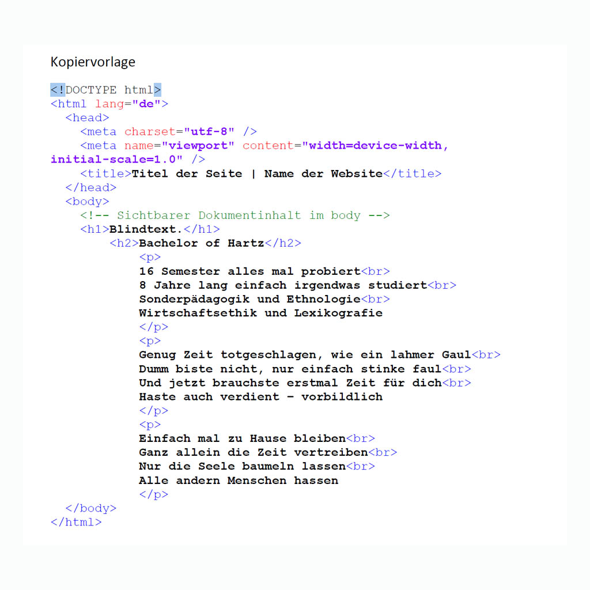

---
### Ein valides HTML-Dokument: Die Bestandteile
- **`<!DOCTYPE html>` (Dokumenttyp-Deklaration):** Steht in der allerersten Zeile und teilt dem Browser mit, dass es sich um HTML5 handelt.
- **`<html>` (Wurzelelement):** Umschließt das gesamte Dokument und definiert die Hauptsprache (z. B. `<html lang="de">`).
- **`<head>` (Kopfbereich):** Umschließt unsichtbare Meta-Informationen (z. B. Zeichensatz `<meta charset="utf-8">`).
- **`<title>` (Seitentitel - PFLICHT!):**
  - Ist im `<head>` platziert und für die Validität der Seite **zwingend vorgeschrieben** (Pflichtelement).
  - Definiert den Text, der im Browser-Tab und in Suchergebnissen (z. B. Google Search) erscheint.
- **`<body>` (Inhaltsbereich):** Umschließt alle sichtbaren Elemente einer Webseite (Texte, Bilder, Links, etc.).

---

**Minimales valides HTML5-Grundgerüst**
Ein voll funktionsfähiges und standardkonformes HTML-Dokument sieht minimal so aus:

```html
<!DOCTYPE html>
<html lang="de">
<head>
    <meta charset="utf-8">
    <title>Meine erste Webseite</title>
</head>
<body>
    <h1>Hallo Welt!</h1>
    <p>Dies ist ein valides HTML5-Dokument.</p>
</body>
</html>
```

---
### Code-Einrückung (Indentation)
- **Für den Browser:** Völlig egal. Browser ignorieren überflüssige Leerzeichen (Whitespaces) und Zeilenumbrüche im Quelltext.
- **Für den Entwickler:** Essentiell für die Lesbarkeit. Man erkennt auf den ersten Blick, welche Elemente ineinander verschachtelt sind und ob Tags korrekt geschlossen wurden.
- **Die Grundregel:** Jedes Kind-Element (untergeordnetes Element) wird um eine Stufe (meist 2 oder 4 Leerzeichen oder 1 Tabulator) weiter eingerückt als sein Eltern-Element.

```html
<ul> <!-- Übergeordnetes Eltern-Element -->
    <li>Erster Eintrag</li> <!-- Untergeordnete Kind-Elemente -->
    <li>Zweiter Eintrag</li>
</ul>
```
- **Tipp:** In Notepad++ > `Tab`-Taste zum Einrücken > `Umschalt + Tab` zum „Ausrücken“

---
**Die 5 Elemente des HTML-Grundgerüsts**

- `<!DOCTYPE html>`
- `<html>`
- `<head>`
- `<title>`
- `<body>`

---
<!-- _class: img-right -->
`<!DOCTYPE html>`

- **Dokumenttyp-Deklaration:** in erster Zeile & teilt Browser mit, dass es sich um HTML5 handelt.
- früher Angabe der html-Version erforderlich (z.B. `<!DOCTYPE html PUBLIC "-//W3C//DTD XHTML 1.0 Strict//EN" "http://www.w3.org/TR/xhtml1/DTD/xhtml1-strict.dtd">`)
- Seit HTML5  `<!DOCTYPE html>`.
- rigorose Vereinfachung im Sinne von
Less-is-more

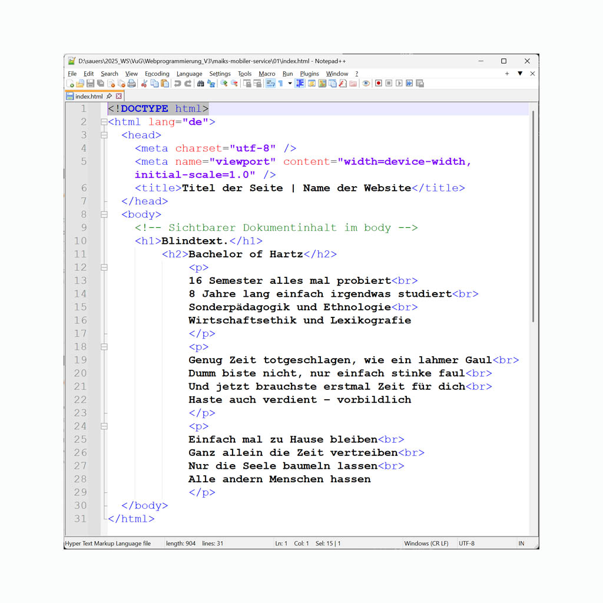

---
<!-- _class: img-right -->
`<html lang="de">`

- ist das **Wurzelelement**
- umschließt die gesamte HTML-Seite
- das Attribut `lang="de"` gibt die Sprache an (hier: Deutsch)
- Alternativ: en, fr, es, ru, etc.
- wichtig für Suchmaschinen & Screenreader

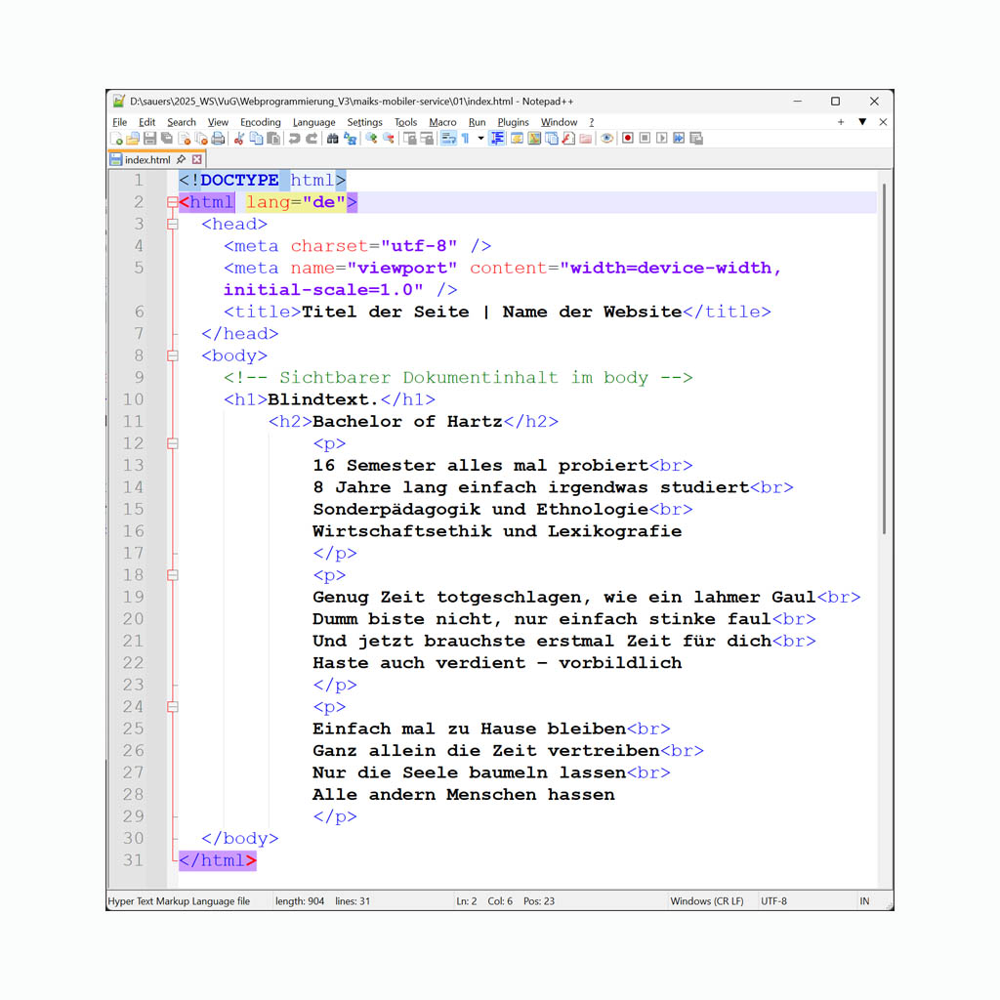

---
<!-- _class: img-right -->
`<head>`

- unsichtbar, aber unverzichtbar
- umschließt unsichtbare Meta-Informationen
- Zeichensatz `<meta charset="utf-8">`
- enthält title-Element (Pflicht für ein valides html-Dokument)
- Enthält Links zu externen CSS-Dateien und JavaScript-Dateien (optional)
- Kann Links zu externen Schriftarten enthalten (z.B. Google Fonts, optional)

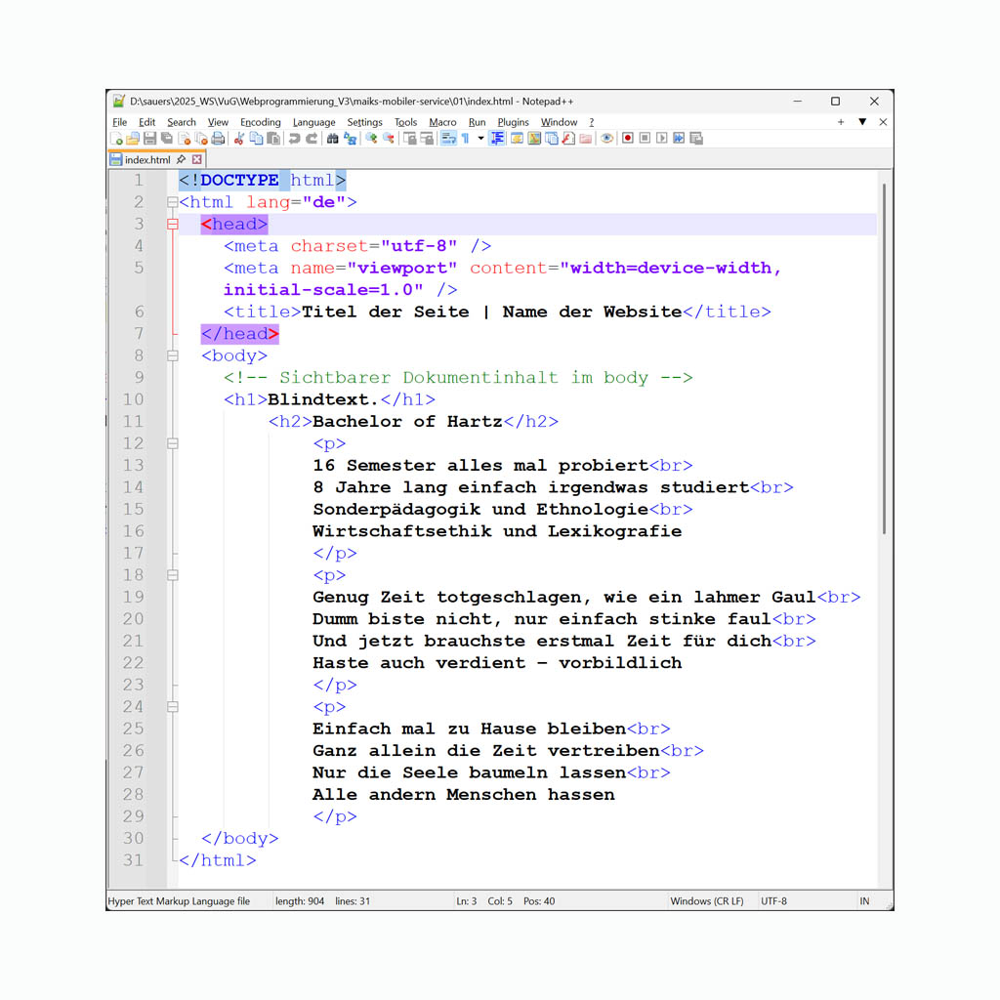

---
<!-- _class: img-right -->
**Zeichensatz-Deklaration im Head**

- `<meta charset="utf-8">`
- Zeichenkodierung festlegen
- für Suchmaschinen & Screenreader wichtig
- korrekte Darstellung von Sonderzeichen, Umlauten und Emojis über verschiedene Betriebssysteme & Browser hinweg.
- erstes Element im `<head>`, vor allen anderen Elementen im `<head>` (nicht zwingend, gilt aber als Best Practice).
- muss innerhalb  erster 512 Bytes des Dokuments stehen

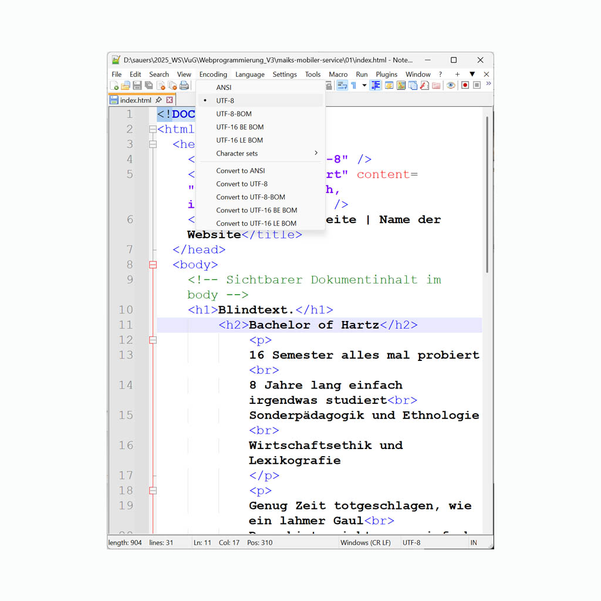

---
<!-- _class: img-right -->

> Wichtig: Das Dokument muss
auch in der Dateikodierung
als UTF-8 gespeichert werden!


---
<!-- _class: img-right -->

**Meta-tag Viewport**
<meta name="viewport" content="width=device-width, initial-scale=1.0" />

- sorgt dafür, dass sich die Webseite an die Bildschirmbreite des Geräts anpasst
- sorgt dafür, dass die Webseite in der korrekten Zoomstufe angezeigt wird
- **unabdingbar für Responsives Webdesign**

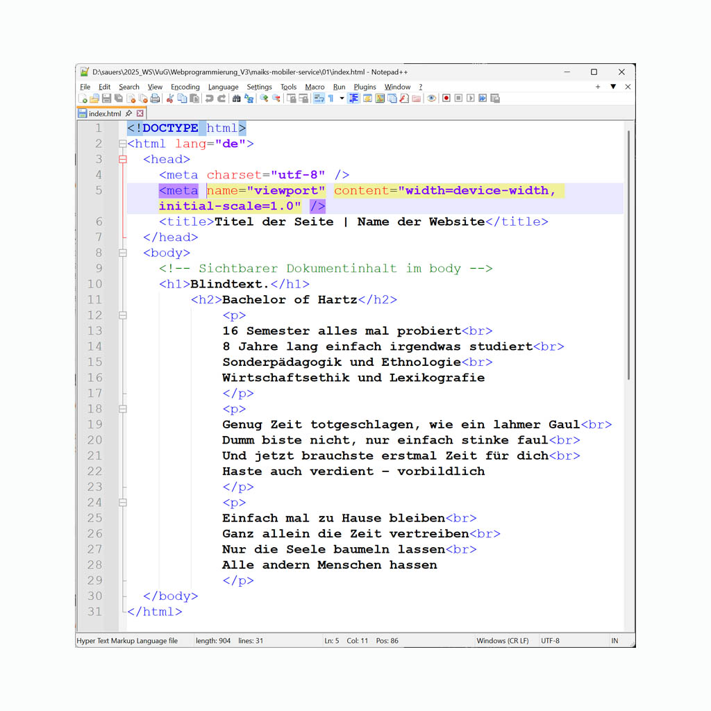

---

**Weitere Meta-Tags im Head**

`<meta name="description" content="Beschreibung meiner Webseite">` (für Suchmaschinen)

`<meta name="viewport" content="width=device-width, initial-scale=1.0">` (für Mobilgeräte)

`<meta name="keywords" content="mobiler Service, Camping, Fahrzeugausbau">` (für Suchmaschinen)

`<meta name="author" content="Maik Mustermann">` (für Suchmaschinen)

`<meta name="robots" content="index, follow">` (für Suchmaschinen)

`<meta name="language" content="German">` (für Suchmaschinen)
...

---
<!-- _class: img-right -->

**<title>**

- umschließt den Titel der Webseite
- erscheint im Browser-Tab und in Suchergebnissen
- für die Validität der Seite **zwingend vorgeschrieben** (Pflichtelement)
- SEO-Relevanz!


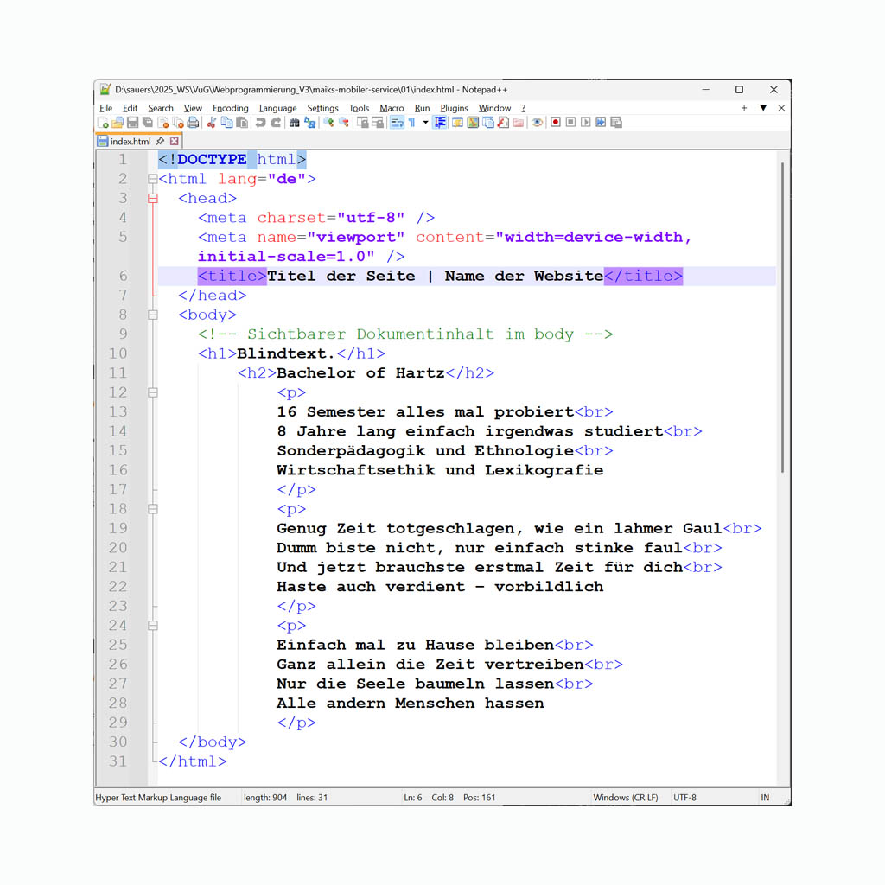

---
<!-- _class: img-right -->
`<body>`

- umschließt alle **sichtbaren** Elemente der Webseite
- Texte, Bilder, Links, Tabellen, etc. sind hier platziert
- Verlinkung von Javascript-Datei (optional) am Ende des body-tags

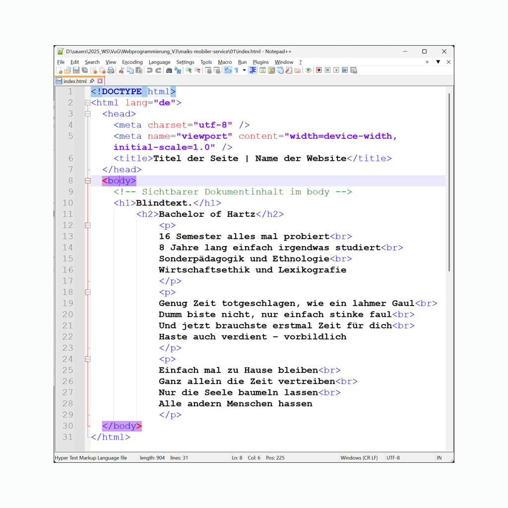

---
<!-- _class: img-right -->

**Weitere Elemente der Kopiervorlage**

`<h1>` – `<h6>` **Überschriften**
- h steht für heading
- Die Zahl gibt die Wichtigkeit der Überschrift an.
- normalerweise reicht h1-h2
- bei technischen Dokumenten h1-h6


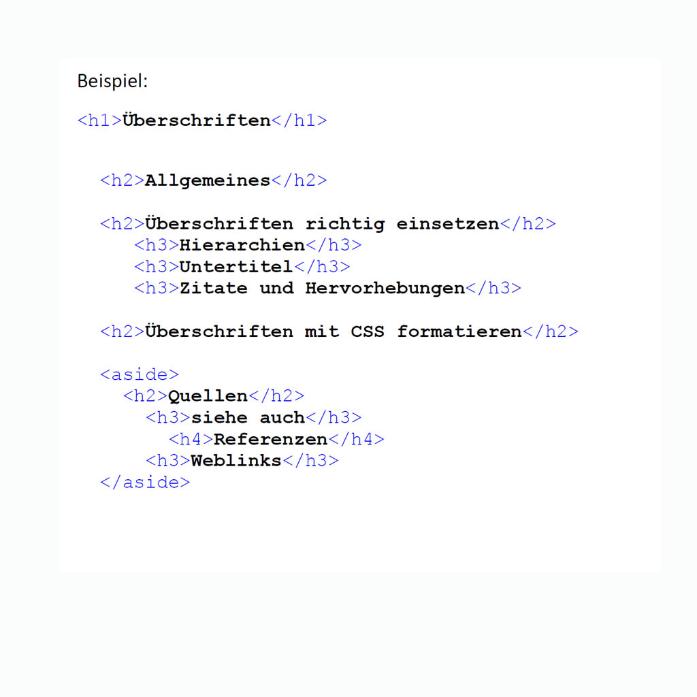

---


> h1 ist semantisch wichtig!
Nicht nur für Darstellung, sondern auch für SEO und Barrierefreiheit.

<br>

> Es ist nur eine h1 pro Seite erlaubt!


---

 `<p>` **Absätze: Gliederung & Syntax**
- **Funktion:** Dienen der Strukturierung von Fließtext in logische Absätze (engl. *paragraph*).
- **Syntax:** `<p>` leitet einen Absatz ein, `</p>` beendet ihn.
- **Schließendes Tag optional?**
  - In HTML5 ist das schließende `</p>` technisch optional (der Browser schließt den Absatz bei bestimmten Folgeelementen implizit).
  - In XHTML ist es zwingend **Pflicht**.
  - **Guter Stil:** Das schließende `</p>` sollte immer angegeben werden. Es umschließt einen zusammenhängenden Textblock – es steht nicht für den Zwischenraum.

---

**Verschachtelung & Abstände bei Absätzen**
- **Keine Block-Elemente im Absatz:** Ein `<p>`-Element darf keine anderen blockerzeugenden Elemente (z. B. Überschriften, Listen `<ul>`, Tabellen `<table>` oder andere Absätze) enthalten.
- **Implizites Schließen:** Erkennt der Browser ein unzulässiges Element innerhalb eines offenen `<p>`, schließt er den Absatz automatisch vorzeitig. Ein späteres schließendes `</p>` ist dann ein verwaister Fehler.
- **Abstände gestalten:**
  - **Falsch:** Leere Absätze (`<p>&nbsp;</p>`) oder mehrere `<br>`-Tags zur Abstandserzeugung missbrauchen.
  - **Richtig:** Abstände sauber über die CSS-Eigenschaft `margin` definieren.


---
**`<br>` :Zeilenumbruch (Line Break)**
- **Bedeutung:** Das `<br>`-Element (*break*) erzeugt einen logischen Zeilenumbruch innerhalb eines Textes.
- **Best Practice:** Nur nutzen, wenn der Umbruch **Bestandteil des Inhalts** ist. Fließtext sollte niemals manuell umgebrochen werden (das regelt der Viewport).
- **Ausnahmen (sinnvoller Einsatz):**
  - Postadressen (wichtig für die korrekte Gliederung der Anschrift).
  - Gedichte, Songtexte oder Liedzeilen.
- **Syntax:** Es ist ein *leeres Element* ohne Inhalt (in HTML `<br>`, in XHTML `<br />` geschrieben, kein End-Tag erforderlich).
- **Quelle:** [SelfHTML: br-Element](https://wiki.selfhtml.org/wiki/HTML/Textauszeichnung/br)

---
### Datei speichern: WIE und WOHIN?
- **Das Grundprinzip:** Bevor Sie Ihre erste HTML-Seite speichern, ist das **WIE** und **WOHIN** in der Webentwicklung von besonderer Bedeutung.
- **Schritt-für-Schritt-Anleitung für XAMPP:**
  1. Öffnen Sie das **XAMPP Control Panel** `1)` und starten Sie den **Apache Webserver** und **MySQL** `2)`.
  2. Öffnen Sie mit **Explorer** `3)` das **XAMPP Root-Verzeichnis** `4)`.
  3. In diesem liegt das **`htdocs`-Verzeichnis** `4)` (dieses wird vom Apache Webserver gehostet).
  4. Legen Sie darin ein **beliebiges Unterverzeichnis** an.
  5. *Empfehlung:* Zur Versionierung empfehlen sich weitere Unterverzeichnisse `5)`.
  6. Nun können Sie im **Notepad++** das HTML-Grundgerüst als HTML-Datei speichern `6)`.

---


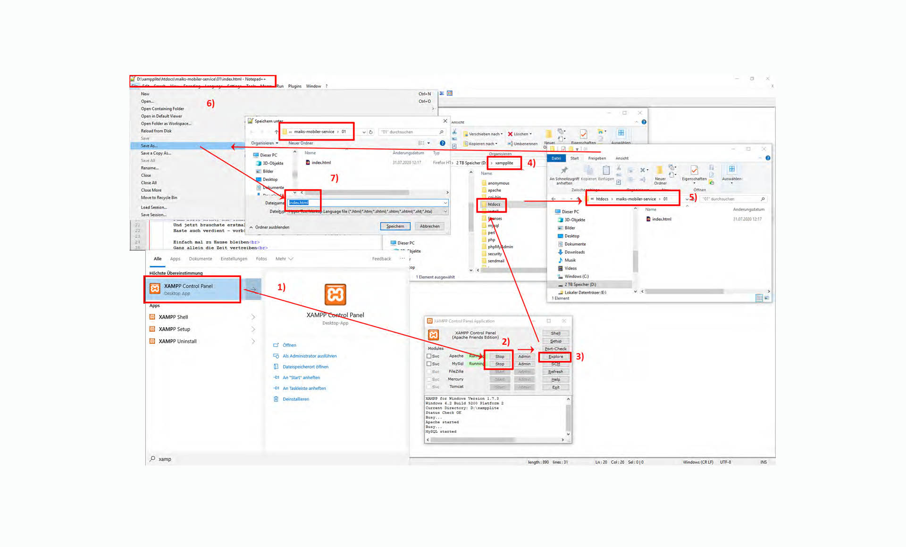


---
**Die Alternative mit dem Mongoose Webserver**

- Projektordner anlegen.
- HTML-Datei als index.html darin abspeichern.
- mongoose.exe herunterladen und in denselben Projektordner kopieren.
- Per Doppelklick ausführen.
- Adresse http://localhost:8080 im Webbrowser aufrufen.
- Wichtiger Sicherheitshinweis zum Thema Mehrfachausführung/Port-Konflikt
und Beenden über den Windows-Infobereich.

---

**Die Startseite (Einstiegsseite)**
- **Definition:** Die Startseite bzw. Einstiegsseite ist dasjenige HTML-Dokument, das standardmäßig ausgeliefert wird, wenn ein Besucher Ihren Webauftritt ohne Angabe einer bestimmten Seite aufruft.
- **Namensgebung:**
  - Wie Sie die Startseite benennen müssen, sodass sie vom Webserver als solche erkannt wird, schreibt Ihr Webspace-Provider vor.
  - Meistens ist der Name `index.html`, `index.htm`, `default.html` oder `default.htm`.
  - Bei manchen Providern können Sie einen beliebigen Namen definieren.
- **Wichtigste Regel:**
  - Die Startseite Ihrer Webseite heißt **IMMER `index.html`**!
  - Beim Aufruf der Domain sucht der Webserver immer nach einer Datei mit diesem Namen, um sie anzuzeigen.

---

<!-- _class: img-right -->

**Darstellen der Seite**

- Webbrowser Chrome undöffnen & Eingabe von:
http://localhost/
- Sollte der Webserver laufen zeigt XAMPP Konfigurationsseite an
- XAMPP hostet Dateien, die im htdocs Verzeichnis liegen und springt automatisch in den Ordner xampp

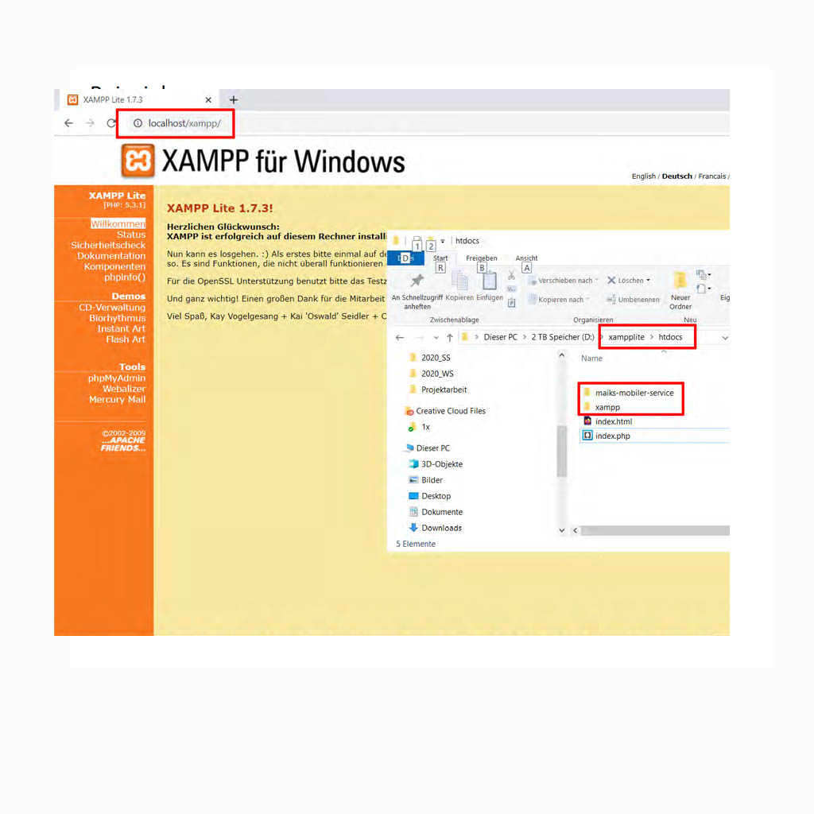

---
<!-- _class: img-right -->

- Um die eigene Webseite anzuzeigen:
-> in das entsprechende Verzeichnis wechseln

Zur Versionierung der Daten > fortlaufende Nummerierung der Verzeichnisse:
http://localhost/maiks-mobiler-service/01/

- Chrome zeigt unsere erste Webseite an.
- Beachten Sie, dass Chrome im Tab den **Title Tag** wiedergibt.
- Beachten Sie ebenfalls die Darstellung des **strukturierten Textes**.

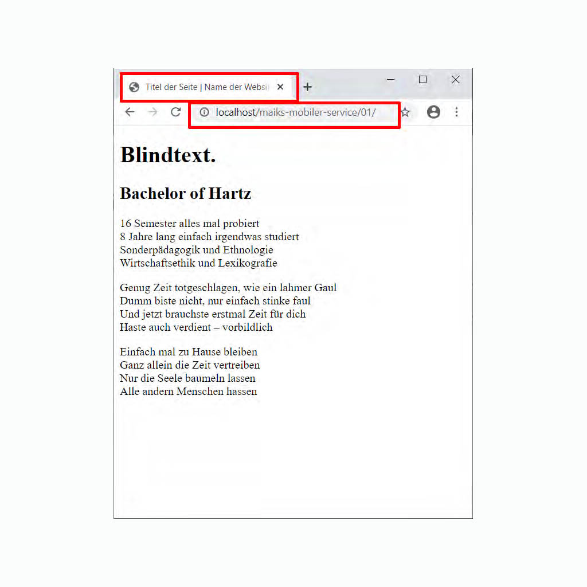

---
**Entwicklertools**
In den Einstellungen > Weitere Tools > Entwicklertools
stellt Chrome Ihnen umfangreiche
Debugging-Werkzeuge zur Verfügung.
>Testen Sie diese.

---

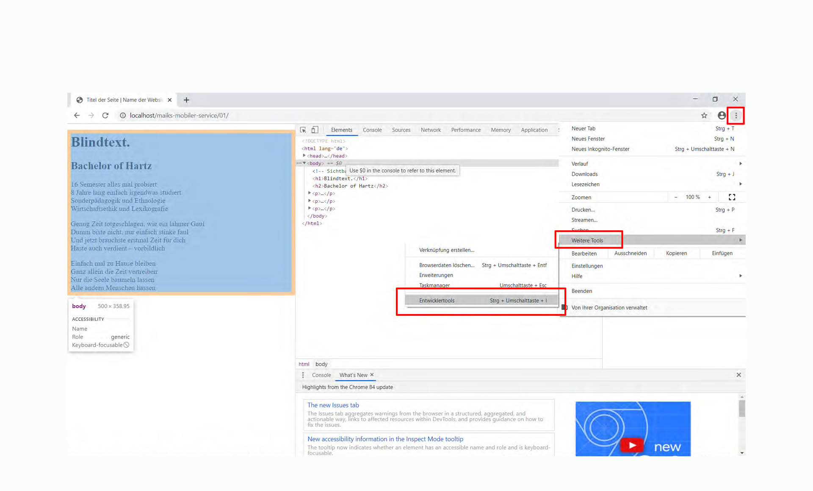

---
<!-- _class: structural img-right -->
## Start Coding: Und los geht`s (02)
- Erste eigene Inhalte (02)
- Bilder
- ... und Texte

---

<!-- _class: img-right -->

### Coden mit Notepad++

**Bilder einfügen**

Als visuelle Menschen sprechen uns als erstes hochwertige und spannende Bilder an. Häufig findet sich auf der Startseite ein aussagekräftiges Bild im Header oder im Seitenhintergrund.

Im Rahmen Ihres Studiums lernen Sie, hochwertige Bilder zu erzeugen und zu verarbeiten. Nutzen Sie diese Fähigkeiten, um einen überzeugenden ersten Eindruck zu hinterlassen.


---

<!-- _class: img-right -->

- neuen Ordner "img" neben index.html anlegen
- "header.jpg" in diesen Ordner kopieren
- Folgenden Code in der index.html einfügen:   


```html
<!-- Sichtbarer Dokumentinhalt im body -->

<h1>Blindtext.</h1>
```
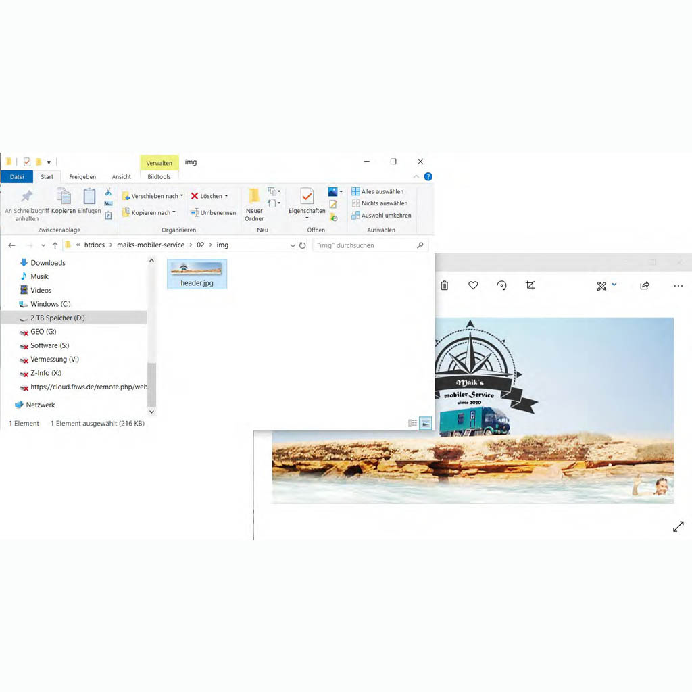

---
**Texte einfügen**

>Herzlich willkommen auf der Webseite von Maik!
Schlimmer geht es nicht!

Wenn Sie gelesen werden wollen:
- Fassen Sie sich kurz.
- Werden Sie originell.
- Transportieren Sie Information.
- Fangen Sie nicht an zu labern.
- Strukturieren Sie Ihre Texte semantisch und inhaltlich!


---
**Think Semantik**

- Semantik ist die Lehre von der Bedeutung
von Zeichen und sprachlichen Ausdrücken.
- Im Zusammenhang mit HTML bezieht sich
Semantik auf die Bedeutung von HTML-Tags.
- HTML-Tags werden verwendet, um die Struktur
und den Inhalt einer Webseite zu beschreiben.
- Semantik ist wichtig, da sie es Suchmaschinen
ermöglicht, den Inhalt einer Webseite zu
verstehen und zu indexieren.

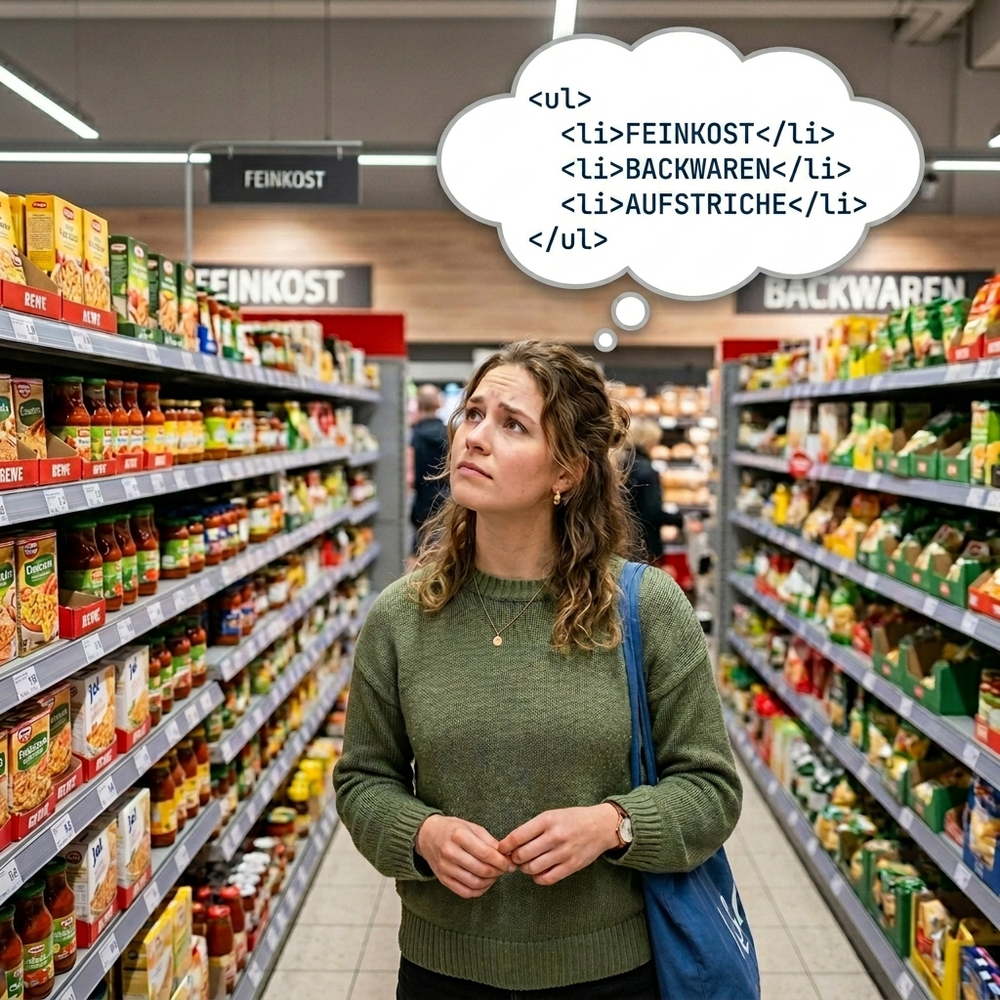

---
<!-- _class: structural -->
### Tags zur Strukturierung von Text
**HTML-Elemente für Semantik und Lesbarkeit**

- Übersicht der wichtigsten Text-Tags
- Eigenschaften von Block- und Inline-Elementen
- Code-Beispiele für die Praxis

---

**Überschriften (h1 - h6)**

Dienen der Strukturierung und Gewichtung:
- **`<h1>` bis `<h6>`**: Abstufung der Wichtigkeit
- **Eigenschaften**:
  - Block-Elemente (erzeugen eine neue Zeile)
  - Suchmaschinen (SEO) nutzen sie zur Gewichtung
  - Pro Seite sollte es nur genau eine `<h1>` geben
- **Code-Beispiel**:
  ```html
  <h1>Hauptüberschrift</h1>
  <h2>Unterüberschrift</h2>
  ```

---

**Textabsätze (p)**

Der Standard für Fließtext:
- **`<p>` (Paragraph)**: Umschließt Textabschnitte
- **Eigenschaften**:
  - Block-Element mit automatischen Abständen
  - Verbessert den Lesefluss durch visuelle Pausen
  - Ignoriert aufeinanderfolgende Leerzeichen im Quelltext
- **Code-Beispiel**:
  ```html
  <p>Dies ist ein Absatz.</p>
  <p>Dies ist der nächste Absatz.</p>
  ```


---

**Ungeordnete Listen (ul)**

Für Sammlungen ohne feste Reihenfolge:
- **`<ul>` (Unordered List)**: Umschließt Listenelemente
- **`<li>` (List Item)**: Einzelne Listenpunkte
- **Eigenschaften**:
  - Block-Elemente
  - Standardmäßig mit Aufzählungspunkten (Bullets)
- **Code-Beispiel**:
  ```html
  <ul>
    <li>HTML5 Semantik</li>
    <li>CSS Styling</li>
  </ul>
  ```


---
**Geordnete Listen (ol)**

Für Abläufe, Rezepte und Anleitungen:
- **`<ol>` (Ordered List)**: Umschließt Listenelemente
- **`<li>` (List Item)**: Einzelne Listenpunkte
- **Eigenschaften**:
  - Block-Elemente
  - Werden automatisch nummeriert (1., 2., 3...)
  - Attribute wie `start` oder `type` möglich
- **Code-Beispiel**:
  ```html
     <ol>
    <li>HTML-Datei anlegen</li>
    <li>Struktur im Browser prüfen</li>
  </ol>
  ```


---

**Zeilenumbruch (br) & Trenner (hr)**

Für feine Text- und Layoutsteuerung:
- **`<br>` (Line Break)**: Erzwingt einen Zeilenumbruch
- **`<hr>` (Horizontal Rule)**: Thematischer Bruch
- **Eigenschaften**:
  - **Leere Elemente** (haben keinen schließenden Tag!)
  - `<br>` wirkt auf Inline-Ebene (bricht nur Text um)
  - `<hr>` wirkt auf Block-Ebene (erzeugt eine Linie)
- **Code-Beispiel**:
  ```html
     Erste Zeile<br>Zweite Zeile
  <hr>
  Anderes Thema...
  ```


---

**Vorformatierter Text (pre & code)**

Für Quellcode und exakte Abstände:
- **`<pre>` (Preformatted)**: Behält alle Leerzeichen und Zeilenumbrüche exakt bei
- **`<code>`**: Kennzeichnet Text als Programmcode
- **Kombination**: `<pre><code>...</code></pre>`
- **Code-Beispiel**:
  ```html
     <pre><code>
    function init() {
    console.log("Start");
  }
  </code></pre>

---

**Starke Betonung (strong)**

Für besonders wichtige Inhalte:
- **`<strong>` (Strong Importance)**: Kennzeichnet Text von großer Bedeutung
- **Eigenschaften**:
  - Inline-Element (fließt im Text mit)
  - Drückt Wichtigkeit, Dringlichkeit oder Ernsthaftigkeit aus
  - Browser stellen den Text standardmäßig **fett** dar
  - Wichtig für Screenreader (akustische Hervorhebung)
  - *Hinweis*: Nutze `<strong>` für Semantik, nicht das rein dekorative `<b>`
- **Code-Beispiel**:
  ```html
     Achtung: Die Steckdose steht <strong>unter Strom</strong>!
  ```

---

**Hervorhebung (em)**

Für sprachliche Betonung:
- **`<em>` (Emphasis)**: Hebt Wörter oder Phrasen im Satz hervor
- **Eigenschaften**:
  - Inline-Element (fließt im Text mit)
  - Ändert je nach betontem Wort die Aussage des Satzes
  - Browser stellen den Text standardmäßig *kursiv* dar
  - Wird von Screenreadern akustisch betont (Intonation)
  - *Hinweis*: Nutze `<em>` für Semantik, nicht das rein dekorative `<i>`
- **Code-Beispiel**:
  ```html
     Das müssen Sie <em>heute</em> noch erledigen!
  ```

---
<!-- _class: structural center -->
### Quick Check: Semantik
**Welches Tag eignet sich am besten für...**

1. ...eine Zutatenliste für eine Pizza?
2. ...eine Schritt-für-Schritt-Anleitung?
3. ...die wichtigste Überschrift der Seite?
4. ...einen einfachen Fließtext?

**Überlegen Sie kurz und besprechen Sie es mit Ihrem Nachbarn!**


---
<!-- _class: img-right -->

Ihre Text-Inhalte fügen Sie nun nach dem Bild ein:
Den Vorlagetext findet Ihr im material-Ordner in der Datei:

**HomeSweetHome.txt**

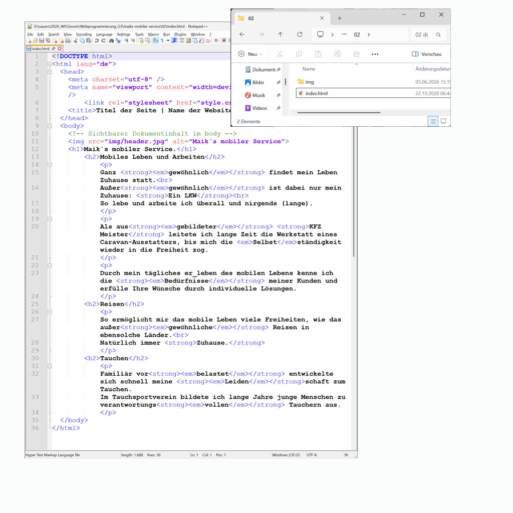

---

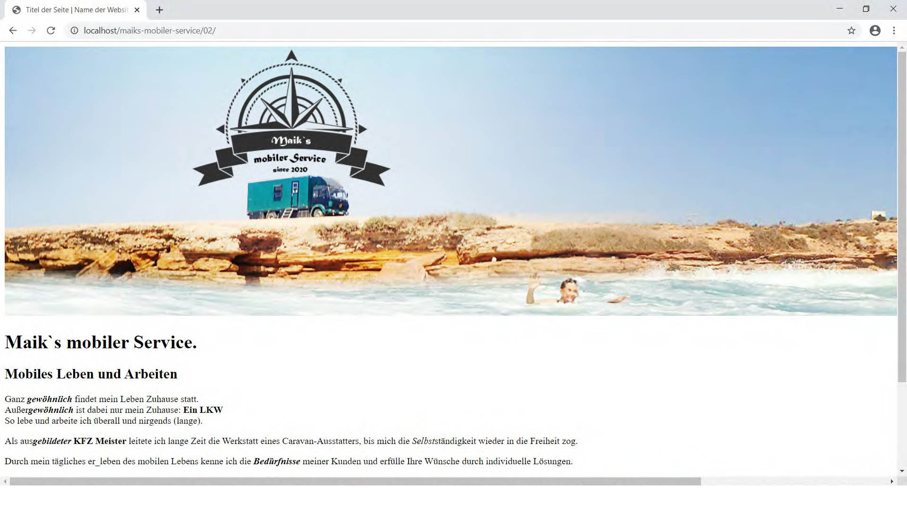

---

### Coden mit Visual Studio Code

Der weltweite Standard für moderne Webentwicklung:
- **Plattformunabhängig & kostenlos**: Läuft auf Windows, macOS und Linux.
- **Riesiger Extension Marketplace**: Tausende Erweiterungen zur Anpassung.
- **IntelliSense**: Intelligente Autovervollständigung für HTML, CSS und JS.
- **Integriertes Terminal & Git**: Alle Werkzeuge an einem zentralen Ort.


---

**Emmet – Schneller HTML schreiben**

Integriertes Feature, das Tipparbeit spart:
- **Funktionsweise**: Kurzschreibweisen eintippen
und mit der **Tab-Taste** expandieren lassen.
- **Wichtige Shortcuts für den Einstieg**:
  - `!` + Tab $\rightarrow$ Erzeugt das komplette
  HTML5-Grundgerüst.
  - `p` + Tab $\rightarrow$ Erzeugt `<p></p>`.
  - `ul>li*3` + Tab $\rightarrow$ Erzeugt eine
  Liste mit 3 Listeneinträgen.
  - `h1{Titel}` + Tab $\rightarrow$ Erzeugt
  `<h1>Titel</h1>`.


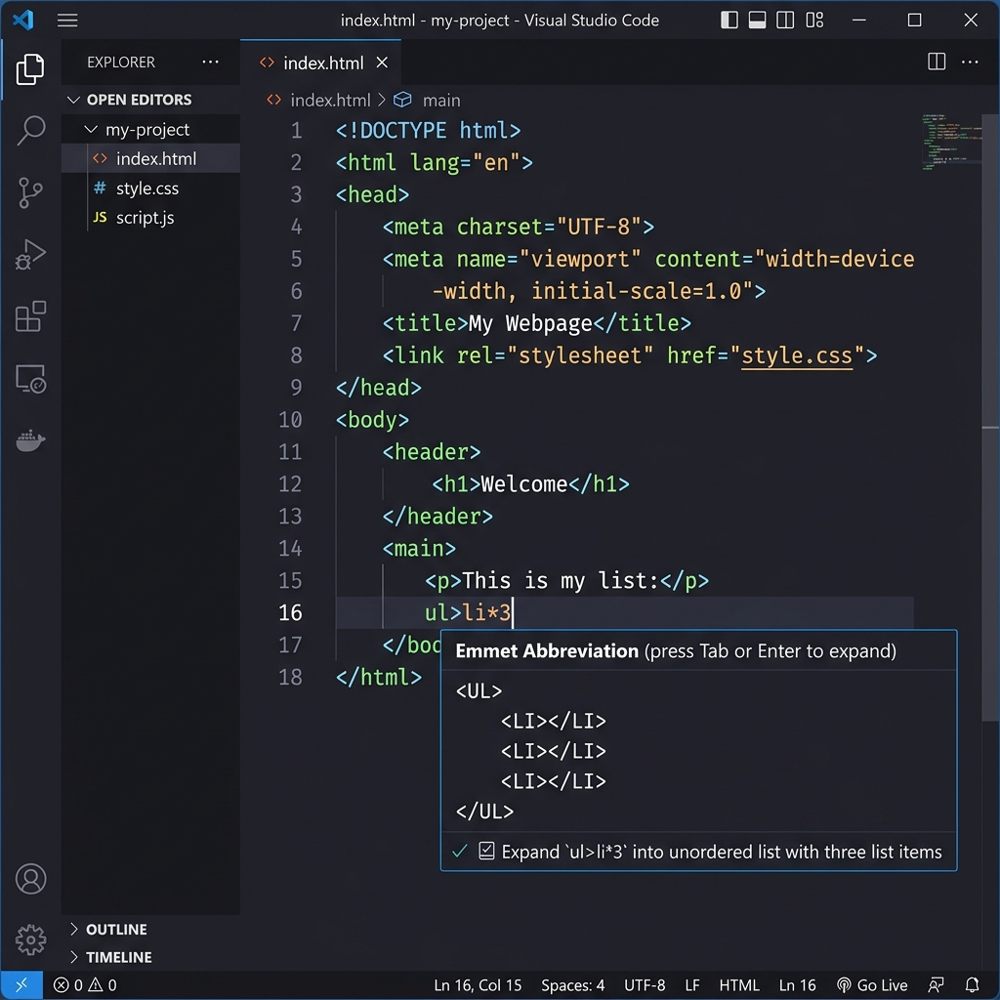

---

**Live Server & Auto-Verwaltung**

Die wichtigsten Erweiterungen für Einsteiger:
- **Live Server (Extension)**:
  - Startet mit einem Klick lokalen Webserver.
  - Aktualisiert den Browser automatisch
  beim Speichern (Live Reload).
- **Auto Rename Tag**:
  - Ändert das schließende Tag automatisch,
  wenn das öffnende Tag geändert wird.
- **Prettier (Code Formatter)**:
  - Formatiert den Code beim Speichern
  automatisch nach festen Regeln.

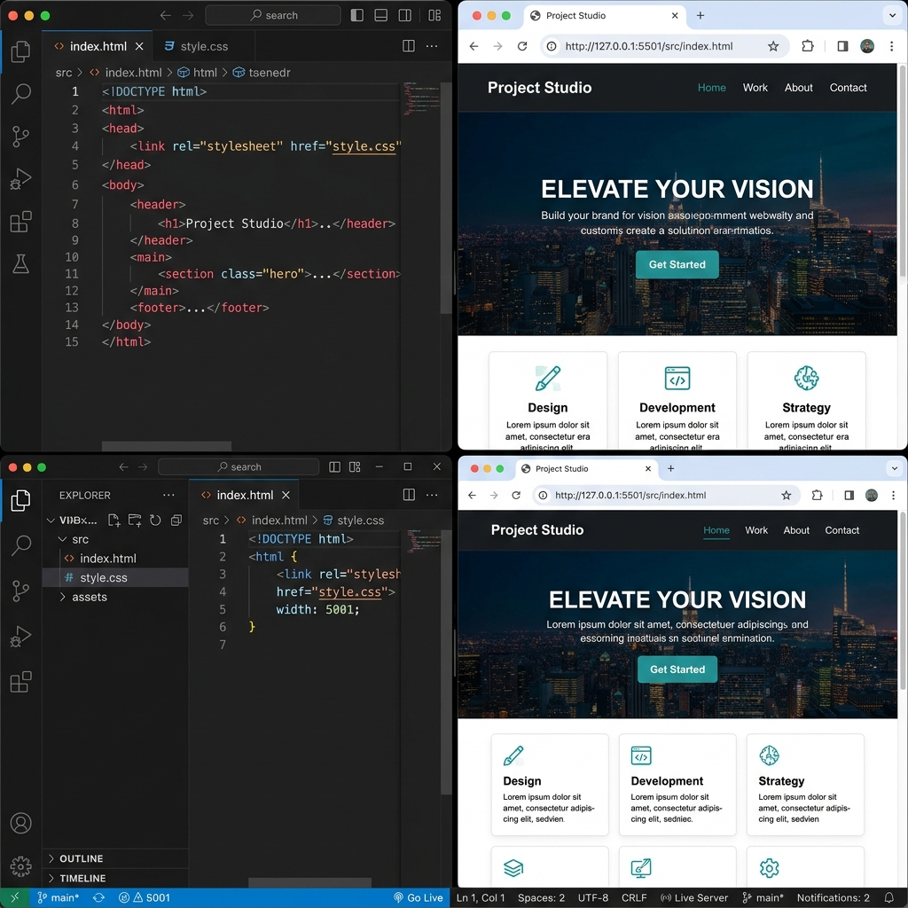

---

**Bedienung: Live Server**

Lokale Entwicklung mit sofortigem Feedback:
- **Starten**: Klicke unten rechts in der Statusleiste
auf **"Go Live"** oder nutze den
Shortcut `Alt + L, Alt + O`.
- **Lokaler Server**: Startet die Seite
unter `http://127.0.0.1:5500/index.html`.
- **Live Reload**: Nach jedem Speichern
(`Strg + S`) lädt der Browser die Seite
automatisch neu. Keine manuelle
Aktualisierung nötig!


---

**Bedienung: Auto Rename Tag**

Verhindert Syntaxfehler durch
unvollständige HTML-Tags:
- **Automatische Anpassung**: Läuft nach der
Installation komplett im Hintergrund.
- **Funktionsweise**:
  - Wenn du ein öffnendes Tag änderst
  (z. B. `<div>` zu `<section>`), wird das
  schließende Tag (`</div>` zu `</section>`)
  zeitgleich angepasst.
- **Vorteil**: Spart Zeit und eliminiert Fehler.

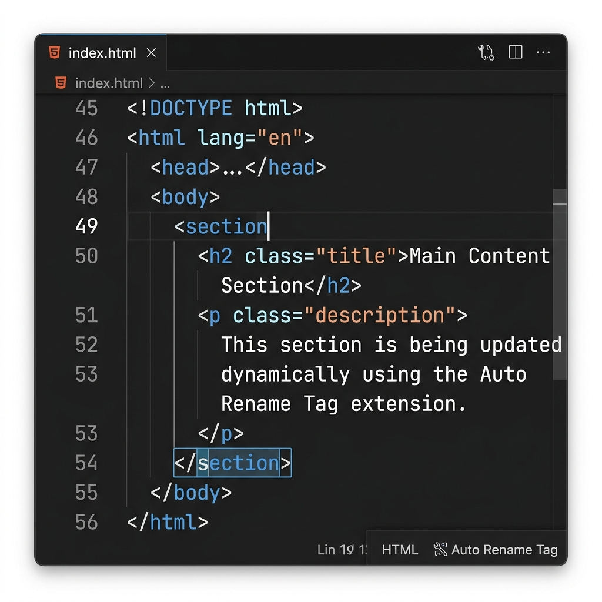

---

**Bedienung: Prettier**

Code-Formatierung per Knopfdruck:
- **Format on Save**: Richtet VS Code so ein, dass
beim Speichern automatisch formatiert wird.
  1. Einstellungen öffnen (`Strg + ,`).
  2. Nach **"Format on Save"**
  suchen und aktivieren.
  3. Prettier als Standard-Formatierer festlegen.
- **Vorteil**: Garantiert saubere Einrückungen
und einheitlichen Code beiDreamteam html & css (03)
jedem Speichern (`Strg + S`).

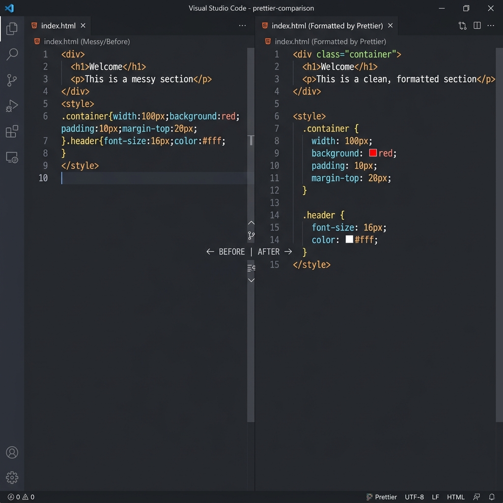

---
<!-- _class: structural img-right -->
## Dreamteam html & css (03)

Webseiten funktionieren auch mit reinem html!
> Aber hübsch ist anders ;)

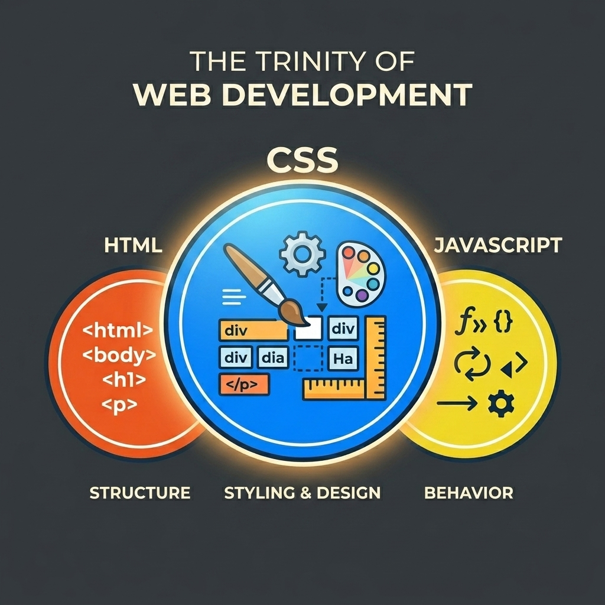

<style scoped>
section.img-right img {
  background-color: #343a40;
}
</style>
---

`<body bgcolor="blue">`
> Das ist tabu!

Das Stylen einzelner Elemente ist möglich aber:
- arbeitsaufwendig
- unübersichtlich
- schwer zu pflegen

**-> Daher css: Trennung von Inhalt und Gestaltung**

---

**CSS-Grundprinzip & Syntax**

Cascading Style Sheets
(Mehrstufige Formatvorlagen):
- **Zweck**: Bestimmt das Design, Layout
und die Darstellung von HTML-Elementen.
- **Grundregel**: Selektor wählt das Element,
Deklarationen definieren das Design.
- **Aufbau einer Deklaration**:
  - **Eigenschaft (Property)**: Was soll
  geändert werden (z. B. `color`)?
  - **Wert (Value)**: Wie soll es
  aussehen (z. B. `blue`)?

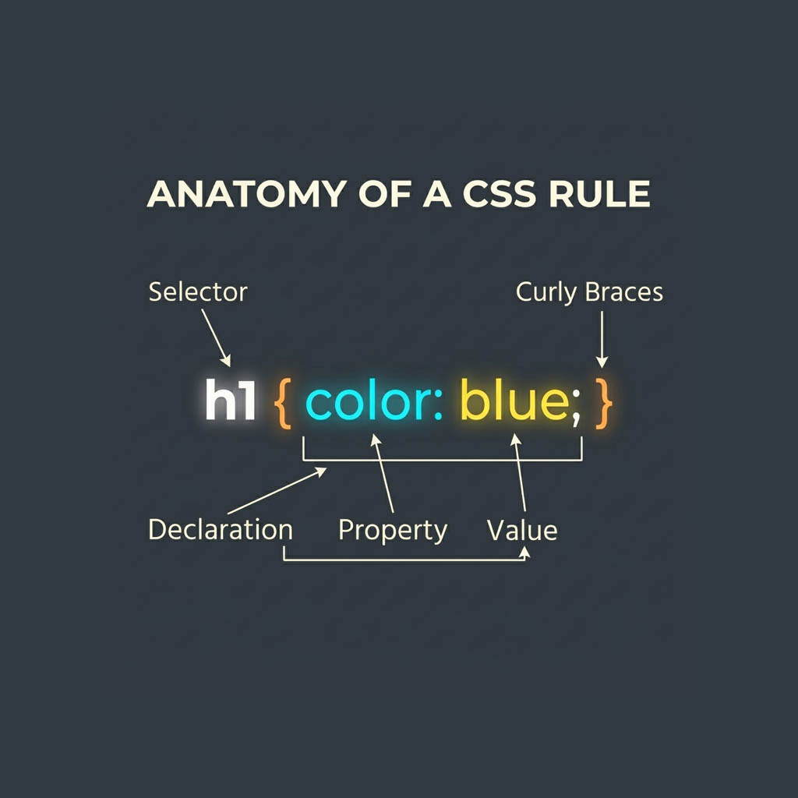

---

**Die drei Wege der CSS-Einbindung**

Wie kommt das CSS-Design in den HTML-Code?
- **1. Inline-Styles**:
  - Direkt im HTML-Tag mit
  dem `style`-Attribut.
- **2. Interne Stylesheets**:
  - Im `<head>`-Bereich in einem `<style>`-Tag.
- **3. Externe Stylesheets (Best Practice)**:
  - In einer eigenen `.css`-Datei
  (z. B. `style.css`).
  - Verknüpfung im `<head>` über
  ein `<link>`-Tag.

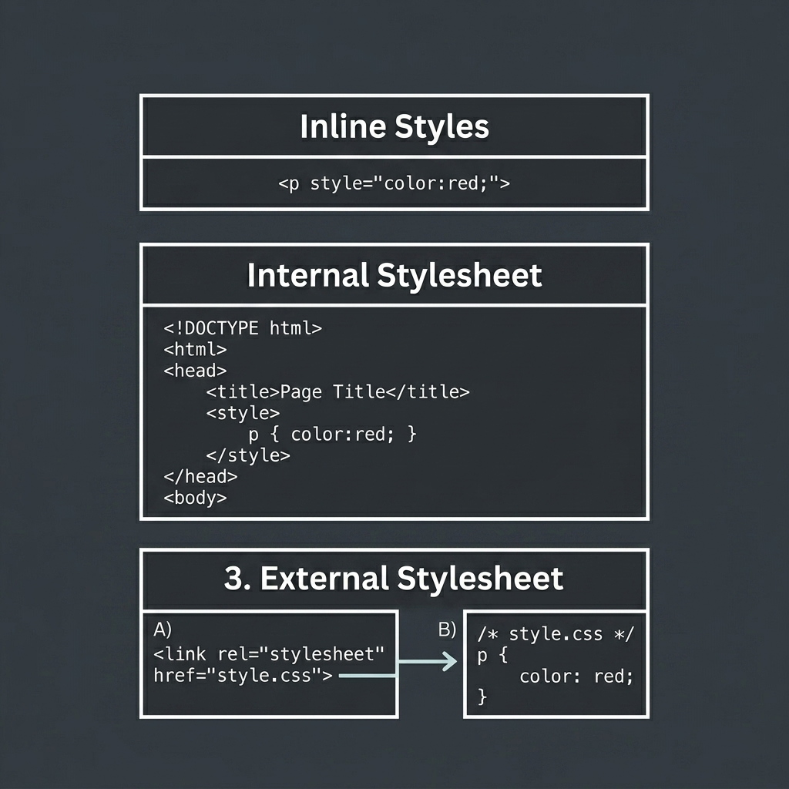

---

**Code-Beispiele der CSS-Einbindung**

- **Inline-Style (Direkt am Element)**:
  ```html
  <p style="color: orange; font-size: 20px;">Maiks Service</p>
  ```
- **Internes Stylesheet (Im HTML-Kopf)**:
  ```html
  <style>
    p { color: orange; font-size: 20px; }
  </style>
  ```
- **Externes Stylesheet (Saubere Trennung)**:
  ```html
  <!-- Im HTML-Kopf verlinkt: -->
  <link rel="stylesheet" href="css/style.css">
  ```

---
**Und wann verwende ich was?**
- Inlinestyle > **Nur in Ausnahmefällen**
- Internes Stylesheet > **Hauptsächlich bei One-Pagern**
vereinfacht die Dateiverwaltung 
- Externes Stylesheet > **Immer verwenden bei größeren Webauftritten**

---

**Das Kaskaden-Prinzip (Cascading)**

Welche CSS-Regel gewinnt, wenn es Konflikte gibt?
- **1. Die Reihenfolge**:
  - Später definierte CSS-Regeln überschreiben frühere Regeln.
- **2. Die Spezifität (Gewichtung)**:
  - Spezifischere Selektoren überschreiben allgemeinere.
  - *Reihenfolge*: Inline-Style $>$ ID-Selektor $>$ Klasse $>$ Element-Tag.
- **3. Die Vererbung (Inheritance)**:
  - Viele Eigenschaften (z. B. `font-family`, `color`) werden an untergeordnete Elemente vererbt.

---


**... wie jetzt?**

Na, Microsoft Word macht das nicht anders:
> Formatvorlagen heißt dort
das Zauberwort


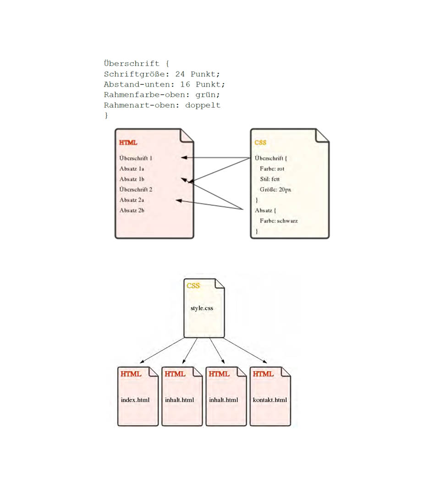

---

**Vererbung in CSS (Inheritance)**

- **Grundprinzip**: CSS-Regeln für ein Element gelten für alle Instanzen dieses Elements auf der Webseite (z. B. Schriftart für alle `<p>`-Elemente).
- **Definition**: Vererbung ist die Übertragung von Eigenschaften von übergeordneten (Eltern-) Elementen auf untergeordnete (Kinder-) Elemente.
- **Vorteil**: Vermeidung redundanter CSS-Regeln – Layouts können effizient an zentraler Stelle gepflegt werden.
- **Vererbte vs. nicht-vererbte Eigenschaften**:
  - *Vererbt*: Text- und Schrifteigenschaften (z. B. `font-family`, `color`, `line-height`).
  - *Nicht vererbt*: Layout- und Box-Eigenschaften (z. B. `margin`, `padding`, `border`, `background-color`).

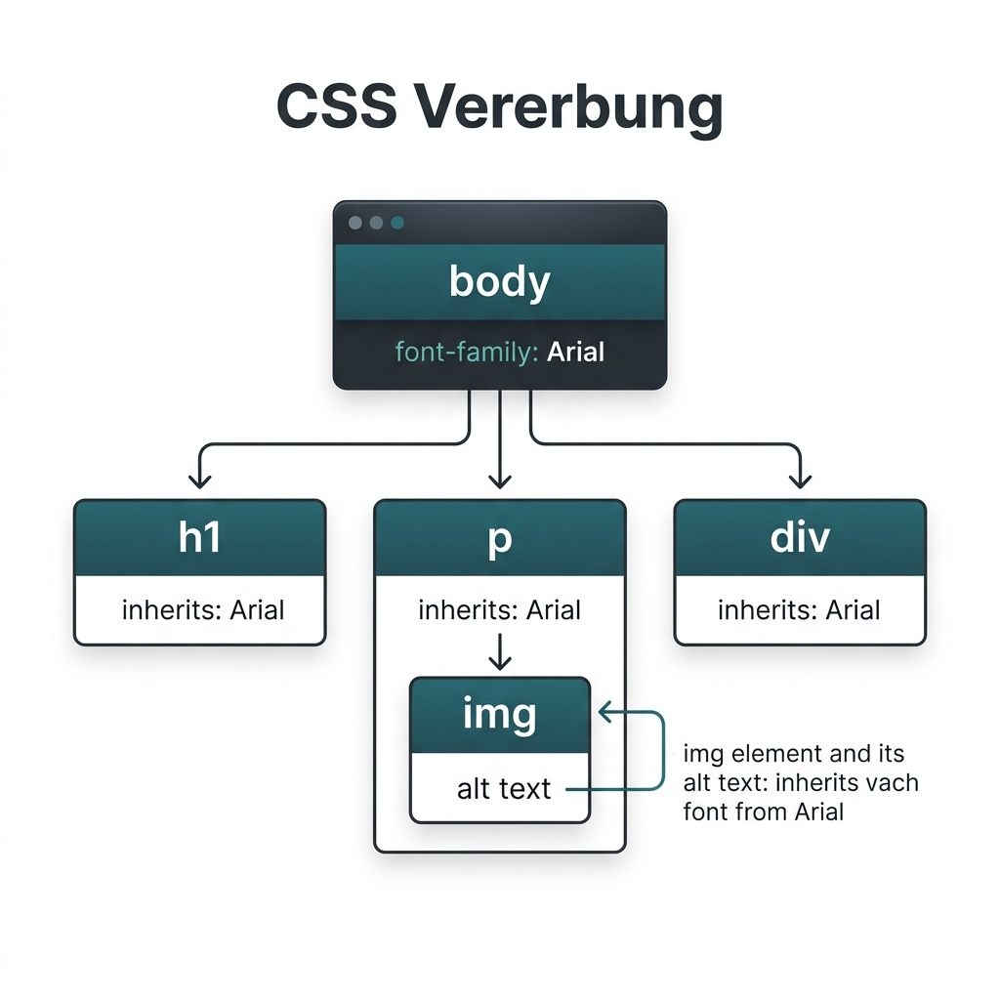

---
**Praxisaufgabe:**

Neues Textdokument, Umbenennen  -> style.css.
Einbinden der style.css in html:

```
<html lang="de"> <head>
<meta charset="utf-8" />
<meta name="viewport" content="width=device-width, initial-scale=1.0" />


<link rel="stylesheet" href="style.css">


<title>Titel der Seite | Name der Website</title>
</head>

```

---

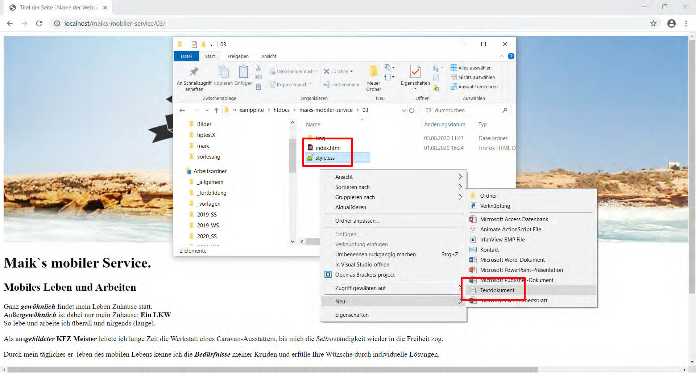

---

**Im css-file dann:**

```

body {
font-family: tahoma,arial,helvetica,verdana,sans-serif;
}

```

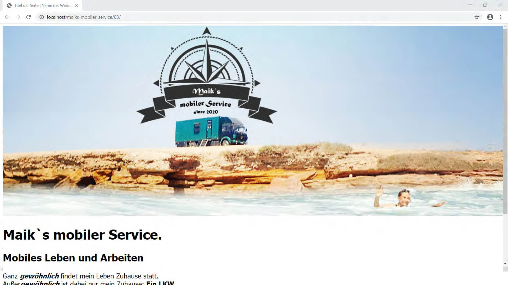


---

**Praxisbeispiele zur Vererbung**

- **Zentrale Standardschriftart**:
  - Wird die Schriftart Arial für das `<body>`-Element festgelegt, gilt sie für alle untergeordneten Elemente.
  - Da alle sichtbaren Elemente vom `<body>` abstammen, fungiert dies als globale Standardschriftart der Seite.
- **Das img-Element & Alternativtext**:
  - Ein Bild (``) selbst ändert sein Aussehen nicht durch Schriftarten.
  - Falls das Bild jedoch nicht geladen werden kann, wird der Alternativ-Text (`alt="..."`) angezeigt.
  - Da das `` dem `<p>`-Element untergeordnet ist, erbt dieser Text automatisch dieselbe Schriftart wie der restliche Absatz.

---

**Weitere css Formatierungen**

```
h1, h2 {
  display: inline;
  color: #FFFFFF ;
  background-color: #303030;
  font-family: "Trebuchet MS", Georgia, Verdana, Geneva, Arial, Helvetica, sans-serif;
  font-size: 1.4em;
  text-align: left;
  margin: 0px;
  padding: 2px;
}
```
---

**display:** inline; 
=>  Schrift wird nicht in einer eigenen Zeile dargestellt
**color:** #FFFFFF ; =>  Schriftfarbe weiß
**background-color:** #303030; =>  Hintergrundfarbe grau
**font-family:** "Trebuchet MS", Georgia, Verdana, Geneva, Arial, Helvetica, sans-serif; 
=>  Schriftart Festlegung
**font-size:** 1.4em; 
=>  Schriftgröße 1,4 mal größer als die Standardschriftgröße
**text-align:** left; =>  Schrift linksbündig
**margin:** 0px; =>  kein Außenabstand
**padding:** 2px; =>  Innenabstand 2px

---

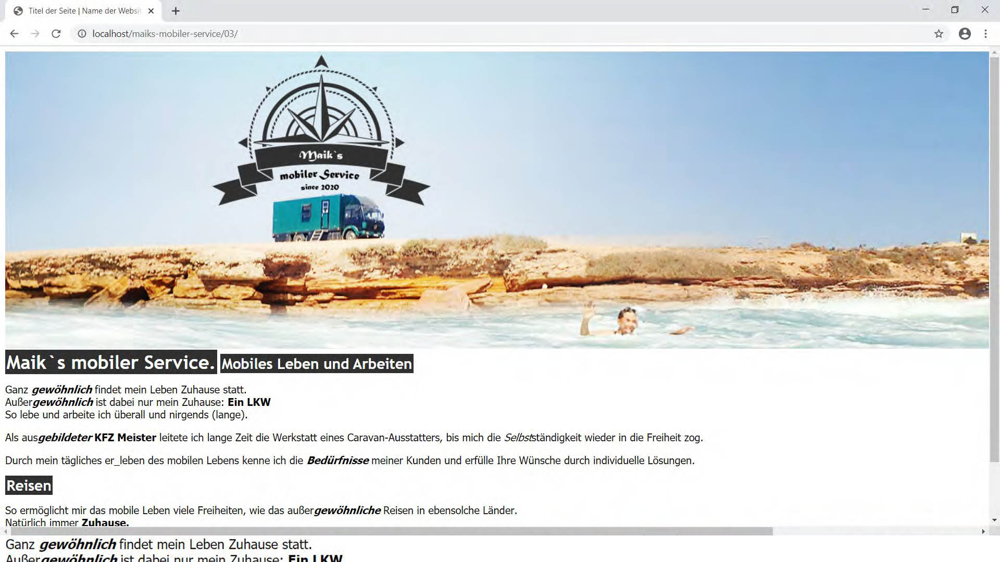


---
<!-- _class: structural-->
