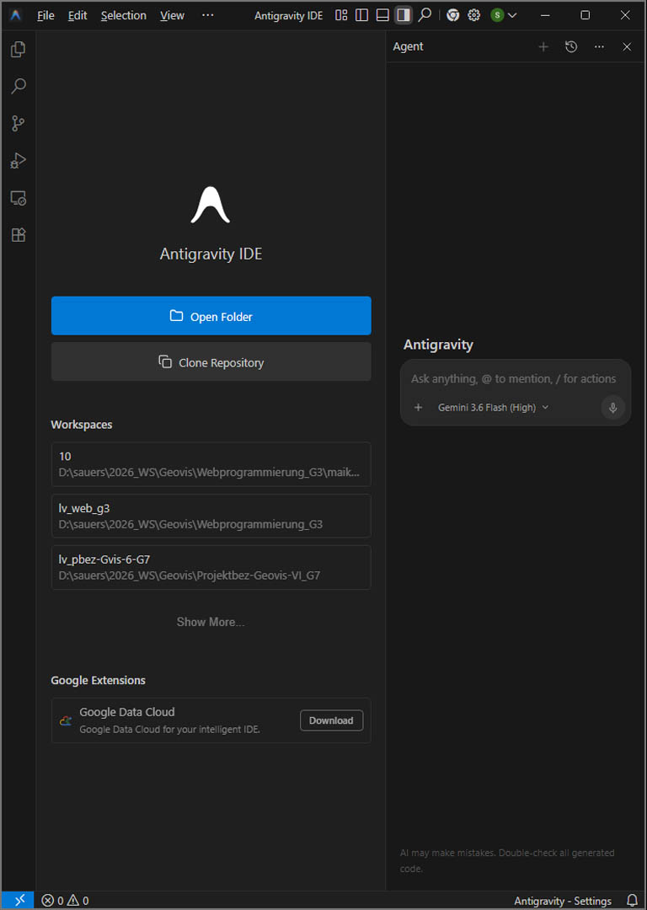
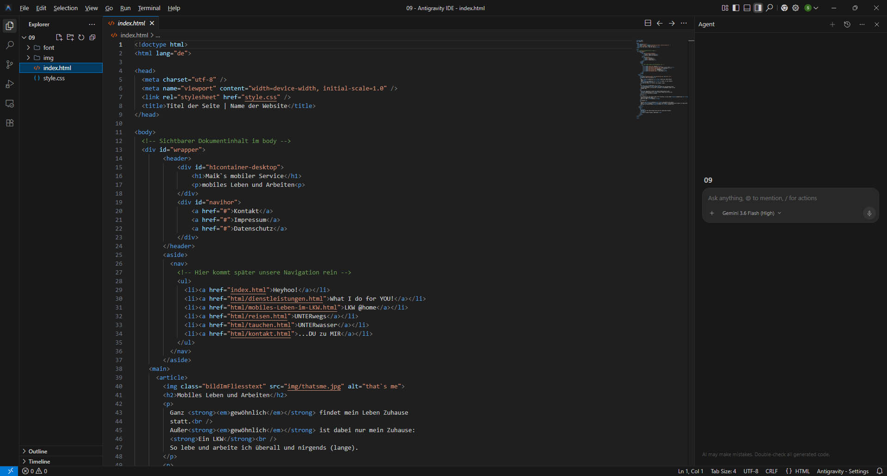
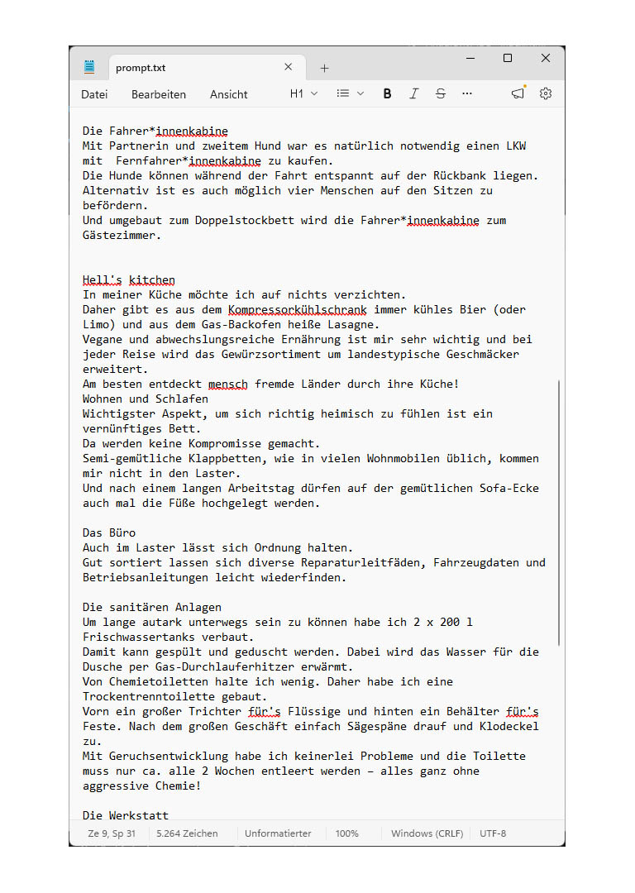
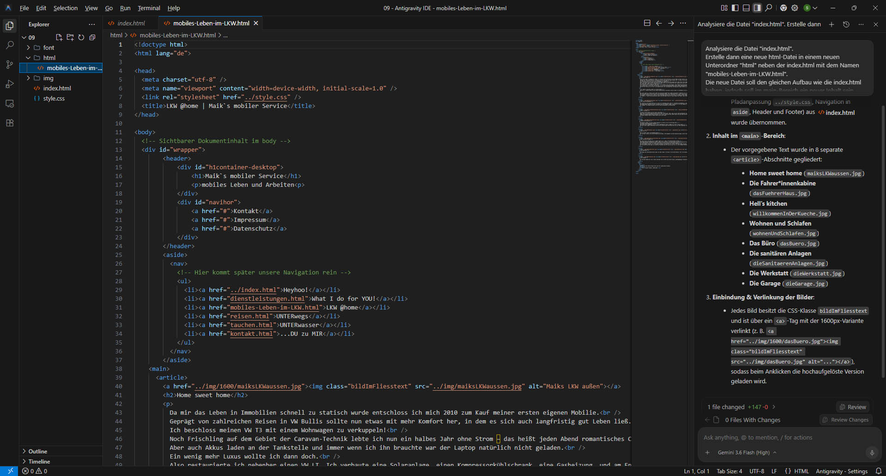
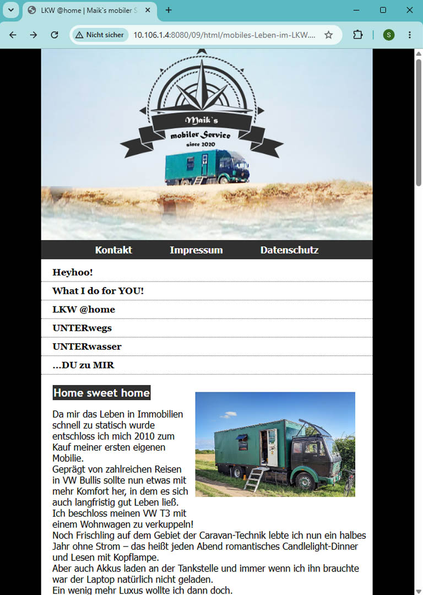
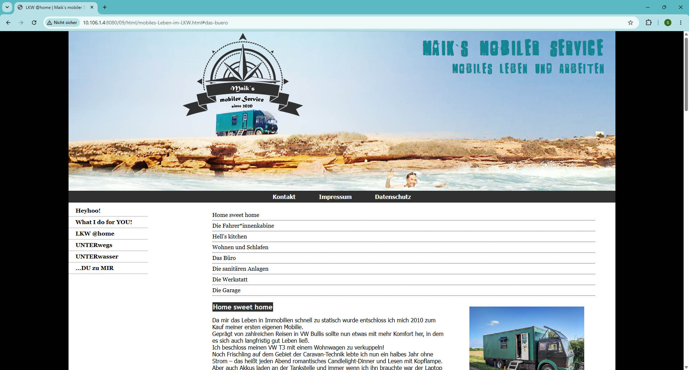

<!-- _class: titlepage -->
# Webprogrammierung: KI-Workflows und SDD

**Fachlehrer  Stefan Sauer**
**THWS Geovisualisierung**

---
<!-- _class: structural -->
# Inhaltsverzeichnis

- [KI Workflows (Future of Development)](#ki-workflows-future-of-development)
- [Spec-Driven Development (SDD)](#spec-driven-development-sdd)
- [KI-native Entwicklungsumgebungen](#ki-native-entwicklungsumgebungen)
- [Eine Unterseite mit KI erstellen (09)](#eine-unterseite-mit-ki-erstellen-09)
- [KI ist geil?](#ki-ist-geil)

---
## KI Workflows (Future of Development)

> Und das muss ich alles tippen?

**KI-gestützte Webentwicklung** transformiert den Prozess
von einem handwerklichen Schreiben von Code zu einer
**orchestrierten Systemintegration**, bei der Entwickler
als Dirigenten agieren, die KI-Modelle steuern und
deren Ergebnisse validieren.

---

### Handwerkliche Kodierung (Status Quo):
Softwareentwicklung als zeilenweises Schreiben von Syntax;
Fokus auf Implementierungsdetails und das Beheben von Syntax fehlern.

### KI-gestützte Orchestrierung (Zukunft):
Der Entwickler agiert als „Dirigent“ (Orchestrator), der Anforderungen definiert, KI-Modelle steuert und deren Ergebnisse validiert.

### Kernkompetenz:
Die Fähigkeit zur präzisen Problemformulierung und Systemintegration ersetzt das reine Auswendiglernen von Programmiersprachen.

---
## Spec-Driven Development (SDD)

### Die neue Ära des Workflows

Workflow-Zyklus: Specify → Plan → Tasks → Implement. Der Prozess beginnt bei der Spezifikation, nicht beim Code.

Verschiebung der Wertschöpfung: Produktivitätssprünge durch automatisiertes Scaffolding (Grundgerüst-Erstellung) von HTML, CSS und JS.

Menschliche Rolle: Der Entwickler fungiert als „Digital Shepherd“ (Hirte), der die Qualität, Sicherheit und Semantik des KI-Outputs überwacht.

---
## KI-native Entwicklungsumgebungen
### Vom Texteditor zur intelligenten Plattform

### Werkzeugwechsel:
Übergang von klassischen Editoren (wie Notepad++) zu KI-nativen Umgebungen (z. B. Cursor, Antigravity oder GitHub Copilot etc.), die Kontext über das gesamte Projekt verstehen.

### Kontextbewusstsein:
Nutzung von agentischen Regeln und ähnlichen Konfigurationen, um der KI projekt-spezifische Architekturregeln beizubringen.

### Echtzeit-Refactoring:
KI-gestützte Identifikation von „Code Smells“ und automatische Optimierung auf moderne Standards.

---
<!-- _class: structural -->
## Eine Unterseite mit KI erstellen (09)

Nun wollen wir auf Basis der index html in möglichst kurzer Zeit eine Unterseite erstellen, die "HomeSweetHome" heißt.
Statt manuell Texte zu kopieren und html-Tags zu schreiben, soll die KI das für uns erledigen!

---

 Kopieren sie nun folgende Dateien in den img-Ordner:
- dasBuero.jpg
- dasFuehrerHaus.jpg
- dieGarage.jpg
- dieSanitaerenAnlagen.jpg
- dieWerkstatt.jpg
- maiksLKWaussen.jpg
- willkommenInDerKueche.jpg
- wohnenUndSchlafen.jpg
- und den gesamten Ordner "1600"!

---
### Antigravity, VS-Code mit Copilot oder Cursor

Installiert / wählt  ein Tool Eurer Wahl und meldet Euch entsprechend an:
- Cursor
https://cursor.com/de/home
- Antigravity IDE
https://antigravity.google/product/antigravity-ide
- VS-Code mit Copilot
https://github.com/features/copilot

Meine Wahl ist Antigravity, da ich ein registriertes Google-Konto mit Altersbestätigung besitze.

---
### Arbeiten in Antigravity
Öffnet Euch in Antigravity doch mal den Projektordner (09)
Analysiert die Projektstruktur
und die Tools der Software:
- Explorer
- Inhaltsfenster
- Agent

---
<!-- _class: fullscreen -->

---

Erstellt nun einen detaillierten Prompt,
oder kopiert den Prompt aus meiner
Datei prompt.txt (im Materialordner)
in das "Agent-Fenster" von Antigravity.

> Lest Euch Euren Prompt mehrmals durch!

---
> Dann: Feuer frei!

Allow read access to this path? (mehrfach)
Allow running this command?
Accept all

---
<!-- _class: fullscreen -->

---

<!-- _class: structural -->
> Fertig ist die Unterseite!

Überprüfen der Inhalte
Testen der Verlinkungen
Lesen der Inhalte

---
### Sub-Navigation

Die Seite ist nun serh lang geworden. Wir müssen die Inhalte der Unterseite also über eine Sub-Navigation anspringen können.

Erstellt Euch dafür einen Prompt:

"Erstelle im main-Bereich eine Liste mit einer Subnavigation.
Die Liste soll gut lesbarer Text in schwarz auf weißem Grund sein und den style der Klasse "subnavi" in der "style.css" haben. Die Texte sollen keinen List-Style haben, sondern stattdessen mit schwarz-gepunkteten Linien horizontal abgegrenzt werden.
Jeder Punkt der Subnavi soll dann einen entsprechenden Anchor der h2-Überschriften in den Articlen anspringen. Erstelle unter jedem Article einen Link "nach oben" zur Subnavigation. Der Inhalt der Navigation sollen die h2-Überschriften der einzelnen Article sein."

---
<!-- _class: fullscreen-->

---
<!-- _class: structural-->
## KI ist geil?

Erstellt Euch mit eigenen Bildern, Texten und Beispielen aus dem Internet eine eigene Webseite.
Gebt der KI ausreichend Content und die passenden Prompts.
- Beispielseiten
- Bilder
- eigenen Texte (auch KI-generiert)
- Responsive-Design
- mobile-fähig und barrierefrei
- ...

---

Denkt daran: 
> "Computer machen uns nicht arbeitslos, aber sie verändern unseren Arbeitsalltag stark.
Neue Technik nimmt uns viele schwere oder langweilige Aufgaben ab."

Zitat von Bill Gates

